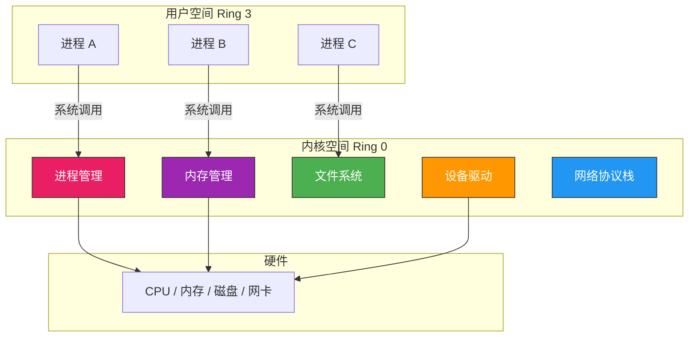
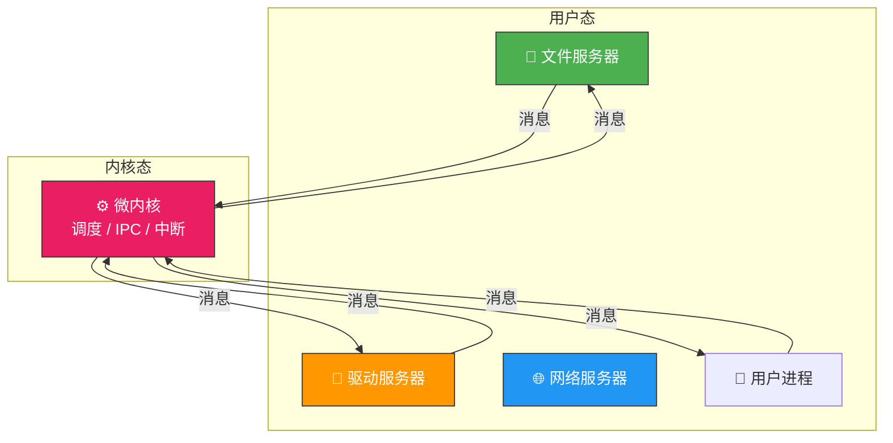
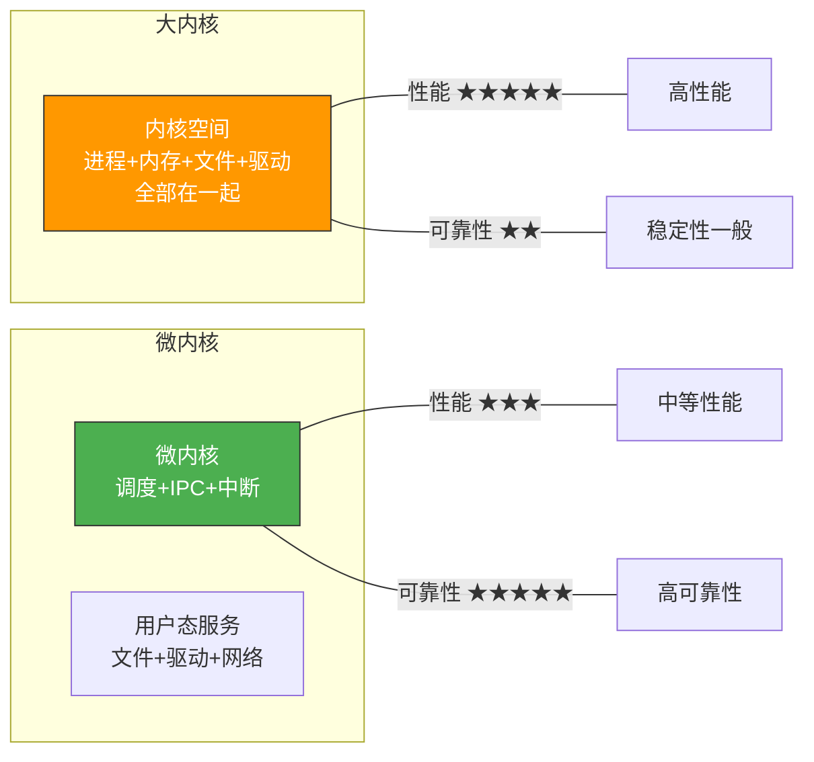
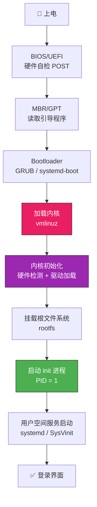

# 操作系统体系结构

> 操作系统就像一座大厦，体系结构决定了它的承重方式——哪些功能放在内核这座"承重墙"里，哪些放在用户空间这座"活动板房"里，直接影响了系统的安全性、性能和可扩展性。

## 一、内核与用户空间的分界

现代操作系统将内存划分为**内核空间**和**用户空间**，CPU 通过特权级机制实现隔离：



::: important 内核态 vs 用户态
- **内核态**：CPU 可执行所有指令，访问所有内存，运行操作系统内核代码
- **用户态**：CPU 只能执行非特权指令，不能直接访问硬件，运行用户程序
- 切换代价：用户态→内核态需要保存/恢复寄存器、切换栈、刷新 TLB，开销不可忽视
:::

---

## 二、大内核（宏内核 / 单体内核）

### 2.1 设计思想

将进程管理、内存管理、文件系统、设备驱动等所有核心功能**全部放在内核态**运行。模块之间可以直接调用函数，性能极高。

```
┌──────────────────────────────────────┐
│              大内核                    │
│  ┌──────────┐ ┌──────────┐          │
│  │ 进程管理  │ │ 内存管理  │          │
│  └────┬─────┘ └────┬─────┘          │
│       │   直接调用   │                │
│  ┌────▼─────┐ ┌────▼─────┐          │
│  │ 文件系统  │ │ 设备驱动  │          │
│  └──────────┘ └──────────┘          │
└──────────────────────────────────────┘
```

### 2.2 典型代表

Linux、MS-DOS、早期 UNIX

### 2.3 优缺点

| 优点 | 缺点 |
|------|------|
| 模块间直接调用，性能高 | 内核体积庞大，难以维护 |
| 无需频繁切换特权级 | 一个驱动 Bug 可能导致整个内核崩溃 |
| 适合高性能场景 | 开发调试困难 |

::: warning 大内核的"牵一发动全身"
大内核中，文件系统的 Bug 可能直接破坏内存管理的数据结构——因为它们在同一地址空间。这就像一栋没有隔断的大平层，一个房间着火，整层都跑不掉。
:::

---

## 三、微内核

### 3.1 设计思想

只把**最基本的功能**放入内核（进程调度、进程通信、中断处理），其他服务（文件系统、设备驱动、网络协议栈）作为**用户态进程**运行，通过消息传递通信。



### 3.2 典型代表

MINIX、QNX、seL4、HarmonyOS

### 3.3 优缺点

| 优点 | 缺点 |
|------|------|
| 高可靠性——服务崩溃不影响内核 | 频繁的消息传递，性能开销大 |
| 易于扩展和移植 | 系统调用路径更长 |
| 安全性好——最小特权原则 | 对 IPC 性能要求极高 |

::: tip 微内核的"隔离病房"
微内核就像把各个科室隔开的医院——文件系统"生病"了，不会传染给内存管理。但代价是科室之间沟通要走走廊（消息传递），比直接喊话慢。
:::

---

## 四、大内核 vs 微内核 对比



| 维度 | 大内核 | 微内核 |
|------|--------|--------|
| 性能 | 高（直接调用） | 较低（消息传递） |
| 可靠性 | 一般（Bug 影响全内核） | 高（服务隔离） |
| 可扩展性 | 差 | 好 |
| 代码量 | 大 | 小 |
| 典型系统 | Linux | QNX / MINIX |

---

## 五、混合内核与其他结构

### 5.1 混合内核

吸取大内核和微内核的优点：核心功能留在内核，但将部分服务模块化。Windows NT 就是一个典型的混合内核——内核态保留了窗口管理、图形驱动等，但通过模块化设计降低耦合。

### 5.2 外内核（Exokernel）

极端思路——内核只做**资源的安全多路复用**，不提供任何抽象。库操作系统（libOS）在用户态实现文件系统等抽象。

### 5.3 实际系统的选择

```c
// Linux 虽然是大内核，但通过模块机制实现了"动态扩展"
// 可加载内核模块（LKM）允许在运行时添加功能

#include <linux/module.h>
#include <linux/kernel.h>

int init_module(void) {
    printk(KERN_INFO "模块加载\n");
    return 0;
}

void cleanup_module(void) {
    printk(KERN_INFO "模块卸载\n");
}

MODULE_LICENSE("GPL");
```

::: tip Linux 的务实路线
Linux 选择大内核 + 可加载模块的方案，在性能和扩展性之间取了很好的平衡。你可以把模块理解为大内核开的"侧门"——不需要时不开，需要时加载进来，虽然还是在内核态运行，但比全部编译进内核灵活得多。
:::

---

## 六、操作系统启动流程

不管内核结构如何，操作系统启动都遵循类似流程：



::: important init 进程——万物之祖
`init` 进程（PID=1）是内核启动的第一个用户态进程，它负责启动所有其他进程和服务。在 Linux 中，`init` 后被 `systemd` 取代，但 PID=1 的地位不变。
:::

---

## 七、操作系统体系结构总结

```c
// 伪代码：不同体系结构下系统调用的路径差异

// 大内核：直接函数调用
void sys_read_big_kernel(int fd, char *buf, int count) {
    // 在内核态直接调用文件系统函数
    vfs_read(fd, buf, count);  // 直接调用，性能高
}

// 微内核：消息传递
void sys_read_micro_kernel(int fd, char *buf, int count) {
    msg_t msg = { .type = READ, .fd = fd, .buf = buf, .count = count };
    ipc_send(FILE_SERVER, &msg);   // 发消息给文件服务器
    ipc_receive(FILE_SERVER, &msg); // 等待回复
    // 额外的上下文切换开销
}
```

::: tip 面试速查
1. **大内核 vs 微内核核心区别**：大内核将所有功能放在内核态（性能高、可靠性低），微内核只保留最基本功能（可靠性高、性能低）
2. **微内核的三大基本功能**：进程调度、进程间通信（IPC）、中断处理
3. **操作系统启动顺序**：BIOS → MBR → Bootloader → 内核 → init → 用户空间
4. **Linux 是大内核**，但通过可加载模块（LKM）实现动态扩展
5. **用户态↔内核态切换**是系统调用开销的主要来源
:::

---

::: info 原著参考
- 小林 coding《图解操作系统》——操作系统体系结构
- 王道考研《操作系统》——第一章 操作系统运行环境与体系结构
- CSAPP 第八章《异常控制流》、第九章《虚拟内存》
:::
