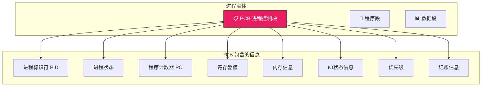
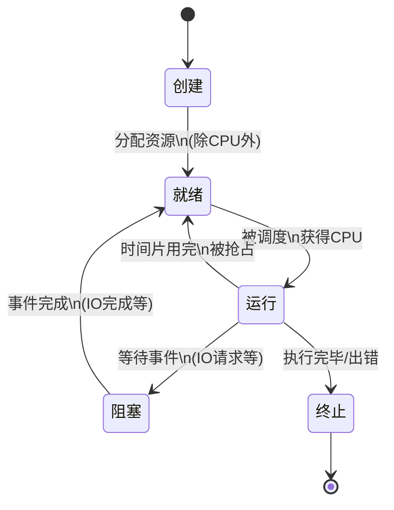
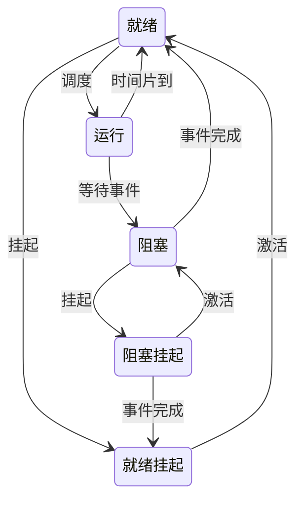
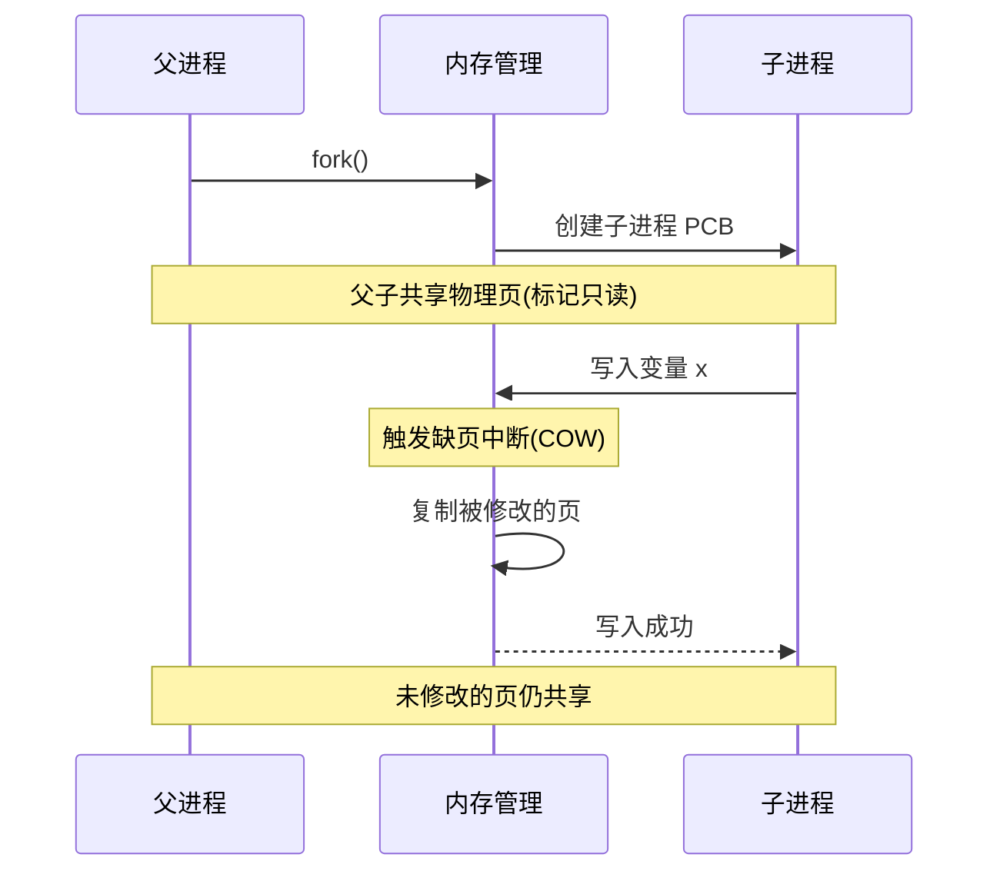
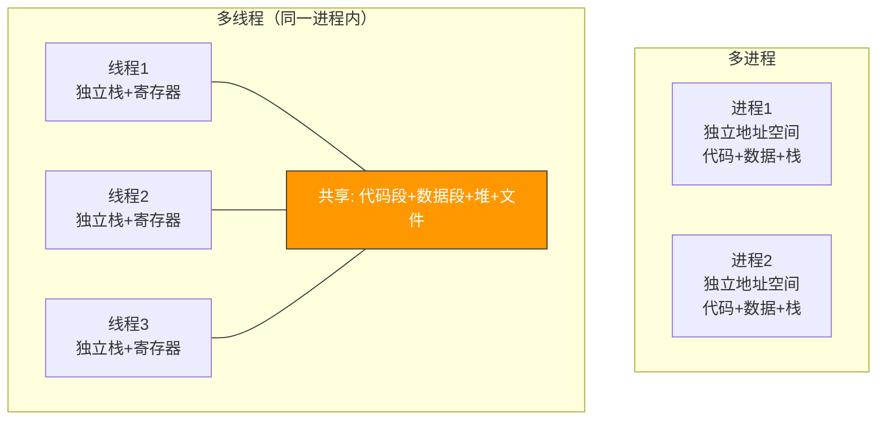
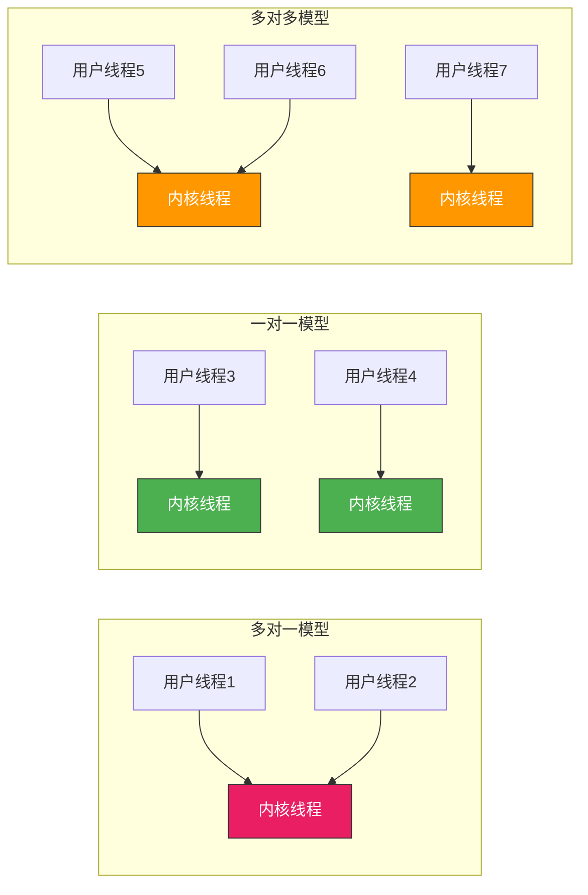

# 进程与线程

> 如果说操作系统是一个工厂，进程就是车间，线程就是车间里的工人。一个车间（进程）拥有独立的资源（内存空间），而工人（线程）共享车间的资源，各自执行不同的任务。

## 一、进程的概念

### 1.1 什么是进程？

进程是**资源分配和调度的基本单位**，是程序的一次执行过程。程序是静态的代码文件，进程是动态的执行实体。

| 维度 | 程序 | 进程 |
|------|------|------|
| 本质 | 静态的指令集合 | 动态的执行过程 |
| 生命周期 | 永久（磁盘上） | 临时（创建→执行→终止） |
| 资源 | 不占有系统资源 | 拥有独立的地址空间、文件描述符等 |

### 1.2 进程的组成（PCB）

操作系统为每个进程维护一个**进程控制块（PCB）**，它是进程存在的唯一标识：



::: important PCB 是进程存在的唯一标志
PCB 中保存了进程运行所需的全部信息。进程被换出内存时，代码和数据可以移到磁盘（对换区），但 PCB 始终驻留内存。操作系统通过 PCB 来管理和控制进程。
:::

---

## 二、进程的状态与转换

### 2.1 五状态模型



### 2.2 七状态模型（引入挂起）

当内存不足时，进程可被**挂起**——换出到磁盘的对换区：

| 状态 | 含义 |
|------|------|
| 就绪挂起 | 进程在外存，进入内存即可执行 |
| 阻塞挂起 | 进程在外存，等待事件完成 |



::: warning 注意状态转换的方向
- **阻塞→运行**：不存在！必须先到就绪，再等调度
- **就绪→阻塞**：不存在！就绪态没有获得 CPU，不可能发起 IO
- 只有**运行→阻塞**是进程主动行为，**阻塞→就绪**是被动行为（由其他进程或中断唤醒）
:::

---

## 三、进程控制

### 3.1 进程的创建

```c
#include <unistd.h>
#include <stdio.h>

int main() {
    pid_t pid = fork();  // 创建子进程

    if (pid < 0) {
        // 创建失败
        perror("fork failed");
    } else if (pid == 0) {
        // 子进程：fork 返回 0
        printf("我是子进程, PID=%d\n", getpid());
    } else {
        // 父进程：fork 返回子进程 PID
        printf("我是父进程, 子进程PID=%d\n", pid);
    }
    return 0;
}
```

### 3.2 fork() 的写时复制（COW）

`fork()` 创建子进程时，并不立即复制父进程的整个地址空间，而是让父子进程**共享同一份物理内存**，标记为只读。只有当某一方尝试写入时，才触发缺页中断，复制那一页。



::: tip 写时复制的好处
如果没有 COW，`fork()` 就要复制父进程全部内存——可能几十上百 MB，但子进程可能马上就 `exec()` 加载新程序，复制的内存全白费。COW 让 `fork()` 极快，只复制真正需要修改的页。
:::

---

## 四、线程的概念

### 4.1 为什么需要线程？

进程的代价太大了——创建要分配地址空间，切换要切换页表、刷新 TLB。如果只是想让多个执行流并发执行，**共享同一地址空间**不就行了？

线程就是**轻量级进程**，是**CPU 调度的基本单位**，同一进程的线程共享进程的资源。

### 4.2 进程 vs 线程

| 维度 | 进程 | 线程 |
|------|------|------|
| 资源分配 | 拥有独立地址空间 | 共享进程的地址空间 |
| 调度 | 传统OS的调度单位 | 现代OS的调度单位 |
| 系统开销 | 创建/切换开销大 | 创建/切换开销小 |
| 通信 | 需要 IPC（管道、共享内存等） | 直接读写共享变量 |
| 安全性 | 进程间相互隔离 | 一个线程崩溃影响整个进程 |



### 4.3 线程共享与独享的资源

| 线程共享（进程级） | 线程独享（线程级） |
|-------------------|-------------------|
| 代码段 | 程序计数器 PC |
| 数据段 | 寄存器组 |
| 堆 | 栈 |
| 文件描述符 | 线程 ID |
| 信号处理器 | errno |

---

## 五、线程的实现方式

### 5.1 用户级线程（ULT）

线程管理在用户空间完成，内核不知道线程的存在。

- **优点**：线程切换不需要内核介入，速度极快
- **缺点**：一个线程阻塞，整个进程阻塞（内核只看到进程）

### 5.2 内核级线程（KLT）

线程管理由内核完成，内核为每个线程维护 TCB。

- **优点**：一个线程阻塞不影响其他线程；多核并行
- **缺点**：线程切换需要陷入内核，开销较大

### 5.3 组合方式

多对多模型：N 个用户线程映射到 M 个内核线程（N ≥ M）。



::: important Linux 的线程实现
Linux 不严格区分进程和线程——统一用 `task_struct` 表示。线程本质上就是共享地址空间的进程，通过 `clone()` 系统调用指定共享哪些资源。这种设计被称为 **LWP（Light Weight Process）**。
:::

---

## 六、进程与线程的生命周期代码示例

```c
#include <pthread.h>
#include <stdio.h>
#include <unistd.h>

int shared_counter = 0;  // 线程共享变量

void* thread_func(void* arg) {
    int id = *(int*)arg;
    for (int i = 0; i < 100000; i++) {
        shared_counter++;  // ⚠️ 非原子操作，存在竞态！
    }
    printf("线程 %d 完成, counter=%d\n", id, shared_counter);
    return NULL;
}

int main() {
    pthread_t t1, t2;
    int id1 = 1, id2 = 2;

    pthread_create(&t1, NULL, thread_func, &id1);
    pthread_create(&t2, NULL, thread_func, &id2);

    pthread_join(t1, NULL);
    pthread_join(t2, NULL);

    // shared_counter 期望 200000，但实际结果不确定！
    printf("最终 counter=%d\n", shared_counter);
    return 0;
}
```

::: warning 共享变量的竞态条件
上面代码中 `shared_counter++` 不是原子操作（读→加→写三步），两个线程同时执行会导致丢失更新。这就是为什么需要**同步机制**——后续进程同步与互斥篇将详细介绍。
:::

---

::: tip 面试速查
1. **进程 vs 线程**：进程是资源分配单位，线程是 CPU 调度单位
2. **PCB** 是进程存在的唯一标识，保存进程的全部管理信息
3. **进程五状态**：创建→就绪→运行→阻塞→终止；不存在阻塞→运行、就绪→阻塞的转换
4. **fork() 使用写时复制（COW）**，不立即复制地址空间
5. **线程共享**：代码段、数据段、堆、文件描述符；**线程独享**：栈、PC、寄存器
6. **用户级线程**：内核不可见，切换快但一个阻塞全阻塞；**内核级线程**：内核可见，可并行但切换慢
7. Linux 用 `task_struct` 统一表示进程和线程，线程就是共享地址空间的进程
:::

---

::: info 原著参考
- 小林 coding《图解操作系统》——进程与线程篇
- 王道考研《操作系统》——第二章 进程管理
- CSAPP 第八章《异常控制流》、第十二章《并发编程》
:::
