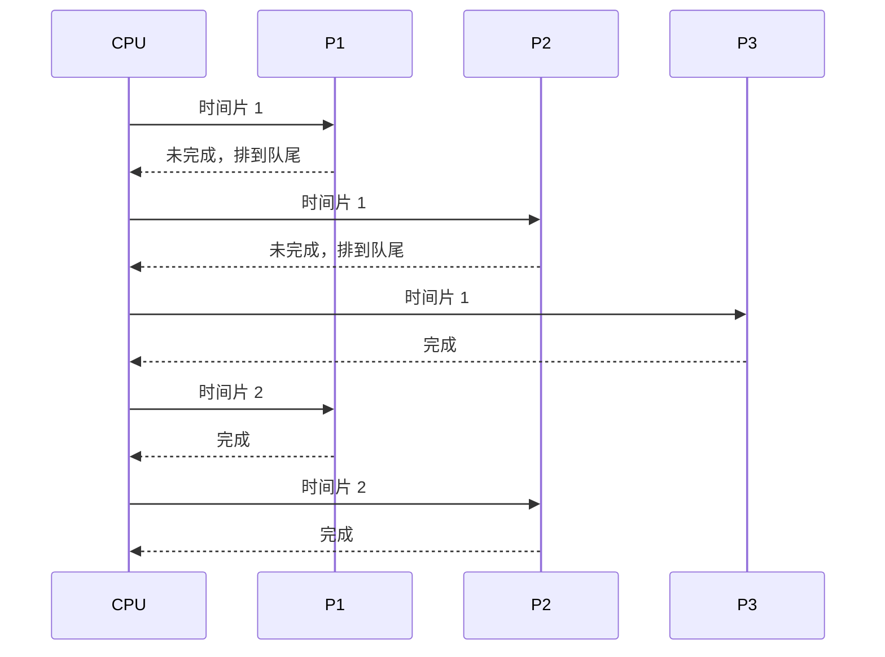
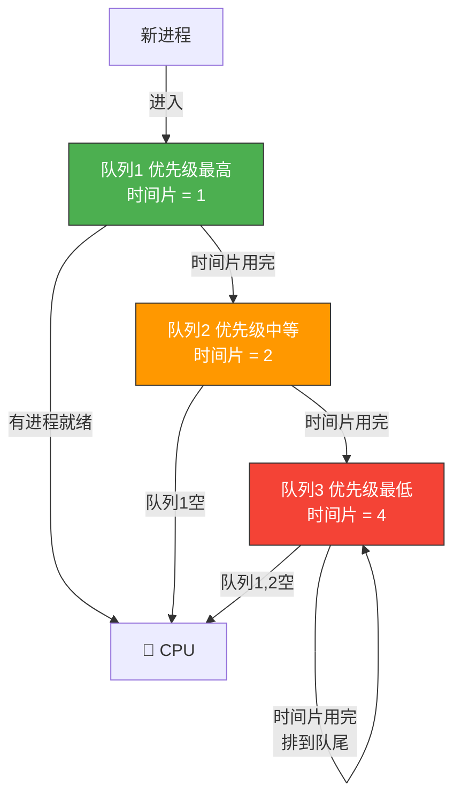

# 进程调度

> 进程调度就像十字路口的交通指挥——谁先走、谁后走、走多久，决定了整个系统的吞吐量和响应速度。好的调度算法让所有人都觉得"公平"，差的调度则让某些进程饿死。

## 一、调度的层次

### 1.1 三级调度


| 调度层次 | 调度对象 | 频率 | 作用 |
|---------|---------|------|------|
| **高级调度**（作业调度） | 作业 | 低 | 决定哪些作业进入内存 |
| **中级调度**（内存调度） | 进程 | 中 | 决定哪些进程换入/换出 |
| **低级调度**（进程调度） | 进程/线程 | 高 | 决定哪个就绪进程获得 CPU |

::: important 低级调度是最基本的调度
低级调度（进程调度）频率最高，每个时间片切换都会发生，是操作系统最核心的调度。高级调度只在批处理系统中存在，分时/实时系统通常没有。
:::

---

## 二、调度的时机与方式

### 2.1 调度时机

**可以调度**的情况：
- 进程正常终止或异常终止
- 进程阻塞（等待 IO、信号量等）
- 时间片用完
- 更高优先级进程到达（抢占式）

**不能调度**的情况：
- 处理中断的过程中
- 在操作系统内核程序临界区中
- 原子操作过程中

### 2.2 调度方式

| 方式 | 含义 | 适用场景 |
|------|------|---------|
| **非抢占式** | 进程获得 CPU 后，除非主动放弃，否则不会被剥夺 | 早期批处理系统 |
| **抢占式** | 高优先级进程可以抢占当前运行进程的 CPU | 分时/实时系统 |

---

## 三、调度算法的评价指标

| 指标 | 含义 | 期望 |
|------|------|------|
| **CPU 利用率** | CPU 忙碌时间 / 总时间 | 越高越好 |
| **系统吞吐量** | 单位时间完成的进程数 | 越高越好 |
| **周转时间** | 提交到完成的总时间 | 越短越好 |
| **等待时间** | 在就绪队列中等待的时间 | 越短越好 |
| **响应时间** | 提交到首次响应的时间 | 越短越好 |

::: tip 周转时间的计算
- **周转时间 = 完成时间 - 到达时间**
- **带权周转时间 = 周转时间 / 服务时间**（≥ 1，越小越好）
- **平均周转时间 = 所有进程周转时间之和 / 进程数**
:::

---

## 四、经典调度算法

### 4.1 先来先服务（FCFS）

按到达顺序排队，先到先服务。

```mermaid
gantt
    title FCFS 调度示例
    dateFormat X
    axisFormat %s

    section 进程
    P1 (执行10s) : 0, 10
    P2 (执行5s)  : 10, 15
    P3 (执行2s)  : 15, 17
```



- **优点**：简单公平
- **缺点**：短作业等待时间长——"护航效应"（Convoy Effect）

### 4.2 短作业优先（SJF）

选择**预计运行时间最短**的作业先执行。

| 进程 | 到达时间 | 服务时间 | 开始时间 | 完成时间 | 周转时间 |
|------|---------|---------|---------|---------|---------|
| P1 | 0 | 7 | 0 | 7 | 7 |
| P2 | 2 | 4 | 7 | 11 | 9 |
| P3 | 4 | 1 | 11 | 12 | 8 |
| P4 | 5 | 4 | 12 | 16 | 11 |

- **优点**：平均周转时间最短（可证明）
- **缺点**：长作业可能"饿死"；运行时间难以预估

::: warning SJF 的"饥饿"问题
SJF 会让短作业不断插队，长作业可能永远得不到执行。这就是**饥饿（Starvation）**——进程长期得不到服务。
:::

### 4.3 最短剩余时间优先（SRTN）

SJF 的抢占式版本——每当新进程到达时，比较剩余时间，选择最短的执行。

### 4.4 高响应比优先（HRRN）

综合等待时间和服务时间：

$$R_p = \frac{\text{等待时间} + \text{服务时间}}{\text{服务时间}} = 1 + \frac{\text{等待时间}}{\text{服务时间}}$$

- 等待时间越长，响应比越高，避免长作业饥饿
- 服务时间越短，响应比也高，照顾短作业

```c
// HRRN 选择逻辑伪代码
float highest_ratio = -1;
Process *selected = NULL;

for (each process p in ready_queue) {
    float ratio = (p.wait_time + p.service_time) / (float)p.service_time;
    if (ratio > highest_ratio) {
        highest_ratio = ratio;
        selected = p;
    }
}
schedule(selected);
```

::: tip HRRN 是非抢占式的折中方案
HRRN 既照顾短作业（服务时间短→响应比高），又不会让长作业饿死（等待时间长了响应比也会高），是 FCFS 和 SJF 的折中。
:::

### 4.5 时间片轮转（RR）

所有就绪进程排成队列，每个进程执行一个时间片后轮到下一个。



**时间片大小的选择**：
- 太大 → 退化为 FCFS
- 太小 → 频繁切换，开销过大
- 经验值：时间片应略大于多数进程的交互间隔（通常 10~100ms）

### 4.6 优先级调度

为每个进程设置优先级，选择优先级最高的执行。

| 类型 | 说明 |
|------|------|
| 静态优先级 | 创建时确定，运行期间不变 |
| 动态优先级 | 运行期间可变（如等待越久优先级越高） |

### 4.7 多级反馈队列调度

综合多种算法的精华，是**公认最好的调度算法**：



**核心规则**：
1. 新进程进入第 1 级队列
2. 时间片用完，降到下一级队列
3. 只有第 k 级队列为空时，才调度第 k+1 级
4. 有更高优先级进程到达时，抢占当前进程

::: important 多级反馈队列的巧妙
- 短作业：在第 1 级队列就能完成，响应快
- 长作业：逐渐降级，时间片变大，减少切换次数
- IO 密集型：频繁阻塞，留在高级队列，响应好
- CPU 密集型：逐渐沉入低级队列
:::

---

## 五、算法对比总结

| 算法 | 抢占 | 饥饿 | 适用场景 | 特点 |
|------|------|------|---------|------|
| FCFS | 非抢占 | 不会 | 批处理 | 简单公平，护航效应 |
| SJF/SRTN | 两者皆有 | 会 | 批处理 | 平均周转最优 |
| HRRN | 非抢占 | 不会 | 批处理 | 折中方案 |
| RR | 抢占 | 不会 | 分时 | 公平响应好 |
| 优先级 | 两者皆有 | 可能 | 通用 | 灵活 |
| 多级反馈队列 | 抢占 | 可能 | 通用 | 最优实践 |

```c
// 算法选择策略伪代码
Process* schedule(Process *ready_queue) {
    if (system_type == BATCH) {
        // 批处理：追求吞吐量
        return sjf_schedule(ready_queue);  // 或 HRRN
    } else if (system_type == TIME_SHARING) {
        // 分时：追求响应时间
        return round_robin_schedule(ready_queue);
    } else if (system_type == REALTIME) {
        // 实时：追求截止时间
        return priority_schedule(ready_queue);
    } else {
        // 通用：多级反馈队列
        return mlfq_schedule(ready_queue);
    }
}
```

---

::: tip 面试速查
1. **三级调度**：高级（作业调度）→中级（内存调度）→低级（进程调度），低级调度最基本、频率最高
2. **SJF 平均周转时间最短**，但可能导致长作业饥饿
3. **HRRN 公式**：响应比 = (等待时间 + 服务时间) / 服务时间，兼顾长短作业
4. **时间片轮转**：时间片太大退化为 FCFS，太小则切换开销大
5. **多级反馈队列**：公认最优调度算法，短作业在高级队列快速完成，长作业逐渐降级获得更大时间片
6. **抢占式 vs 非抢占式**：分时/实时系统用抢占式，早期批处理用非抢占式
7. **不能调度**的时机：中断处理中、内核临界区、原子操作中
:::

---

::: info 原著参考
- 小林 coding《图解操作系统》——进程调度篇
- 王道考研《操作系统》——第二章 进程调度
- CSAPP 第八章《异常控制流》
:::
