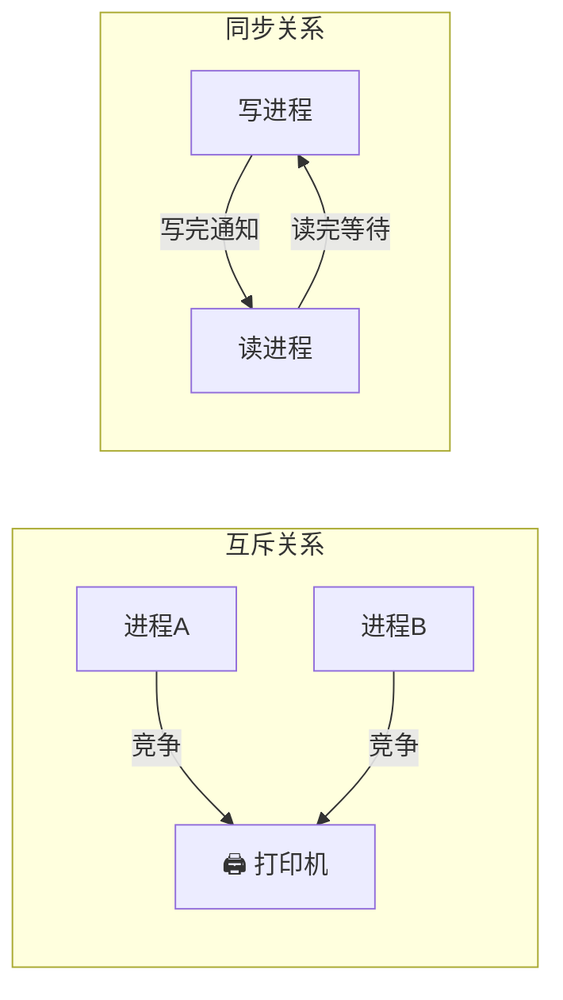
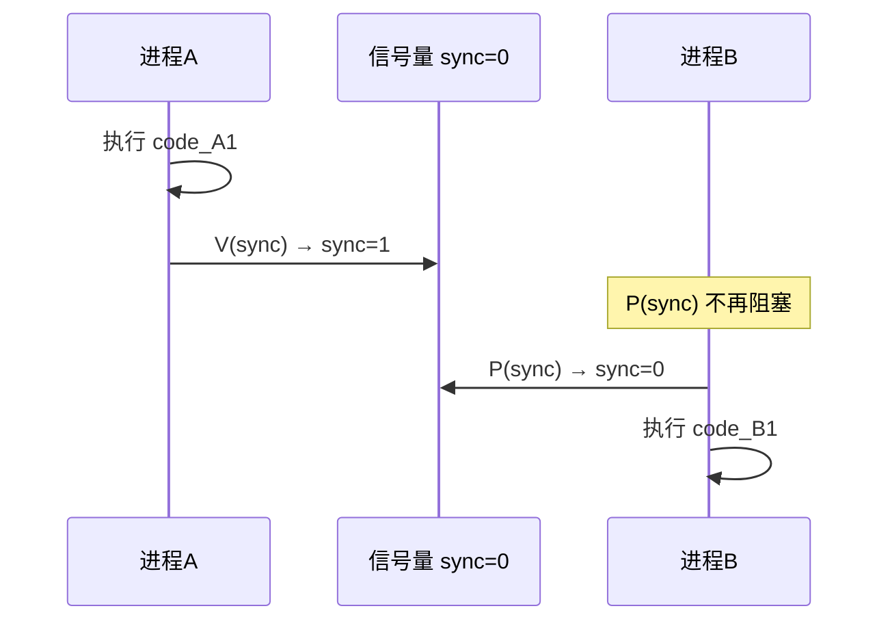
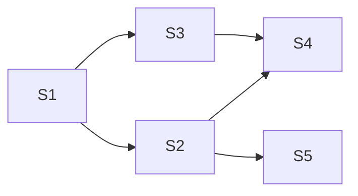
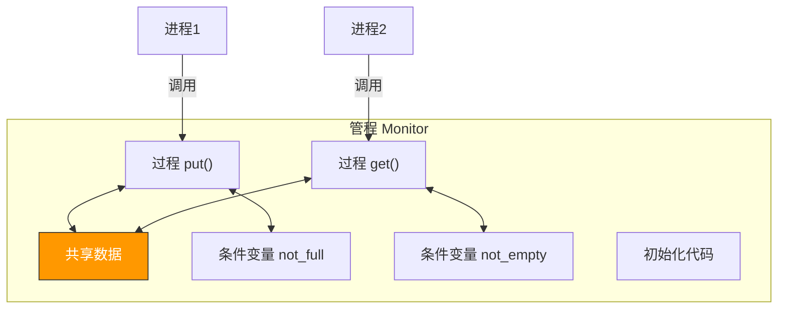

# 进程同步与互斥

> 多个进程并发执行时，如果对共享资源的访问不加约束，结果就像多个人同时修改同一份文档——最终版本谁也说不清。同步与互斥就是操作系统的"交通规则"，确保并发执行的结果正确可预测。

## 一、基本概念

### 1.1 临界资源与临界区

- **临界资源**：一次仅允许一个进程使用的资源（如打印机、共享变量）
- **临界区**：访问临界资源的代码段

```c
// 临界区示例
void deposit(int amount) {
    // --- 进入区 ---
    lock(&mutex);

    // --- 临界区 ---
    balance = balance + amount;  // 访问共享变量

    // --- 退出区 ---
    unlock(&mutex);

    // --- 剩余区 ---
    printf("存款成功\n");
}
```

### 1.2 同步与互斥的区别

| 概念 | 含义 | 关系 |
|------|------|------|
| **互斥** | 对临界资源的排他性访问 | 竞争关系 |
| **同步** | 进程间的协调执行顺序 | 协作关系 |



### 1.3 临界区访问原则

| 原则 | 含义 |
|------|------|
| **空闲让进** | 临界区空闲时，允许进程进入 |
| **忙则等待** | 已有进程在临界区时，其他进程等待 |
| **有限等待** | 等待进入临界区的进程不能无限等 |
| **让权等待** | 进程不能进入临界区时应释放 CPU |

---

## 二、互斥的硬件实现

### 2.1 中断屏蔽

进入临界区前关中断，退出后开中断。

```c
// 简化伪代码
void enter_critical() {
    disable_interrupts();  // 关中断
}

void exit_critical() {
    enable_interrupts();   // 开中断
}
```

- **优点**：简单高效
- **缺点**：只适用于单核；关中断时间过长影响系统响应；不适合用户进程使用

### 2.2 TestAndSet（TSL）指令

硬件提供的**原子操作**，读取并设置一个标志：

```c
// TestAndSet 的硬件原子实现
bool TestAndSet(bool *lock) {
    bool old = *lock;  // 读取旧值
    *lock = true;      // 设为 true
    return old;        // 返回旧值
}

// 使用 TSL 实现互斥
while (TestAndSet(&lock)) {
    // 忙等待（自旋锁）
}
// 临界区
lock = false;
```

### 2.3 Swap 指令

```c
// Swap 的硬件原子实现
void Swap(bool *a, bool *b) {
    bool temp = *a;
    *a = *b;
    *b = temp;
}

// 使用 Swap 实现互斥
bool key = true;
do {
    Swap(&lock, &key);  // key 为 true 说明锁被占
} while (key);
// 临界区
lock = false;
```

::: warning 硬件实现的缺陷
TSL 和 Swap 虽然是原子的，但都不满足"让权等待"——进程在忙等待期间一直占用 CPU。这就是**自旋锁（Spinlock）**的特点：等待时不释放 CPU，适合临界区很短的场景。
:::

---

## 三、信号量机制

### 3.1 信号量的定义

信号量（Semaphore）由 Dijkstra 提出，是**整型变量 + P/V 操作**的组合：

```c
// 信号量的定义
typedef struct {
    int value;           // 资源数量
    Queue *wait_queue;   // 等待队列
} Semaphore;

// P 操作（wait）——申请资源
void P(Semaphore *S) {
    S->value--;
    if (S->value < 0) {
        // 资源不足，阻塞当前进程
        block(S->wait_queue);
    }
}

// V 操作（signal）——释放资源
void V(Semaphore *S) {
    S->value++;
    if (S->value <= 0) {
        // 有等待的进程，唤醒一个
        wakeup(S->wait_queue);
    }
}
```

::: important P/V 操作的原子性
P 和 V 操作是**原子的**——执行过程中不可中断。这是信号量机制正确性的基础。操作系统通过关中断或硬件指令保证 P/V 的原子性。
:::

### 3.2 信号量的分类

| 类型 | 初值 | 含义 |
|------|------|------|
| **互斥信号量** | 1 | 实现互斥，同一时刻只允许一个进程进入 |
| **同步信号量** | 0 | 实现同步，前V后P |

### 3.3 用信号量实现互斥

```c
Semaphore mutex = 1;  // 互斥信号量，初值1

// 进程 A
P(mutex);      // 申请进入临界区
// 临界区
V(mutex);      // 退出临界区

// 进程 B
P(mutex);
// 临界区
V(mutex);
```

### 3.4 用信号量实现同步

```c
Semaphore sync = 0;  // 同步信号量，初值0

// 进程 A（先执行）
code_A1;
V(sync);       // 通知 B：A 已完成

// 进程 B（后执行）
P(sync);       // 等待 A 完成
code_B1;
```



::: tip 同步的口诀："前V后P"
如果要求"代码 A 先于代码 B 执行"，则在 A 后面 V、在 B 前面 P，使用初值为 0 的同步信号量。
:::

### 3.5 用信号量实现前驱关系

多个进程之间的执行顺序约束——前驱图：



```c
// 每条边对应一个同步信号量
Semaphore a12 = 0, a13 = 0, a24 = 0, a34 = 0, a25 = 0;

S1() { ...; V(a12); V(a13); }
S2() { P(a12); ...; V(a24); V(a25); }
S3() { P(a13); ...; V(a34); }
S4() { P(a24); P(a34); ...; }
S5() { P(a25); ...; }
```

---

## 四、管程

### 4.1 为什么需要管程？

信号量虽然强大，但使用起来容易出错——P/V 操作必须严格配对，忘写一个 V 就可能死锁。管程（Monitor）是一种**高级同步机制**，把共享变量和对它的操作封装在一起。

### 4.2 管程的结构

```c
// 管程的伪代码
monitor BufferManager {
    int buffer[N];
    int count = 0;
    condition not_full;    // 条件变量：缓冲区不满
    condition not_empty;   // 条件变量：缓冲区不空

    void put(int item) {
        if (count == N)
            wait(not_full);    // 缓冲区满，等待
        buffer[count++] = item;
        signal(not_empty);     // 通知消费者
    }

    int get() {
        if (count == 0)
            wait(not_empty);   // 缓冲区空，等待
        int item = buffer[--count];
        signal(not_full);      // 通知生产者
        return item;
    }
}
```

### 4.3 管程的特性

| 特性 | 说明 |
|------|------|
| **封装性** | 共享变量只能被管程内的过程访问 |
| **互斥性** | 同一时刻只有一个进程能在管程内执行（编译器保证） |
| **条件变量** | 通过 wait/signal 实现同步（类似 P/V 但更安全） |



::: important 管程 vs 信号量
- 管程是语言级的构造，编译器自动保证互斥；信号量需要程序员手动保证 P/V 配对
- Java 的 `synchronized` 就是管程思想的体现——每个对象自带一个锁和一个等待队列
- 条件变量的 `wait` 会释放管程锁并阻塞，`signal` 唤醒一个等待进程
:::

---

## 五、经典同步问题概览

| 问题 | 核心矛盾 | 关键信号量 |
|------|---------|-----------|
| 生产者-消费者 | 互斥 + 同步（缓冲区满/空） | mutex, full, empty |
| 读者-写者 | 读写互斥、读读共享 | mutex, rw, count |
| 哲学家就餐 | 互斥避免死锁 | forks[5] |
| 理发师 | 同步等待与服务 | customers, barber, mutex |

> 详细解法见 [06_经典问题](../06_经典问题/01_生产者消费者问题.md) 系列文章。

---

::: tip 面试速查
1. **临界区四原则**：空闲让进、忙则等待、有限等待、让权等待
2. **互斥 vs 同步**：互斥是竞争关系（排他访问），同步是协作关系（执行顺序约束）
3. **信号量 P/V 必须原子执行**，P 申请资源（value--），V 释放资源（value++）
4. **同步口诀**："前V后P"，用初值为 0 的信号量保证先后顺序
5. **自旋锁**不满足让权等待，适合临界区极短的场景
6. **管程**是高级同步机制，编译器保证互斥，条件变量实现同步
7. 实现"前驱图"——每条边对应一个初值为 0 的同步信号量
:::

---

::: info 原著参考
- 小林 coding《图解操作系统》——进程同步与互斥篇
- 王道考研《操作系统》——第二章 进程同步
- CSAPP 第十二章《并发编程》
:::
