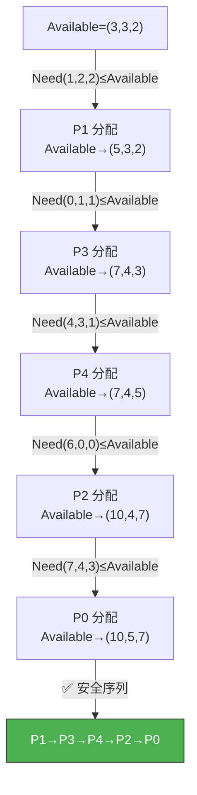
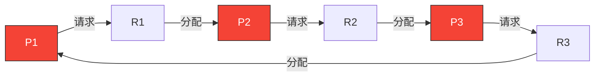

# 死锁

> 死锁就像两个人面对面窄巷相遇，谁也不肯让路，结果谁也过不去。在操作系统中，多个进程互相持有对方需要的资源，又都在等待对方释放，形成了永远无法解开的循环等待。

## 一、死锁的概念

### 1.1 什么是死锁？

死锁是指**一组进程中每个进程都在等待只能由该组中的其他进程释放的资源**，导致所有进程都无法继续执行。


### 1.2 死锁 vs 饥饿 vs 死循环

| 概念 | 原因 | 状态 | 可否恢复 |
|------|------|------|---------|
| **死锁** | 循环等待资源 | 全部阻塞 | 需外力干预 |
| **饥饿** | 长期得不到资源 | 就绪但无法运行 | 有可能自动恢复 |
| **死循环** | 程序逻辑错误 | 运行中 | 程序员修复 |

---

## 二、死锁产生的四个必要条件

死锁发生必须**同时满足**以下四个条件，打破任一条件即可预防死锁：


::: important 四个条件缺一不可
- 只要有一个条件不满足，死锁就不会发生
- **互斥条件**通常是资源本身的特性（如打印机），难以打破
- **循环等待条件**是最容易通过策略打破的
:::

---

## 三、死锁预防

死锁预防是**静态策略**，在死锁发生前通过破坏四个必要条件之一来避免死锁。

| 破坏条件 | 方法 | 副作用 |
|---------|------|--------|
| 互斥 | 将独占资源改为共享 | 很多资源无法共享（如打印机） |
| 不可剥夺 | 进程请求新资源失败时释放已持有资源 | 实现复杂，可能造成前期工作浪费 |
| 请求并保持 | 一次性申请所有资源（静态分配） | 资源利用率低，可能饥饿 |
| 循环等待 | 对资源编号，按序申请 | 限制申请顺序，灵活性差 |

### 3.1 破坏循环等待——顺序资源分配法

给每类资源编号，进程只能按编号**递增顺序**申请资源：

```c
// 资源编号：R1 < R2 < R3 < R4
// 正确：先申请 R1，再申请 R3 ✓
// 错误：先申请 R3，再申请 R1 ✗（必须先释放 R3 再申请 R1）

void process_work() {
    request(R1);  // 按编号递增申请
    request(R2);
    request(R4);
    // 使用资源...
    release(R4);
    release(R2);
    release(R1);
}
```

::: tip 为什么顺序分配能破坏循环等待？
如果所有进程都按递增顺序申请资源，那么持有大编号资源的进程不可能去申请小编号资源，也就不可能形成循环等待链——循环意味着编号链上有"回头"，但递增申请不允许回头。
:::

---

## 四、死锁避免

死锁避免是**动态策略**，在资源分配时判断是否可能导致死锁，只在安全时才分配。

### 4.1 安全状态与不安全状态

- **安全状态**：系统能按某种顺序为每个进程分配资源，使所有进程都能执行完毕
- **不安全状态**：不存在这样的分配顺序，**可能**导致死锁

::: warning 不安全 ≠ 死锁
不安全状态不一定会死锁，只是有死锁的**风险**。安全状态则一定不会死锁。死锁避免的策略就是让系统始终处于安全状态。
:::

### 4.2 银行家算法

最著名的死锁避免算法，模拟银行贷款：银行家在贷款前先检查——如果贷出去后还有可能让所有客户都完成业务，才批准贷款。

**数据结构**：

```c
int Available[m];    // 每类资源的可用数量
int Max[n][m];       // 每个进程的最大需求
int Allocation[n][m]; // 每个进程已分配的资源
int Need[n][m];      // 每个进程还需要的资源 = Max - Allocation
```

**安全性算法**：

```c
// 银行家算法——安全性检查
bool is_safe(int Available[], int Max[][M], int Allocation[][M], int Need[][M]) {
    int Work[M];       // 当前可用资源
    bool Finish[N];    // 进程是否可完成

    // 初始化
    Work = Available;
    Finish = all false;

    // 寻找可满足的进程
    while (exists i such that !Finish[i] && Need[i] <= Work) {
        Work = Work + Allocation[i];  // 进程完成后释放资源
        Finish[i] = true;
    }

    // 所有进程都能完成 → 安全
    return all Finish[i] == true;
}
```

### 4.3 银行家算法示例

| 进程 | Max | Allocation | Need | Available |
|------|-----|-----------|------|-----------|
| P0 | (7,5,3) | (0,1,0) | (7,4,3) | (3,3,2) |
| P1 | (3,2,2) | (2,0,0) | (1,2,2) | |
| P2 | (9,0,2) | (3,0,2) | (6,0,0) | |
| P3 | (2,2,2) | (2,1,1) | (0,1,1) | |
| P4 | (4,3,3) | (0,0,2) | (4,3,1) | |



---

## 五、死锁检测与解除

### 5.1 死锁检测

不预防也不避免，允许死锁发生，但定期检测并解除。

**资源分配图法**：



- 如果资源分配图**不可完全简化**，则存在死锁
- 完全简化：不断消除不阻塞的进程及其边，如果最终所有进程都被消除，则无死锁

### 5.2 死锁解除

| 方法 | 说明 | 代价 |
|------|------|------|
| **资源剥夺** | 从死锁进程剥夺资源给其他进程 | 被剥夺进程可能需要回滚 |
| **撤销进程** | 终止一个或多个死锁进程 | 进程工作丢失 |
| **进程回滚** | 让进程退回到之前的检查点 | 需要检查点机制支持 |

::: warning 选择牺牲进程的原则
- 优先级最低的进程
- 已执行时间最短的进程
- 已使用资源最少的进程
- 还需执行时间最长的进程（不选）
:::

---

## 六、死锁策略对比

| 策略 | 时机 | 开销 | 资源利用率 |
|------|------|------|-----------|
| **预防** | 事前（破坏条件） | 低（限制多） | 低 |
| **避免** | 分配时（银行家算法） | 中（每次检查） | 中 |
| **检测+解除** | 事后 | 低（不限制） | 高 |

```c
// 死锁策略选择伪代码
deadlock_policy_t choose_policy() {
    if (resource_types_few && processes_few) {
        return AVOIDANCE;  // 银行家算法
    } else if (can_reorder_requests) {
        return PREVENTION; // 顺序资源分配
    } else {
        return DETECTION;  // 检测+解除
    }
}
```

::: tip 实际系统怎么做？
大多数操作系统（如 Linux、Windows）**不使用**银行家算法——太保守、开销大。而是采用鸵鸟策略（忽略死锁）+ 检测解除。因为死锁概率低，预防/避免的代价远大于偶尔重启的代价。
:::

---

::: tip 面试速查
1. **死锁四个必要条件**：互斥、不可剥夺、请求并保持、循环等待——必须同时满足
2. **死锁预防**：破坏四个条件之一（最常考破坏循环等待——顺序资源分配法）
3. **银行家算法**：分配前检查系统是否仍处于安全状态，是则分配
4. **安全状态**：存在安全序列使所有进程都能完成；不安全状态可能但不必然死锁
5. **死锁检测**：资源分配图不可完全简化 → 存在死锁
6. **死锁解除**：资源剥夺、撤销进程、进程回滚
7. **实际系统多采用鸵鸟策略**——死锁概率低，预防代价大
:::

---

::: info 原著参考
- 小林 coding《图解操作系统》——死锁篇
- 王道考研《操作系统》——第二章 死锁
- CSAPP 第十二章《并发编程》
:::
