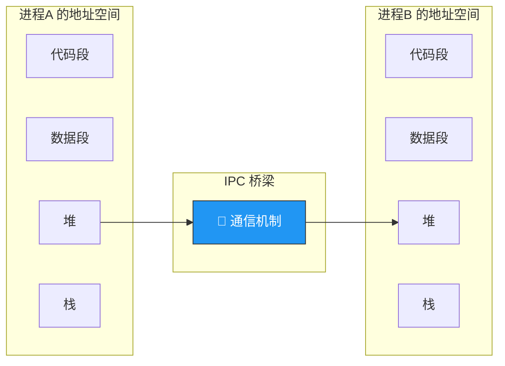
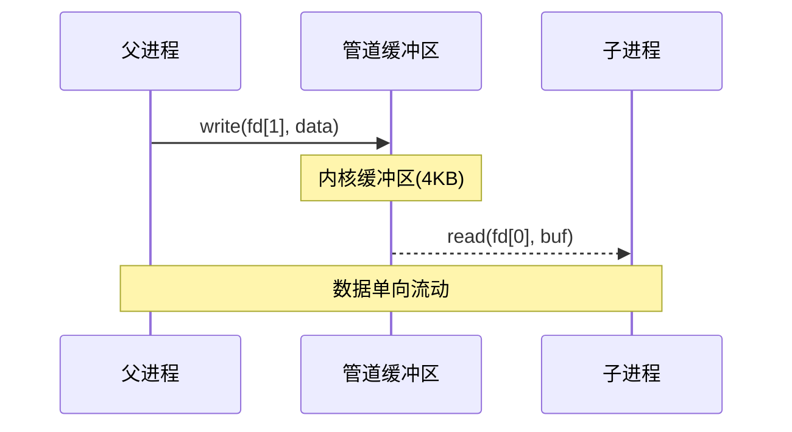
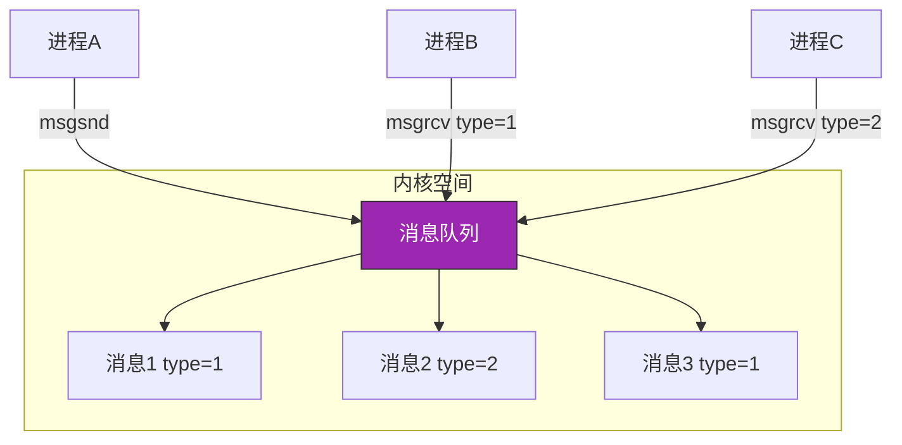
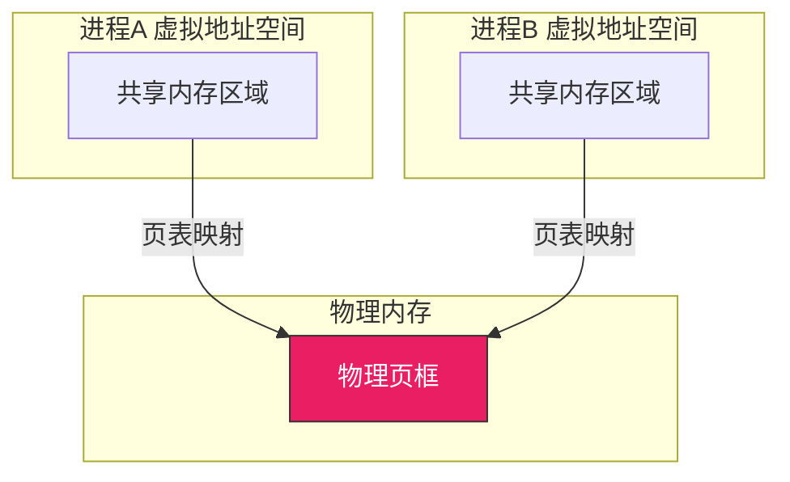
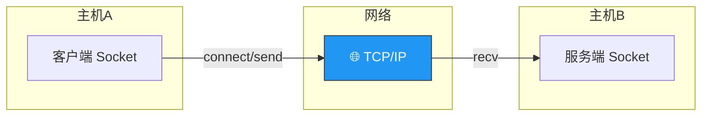

# 进程间通信

> 进程之间就像住在不同房间的人——各自独立，但有时需要传递消息。进程间通信（IPC）就是这些"传话"的方式：有的像塞纸条（管道），有的像共享白板（共享内存），有的像贴通知（信号）。

## 一、为什么需要 IPC？

每个进程拥有**独立的地址空间**，一个进程不能直接访问另一个进程的内存。IPC 机制就是操作系统提供的"桥梁"，让进程间可以安全地交换数据。



---

## 二、管道（Pipe）

### 2.1 匿名管道

最古老的 IPC 方式，半双工通信，数据单向流动。

```c
#include <unistd.h>
#include <stdio.h>
#include <string.h>

int main() {
    int fd[2];  // fd[0] 读端, fd[1] 写端
    pid_t pid;
    char buf[128];

    pipe(fd);       // 创建管道
    pid = fork();   // 创建子进程

    if (pid == 0) {
        // 子进程——读
        close(fd[1]);              // 关闭写端
        read(fd[0], buf, sizeof(buf));
        printf("子进程收到: %s\n", buf);
        close(fd[0]);
    } else {
        // 父进程——写
        close(fd[0]);              // 关闭读端
        write(fd[1], "Hello from parent!", 18);
        close(fd[1]);
    }
    return 0;
}
```



**匿名管道的特点**：

| 特性 | 说明 |
|------|------|
| 半双工 | 数据只能单向流动 |
| 亲缘关系 | 只能在父子进程间使用 |
| 生命周期 | 随进程结束而消失 |
| 字节流 | 无消息边界，FIFO |

::: warning 管道的"四不"
1. 管道读端关闭后，写端写会收到 SIGPIPE 信号
2. 管道写端关闭后，读端 read 返回 0（EOF）
3. 管道满时 write 阻塞，管道空时 read 阻塞
4. 管道数据被读取后就消失了（一次性）
:::

### 2.2 命名管道（FIFO）

命名管道在文件系统中存在一个路径名，**允许无亲缘关系的进程**通信。

```c
// 创建命名管道
mkfifo("/tmp/myfifo", 0666);

// 进程 A——写
int fd = open("/tmp/myfifo", O_WRONLY);
write(fd, "Hello", 5);

// 进程 B——读
int fd = open("/tmp/myfifo", O_RDONLY);
read(fd, buf, 5);
```

---

## 三、消息队列

消息队列是消息的链表，存放在内核中，按类型读取。



```c
#include <sys/msg.h>

// 定义消息结构
struct my_msg {
    long mtype;         // 消息类型（必须 > 0）
    char mtext[100];    // 消息正文
};

// 发送消息
void send_msg(int msgid, long type, const char *text) {
    struct my_msg msg;
    msg.mtype = type;
    strcpy(msg.mtext, text);
    msgsnd(msgid, &msg, sizeof(msg.mtext), 0);
}

// 接收消息（按类型）
void recv_msg(int msgid, long type) {
    struct my_msg msg;
    msgrcv(msgid, &msg, sizeof(msg.mtext), type, 0);
    printf("收到(type=%ld): %s\n", msg.mtype, msg.mtext);
}
```

| 对比 | 管道 | 消息队列 |
|------|------|---------|
| 通信方式 | 字节流，无边界 | 消息为单位，有边界 |
| 数据持久性 | 随进程消失 | 内核持久，需显式删除 |
| 读取方式 | FIFO 顺序读 | 可按类型选择性读 |
| 适用场景 | 父子进程简单通信 | 多进程、多类型消息 |

---

## 四、共享内存

共享内存是**最快的 IPC 方式**——两个进程映射同一块物理内存，直接读写，无需内核中转。



```c
#include <sys/shm.h>
#include <string.h>

// 进程 A：创建并写入共享内存
int shmid = shmget(IPC_PRIVATE, 4096, IPC_CREAT | 0666);
char *addr = (char*)shmat(shmid, NULL, 0);
strcpy(addr, "Hello from A!");

// 进程 B：连接并读取共享内存
char *addr = (char*)shmat(shmid, NULL, 0);
printf("B读到: %s\n", addr);
shmdt(addr);
```

::: important 共享内存为什么最快？
管道/消息队列每次通信都需要**两次数据拷贝**（用户态→内核态→用户态），而共享内存映射后，进程直接读写同一块物理内存，**零拷贝**。代价是必须自行处理同步问题。
:::

---

## 五、信号量

信号量用于进程间**同步与互斥**，本身不传输数据，而是控制对共享资源的访问。

```c
#include <sys/sem.h>

// 创建信号量集
int semid = semget(IPC_PRIVATE, 1, IPC_CREAT | 0666);

// 初始化为 1（互斥信号量）
semctl(semid, 0, SETVAL, 1);

// P 操作
struct sembuf p_op = {0, -1, 0};
semop(semid, &p_op, 1);

// V 操作
struct sembuf v_op = {0, 1, 0};
semop(semid, &v_op, 1);
```

信号量常与共享内存配合使用——共享内存提供数据通道，信号量保证同步互斥。

---

## 六、信号

信号是**异步通知机制**，用于通知进程某个事件发生了。

| 信号 | 含义 | 默认行为 |
|------|------|---------|
| SIGINT | Ctrl+C | 终止 |
| SIGKILL | 强制终止 | 终止（不可捕获） |
| SIGTERM | 请求终止 | 终止 |
| SIGSEGV | 段错误 | 终止+core |
| SIGCHLD | 子进程状态变化 | 忽略 |
| SIGSTOP | 暂停 | 停止（不可捕获） |

```c
#include <signal.h>
#include <stdio.h>

// 信号处理函数
void handler(int sig) {
    printf("收到信号 %d\n", sig);
}

int main() {
    signal(SIGINT, handler);   // 捕获 Ctrl+C
    while (1) {
        pause();  // 等待信号
    }
    return 0;
}
```

::: warning 信号的局限
- 信号只能传递**信号编号**，不能传递复杂数据
- SIGKILL 和 SIGSTOP **不可捕获、不可忽略**
- 信号处理函数中只能调用**异步信号安全**的函数
- 信号是异步的，可能打断正常的控制流
:::

---

## 七、Socket

Socket 是**跨网络**的 IPC 方式，也可用于本机进程通信（Unix Domain Socket）。



```c
// 简化的 Socket 通信流程
// 服务端
int server_fd = socket(AF_INET, SOCK_STREAM, 0);
bind(server_fd, ...);
listen(server_fd, 5);
int client_fd = accept(server_fd, ...);
recv(client_fd, buf, sizeof(buf), 0);

// 客户端
int sock = socket(AF_INET, SOCK_STREAM, 0);
connect(sock, ...);
send(sock, "Hello", 5, 0);
```

---

## 八、IPC 机制对比总结

| 机制 | 数据传输 | 同步 | 通信范围 | 速度 |
|------|---------|------|---------|------|
| 匿名管道 | 字节流 | 自带阻塞 | 父子进程 | 中 |
| 命名管道 | 字节流 | 自带阻塞 | 任意进程 | 中 |
| 消息队列 | 消息 | 自带阻塞 | 任意进程 | 中 |
| 共享内存 | 自由读写 | 需信号量配合 | 任意进程 | **最快** |
| 信号量 | 不传数据 | 同步/互斥 | 任意进程 | - |
| 信号 | 信号编号 | 异步 | 任意进程 | 快 |
| Socket | 字节流 | 自带阻塞 | 跨网络 | 慢 |

```c
// IPC 选择策略伪代码
ipc_type choose_ipc() {
    if (need_cross_network) return SOCKET;
    if (parent_child && simple_data) return PIPE;
    if (need_selective_read) return MESSAGE_QUEUE;
    if (need_high_performance) return SHARED_MEMORY + SEMAPHORE;
    if (need_notification_only) return SIGNAL;
}
```

::: tip 面试速查
1. **管道**：半双工、亲缘进程、字节流、FIFO
2. **消息队列**：有消息边界、可按类型读取、内核持久
3. **共享内存是最快的 IPC**——零拷贝，但需自行同步
4. **信号**：异步通知，SIGKILL/SIGSTOP 不可捕获
5. **Socket**：唯一可跨网络的 IPC，也可本机通信
6. 管道通信需要**两次数据拷贝**（用户→内核→用户），共享内存只需映射无需拷贝
7. 匿名管道 vs 命名管道：前者限亲缘进程，后者通过文件系统路径通信
:::

---

::: info 原著参考
- 小林 coding《图解操作系统》——进程间通信篇
- 王道考研《操作系统》——第二章 进程间通信
- CSAPP 第十二章《并发编程》
:::
