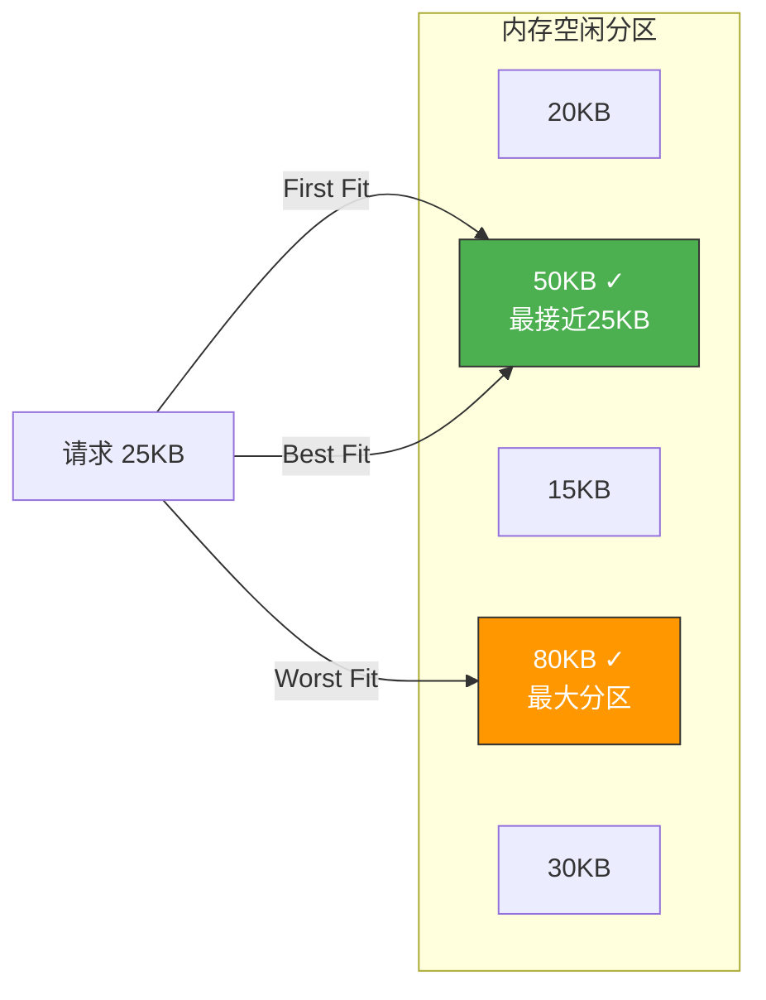
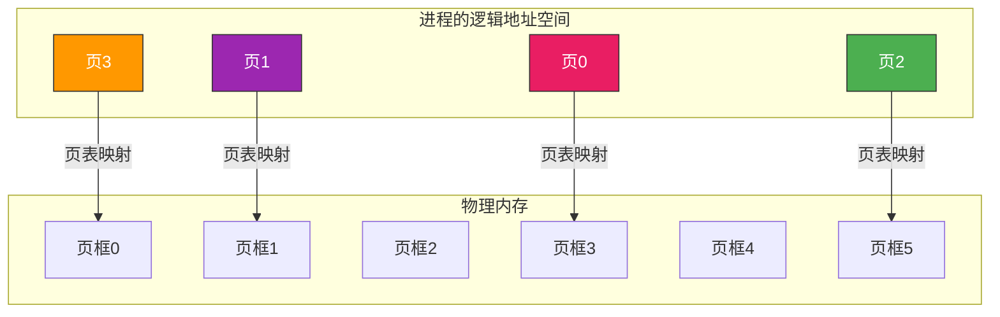

# 内存管理基础

> 内存就像一个书架，程序运行需要把"书"放到书架上。内存管理的核心问题就是：书架有限，怎么放书才能既不浪费空间，又能快速找到想要的书？

## 一、内存管理的基本功能

| 功能 | 说明 |
|------|------|
| **内存分配与回收** | 为进程分配内存，进程结束后回收 |
| **地址转换** | 将逻辑地址转换为物理地址 |
| **内存保护** | 防止进程越界访问其他进程的内存 |
| **内存共享** | 允许进程共享某些内存区域 |
| **内存扩充** | 用虚拟内存技术"扩充"物理内存 |


---

## 二、程序的装入与链接

### 2.1 从源代码到运行——三步走


### 2.2 链接方式

| 方式 | 时机 | 特点 |
|------|------|------|
| **静态链接** | 编译后、运行前 | 库代码复制到可执行文件，文件大 |
| **装入时动态链接** | 装入内存时 | 边装入边链接，便于更新 |
| **运行时动态链接** | 运行时需要时 | 按需加载，节省内存（DLL/SO） |

### 2.3 装入方式

| 方式 | 地址确定时机 | 特点 |
|------|------------|------|
| **绝对装入** | 编译时 | 只能放在固定地址，不灵活 |
| **可重定位装入（静态重定位）** | 装入时 | 装入时一次性地址转换，装入后不能移动 |
| **动态运行时装入（动态重定位）** | 运行时 | 需要重定位寄存器，运行时才转换地址 |

```c
// 静态重定位：装入时修改所有地址
// 假设程序中有一条指令: JMP 100
// 装入起始地址为 5000
// 则装入后修改为: JMP 5100

// 动态重定位：运行时通过寄存器转换
// 程序中仍为: JMP 100
// 运行时: 实际地址 = 100 + 重定位寄存器值(5000) = 5100
```

::: important 动态重定位是现代OS的基础
动态重定位允许进程在内存中移动（换入换出），只需修改重定位寄存器的值。这是虚拟内存实现的前提。
:::

---

## 三、连续分配管理方式

### 3.1 单一连续分配

内存分为系统区和用户区，一次只能运行一个用户程序。

- **优点**：简单，无外部碎片
- **缺点**：内存利用率极低，无法多道程序

### 3.2 固定分区分配

将用户空间划分为若干**固定大小**的分区，每个分区装入一道作业。

| 分区 | 大小 | 起始地址 | 状态 |
|------|------|---------|------|
| 1 | 8KB | 0x1000 | 已分配 |
| 2 | 16KB | 0x3000 | 空闲 |
| 3 | 32KB | 0x7000 | 已分配 |

- **优点**：支持多道程序，无外部碎片
- **缺点**：有**内部碎片**（分区大于作业需要的空间）

### 3.3 动态分区分配

根据作业需要动态划分分区，大小不固定。

- **优点**：无内部碎片
- **缺点**：有**外部碎片**（空闲分区太小，无法利用）

::: tip 内部碎片 vs 外部碎片
- **内部碎片**：分配给进程的内存大于实际需要，多余的部分在分区内部浪费
- **外部碎片**：内存中空闲分区总量足够，但分散为小块，无法满足大请求
- **紧凑（Compaction）**：移动进程使空闲分区合并，解决外部碎片，但开销大
:::

---

## 四、动态分区分配算法

### 4.1 首次适应（First Fit）

从低地址开始找，第一个够大的空闲分区就分配。

```c
// 首次适应算法
Block* first_fit(int size) {
    for (each block b in free_list) {  // 按地址递增排列
        if (b.size >= size) {
            allocate(b, size);
            return b;
        }
    }
    return NULL;  // 分配失败
}
```

### 4.2 最佳适应（Best Fit）

找**最小的**能满足要求的空闲分区。

```c
// 最佳适应算法
Block* best_fit(int size) {
    Block *best = NULL;
    for (each block b in free_list) {  // 按大小递增排列
        if (b.size >= size) {
            if (best == NULL || b.size < best.size) {
                best = b;
            }
        }
    }
    if (best) allocate(best, size);
    return best;
}
```

### 4.3 最坏适应（Worst Fit）

找**最大的**空闲分区分配，减少小碎片。

### 4.4 邻近适应（Next Fit）

从上次查找结束的位置开始，首次适应的变种。



| 算法 | 空闲分区排列 | 优点 | 缺点 |
|------|------------|------|------|
| 首次适应 | 地址递增 | 高地址大分区保留 | 低地址碎片多 |
| 最佳适应 | 容量递增 | 小分区够用 | 大量极小碎片 |
| 最坏适应 | 容量递减 | 减少小碎片 | 大分区被用完 |
| 邻近适应 | 循环查找 | 避免低地址碎片 | 大分区也用完 |

::: important 首次适应实际效果最好
虽然最佳适应听起来"最优"，但它会产生大量难以利用的小碎片。首次适应利用了地址空间的"惯性"——高地址保留大分区，综合效果反而最好。这也是 Linux 早期伙伴系统设计的参考依据。
:::

---

## 五、非连续分配——基本分页

### 5.1 分页的思想

将内存划分为固定大小的**页框（Frame）**，将进程的逻辑地址空间划分为同样大小的**页（Page）**，以页为单位离散分配。



### 5.2 地址转换

逻辑地址 = 页号 + 页内偏移

```c
// 分页地址转换
#define PAGE_SIZE 4096  // 4KB 页面

void translate(int logical_addr) {
    int page_num = logical_addr / PAGE_SIZE;    // 页号
    int offset = logical_addr % PAGE_SIZE;       // 页内偏移

    // 查页表得到页框号
    int frame_num = page_table[page_num];

    // 物理地址 = 页框号 * PAGE_SIZE + 偏移
    int physical_addr = frame_num * PAGE_SIZE + offset;
}
```

### 5.3 页表

每个进程一张页表，记录页号→页框号的映射。

| 页号 | 页框号 | 标志位 |
|------|--------|--------|
| 0 | 3 | 有效 |
| 1 | 1 | 有效 |
| 2 | 5 | 有效 |
| 3 | 0 | 有效 |

---

## 六、基本分段

按程序的**逻辑结构**分段（代码段、数据段、栈段等），每段大小可不同。

```c
// 分段地址：段号 + 段内偏移
struct segment_addr {
    int segment_num;   // 段号
    int offset;        // 段内偏移
};

// 段表项
struct segment_table_entry {
    int base;     // 段基址
    int limit;    // 段长度
    int flags;    // 标志位
};
```

| 对比 | 分页 | 分段 |
|------|------|------|
| 大小 | 固定（系统决定） | 可变（由程序决定） |
| 划分依据 | 物理内存管理 | 程序逻辑结构 |
| 碎片 | 内部碎片 | 外部碎片 |
| 地址空间 | 一维 | 二维（段号+偏移） |
| 信息共享 | 不方便 | 方便（按段共享） |

---

::: tip 面试速查
1. **逻辑地址 vs 物理地址**：逻辑地址是CPU生成的，物理地址是内存单元的真实地址
2. **静态重定位 vs 动态重定位**：前者装入时一次转换（不能移动），后者运行时转换（需重定位寄存器）
3. **内部碎片 vs 外部碎片**：内部碎片在分区内部浪费，外部碎片是空闲区太小无法利用
4. **动态分区算法**：首次适应实际效果最好；最佳适应产生极小碎片；最坏适应用完大分区
5. **分页**：固定大小，有内部碎片，无外部碎片，一维地址
6. **分段**：可变大小，有外部碎片，无内部碎片，二维地址，便于共享和保护
7. **页大小选择**：太小→页表大；太大→内部碎片大；通常4KB
:::

---

::: info 原著参考
- 小林 coding《图解操作系统》——内存管理篇
- 王道考研《操作系统》——第三章 内存管理
- CSAPP 第九章《虚拟内存》
:::
