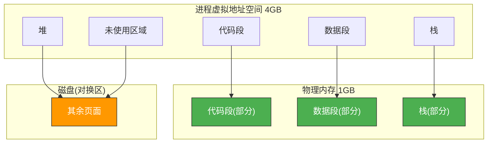
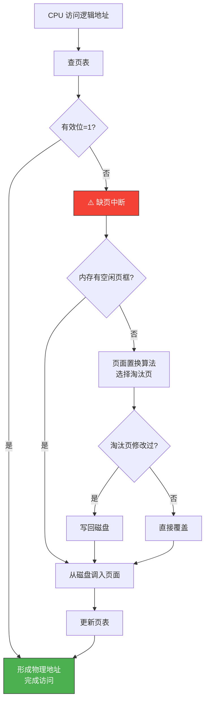
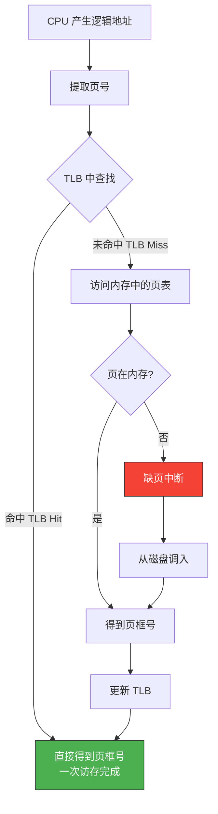
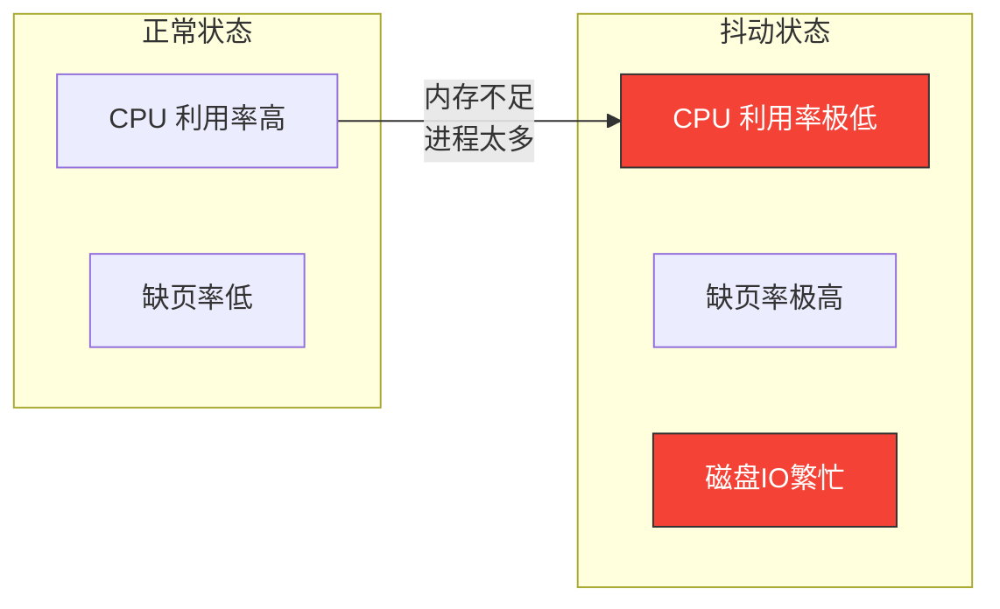

# 虚拟内存

> 虚拟内存就像一个"变魔术"的书架——你拥有一个巨大的虚拟空间，但实际的书架（物理内存）只有那么大。当你需要一本书时，如果它不在书架上，就从仓库（磁盘）取过来，同时可能把暂时不用的书放回仓库。

## 一、为什么需要虚拟内存？

### 1.1 局部性原理

虚拟内存能够工作的理论基础是**局部性原理**：

| 局部性类型 | 含义 | 举例 |
|-----------|------|------|
| **时间局部性** | 最近访问的数据可能很快再次访问 | 循环变量 |
| **空间局部性** | 访问某位置后，很可能访问附近位置 | 数组遍历 |

```c
// 局部性原理的体现
int sum = 0;
for (int i = 0; i < 1000; i++) {  // 时间局部性：sum, i 反复访问
    sum += array[i];                // 空间局部性：array 连续访问
}
```

### 1.2 虚拟内存的核心思想

不需要把进程全部装入内存——只装入当前需要的部分，其余留在磁盘，需要时再调入。



::: important 虚拟内存的三大好处
1. **扩大地址空间**：进程可使用比物理内存更大的地址空间
2. **提高内存利用率**：只加载需要的页面，不浪费空间
3. **便于编程**：程序员不需要关心物理内存大小
:::

---

## 二、虚拟内存的实现

### 2.1 请求分页存储管理

在基本分页基础上增加**调页功能**——访问的页不在内存时，从磁盘调入。

**页表项的扩展**：

| 字段 | 含义 |
|------|------|
| 页框号 | 物理页框 |
| **有效位（状态位）** | 页是否在内存 |
| **访问字段** | 记录访问次数/时间（用于置换算法） |
| **修改位** | 页是否被修改过（决定换出时是否写回磁盘） |
| **外存地址** | 页在磁盘上的位置 |

```c
// 扩展的页表项
struct page_table_entry {
    int frame_num;        // 页框号
    int valid;            // 有效位(1=在内存, 0=不在)
    int reference;        // 访问位
    int dirty;            // 修改位
    int disk_addr;        // 磁盘地址
};
```

### 2.2 缺页中断处理流程



::: warning 缺页中断 vs 普通中断
- 缺页中断是**指令执行期间**产生的（访问地址才发现不在内存）
- 普通中断是**指令执行完后**才响应的
- 一条指令可能产生多次缺页中断（如跨页的指令本身+操作数）
:::

### 2.3 请求分段存储管理

与请求分页类似，但以段为单位进行换入换出。段是逻辑单位，便于共享和保护。

---

## 三、页表的高速缓存——TLB

### 3.1 两次内存访问问题

分页系统中，每次访存需要**两次访问内存**：
1. 访问页表（在内存中）→ 得到物理地址
2. 访问目标内存单元

这太慢了！解决方案：**TLB（Translation Lookaside Buffer）**，页表的高速缓存。

### 3.2 TLB 的工作原理



### 3.3 TLB 的关键参数

```c
// TLB 性能计算
// 有效访存时间 EAT = 命中率 * TLB访存时间 + (1-命中率) * 两次内存访存时间

float effective_access_time(float hit_ratio, int tlb_time, int mem_time) {
    return hit_ratio * (tlb_time + mem_time)     // TLB命中
         + (1 - hit_ratio) * (tlb_time + 2 * mem_time);  // TLB未命中
}

// 示例：命中率 90%，TLB 10ns，内存 100ns
// EAT = 0.9 * (10+100) + 0.1 * (10+200) = 99 + 21 = 120ns
// 比无 TLB 的 200ns 快了 40%
```

::: tip TLB 命中率通常很高
由于局部性原理，TLB 命中率通常可达 **90%~99%**。这意味着绝大多数访存只需一次内存访问。
:::

---

## 四、多级页表与哈希页表

### 4.1 为什么需要多级页表？

32 位地址空间、4KB 页面：页表项 = 2^20 ≈ 100万项。如果每个页表项 4 字节，一个进程的页表就占 **4MB** 连续内存！

解决思路：对页表本身再分页——**二级页表**。

### 4.2 二级页表的地址转换

```
逻辑地址 (32位):
┌──────────┬──────────┬──────────────────┐
│ 一级页号  │ 二级页号  │    页内偏移       │
│ (10位)   │ (10位)   │    (12位)        │
└──────────┴──────────┴──────────────────┘

转换过程：
一级页号 → 查一级页表 → 二级页表基地址
二级页号 → 查二级页表 → 页框号
页框号 + 偏移 → 物理地址
```


### 4.3 64 位系统——四级页表

Linux 在 64 位系统上使用**四级页表**：PGD → PUD → PMD → PTE → 物理页

```c
// Linux 四级页表查找
unsigned long *page_walk(pgd_t *pgd, unsigned long addr) {
    pud_t *pud = pud_offset(pgd, addr);  // 第一级
    if (!pud_present(*pud)) return NULL;

    pmd_t *pmd = pmd_offset(pud, addr);  // 第二级
    if (!pmd_present(*pmd)) return NULL;

    pte_t *pte = pte_offset(pmd, addr);  // 第三级
    if (!pte_present(*pte)) return NULL;

    return (unsigned long *)pte_page(*pte) + (addr & ~PAGE_MASK);
}
```

### 4.4 哈希页表

适用于地址空间大但使用稀疏的场景——对页号取哈希，在哈希链中查找。

### 4.5 反置页表

不为每个进程建页表，而是为每个**页框**建一个表项——记录该页框属于哪个进程的哪一页。

- **优点**：页表大小只与物理内存有关，与进程数无关
- **缺点**：查找需要哈希，实现复杂

---

## 五、虚拟内存的性能影响

### 5.1 抖动（Thrashing）

当物理内存不足，进程频繁缺页，大部分时间花在页面换入换出上，系统吞吐量急剧下降。



### 5.2 工作集模型

进程在时间窗口 Δ 内访问的页面集合称为**工作集**：

```c
// 工作集估算
int working_set(Process *p, int window_size) {
    // 最近 window_size 次访存涉及的页面数
    int pages = count_distinct_pages(p->recent_accesses, window_size);
    return pages;
}

// 分配策略：为每个进程分配 ≥ 工作集的页框数
// 如果总工作集 > 物理页框数 → 抖动，需要挂起某些进程
```

::: important 防止抖动的方法
1. **工作集模型**：为进程分配足够多的页框（≥ 工作集大小）
2. **L = S 准则**：缺页间的平均时间（L）= 缺页处理时间（S）时系统效率最优
3. **减少并发进程数**：挂起某些进程，释放页框给活跃进程
:::

---

::: tip 面试速查
1. **虚拟内存基于局部性原理**：时间局部性（重用）+ 空间局部性（附近访问）
2. **缺页中断**：指令执行期间产生，一条指令可能多次缺页
3. **TLB**：页表的高速缓存，命中率 90%+，极大加速地址转换
4. **多级页表**：解决页表过大问题，一级页表常驻内存，二级按需调入
5. **抖动**：进程太多导致频繁缺页，CPU 利用率极低
6. **工作集**：时间窗口内访问的页面集合，分配策略应满足工作集需求
7. 页表项扩展字段：有效位、访问位、修改位、外存地址
:::

---

::: info 原著参考
- 小林 coding《图解操作系统》——虚拟内存篇
- 王道考研《操作系统》——第三章 虚拟内存
- CSAPP 第九章《虚拟内存》
:::
