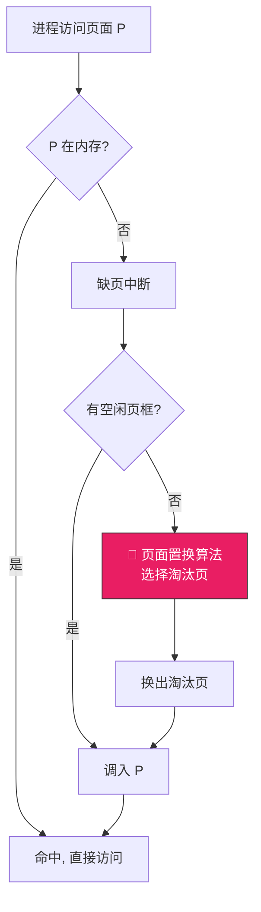
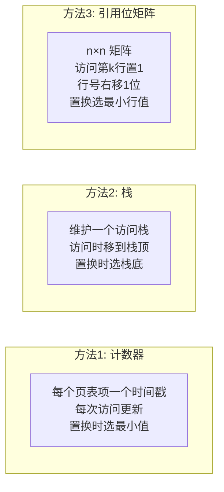

# 页面置换算法

> 当内存已满又需要调入新页面时，必须选择一个旧页面"赶出去"——选谁？选错了，刚赶走又要请回来，来来回回就是"抖动"。页面置换算法就是决定"赶谁走"的策略。

## 一、页面置换的基本概念

### 1.1 什么时候需要置换？



### 1.2 置换算法的评价指标

- **缺页率** = 缺页次数 / 总访问次数（越低越好）
- **命中率** = 1 - 缺页率（越高越好）

::: important Belady 异常
一般情况下，分配的页框越多，缺页率越低。但 **FIFO 算法**可能出现反常——页框数增加，缺页率反而上升！这就是 Belady 异常。LRU 等基于栈的算法不会出现此异常。
:::

---

## 二、OPT——最优置换算法（理论标杆）

选择**未来最长时间不再使用**的页面淘汰。

```
页面引用串: 7, 0, 1, 2, 0, 3, 0, 4, 2, 3, 0, 3, 2, 1, 2, 0, 1, 7, 0, 1
页框数: 3

  访问:  7  0  1  2  0  3  0  4  2  3  0  3  2  1  2  0  1  7  0  1
  ┌───┬───┬───┬───┬───┬───┬───┬───┬───┬───┬───┬───┬───┬───┬───┬───┬───┬───┬───┬───┐
  │ 7 │ 7 │ 7 │ 2 │ 2 │ 2 │ 2 │ 2 │ 2 │ 2 │ 2 │ 2 │ 2 │ 2 │ 2 │ 2 │ 2 │ 7 │ 7 │ 7 │
  │   │ 0 │ 0 │ 0 │ 0 │ 0 │ 0 │ 4 │ 4 │ 4 │ 0 │ 0 │ 0 │ 0 │ 0 │ 0 │ 0 │ 0 │ 0 │ 0 │
  │   │   │ 1 │ 1 │ 1 │ 3 │ 3 │ 3 │ 3 │ 3 │ 3 │ 3 │ 3 │ 1 │ 1 │ 1 │ 1 │ 1 │ 1 │ 1 │
  └───┴───┴───┴───┴───┴───┴───┴───┴───┴───┴───┴───┴───┴───┴───┴───┴───┴───┴───┴───┘
  缺页:  ✓  ✓  ✓  ✓     ✓     ✓        ✓

OPT 缺页次数: 9, 缺页率: 9/20 = 45%
```

::: tip OPT 是理论最优
OPT 需要预知未来的访问序列，实际无法实现，但它是**评价其他算法的标杆**——越接近 OPT 越好。
:::

---

## 三、FIFO——先进先出置换算法

选择**最早进入内存**的页面淘汰。

```c
// FIFO 置换算法伪代码
void fifo_replace(int new_page) {
    int victim = queue_front();  // 队首 = 最早进入的
    dequeue();
    swap_out(victim);
    swap_in(new_page);
    enqueue(new_page);  // 新页排到队尾
}
```

```
页面引用串: 7, 0, 1, 2, 0, 3, 0, 4, 2, 3, 0, 3, 2, 1, 2, 0, 1, 7, 0, 1
页框数: 3

  访问:  7  0  1  2  0  3  0  4  2  3  0  3  2  1  2  0  1  7  0  1
  ┌───┬───┬───┬───┬───┬───┬───┬───┬───┬───┬───┬───┬───┬───┬───┬───┬───┬───┬───┬───┐
  │ 7 │ 7 │ 7 │ 2 │ 2 │ 2 │ 2 │ 4 │ 4 │ 4 │ 0 │ 0 │ 0 │ 0 │ 0 │ 0 │ 1 │ 1 │ 1 │ 1 │
  │   │ 0 │ 0 │ 0 │ 0 │ 3 │ 3 │ 3 │ 2 │ 2 │ 2 │ 2 │ 2 │ 2 │ 2 │ 2 │ 2 │ 7 │ 7 │ 7 │
  │   │   │ 1 │ 1 │ 1 │ 1 │ 0 │ 0 │ 0 │ 3 │ 3 │ 3 │ 3 │ 1 │ 1 │ 1 │ 1 │ 1 │ 0 │ 0 │
  └───┴───┴───┴───┴───┴───┴───┴───┴───┴───┴───┴───┴───┴───┴───┴───┴───┴───┴───┴───┘
  缺页:  ✓  ✓  ✓  ✓     ✓  ✓  ✓  ✓  ✓  ✓     ✓  ✓     ✓     ✓  ✓

FIFO 缺页次数: 15, 缺页率: 15/20 = 75%
```

- **优点**：实现简单
- **缺点**：性能差；可能产生 **Belady 异常**

### Belady 异常示例

```
引用串: 1, 2, 3, 4, 1, 2, 5, 1, 2, 3, 4, 5

3 个页框: 缺页 9 次
4 个页框: 缺页 10 次  ← 页框多了反而更差！
```

---

## 四、LRU——最近最久未使用算法

选择**最近最长时间没有被访问**的页面淘汰——"向后看"的 OPT。

```c
// LRU 置换算法伪代码（基于时间戳）
void lru_replace(int new_page) {
    int victim = -1;
    int min_time = MAX_INT;

    for (each page p in frames) {
        if (p.last_access_time < min_time) {
            min_time = p.last_access_time;
            victim = p;
        }
    }
    swap_out(victim);
    swap_in(new_page);
}

// 每次访问时更新时间戳
void access_page(int page) {
    page_table[page].last_access_time = current_time++;
}
```

```
页面引用串: 7, 0, 1, 2, 0, 3, 0, 4, 2, 3, 0, 3, 2, 1, 2, 0, 1, 7, 0, 1
页框数: 3

  访问:  7  0  1  2  0  3  0  4  2  3  0  3  2  1  2  0  1  7  0  1
  ┌───┬───┬───┬───┬───┬───┬───┬───┬───┬───┬───┬───┬───┬───┬───┬───┬───┬───┬───┬───┐
  │ 7 │ 7 │ 7 │ 2 │ 2 │ 2 │ 2 │ 4 │ 4 │ 4 │ 0 │ 0 │ 0 │ 1 │ 1 │ 1 │ 1 │ 1 │ 1 │ 1 │
  │   │ 0 │ 0 │ 0 │ 0 │ 0 │ 0 │ 0 │ 0 │ 3 │ 3 │ 3 │ 3 │ 3 │ 2 │ 2 │ 2 │ 2 │ 2 │ 2 │
  │   │   │ 1 │ 1 │ 1 │ 3 │ 3 │ 3 │ 2 │ 2 │ 2 │ 2 │ 2 │ 2 │ 2 │ 0 │ 0 │ 7 │ 7 │ 7 │
  └───┴───┴───┴───┴───┴───┴───┴───┴───┴───┴───┴───┴───┴───┴───┴───┴───┴───┴───┴───┘
  缺页:  ✓  ✓  ✓  ✓     ✓     ✓  ✓  ✓  ✓        ✓        ✓     ✓

LRU 缺页次数: 12, 缺页率: 12/20 = 60%
```

- **优点**：性能接近 OPT，不会出现 Belady 异常
- **缺点**：实现开销大（需要硬件支持记录访问时间）

### LRU 的硬件实现



---

## 五、Clock——时钟置换算法

LRU 实现太复杂，Clock 是 LRU 的**近似算法**，性能接近但实现简单。

### 5.1 简单 Clock 算法（NRU）

为每页设一个**访问位**，页面组成循环链表，指针像时钟一样转动：

```c
// 简单 Clock 算法
void clock_replace(int new_page) {
    while (true) {
        if (current->reference_bit == 0) {
            // 访问位为0，选择淘汰
            swap_out(current->page);
            swap_in(new_page);
            current->reference_bit = 1;
            current = current->next;
            return;
        } else {
            // 访问位为1，给第二次机会
            current->reference_bit = 0;
            current = current->next;
        }
    }
}
```


### 5.2 改进型 Clock 算法

同时考虑**访问位(R)**和**修改位(M)**，优先淘汰未修改的页面（减少写回磁盘）：

| 优先级 | (R, M) | 含义 | 选择顺序 |
|--------|--------|------|---------|
| 1 | (0, 0) | 最近未访问、未修改 | 最先淘汰 |
| 2 | (0, 1) | 最近未访问、已修改 | 第二选择 |
| 3 | (1, 0) | 最近访问过、未修改 | 第三选择 |
| 4 | (1, 1) | 最近访问过、已修改 | 最后淘汰 |

```c
// 改进型 Clock 算法——两轮扫描
void improved_clock_replace(int new_page) {
    // 第一轮：找 (0,0)
    for (each page in circular_list) {
        if (R == 0 && M == 0) { replace(it); return; }
    }
    // 第二轮：找 (0,1)，同时将 R 置 0
    for (each page in circular_list) {
        if (R == 0 && M == 1) { replace(it); return; }
        R = 0;  // 给"第二次机会"
    }
    // 第三轮：重复第一轮逻辑（此时所有 R 都已清0）
    // 第四轮：重复第二轮逻辑
    // 最多四轮一定能找到
}
```

---

## 六、其他置换算法

### 6.1 最不常用（LFU）

选择**访问次数最少**的页面淘汰。

- **优点**：考虑了长期使用频率
- **缺点**：早期频繁访问的页面即使后来不再使用也不会被淘汰；需要维护计数器

### 6.2 页面缓冲算法

被选中的淘汰页不立即换出，而是放入**空闲链表**或**已修改链表**，如果很快又被访问，可以直接"救回"。

---

## 七、算法对比总结

| 算法 | 看什么 | Belady异常 | 实现难度 | 性能 |
|------|--------|-----------|---------|------|
| OPT | 未来最远使用 | 不会 | 无法实现 | 最优(理论) |
| FIFO | 进入时间最早 | **会** | 简单 | 差 |
| LRU | 最近最久未用 | 不会 | 复杂 | 好 |
| Clock(NRU) | 访问位近似 | 不会 | 简单 | 较好 |
| 改进Clock | 访问位+修改位 | 不会 | 中等 | 好 |
| LFU | 访问次数最少 | 不会 | 中等 | 一般 |

```c
// 算法选择策略
page_replacement_t choose_algorithm() {
    if (has_hardware_timestamp) return LRU;        // 硬件支持 → LRU
    if (need_simple_implementation) return CLOCK;   // 简单 → Clock
    if (disk_write_costly) return IMPROVED_CLOCK;   // 减少写回 → 改进Clock
    // 实际系统中 Linux 使用近似 LRU（双链表），Windows 使用 Clock 变种
}
```

::: tip 面试速查
1. **OPT** 是理论最优但无法实现，作为评价标杆
2. **FIFO** 最简单但性能差，且可能出现 **Belady 异常**
3. **LRU** 性能好但实现复杂，需要硬件支持（时间戳/栈/矩阵）
4. **Clock** 是 LRU 的近似，用访问位模拟，实现简单性能好
5. **改进 Clock** 考虑修改位，减少磁盘写回，最多四轮一定能找到淘汰页
6. LRU 和 Clock **不会出现 Belady 异常**（属于栈式算法）
7. 实际系统：Linux 近似 LRU（Active/Inactive 双链表），Windows 使用 Clock 变种
:::

---

::: info 原著参考
- 小林 coding《图解操作系统》——页面置换算法篇
- 王道考研《操作系统》——第三章 页面置换算法
- CSAPP 第九章《虚拟内存》
:::
