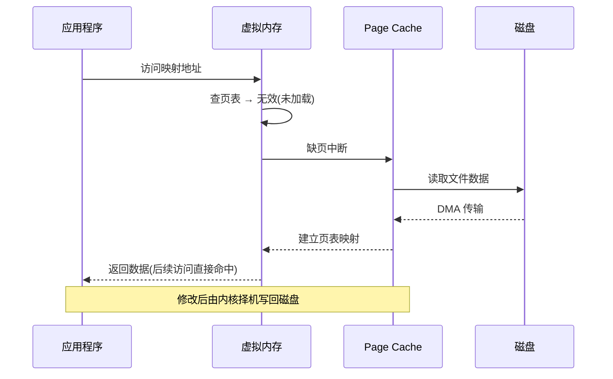
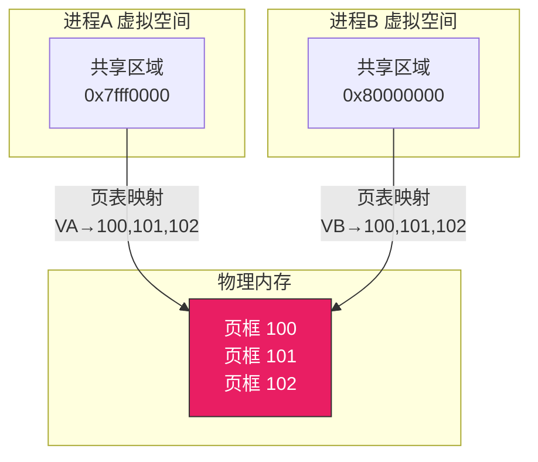
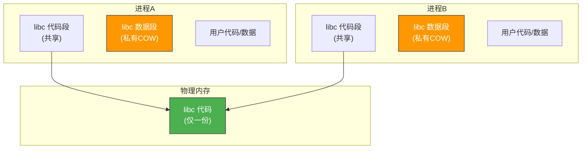
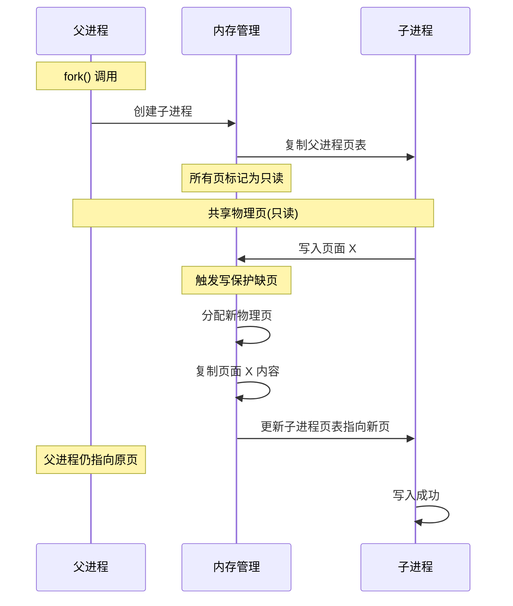

# 内存映射与共享

> 内存映射就像在两个房间之间打通一扇窗——不同进程的虚拟地址空间，通过页表映射到同一块物理内存，数据共享变得自然高效。这是现代操作系统实现共享库、文件映射、进程间通信的核心机制。

## 一、内存映射文件（mmap）

### 1.1 传统文件 IO vs mmap


传统文件 IO 需要**两次数据拷贝**（磁盘→内核缓冲区→用户缓冲区），mmap 直接将文件映射到虚拟地址空间，省去了一次拷贝。

### 1.2 mmap 的使用

```c
#include <sys/mman.h>
#include <fcntl.h>
#include <stdio.h>
#include <unistd.h>
#include <string.h>

int main() {
    // 打开文件
    int fd = open("hello.txt", O_RDWR);

    // 获取文件大小
    off_t size = lseek(fd, 0, SEEK_END);

    // 映射文件到内存
    char *addr = mmap(NULL, size, PROT_READ | PROT_WRITE,
                      MAP_SHARED, fd, 0);

    // 直接读写内存 = 读写文件
    printf("内容: %s\n", addr);
    strcpy(addr, "Hello mmap!");  // 修改 = 写文件

    // 解除映射
    munmap(addr, size);
    close(fd);
    return 0;
}
```

### 1.3 mmap 的原理



::: important mmap 的优势
1. **减少拷贝**：省去内核缓冲区→用户缓冲区的拷贝
2. **自动管理**：由内核负责缺页调入和脏页写回
3. **共享方便**：多个进程映射同一文件，自动共享物理页
4. **大文件友好**：不需要一次性读入整个文件
:::

---

## 二、共享内存的底层原理

### 2.1 共享页表映射

两个进程的虚拟地址空间通过页表映射到**同一组物理页框**：



### 2.2 写时复制（COW）与共享

当进程 fork 后，父子进程共享所有物理页（标记只读）。只有写入时才复制——**私有映射**。如果不写入，则**始终共享**同一物理页。

```c
// 共享映射 vs 私有映射
// MAP_SHARED：修改对其他进程可见，写回文件
// MAP_PRIVATE：修改不可见，写时复制

char *shared = mmap(NULL, size, PROT_READ | PROT_WRITE,
                    MAP_SHARED, fd, 0);    // 共享映射

char *private = mmap(NULL, size, PROT_READ | PROT_WRITE,
                     MAP_PRIVATE, fd, 0);  // 私有映射(COW)
```

---

## 三、共享库的内存映射

### 3.1 动态链接库的共享

所有使用 `libc.so` 的进程共享同一份**代码段**物理页，各自有独立的**数据段**副本：



### 3.2 位置无关代码（PIC）

共享库的代码段要被多个进程映射到不同的虚拟地址，因此必须是**位置无关代码**——通过 GOT（全局偏移表）间接访问全局变量和函数。

```c
// 位置无关代码的间接寻址
// 不直接用绝对地址，而是通过 GOT 表跳转

// 普通代码（非PIC）:
call 0x400560     // 绝对地址，加载位置固定

// PIC 代码:
call *GOT[printf] // 通过 GOT 间接调用，GOT 在数据段，可重定位
```

::: tip 共享库节省大量内存
假设系统有 100 个进程都使用 libc（代码段 2MB），如果不用共享：
- 100 × 2MB = 200MB
- 共享后：1 × 2MB = 2MB，节省 99%！
:::

---

## 四、内存保护

### 4.1 页级保护

每个页表项都有保护位，控制该页的访问权限：

```c
// 页表项的保护位
struct pte_protection {
    int readable;    // 可读
    int writable;    // 可写
    int executable;  // 可执行
    int user_access; // 用户态可访问(否则仅内核态)
};
```

| 访问违规 | 触发 |
|---------|------|
| 用户态访问内核页 | 段错误（SIGSEGV） |
| 写只读页 | 段错误（除非 COW 触发缺页） |
| 执行不可执行页 | 段错误（NX 位保护） |

### 4.2 代码段与数据段的保护

```
进程地址空间:
┌──────────────────────────┐ 高地址
│ 内核空间（用户不可访问）     │ Ring 0
├──────────────────────────┤
│ 栈（可读写，不可执行）       │ RW-
│ ↓ 向低地址增长              │
│ ...                        │
│ ↑ 向高地址增长              │
│ 堆（可读写，不可执行）       │ RW-
├──────────────────────────┤
│ 数据段（可读写，不可执行）   │ RW-
├──────────────────────────┤
│ 代码段（可读可执行，不可写） │ R-X
└──────────────────────────┘ 低地址
```

---

## 五、写时复制的深层机制

### 5.1 fork() 中的 COW



### 5.2 COW 的页表状态

```c
// fork() 后的页表状态
// 父进程和子进程的页表项都标记为只读
// 实际物理页是共享的

// 写入时触发缺页中断处理
void cow_page_fault(PageTableEntry *pte) {
    if (pte->reference_count == 1) {
        // 只有自己引用，直接恢复可写
        pte->writable = 1;
    } else {
        // 多个进程共享，需要复制
        void *new_page = allocate_physical_page();
        copy_page(pte->physical_page, new_page);
        pte->physical_page = new_page;
        pte->reference_count--;
        pte->writable = 1;
        pte->reference_count = 1;
    }
    flush_tlb();
}
```

---

## 六、mmap 的实际应用场景

| 场景 | 说明 |
|------|------|
| **共享库加载** | `ld.so` 将 .so 文件 mmap 到进程地址空间 |
| **进程间通信** | `shm_open()` + `mmap()` 实现共享内存 IPC |
| **大文件处理** | 避免一次性读入，按需调页 |
| **零拷贝传输** | `sendfile()` 底层利用 mmap 减少拷贝 |
| **执行程序** | `execve()` 将可执行文件 mmap 后运行 |

```c
// 零拷贝 sendfile 的原理
// 传统: 磁盘 → 内核缓冲区 → 用户缓冲区 → Socket缓冲区 → 网卡
// sendfile: 磁盘 → 内核缓冲区 → 网卡 (省去用户态拷贝)

// mmap 方式的零拷贝
void zero_copy_send(int fd, int sockfd, off_t offset, size_t count) {
    char *addr = mmap(NULL, count, PROT_READ, MAP_PRIVATE, fd, offset);
    send(sockfd, addr, count, 0);
    munmap(addr, count);
}
```

::: warning mmap 的注意事项
1. 映射区域必须是页大小的整数倍
2. 信号处理中不要使用 mmap（可能死锁）
3. 大量小文件用 mmap 反而不如 read（页表开销大）
4. 32 位系统地址空间有限，不能映射太大的文件
:::

---

::: tip 面试速查
1. **mmap** 将文件映射到虚拟地址空间，省去一次数据拷贝
2. **共享映射（MAP_SHARED）** vs **私有映射（MAP_PRIVATE）**：前者修改可见且写回文件，后者 COW
3. **共享库**通过 mmap 实现：代码段共享（仅一份物理页），数据段 COW
4. **写时复制（COW）**：fork 后共享物理页标记只读，写入时才复制
5. **页级保护**：通过页表项的 R/W/X/U 位实现访问控制
6. **位置无关代码（PIC）**：共享库代码段通过 GOT 间接寻址，可映射到任意虚拟地址
7. mmap 应用场景：共享库、IPC共享内存、大文件处理、零拷贝
:::

---

::: info 原著参考
- 小林 coding《图解操作系统》——内存映射篇
- 王道考研《操作系统》——第三章 内存管理
- CSAPP 第九章《虚拟内存》
:::
