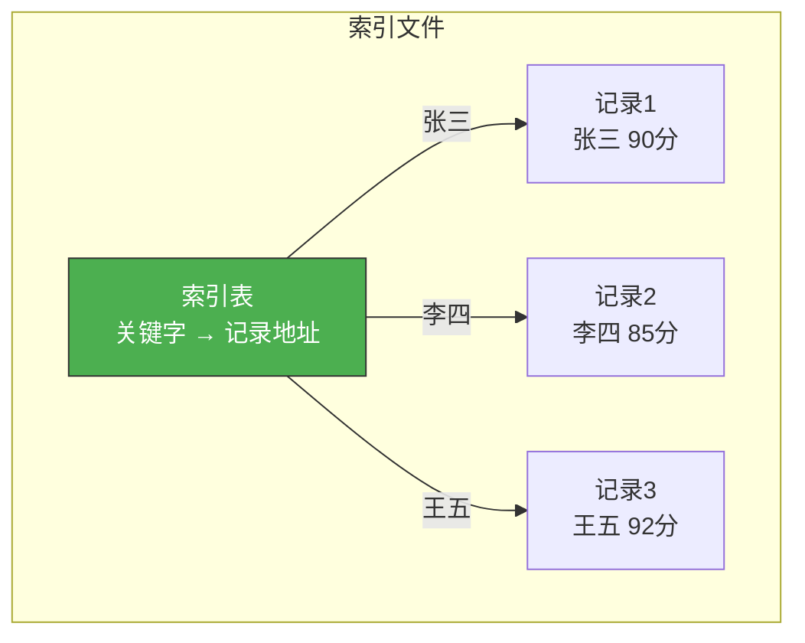
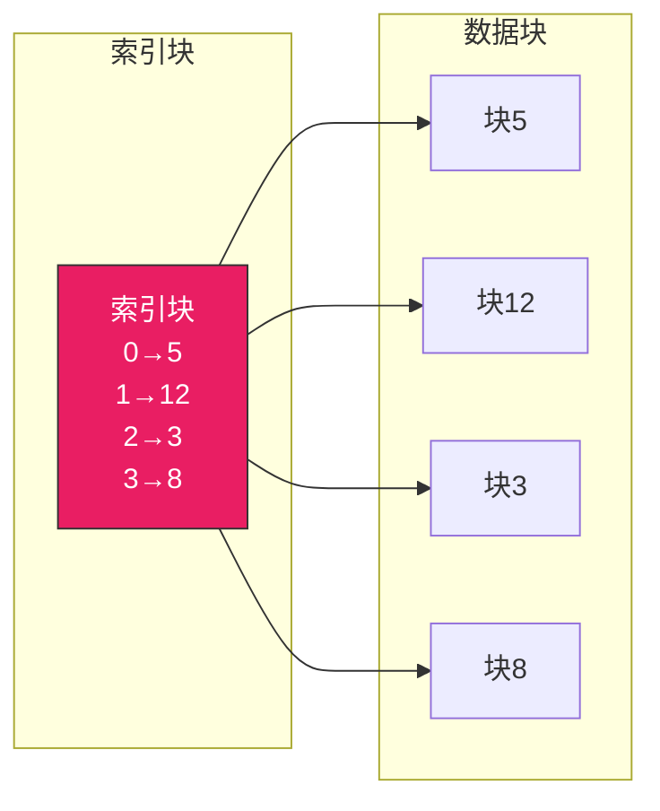
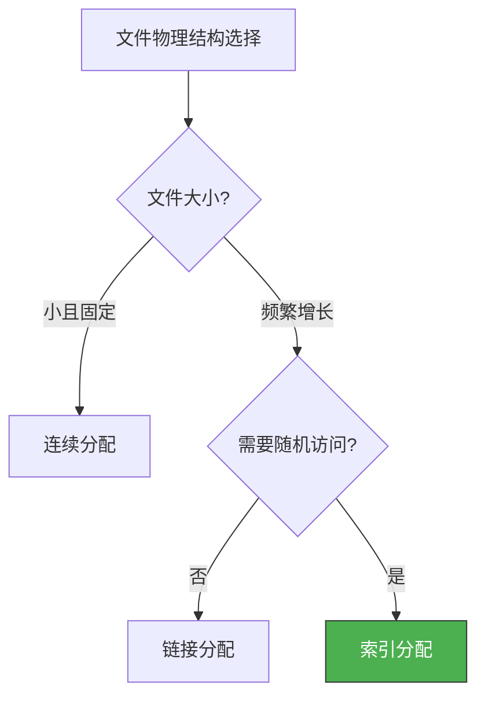

# 文件系统概述

> 文件系统是操作系统的"档案室管理员"——它负责把数据有序地存放在磁盘上，让你可以通过文件名找到文件，而不是记住数据在第几号磁道第几号扇区。

## 一、文件的概念

### 1.1 什么是文件？

文件是**以计算机硬盘为载体的存储在外存上的信息集合**，是操作系统中最小的存储单位。

| 属性 | 说明 |
|------|------|
| 文件名 | 用户可见的标识 |
| 标识符（inode号） | 操作系统内部使用的唯一标识 |
| 类型 | 普通/目录/设备/管道等 |
| 位置 | 磁盘上的物理位置 |
| 大小 | 文件长度 |
| 保护信息 | 读/写/执行权限 |
| 时间戳 | 创建/修改/访问时间 |

### 1.2 文件的分类

| 分类方式 | 类型 |
|---------|------|
| 按用途 | 系统文件、库文件、用户文件 |
| 按保护级别 | 只读文件、读写文件、可执行文件、不保护文件 |
| 按逻辑结构 | **无结构文件（流式文件）**、**有结构文件（记录式文件）** |
| 按组织方式 | 顺序文件、索引文件、索引顺序文件 |

---

## 二、文件的逻辑结构

### 2.1 无结构文件（流式文件）

字节流，没有明确的记录边界。如 txt 文件、二进制可执行文件。

```c
// 流式文件：逐字节读写
int fd = open("data.bin", O_RDONLY);
char buf[1024];
read(fd, buf, 1024);  // 读 1024 字节，无记录概念
```

### 2.2 有结构文件（记录式文件）

由若干**记录**组成，每条记录有内部结构。

| 组织方式 | 说明 | 查找效率 |
|---------|------|---------|
| **顺序文件** | 记录按关键字顺序排列 | 可变/可二分 |
| **索引文件** | 建立索引表，变长记录 | 快（查索引） |
| **索引顺序文件** | 顺序 + 索引，分组索引 | 较快 |



---

## 三、文件的物理结构

文件在磁盘上的存放方式——决定了读写性能和空间利用率。

### 3.1 连续分配

文件占据一组**连续**的磁盘块。

```
磁盘块:  0  1  2  3  4  5  6  7  8  9
文件A:   [A  A  A]
文件B:            [B  B  B  B]
空闲:                      [  ][  ]
```

- **优点**：顺序读写快；支持随机访问（第 i 块 = 起始块 + i）
- **缺点**：必须预知文件大小；产生外部碎片；难以扩展

### 3.2 链接分配

每个磁盘块包含**指向下一块的指针**，形成链表。

```
文件A:  [A|→3] → [A|→7] → [A|nil]
磁盘块:  0  1  2   3  4  5   7  8  9
```

- **优点**：无外部碎片；文件可动态增长
- **缺点**：不支持随机访问；指针占空间；一个指针损坏后续全丢

### 3.3 索引分配

为每个文件建立一个**索引块**，记录各逻辑块对应的物理块号。



- **优点**：支持随机访问；无外部碎片
- **缺点**：索引块占额外空间

### 3.4 索引块的扩展

大文件的索引块太大怎么办？

| 方案 | 说明 | 最大文件 |
|------|------|---------|
| **链接方案** | 多个索引块链起来 | 理论无限 |
| **多层索引** | 类似多级页表 | 非常大 |
| **混合索引** | 直接+间接+双重间接 | 灵活高效 |

::: important Unix 的混合索引方案
Linux/ext2 的 inode 采用混合索引：
- **直接地址**（12个）：小文件直接访问，快
- **一次间接**：中等文件
- **二次间接**：大文件
- **三次间接**：超大文件

这就像地址簿——常用的号码直接记，不常用的查一层目录，更少用的查两层目录。
:::

```c
// Unix inode 的混合索引
struct inode {
    int direct_blocks[12];     // 直接索引：0~11 块
    int single_indirect;       // 一次间接：12~(12+256) 块
    int double_indirect;       // 二次间接：更多块
    int triple_indirect;       // 三次间接：超多块
};

// 假设块大小 4KB，每块可存 1024 个指针
// 直接: 12 × 4KB = 48KB
// 一次间接: 1024 × 4KB = 4MB
// 二次间接: 1024² × 4KB = 4GB
// 三次间接: 1024³ × 4KB = 4TB
```

---

## 四、物理结构对比

| 结构 | 顺序读 | 随机读 | 空间碎片 | 动态增长 |
|------|--------|--------|---------|---------|
| 连续 | 快 | 快 | 外部碎片 | 难 |
| 链接 | 较慢 | 不支持 | 无 | 易 |
| 索引 | 快 | 快 | 无 | 易 |



---

## 五、磁盘空间管理

### 5.1 空闲表法

类似于内存管理的动态分区——记录每个空闲区的起始块号和长度。

### 5.2 空闲链表法

将空闲块用链表串联，分配时取链首，回收时加入链尾。

### 5.3 位示图法

每个磁盘块用一个 bit 表示：0=空闲，1=已占用。

```c
// 位示图管理
// 假设磁盘有 1024 个块
#define TOTAL_BLOCKS 1024
#define BITMAP_SIZE  (TOTAL_BLOCKS / 8)  // 128 字节

unsigned char bitmap[BITMAP_SIZE];

// 分配一个空闲块
int allocate_block() {
    for (int i = 0; i < TOTAL_BLOCKS; i++) {
        if ((bitmap[i/8] & (1 << (i%8))) == 0) {
            bitmap[i/8] |= (1 << (i%8));  // 标记已占用
            return i;
        }
    }
    return -1;  // 磁盘满
}

// 释放一个块
void free_block(int block_num) {
    bitmap[block_num/8] &= ~(1 << (block_num%8));
}
```

### 5.4 成组链接法

Unix 使用的方法：将空闲块分组，每组第一个块记录下一组的信息。


| 方法 | 优点 | 缺点 |
|------|------|------|
| 空闲表 | 适合连续分配 | 不适合大量小文件 |
| 空闲链表 | 实现简单 | 链过长 |
| 位示图 | 紧凑，易找连续空间 | 占内存（但很小） |
| 成组链接 | Unix 经典，高效 | 实现复杂 |

::: tip 面试速查
1. **文件逻辑结构**：无结构（字节流）和有结构（记录式：顺序/索引/索引顺序）
2. **文件物理结构**：连续（快但有碎片）、链接（无碎片但不支持随机访问）、索引（支持随机访问，Unix用混合索引）
3. **Unix 混合索引**：12个直接 + 1次间接 + 2次间接 + 3次间接，兼顾大小文件
4. **空闲管理**：位示图最常用（每个块1bit），成组链接是 Unix 的经典方案
5. 连续分配支持**随机访问**，链接分配**不支持随机访问**
:::

---

::: info 原著参考
- 小林 coding《图解操作系统》——文件系统篇
- 王道考研《操作系统》——第四章 文件管理
- CSAPP 第十章《系统级 IO》
:::
