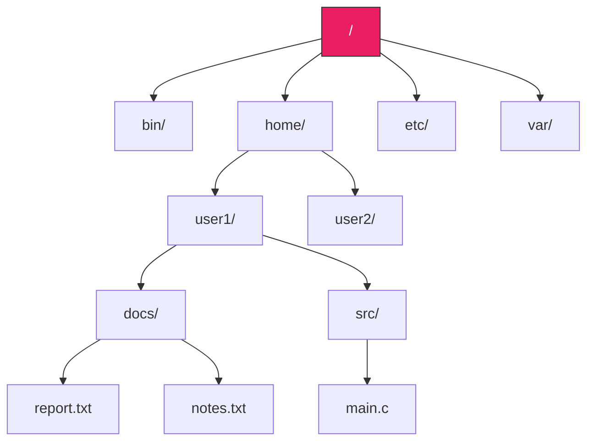
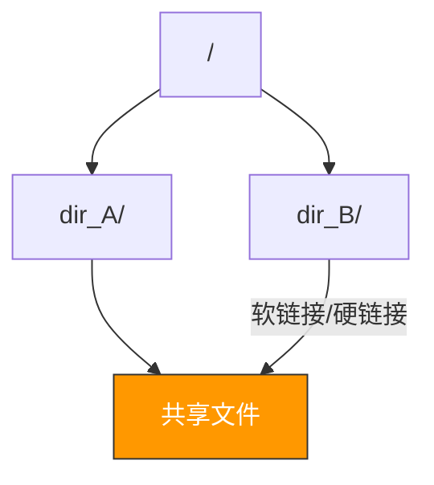
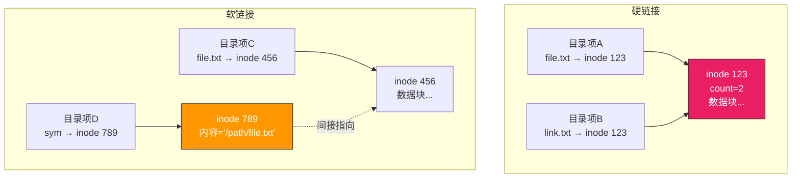
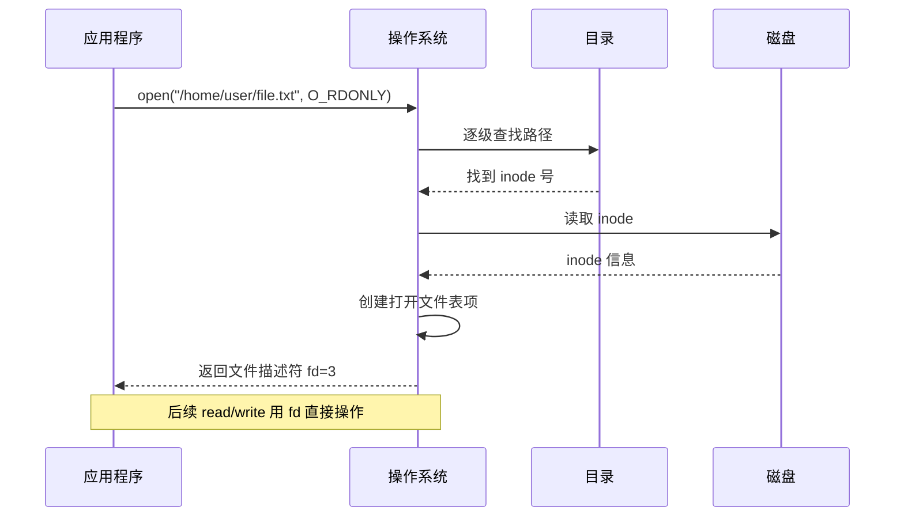
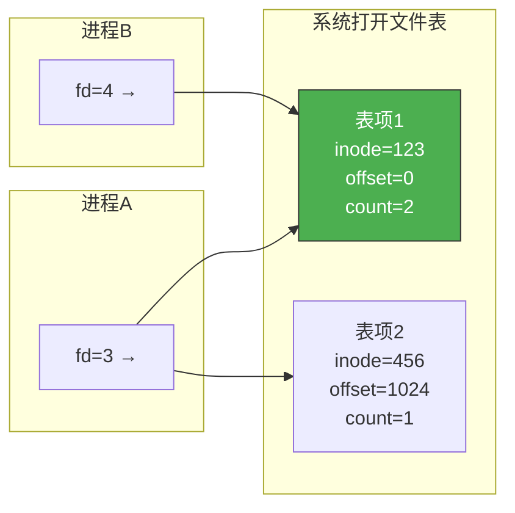

# 目录与文件操作

> 目录就像文件系统的"导航地图"——没有目录，文件就像散落一地的书，知道内容却找不到在哪。目录结构决定了你如何组织和查找文件，而文件操作则是你与文件交互的基本手段。

## 一、目录的基本概念

### 1.1 目录的作用

目录（Directory）是**文件名到文件物理位置的映射**，实现了"按名存取"。

| 功能 | 说明 |
|------|------|
| 按名存取 | 用户通过文件名访问，无需关心物理位置 |
| 控制访问 | 目录记录文件权限信息 |
| 允许重名 | 不同目录下可有同名文件 |

### 1.2 目录项的结构

```c
// 简化的目录项
struct directory_entry {
    char filename[256];    // 文件名
    int inode_number;      // inode 号（Unix）
    // 或
    int first_block;       // 首块号（FAT）
    int file_attributes;   // 文件属性
};
```

---

## 二、目录结构的发展

### 2.1 单级目录

整个系统只有一个目录表，所有文件在同一层级。

- **优点**：简单
- **缺点**：不允许重名；查找慢；不便于分类

### 2.2 两级目录

分为主文件目录（MFD）和用户文件目录（UFD），每个用户一个 UFD。

```
MFD
├── 用户A → UFD_A
│           ├── file1
│           └── file2
└── 用户B → UFD_B
            ├── file1  ← 可以与A的重名
            └── file3
```

### 2.3 树形目录

现代操作系统采用**树形目录结构**，从根目录出发，层层嵌套。



- **绝对路径**：从根目录开始 `/home/user1/docs/report.txt`
- **相对路径**：从当前目录开始 `docs/report.txt`

### 2.4 无环图目录

在树形基础上增加**共享链接**，允许同一文件出现在多个目录中。



---

## 三、硬链接与软链接

### 3.1 硬链接（Hard Link）

多个目录项指向**同一个 inode**，inode 中有引用计数。

```c
// 创建硬链接
link("/home/user1/file.txt", "/home/user2/file_link.txt");
// 两个路径指向同一个 inode，引用计数 +1

// 删除一个链接
unlink("/home/user1/file.txt");
// 引用计数 -1，只有计数为 0 时才真正删除文件
```

### 3.2 软链接（Symbolic Link）

创建一个新文件，内容是**目标文件的路径名**。

```c
// 创建软链接
symlink("/home/user1/file.txt", "/home/user2/file_symlink");
// user2/file_symlink 是独立文件，内容是 "/home/user1/file.txt"
```

| 对比 | 硬链接 | 软链接 |
|------|--------|--------|
| 指向 | 同一个 inode | 目标文件路径 |
| 删除原文件 | 不受影响 | 链接失效（悬空链接） |
| 跨文件系统 | 不可以 | 可以 |
| 链接目录 | 不可以 | 可以 |
| 创建命令 | `link()` / `ln` | `symlink()` / `ln -s` |



::: important 硬链接的引用计数
硬链接的关键是 inode 的引用计数（nlink）。只有当 nlink 降为 0 时，文件数据块才会被释放。这就是为什么 `rm` 命令叫"unlink"——它只是删除目录项，减少引用计数。
:::

---

## 四、文件操作

### 4.1 基本文件操作

| 操作 | 系统调用 | 说明 |
|------|---------|------|
| 创建 | `create()` | 分配 inode，创建目录项 |
| 删除 | `unlink()` | 删除目录项，引用计数-1 |
| 打开 | `open()` | 查找目录，读入 inode，返回文件描述符 |
| 关闭 | `close()` | 释放文件描述符，写回脏页 |
| 读 | `read()` | 从文件读取数据到用户缓冲区 |
| 写 | `write()` | 从用户缓冲区写入文件 |

### 4.2 打开文件的过程



### 4.3 打开文件表

操作系统维护多级打开文件表：

```c
// 进程级打开文件表（每个进程一个）
struct proc_fd_table {
    struct file *files[MAX_FD];  // fd → 系统级表项指针
};

// 系统级打开文件表（全局唯一）
struct system_open_table {
    int inode_ptr;       // 指向内存中的 inode
    int open_count;      // 多少个进程打开了这个文件
    int offset;          // 当前读写位置
    int flags;           // 打开模式（读写等）
};
```



::: important 为什么需要打开文件表？
磁盘 IO 很慢，每次读写都查目录不现实。`open()` 把 inode 读入内存并创建表项，后续操作直接用 fd 访问内存中的表项，避免重复磁盘 IO。`close()` 时才释放。
:::

---

## 五、文件共享方式

### 5.1 基于索引节点的共享

多个目录项指向同一 inode（硬链接的原理）。

### 5.2 基于符号链的共享

创建一个 LINK 类型文件，存放被共享文件的路径名（软链接的原理）。

### 5.3 内存映射共享

多个进程 `mmap()` 同一文件，共享同一份物理内存页。

---

## 六、文件保护

### 6.1 访问控制类型

| 类型 | 说明 |
|------|------|
| 读（r） | 读取文件内容 |
| 写（w） | 修改文件内容 |
| 执行（x） | 执行文件（程序） |
| 删除（d） | 删除文件 |
| 追加（a） | 在文件末尾追加 |

### 6.2 Unix 的权限模型

```
-rwxr-xr-- 1 user group 1024 Jan 1 file.txt
│├──┤├──┤├──┤
│ │   │   │
│ │   │   └── 其他用户: r-- (只读)
│ │   └────── 同组用户: r-x (读+执行)
│ └────────── 文件所有者: rwx (读+写+执行)
└──────────── 文件类型: - 普通文件
```

```c
// 权限检查伪代码
bool check_permission(inode *ino, process *proc, int access) {
    if (proc->uid == ino->owner) {
        return (ino->owner_perm & access) != 0;
    } else if (proc->gid == ino->group) {
        return (ino->group_perm & access) != 0;
    } else {
        return (ino->other_perm & access) != 0;
    }
}
```

---

::: tip 面试速查
1. **目录的核心作用**：实现"按名存取"，文件名→物理位置的映射
2. **目录结构发展**：单级→两级→树形→无环图
3. **硬链接 vs 软链接**：硬链接同 inode、不可跨文件系统、删原文件不受影响；软链接存路径、可跨文件系统、删原文件失效
4. **打开文件流程**：open → 查目录 → 读入 inode → 创建系统级表项 → 返回 fd
5. **系统打开文件表**：存储 inode 指针、读写偏移、打开计数，避免重复磁盘 IO
6. **Unix 权限模型**：owner/group/other 各有 rwx 权限
7. `rm` 本质是 `unlink`，只有引用计数为 0 才真正删除
:::

---

::: info 原著参考
- 小林 coding《图解操作系统》——文件系统篇
- 王道考研《操作系统》——第四章 文件目录与保护
- CSAPP 第十章《系统级 IO》
:::
