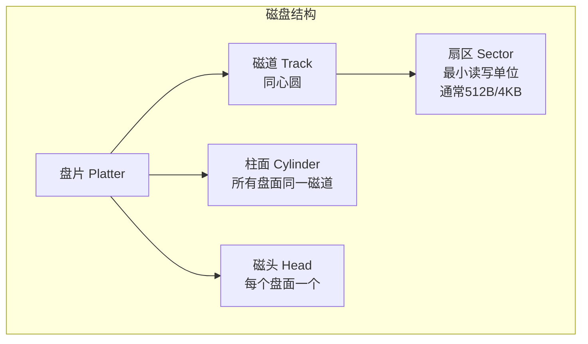
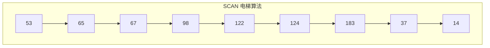
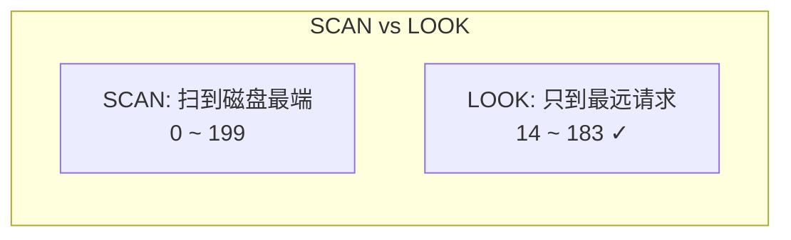
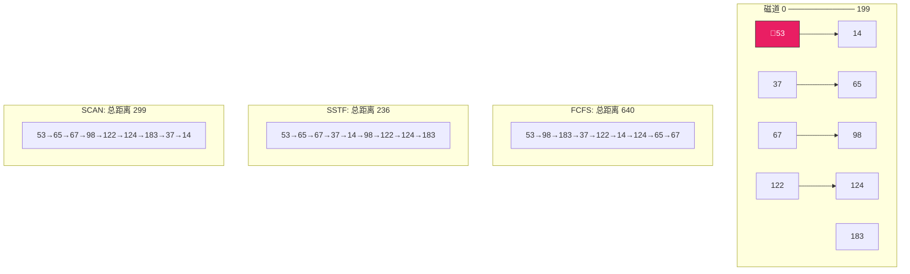

# 磁盘调度

> 磁盘是计算机中最慢的存储设备——CPU 以纳秒计时，内存以纳秒计时，磁盘却以毫秒计时，差了百万倍。磁盘调度的目标就是减少磁头移动距离，缩短寻道时间，把"慢"的影响降到最低。

## 一、磁盘的结构与性能

### 1.1 磁盘的物理结构



磁盘地址 = **柱面号 + 盘面号 + 扇区号**

### 1.2 磁盘访问时间

| 组成 | 含义 | 典型值 |
|------|------|--------|
| **寻道时间** | 磁头移动到目标磁道 | 5~15ms（最大差异） |
| **旋转延迟** | 等待目标扇区转到磁头下 | 2~4ms（7200RPM） |
| **数据传输** | 读写数据 | 微秒级 |

::: important 寻道时间是大头
寻道时间是磁盘访问时间中**最大的变量**（5~15ms），旋转延迟相对固定（平均半圈），传输时间可忽略。所以磁盘调度的核心目标就是**减少平均寻道距离**。
:::

---

## 二、磁盘调度算法

### 2.1 先来先服务（FCFS）

按请求到达的顺序依次服务。

```
请求队列: 98, 183, 37, 122, 14, 124, 65, 67
初始位置: 53

移动路径: 53 → 98 → 183 → 37 → 122 → 14 → 124 → 65 → 67
总移动距离: |98-53| + |183-98| + |37-183| + |122-37| + |14-122| + |124-14| + |65-124| + |67-65|
          = 45 + 85 + 146 + 85 + 108 + 110 + 59 + 2 = 640
```

- **优点**：公平
- **缺点**：磁头来回跳动，效率低

### 2.2 最短寻道时间优先（SSTF）

选择离当前磁头位置**最近**的请求。

```
请求队列: 98, 183, 37, 122, 14, 124, 65, 67
初始位置: 53

最近的是 65: 53 → 65
最近的是 67: 65 → 67
最近的是 37: 67 → 37
最近的是 14: 37 → 14
最近的是 98: 14 → 98
最近的是 122: 98 → 122
最近的是 124: 122 → 124
最近的是 183: 124 → 183

移动路径: 53 → 65 → 67 → 37 → 14 → 98 → 122 → 124 → 183
总移动距离: 12+2+30+23+84+24+2+59 = 236
```

- **优点**：比 FCFS 好很多
- **缺点**：远端请求可能**饥饿**

### 2.3 扫描算法（SCAN / 电梯算法）

磁头向一个方向移动，沿途服务请求，到头后反向。

```
请求队列: 98, 183, 37, 122, 14, 124, 65, 67
初始位置: 53，方向: 向大号移动

向右扫描: 53 → 65 → 67 → 98 → 122 → 124 → 183
到达最右端后反向: 183 → 37 → 14

移动路径: 53 → 65 → 67 → 98 → 122 → 124 → 183 → 37 → 14
总移动距离: (183-53) + (183-14) = 130 + 169 = 299
```



- **优点**：不会饥饿；性能较好
- **缺点**：刚扫过的区域要等到反向才能服务；对两端位置不友好

### 2.4 循环扫描（C-SCAN）

磁头只在一个方向服务，到头后直接跳回另一端（不服务），再继续同向扫描。

```
请求队列: 98, 183, 37, 122, 14, 124, 65, 67
初始位置: 53，方向: 向大号

向右服务: 53 → 65 → 67 → 98 → 122 → 124 → 183
跳回最左端: 183 → 0（不服务）
再向右: 0 → 14 → 37

移动路径: 53 → 65 → 67 → 98 → 122 → 124 → 183 → [跳回0] → 14 → 37
```

- **优点**：各位置等待时间更均匀
- **缺点**：回程不服务，有一定浪费

### 2.5 LOOK 与 C-LOOK

SCAN/C-SCAN 的改进版——不到磁盘最端点，只到**最远的请求**就回头。



| 算法 | 是否饥饿 | 平均寻道 | 特点 |
|------|---------|---------|------|
| FCFS | 不会 | 最长 | 公平但低效 |
| SSTF | **可能** | 较短 | 近优先，远饥饿 |
| SCAN | 不会 | 中等 | 电梯算法 |
| C-SCAN | 不会 | 中等 | 均匀响应 |
| LOOK | 不会 | 较短 | 不跑空程 |

---

## 三、算法对比图解



---

## 四、磁盘缓存与预读

### 4.1 磁盘缓存

在内存中维护一块缓冲区，缓存最近读取的磁盘块。命中时直接返回，不访问磁盘。

```c
// 磁盘缓存查找
Buffer* disk_cache_read(int block_num) {
    // 先查缓存
    Buffer *buf = cache_lookup(block_num);
    if (buf != NULL) {
        cache_hit++;
        return buf;  // 命中
    }

    // 未命中，从磁盘读取并加入缓存
    buf = disk_read(block_num);
    cache_insert(block_num, buf);
    return buf;
}
```

### 4.2 预读（Read-Ahead）

基于空间局部性，读取请求块时，**顺带读取后续几个块**到缓存。

```c
// 预读策略
void read_with_prefetch(int fd, int block_num, char *buf) {
    // 读取请求的块
    disk_read(block_num, buf);

    // 预读后续 4 个块（如果不在缓存中）
    for (int i = 1; i <= 4; i++) {
        if (!cache_contains(block_num + i)) {
            disk_read_async(block_num + i, prefetch_buf);
        }
    }
}
```

---

## 五、现代磁盘的考量

### 5.1 磁盘调度在 SSD 中的变化

SSD 没有机械磁头，寻道时间为零，传统调度算法意义不大。但 SSD 有自己的问题：

| SSD 特性 | 影响 |
|---------|------|
| 无寻道时间 | 调度算法退化，但仍有合并请求的价值 |
| 读写不对称 | 写入需要擦除，比读慢得多 |
| 磨损均衡 | 需要均匀分布写入，避免某些块过早失效 |

### 5.2 Linux 的磁盘调度器

| 调度器 | 适用 | 算法 |
|--------|------|------|
| **CFQ** | 传统机械盘 | 公平分配IO带宽 |
| **Deadline** | 数据库 | 保证请求延迟上限 |
| **NOOP** | SSD/虚拟机 | 仅合并，不排序 |
| **mq-deadline** | 现代Linux | 多队列版 Deadline |
| **BFQ** | 桌面 | 公平+低延迟 |

::: tip 面试速查
1. **磁盘访问时间**：寻道时间（最大）+ 旋转延迟 + 传输时间
2. **FCFS**：公平但效率低，总移动距离最长
3. **SSTF**：最短寻道优先，性能好但可能**饥饿**
4. **SCAN（电梯算法）**：单向扫描到头再反向，不会饥饿
5. **C-SCAN**：单向扫描，跳回起点再扫，响应更均匀
6. **LOOK/C-LOOK**：只到最远请求就回头，不跑空程
7. **SSD 无寻道时间**，传统调度意义不大，Linux 用 NOOP/Deadline
:::

---

::: info 原著参考
- 小林 coding《图解操作系统》——磁盘调度篇
- 王道考研《操作系统》——第四章 磁盘调度
- CSAPP 第六章《存储器层次结构》
:::
