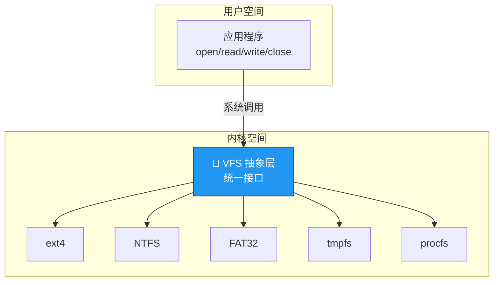
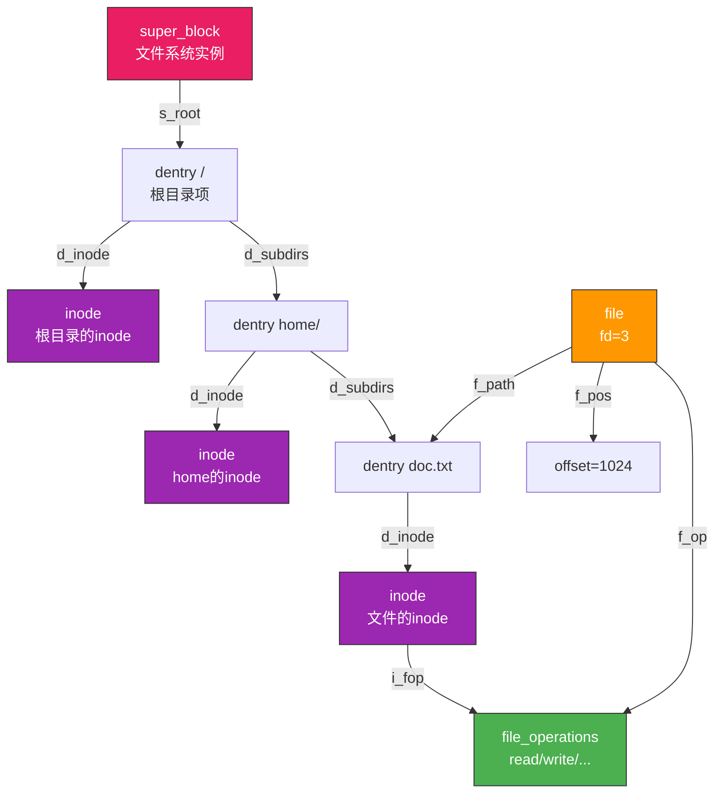
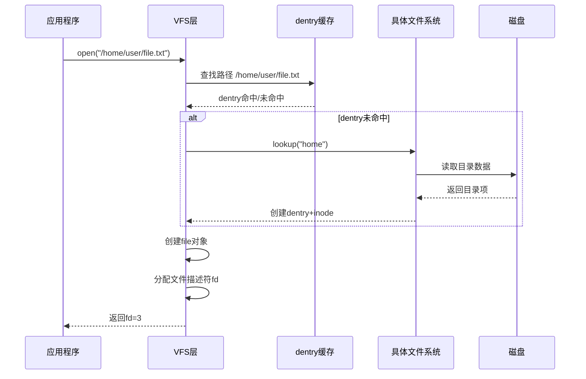
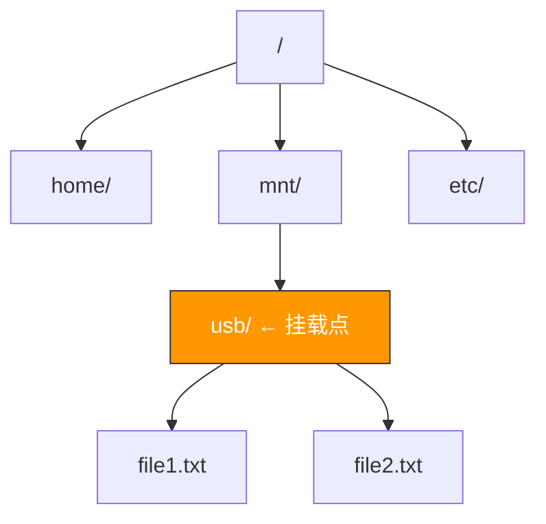

# 虚拟文件系统

> 虚拟文件系统就像一个"万能翻译器"——不管底层是 ext4、NTFS 还是 FAT32，应用程序都用同一套接口读写文件，完全不需要关心磁盘上的数据是怎么组织的。

## 一、为什么需要 VFS？

### 1.1 问题：文件系统五花八门

不同的文件系统有不同的磁盘布局、目录结构、分配策略：

| 文件系统 | 平台 | 特点 |
|---------|------|------|
| ext4 | Linux | 日志式，大文件支持 |
| NTFS | Windows | 安全性，压缩 |
| FAT32 | 通用 | 兼容性好，单文件4GB限制 |
| XFS | Linux | 高性能，大文件 |
| Btrfs | Linux | 写时复制，快照 |
| tmpfs | Linux | 内存文件系统 |

### 1.2 VFS 的解决方案

VFS（Virtual File System）在应用程序和具体文件系统之间增加一个**抽象层**：



::: important VFS 的核心价值
VFS 让 `open("/mnt/usb/file.txt")` 和 `open("/home/user/doc.txt")` 使用完全相同的代码，即使前者在 FAT32 的 U 盘上，后者在 ext4 的硬盘上。这就是**"一切皆文件"**的 Unix 哲学。
:::

---

## 二、VFS 的四大对象

VFS 通过四个核心数据结构实现抽象：

### 2.1 超级块（super_block）

代表一个**已挂载的文件系统**，存储文件系统的元信息。

```c
// VFS 超级块（简化）
struct super_block {
    dev_t s_dev;              // 设备号
    unsigned long s_blocksize;// 块大小
    struct file_system_type *s_type;  // 文件系统类型
    const struct super_operations *s_op;  // 操作函数表
    struct dentry *s_root;    // 根目录项
    // ... 更多字段
};

// 超级块操作
struct super_operations {
    struct inode *(*alloc_inode)(struct super_block *sb);
    void (*destroy_inode)(struct inode *);
    void (*dirty_inode)(struct inode *);
    int (*write_inode)(struct inode *, int);
    void (*drop_inode)(struct inode *);
    // ...
};
```

### 2.2 索引节点（inode）

代表一个**具体的文件**，存储文件的元数据。

```c
// VFS inode（简化）
struct inode {
    umode_t i_mode;           // 文件类型和权限
    uid_t i_uid;              // 所有者
    gid_t i_gid;              // 所属组
    loff_t i_size;            // 文件大小
    struct timespec i_atime;  // 访问时间
    struct timespec i_mtime;  // 修改时间
    struct super_block *i_sb; // 所属超级块
    const struct inode_operations *i_op;
    const struct file_operations *i_fop;
    // ...
};

// inode 操作
struct inode_operations {
    struct dentry *(*lookup)(struct inode *, struct dentry *);
    int (*create)(struct inode *, struct dentry *, int);
    int (*link)(struct dentry *, struct inode *, struct dentry *);
    int (*unlink)(struct inode *, struct dentry *);
    int (*mkdir)(struct inode *, struct dentry *, int);
    int (*rmdir)(struct inode *, struct dentry *);
    int (*rename)(struct inode *, struct dentry *, struct inode *, struct dentry *);
    // ...
};
```

### 2.3 目录项（dentry）

代表一个**目录项**（路径的一个组成部分），是路径查找的中间结果。

```c
// VFS dentry（简化）
struct dentry {
    struct qstr d_name;       // 目录项名称
    struct inode *d_inode;    // 关联的 inode
    struct dentry *d_parent;  // 父目录项
    struct list_head d_child; // 兄弟链表
    struct list_head d_subdirs; // 子目录链表
    // dentry 缓存（dcache）加速路径查找
};
```

### 2.4 文件对象（file）

代表一个**进程打开的文件**，存储读写偏移和打开模式。

```c
// VFS file（简化）
struct file {
    struct path f_path;       // 路径（dentry + vfsmount）
    const struct file_operations *f_op;
    loff_t f_pos;             // 读写偏移
    unsigned int f_flags;     // 打开标志
    fmode_t f_mode;           // 读写模式
    void *private_data;       // 私有数据
    // ...
};

// 文件操作
struct file_operations {
    ssize_t (*read)(struct file *, char __user *, size_t, loff_t *);
    ssize_t (*write)(struct file *, const char __user *, size_t, loff_t *);
    int (*open)(struct inode *, struct file *);
    int (*release)(struct inode *, struct file *);
    int (*mmap)(struct file *, struct vm_area_struct *);
    long (*ioctl)(struct file *, unsigned int, unsigned long);
    // ...
};
```

---

## 三、四大对象的关系



::: important 每个对象都有操作函数表
super_block 有 `super_operations`，inode 有 `inode_operations`，file 有 `file_operations`。这些函数表是**多态的实现**——VFS 调用通用接口，实际执行的是具体文件系统的函数。
:::

---

## 四、VFS 的工作流程

### 4.1 open() 的全过程



### 4.2 read() 的调用链

```c
// 应用层
read(fd, buf, 1024);

// VFS 层
sys_read(fd, buf, 1024) {
    file = fget(fd);           // 通过 fd 找到 file 对象
    file->f_op->read(file, buf, 1024, &file->f_pos);  // 调用具体文件系统的 read
}

// ext4 层
ext4_file_read(file, buf, count, offset) {
    // 读取 inode 的数据块
    // 可能通过 page cache
    // 如果缺页 → 从磁盘读取
}

// 块设备层
submit_bio(bio) {
    // 将 IO 请求提交给块设备驱动
    // 经过 IO 调度器
    // DMA 传输到内存
}
```

---

## 五、文件系统挂载

### 5.1 mount 的作用

将一个文件系统的根目录"嫁接"到 VFS 目录树的某个挂载点上。

```bash
# 将 /dev/sdb1 (ext4) 挂载到 /mnt/usb
mount -t ext4 /dev/sdb1 /mnt/usb
```



### 5.2 mount 的内部过程

```c
// mount 系统调用的简化逻辑
long sys_mount(const char *dev_name, const char *dir_name, const char *type) {
    // 1. 找到文件系统类型
    struct file_system_type *fs_type = get_fs_type(type);

    // 2. 读取设备上的超级块
    struct super_block *sb = fs_type->get_sb(dev_name);

    // 3. 找到挂载点的 dentry
    struct dentry *mount_point = lookup_dentry(dir_name);

    // 4. 将文件系统根目录嫁接到挂载点
    mount_point->d_mounted = sb->s_root;
}
```

---

## 六、特殊文件系统

### 6.1 procfs

将内核信息以文件形式暴露，不对应磁盘上的数据。

```bash
/proc/cpuinfo    # CPU 信息
/proc/meminfo    # 内存信息
/proc/<pid>/     # 进程信息
/proc/version    # 内核版本
```

### 6.2 sysfs

设备驱动的层次结构，供 udev 等工具使用。

### 6.3 tmpfs

纯内存文件系统，断电即丢失，但速度极快。

### 6.4 devfs / devtmpfs

设备文件管理，`/dev/sda`、`/dev/tty` 等。

::: tip 一切皆文件
Unix 的"一切皆文件"哲学通过 VFS 得到了完美体现：
- 普通文件：磁盘上的数据
- 目录：特殊的文件
- 设备：`/dev/sda` 可以 read/write
- 管道：`mkfifo` 创建的文件
- 网络：Socket 也有 fd
- 内核信息：`/proc` 下的文件

所有这些都可以用 `open/read/write/close` 操作，这就是 VFS 的威力。
:::

---

::: tip 面试速查
1. **VFS 四大对象**：super_block（文件系统）、inode（文件）、dentry（目录项）、file（打开文件）
2. **VFS 实现多态**：每个对象有操作函数表，VFS 调用通用接口，实际执行具体文件系统的函数
3. **dentry 缓存（dcache）**：加速路径查找，避免重复解析路径
4. **mount 操作**：将文件系统的根目录嫁接到 VFS 目录树的挂载点
5. **"一切皆文件"**：普通文件、目录、设备、管道、`/proc` 都用同一套接口
6. **Page Cache**：VFS 层的磁盘缓存，读写先经过缓存
:::

---

::: info 原著参考
- 小林 coding《图解操作系统》——文件系统篇
- 王道考研《操作系统》——第四章 文件系统实现
- CSAPP 第十章《系统级 IO》
:::
