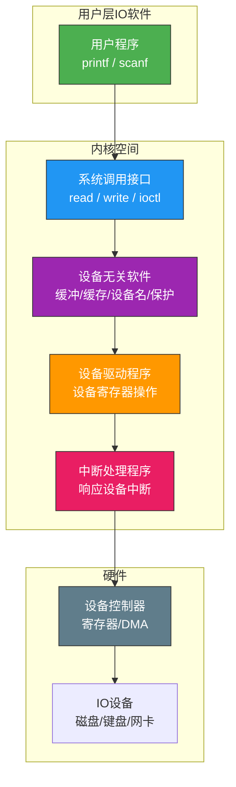
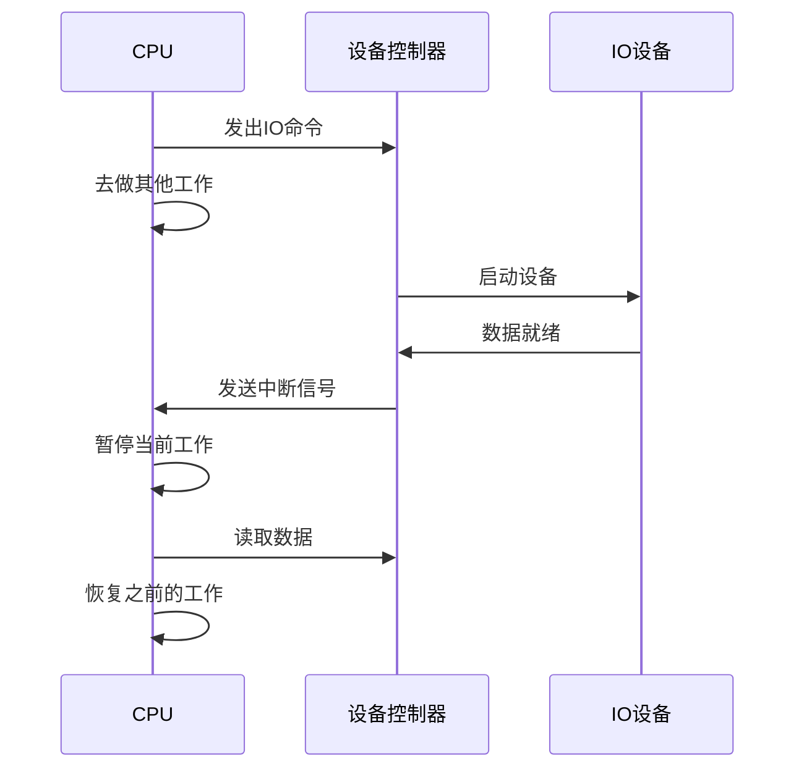
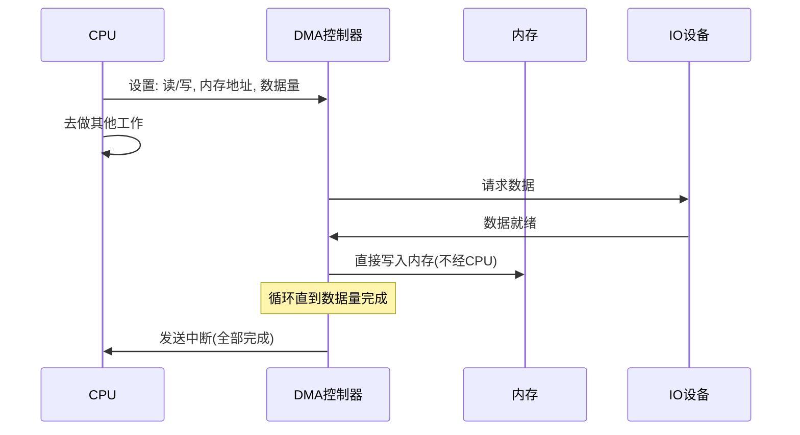
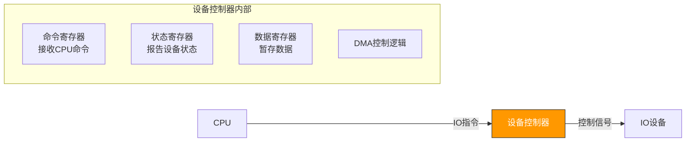
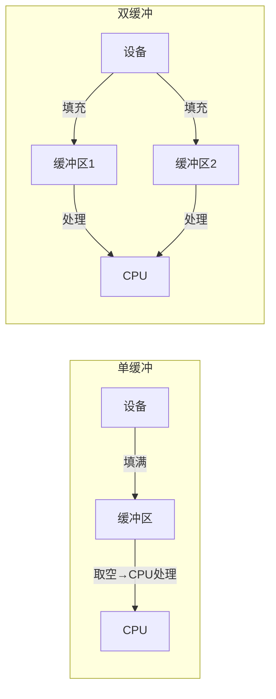

# IO系统概述

> IO 是计算机与外部世界的桥梁——键盘输入、屏幕显示、磁盘读写、网络传输，全靠 IO 系统。理解 IO，就是理解计算机如何"伸出触角"与外界交互。

## 一、IO设备分类

### 1.1 按使用特性分类

| 类型 | 特点 | 举例 |
|------|------|------|
| **人机交互类** | 速度慢，数据量小 | 键盘、鼠标、显示器 |
| **存储类** | 速度中等，数据量大 | 磁盘、SSD、U盘 |
| **网络通信类** | 速度变化大 | 网卡、调制解调器 |

### 1.2 按传输速率分类

| 类型 | 速率 | 举例 |
|------|------|------|
| 低速设备 | 几B~几KB/s | 键盘、鼠标 |
| 中速设备 | 几KB~几MB/s | 打印机 |
| 高速设备 | 几MB~几GB/s | 磁盘、网卡 |

### 1.3 按信息交换单位分类

| 类型 | 交换单位 | 特点 |
|------|---------|------|
| **块设备** | 块（Block） | 可寻址，随机访问，如磁盘 |
| **字符设备** | 字符（Character） | 不可寻址，顺序访问，如键盘 |

---

## 二、IO系统的层次结构



| 层次 | 职责 |
|------|------|
| **用户层IO软件** | 提供用户友好的接口（如C标准库） |
| **系统调用接口** | 将用户请求封装为系统调用 |
| **设备无关软件** | 缓冲管理、设备命名、保护、分配 |
| **设备驱动程序** | 将抽象请求转为设备特定操作 |
| **中断处理程序** | 响应设备中断，唤醒等待进程 |

---

## 三、IO控制方式

### 3.1 程序直接控制（轮询）

CPU 不断查询设备状态，直到设备就绪。

```c
// 程序直接控制方式
void program_io(char *buf, int count) {
    for (int i = 0; i < count; i++) {
        // 轮询等待设备就绪
        while (status_reg != READY) {
            // CPU 空转等待！
        }
        // 读写一个字
        buf[i] = data_reg;
    }
}
```

- **优点**：实现简单
- **缺点**：CPU 全程忙等，利用率极低

### 3.2 中断驱动方式

CPU 发出 IO 命令后去做别的事，设备完成时发中断通知。



```c
// 中断驱动方式
void interrupt_io(char *buf, int count) {
    // 启动IO
    issue_io_command(device, READ);
    // CPU可以做其他事...

    // 中断处理函数中
    // void io_interrupt_handler() {
    //     *buf = data_reg;
    //     wake_up(waiting_process);
    // }
}
```

- **优点**：CPU 不用忙等
- **缺点**：每传输一个字/字节就要中断一次，频繁中断开销大

### 3.3 DMA 方式（直接存储器存取）

设备控制器直接与内存交换数据，**CPU 只在开始和结束时介入**。



```c
// DMA 传输设置
void dma_transfer(int device, char *mem_addr, int count) {
    DMA->source = device;          // 数据源
    DMA->dest = mem_addr;          // 内存目标地址
    DMA->count = count;            // 传输字节数
    DMA->control = START;          // 启动传输
    // CPU 可自由执行其他任务
    // DMA 完成后发中断
}
```

### 3.4 通道控制方式

通道是**专用的 IO 处理机**，执行通道程序完成 IO 操作，比 DMA 更灵活。

### 3.5 四种方式对比

| 方式 | CPU介入频率 | 数据传送单位 | 电路实现 |
|------|-----------|------------|---------|
| 程序直接 | 极高（每字） | 字 | 最简单 |
| 中断驱动 | 高（每字） | 字 | 简单 |
| DMA | 低（每块） | 块 | 中等 |
| 通道 | 最低（每组） | 块/组 | 复杂 |

---

## 四、设备控制器

设备控制器是 CPU 与 IO 设备之间的接口，包含三类寄存器：



### IO 端口的编址方式

| 方式 | 说明 | 举例 |
|------|------|------|
| **统一编址** | IO端口与内存共享地址空间 | ARM、MIPS |
| **独立编址** | IO端口有独立的地址空间 | x86（IN/OUT 指令） |

```c
// 统一编址：IO端口映射到内存地址
volatile int *status = (int*)0xFE000000;  // IO端口
*status = 1;  // 像写内存一样操作设备

// 独立编址：使用专用IO指令
outb(0x3F8, 'A');   // 向端口0x3F8输出字节
char c = inb(0x3F8); // 从端口0x3F8读入字节
```

---

## 五、IO软件的缓冲技术

### 5.1 为什么需要缓冲？

1. **缓解速度不匹配**：CPU 快、设备慢
2. **减少中断频率**：积累一批数据再中断
3. **解决数据粒度不匹配**：生产者一次产1字节，消费者一次读1块

### 5.2 单缓冲与双缓冲



| 缓冲策略 | 处理一块数据的时间 |
|---------|-----------------|
| 无缓冲 | C + T（C=处理, T=输入） |
| 单缓冲 | max(C, T) + M（M=搬运） |
| 双缓冲 | max(C, T)（可并行） |

### 5.3 循环缓冲

多个缓冲区组成环形队列，输入指针和输出指针分别前进。

::: tip 面试速查
1. **IO控制方式**：程序轮询 → 中断驱动 → DMA → 通道，CPU介入越来越少
2. **DMA 核心特点**：数据直接在设备与内存间传输，不经 CPU
3. **缓冲技术目的**：缓解速度差异、减少中断频率、解决粒度不匹配
4. **单缓冲 vs 双缓冲**：双缓冲可实现输入与处理并行
5. **IO端口编址**：统一编址（内存映射IO）和独立编址（专用IO指令）
6. **IO层次**：用户层→系统调用→设备无关软件→设备驱动→中断处理→硬件
:::

---

::: info 原著参考
- 小林 coding《图解操作系统》——IO管理篇
- 王道考研《操作系统》——第五章 IO管理
- CSAPP 第六章《存储器层次结构》
:::
