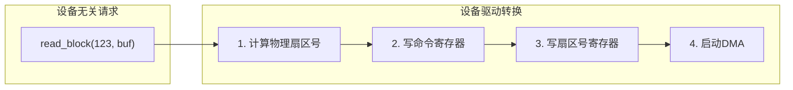
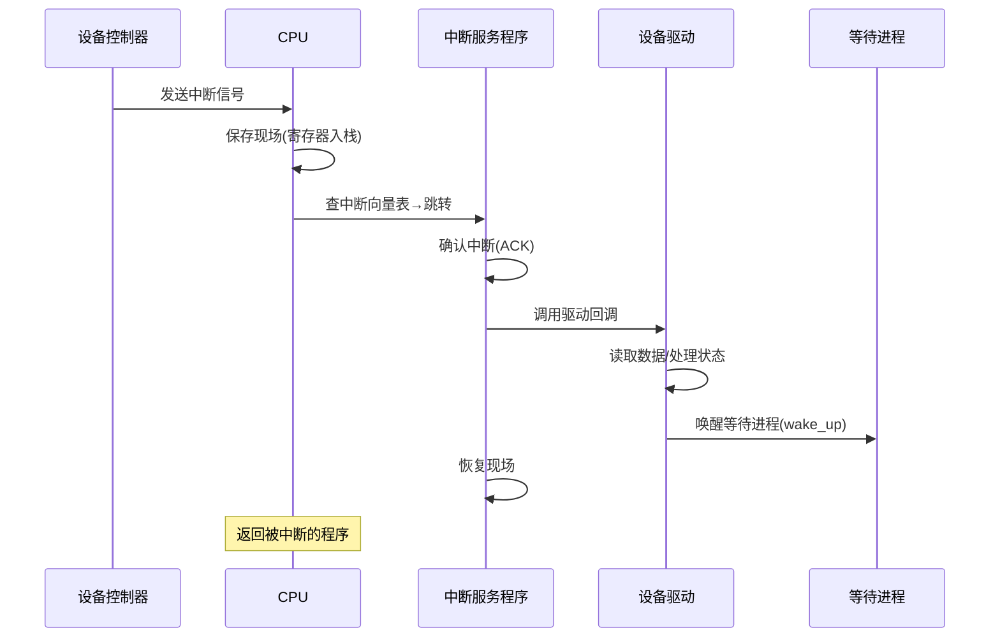
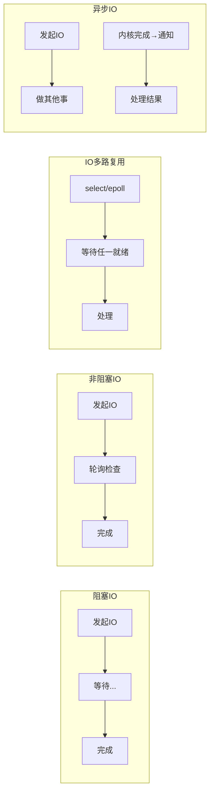
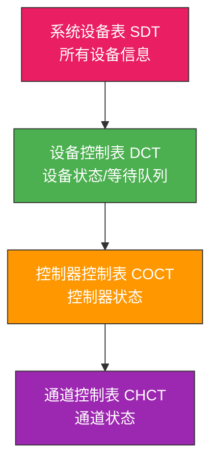

# IO软件与中断

> 中断是 IO 系统的"脉搏"——设备完成操作后发中断通知 CPU，CPU 响应中断后处理数据。没有中断，CPU 只能轮询等待；有了中断，CPU 和设备就能真正并行工作。

## 一、IO软件的设计目标

| 目标 | 说明 |
|------|------|
| **设备独立性** | 程序不依赖具体设备，可换设备运行 |
| **统一命名** | 所有设备用统一的命名规则（如 /dev/sda） |
| **错误处理** | 尽可能在底层处理错误，向上层报告 |
| **同步/异步传输** | 阻塞IO（同步）和非阻塞IO（异步） |

---

## 二、IO软件的层次详解

### 2.1 用户层IO软件

提供用户友好的接口，如 C 标准库的 `printf()`、`scanf()`。

```c
// printf 内部会调用 write() 系统调用
printf("Hello");  // 用户层
    ↓
write(1, "Hello", 5);  // 系统调用
    ↓
// 内核处理
```

### 2.2 设备无关软件（设备独立性软件）

这是最厚的一层，负责：

| 功能 | 说明 |
|------|------|
| 设备命名 | `/dev/sda` → 设备号映射 |
| 设备保护 | 权限检查 |
| 设备分配与回收 | 独占设备的分配 |
| 缓冲区管理 | 块缓冲、字符缓冲 |
| 差错处理 | 通用错误报告 |

```c
// 设备无关软件的缓冲管理
struct buffer_head {
    int block_num;          // 块号
    char *data;             // 缓冲数据
    int dirty;              // 脏标志
    int locked;             // 锁标志
    struct buffer_head *next;  // 哈希链
};
```

### 2.3 设备驱动程序

将设备无关的抽象请求转换为**设备特定的寄存器操作**。

```c
// 简化的磁盘驱动程序
void disk_driver_read(int sector, char *buf) {
    // 向设备控制器写入命令和参数
    outb(DISK_COMMAND, READ_CMD);
    outb(DISK_SECTOR, sector);
    outb(DISK_COUNT, 1);
    outb(DISK_BUFFER, buf);  // DMA地址

    // 启动传输
    outb(DISK_CONTROL, START);

    // 阻塞等待中断
    sleep_on(&disk_wait_queue);
}
```



::: important 驱动程序是操作系统中最多的代码
Linux 内核代码中，驱动程序占了 60% 以上。每种设备需要自己的驱动，驱动质量直接影响系统稳定性。
:::

---

## 三、中断处理详解

### 3.1 中断的分类

| 类型 | 触发源 | 举例 |
|------|--------|------|
| **外中断（中断/Interrupt）** | CPU 外部 | IO完成、时钟、键盘 |
| **内中断（异常/Exception）** | CPU 内部 | 缺页、除零、系统调用 |

### 3.2 IO中断的处理流程



### 3.3 中断处理程序的约束

中断处理程序运行在**中断上下文**中，有以下限制：

| 限制 | 原因 |
|------|------|
| 不能睡眠/阻塞 | 没有进程上下文，无法调度 |
| 不能调用可能阻塞的函数 | 同上 |
| 执行必须快速 | 中断期间可能屏蔽其他中断 |
| 不能访问用户空间 | 没有进程地址空间 |

```c
// Linux 中断处理：上半部(top half) + 下半部(bottom half)

// 上半部：紧急操作，在中断上下文中执行
irqreturn_t disk_interrupt(int irq, void *dev_id) {
    // 快速应答，读取状态
    acknowledge_interrupt();
    // 将耗时工作推迟到下半部
    schedule_work(&disk_work);  // 或 tasklet / softirq
    return IRQ_HANDLED;
}

// 下半部：非紧急操作，可以睡眠
void disk_work_handler(struct work_struct *work) {
    // 处理数据，唤醒进程
    process_io_completion();
    wake_up(&wait_queue);
}
```

::: tip 中断的"上半部"与"下半部"
上半部（硬中断）必须极快——关中断期间其他中断被屏蔽。下半部（软中断/tasklet/工作队列）处理非紧急任务，可以开中断执行。这种分层设计保证了中断响应的实时性。
:::

---

## 四、IO的同步与异步

### 4.1 阻塞IO（同步）

进程发起 IO 请求后阻塞，直到操作完成。

```c
// 阻塞IO
char buf[1024];
int n = read(fd, buf, 1024);  // 阻塞直到数据就绪
printf("读到 %d 字节\n", n);
```

### 4.2 非阻塞IO

IO 请求立即返回，进程可以继续执行，稍后查询结果。

```c
// 非阻塞IO（轮询模式）
fcntl(fd, F_SETFL, O_NONBLOCK);  // 设置非阻塞

while (1) {
    int n = read(fd, buf, 1024);
    if (n > 0) {
        process_data(buf, n);
        break;
    } else if (errno == EAGAIN) {
        do_other_work();  // 没数据，做别的事
    }
}
```

### 4.3 IO多路复用

同时监控多个文件描述符，有就绪的才处理。

```c
// select / poll / epoll
fd_set readfds;
FD_ZERO(&readfds);
FD_SET(fd1, &readfds);
FD_SET(fd2, &readfds);

// 阻塞直到至少一个fd就绪
select(maxfd+1, &readfds, NULL, NULL, NULL);

if (FD_ISSET(fd1, &readfds)) {
    read(fd1, buf1, sizeof(buf1));
}
if (FD_ISSET(fd2, &readfds)) {
    read(fd2, buf2, sizeof(buf2));
}
```

### 4.4 异步IO（AIO）

发起 IO 后立即返回，内核完成操作后通知进程。



---

## 五、设备分配

### 5.1 设备分配策略

| 策略 | 说明 | 适用 |
|------|------|------|
| **独占分配** | 一段时间内只分配给一个进程 | 打印机、磁带 |
| **共享分配** | 多个进程可同时使用 | 磁盘 |
| **虚拟分配** | SPOOLing 技术 | 打印机虚拟化 |

### 5.2 设备分配的数据结构



设备分配流程：查 SDT → 找 DCT → 检查 COCT → 检查 CHCT → 分配（从通道到设备逐层分配）。

---

::: tip 面试速查
1. **IO软件层次**：用户层→系统调用→设备无关软件→设备驱动→中断处理→硬件
2. **设备无关软件**：负责缓冲、命名、保护、分配，不关心设备细节
3. **中断处理**：上半部（硬中断，快，不可睡眠）+ 下半部（软中断/tasklet/工作队列，可睡眠）
4. **IO模型**：阻塞IO、非阻塞IO、IO多路复用（select/epoll）、异步IO（AIO）
5. **设备分配**：独占/共享/虚拟，需要 DCT→COCT→CHCT 逐层检查
6. 驱动程序是内核中代码量最大的部分，将抽象请求转为设备寄存器操作
:::

---

::: info 原著参考
- 小林 coding《图解操作系统》——IO管理篇
- 王道考研《操作系统》——第五章 IO系统
- CSAPP 第十章《系统级IO》
:::
