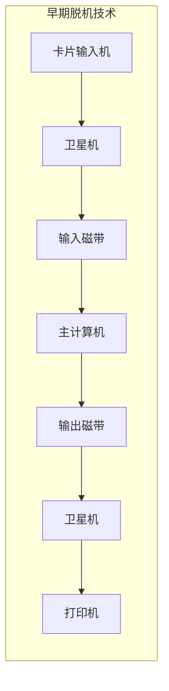
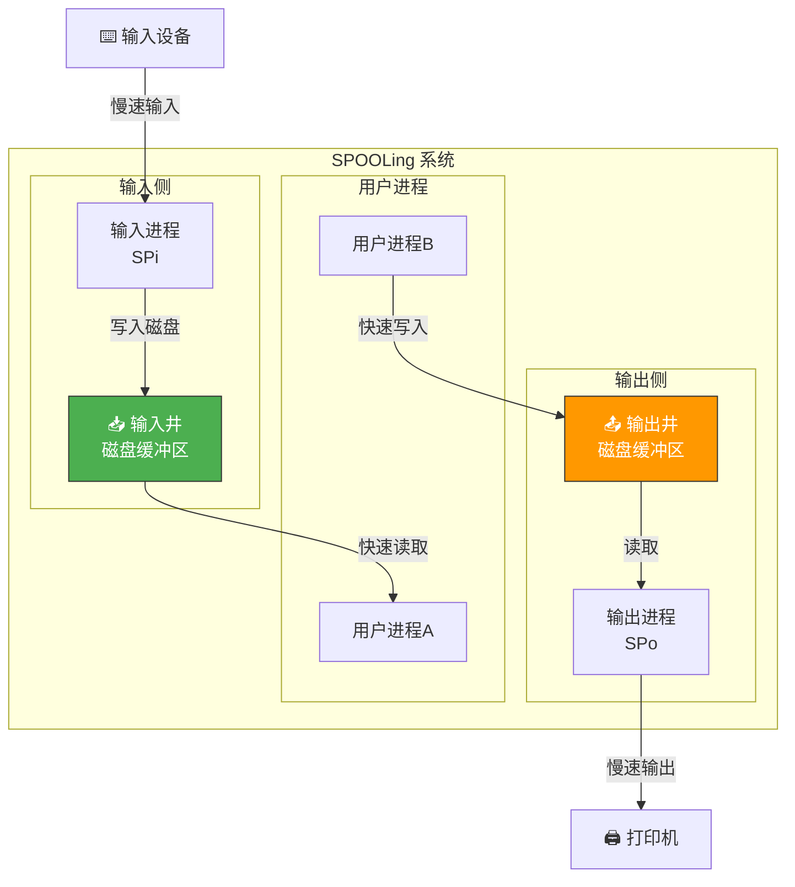
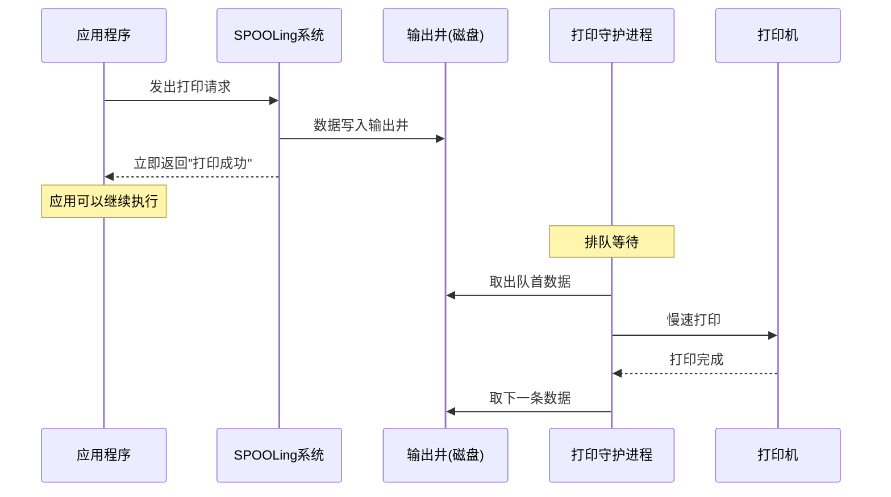
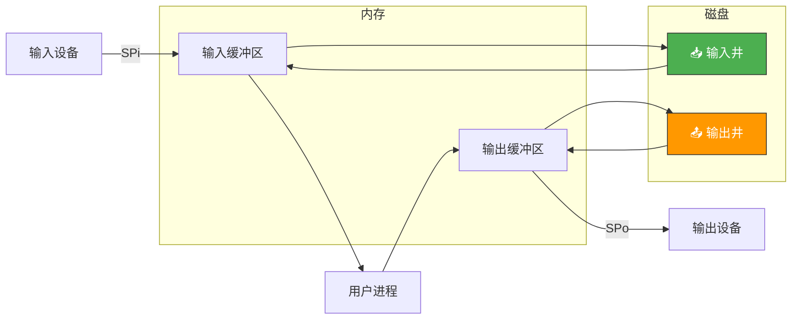

# SPOOLing技术

> SPOOLing（假脱机）是操作系统的"障眼法"——把独占设备变成共享设备。就像银行取号系统：每个客户拿到号就"以为"自己在办理业务，实际上是在排队等候，但至少不用站着等——你可以坐下来做别的事。

## 一、为什么需要 SPOOLing？

### 1.1 独占设备的问题

打印机、磁带机等设备是**独占设备**——一次只能被一个进程使用。如果进程 A 占着打印机慢慢打印，进程 B 就只能傻等。

```
没有 SPOOLing:
进程A: 打印100页 ══════════════════════════════→ 完成
进程B: 等待...................................................→ 开始打印
进程C: 等待...................................................→ 等待...
```

### 1.2 脱机技术的历史

在 SPOOLing 出现之前，人们用**脱机技术**——用一台专用的小计算机做 IO 预处理，让主计算机不直接与慢速设备打交道。



SPOOLing 用软件模拟了这个过程，不需要额外的卫星机——这就是"假脱机"（Simultaneous Peripheral Operations On-Line）。

---

## 二、SPOOLing 的工作原理

### 2.1 核心思想

在磁盘上开辟**输入井**和**输出井**，用守护进程（daemon）代替卫星机。



### 2.2 打印的完整过程



```c
// SPOOLing 打印的简化逻辑

// 用户进程：看似在打印，实际只是写磁盘
void spool_print(char *data, int len) {
    // 1. 在输出井分配空间
    int slot = allocate_output_well(len);

    // 2. 将数据写入输出井（磁盘速度快）
    write_to_well(slot, data, len);

    // 3. 将请求加入打印队列
    enqueue_print_request(slot);

    // 4. 立即返回！用户以为已经打印了
    return;
}

// 打印守护进程：真正与打印机打交道
void print_daemon() {
    while (1) {
        // 等待打印请求
        wait_print_request();

        // 从队列取出请求
        PrintRequest *req = dequeue_print_request();

        // 从输出井读取数据
        char *data = read_from_well(req->slot);

        // 慢速打印（独占打印机）
        for (int i = 0; i < req->len; i++) {
            while (!printer_ready()) {}  // 等待打印机
            send_to_printer(data[i]);
        }

        // 释放输出井空间
        free_output_well(req->slot);
    }
}
```

::: important SPOOLing 的妙处
1. **用户进程不会阻塞**：写入磁盘（快）而非直接操作打印机（慢）
2. **打印机虚拟化**：多个进程"同时打印"，实际排队依次输出
3. **独占变共享**：每个进程以为自己独占打印机，实际是 SPOOLing 在协调
:::

---

## 三、SPOOLing 的组成

| 组成部分 | 说明 |
|---------|------|
| **输入井** | 磁盘上的缓冲区，暂存输入数据 |
| **输出井** | 磁盘上的缓冲区，暂存输出数据 |
| **输入缓冲区** | 内存中，暂存从输入设备到输入井的数据 |
| **输出缓冲区** | 内存中，暂存从输出井到输出设备的数据 |
| **输入进程 SPi** | 负责将输入设备的数据送到输入井 |
| **输出进程 SPo** | 负责将输出井的数据送到输出设备 |



---

## 四、SPOOLing 的实际应用

### 4.1 打印机 SPOOLing（lpd / CUPS）

Linux 的打印系统就是 SPOOLing 的实现：

```bash
# 用户提交打印任务
lp document.pdf

# 任务进入打印队列（输出井）
lpq                        # 查看队列
Rank   Owner   Job   File
1st    user    42    document.pdf

# 打印守护进程 lpd 依次处理
# 用户提交后立即返回，不必等打印完成
```

### 4.2 网络通信中的 SPOOLing

邮件系统的"发件箱"和"收件箱"就是 SPOOLing 的思想：

```
发送邮件:
用户 → 写入发件箱(磁盘) → 立即返回
邮件守护进程 → 从发件箱取出 → 发送到目标服务器

接收邮件:
邮件服务器 → 写入收件箱(磁盘)
用户 → 从收件箱读取
```

### 4.3 共享打印的实现

```
┌──────────────────────────────────────────┐
│              打印队列（输出井）              │
│  ┌────────┐ ┌────────┐ ┌────────┐       │
│  │ 作业A  │ │ 作业B  │ │ 作业C  │ ...   │
│  └────────┘ └────────┘ └────────┘       │
└──────────────────────────────────────────┘
        ↑ 写入(快)              ↓ 读取(慢)
   ┌─────┴──────┐        ┌──────┴─────┐
   │ 进程A      │        │ 打印守护进程│──→ 🖨️
   │ 进程B      │        │ (独占打印机)│
   │ 进程C      │        └────────────┘
   └────────────┘
```

---

## 五、SPOOLing 的优势与局限

### 5.1 优势

| 优势 | 说明 |
|------|------|
| **提高设备利用率** | 独占设备变为共享设备 |
| **加速用户进程** | 用户进程只需写磁盘，不等待慢速设备 |
| **避免死锁** | 不存在进程独占设备互相等待 |
| **排队有序** | 先来先服务，公平 |

### 5.2 局限

| 局限 | 说明 |
|------|------|
| **需要磁盘空间** | 输入井/输出井占用磁盘 |
| **不是真正的并行** | 设备仍然串行处理，只是用户感觉是并行的 |
| **延迟增加** | 数据经过磁盘中转，增加一点延迟 |
| **顺序处理** | 只能按队列顺序，无法优先级调度 |

---

## 六、SPOOLing 与其他技术的对比

| 技术 | 原理 | 设备类型 | 是否真正并行 |
|------|------|---------|------------|
| **SPOOLing** | 磁盘缓冲+守护进程 | 独占→虚拟共享 | 设备串行，用户并行 |
| **缓冲** | 内存暂存 | 所有 | 单次IO内并行 |
| **DMA** | 硬件直接传输 | 块设备 | CPU与设备并行 |
| **中断** | 通知机制 | 所有 | CPU与设备并行 |

```c
// SPOOLing vs 直接IO的对比

// 直接IO：进程阻塞等打印机
void direct_print(char *data) {
    acquire_printer_lock();       // 独占
    while (*data) {
        while (!printer_ready()); // 忙等
        send_to_printer(*data++);
    }
    release_printer_lock();       // 释放
    // 整个过程进程阻塞
}

// SPOOLing：进程几乎不阻塞
void spool_print(char *data) {
    write_to_output_well(data);   // 写磁盘，很快
    notify_print_daemon();        // 通知守护进程
    // 立即返回，进程可以继续
}
```

::: important SPOOLing 的本质
SPOOLing 的本质是用**空间换时间**、用**磁盘速度换设备速度**。它不能让打印机变快，但能让用户进程不用等打印机。它把"等设备"的时间转化为了"写磁盘"的时间——而磁盘比打印机快几个数量级。
:::

---

::: tip 面试速查
1. **SPOOLing** = Simultaneous Peripheral Operations On-Line（假脱机/外围设备同时联机操作）
2. **核心组成**：输入井/输出井（磁盘）+ 输入/输出缓冲区（内存）+ 输入/输出进程
3. **核心思想**：独占设备虚拟化为共享设备，用户写磁盘而非直接操作设备
4. **典型应用**：打印机 SPOOLing（lpd/CUPS）、邮件系统
5. **SPOOLing 的优势**：提高利用率、加速用户进程、避免死锁
6. **SPOOLing 不是真正并行**：设备仍串行处理，只是用户进程不阻塞
7. 输出井中数据按**队列顺序**处理（FCFS）
:::

---

::: info 原著参考
- 小林 coding《图解操作系统》——SPOOLing技术篇
- 王道考研《操作系统》——第五章 SPOOLing技术
- CSAPP 第十章《系统级IO》
:::
