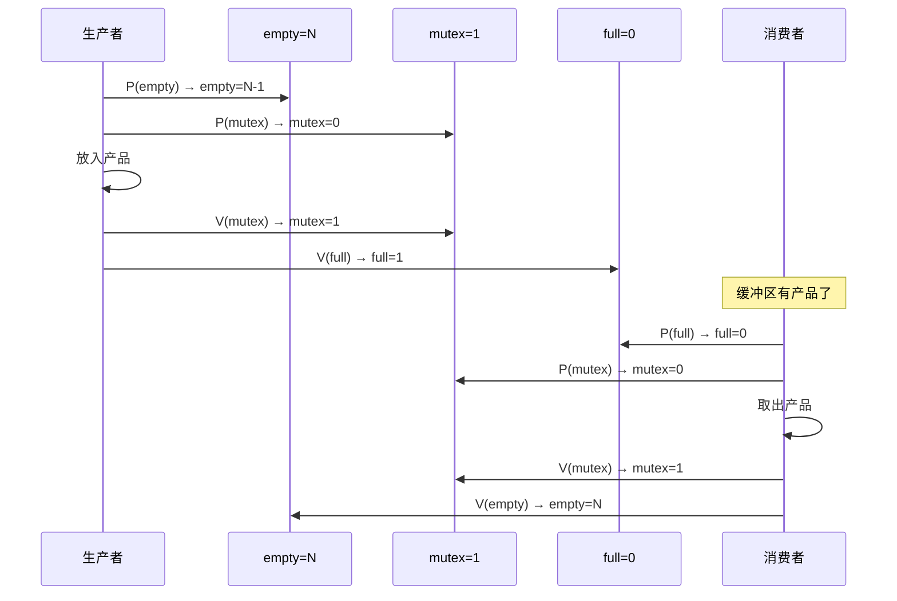
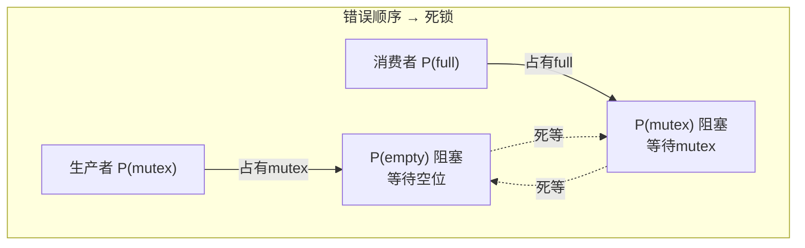

# 生产者消费者问题

> 生产者消费者问题是并发编程的"Hello World"——它浓缩了互斥与同步两大核心矛盾：生产者和消费者互斥访问缓冲区，同时必须协调"满了不能生产、空了不能消费"的同步关系。

## 一、问题描述

- **生产者**：向缓冲区放入产品，缓冲区满时等待
- **消费者**：从缓冲区取出产品，缓冲区空时等待
- **缓冲区**：大小为 N，生产者和消费者互斥访问


---

## 二、同步变量分析

### 2.1 识别同步关系

| 关系 | 类型 | 说明 |
|------|------|------|
| 生产者 ↔ 消费者 | **互斥** | 不能同时访问缓冲区 |
| 生产者 → 消费者 | **同步** | 缓冲区空时，消费者等待生产者 |
| 消费者 → 生产者 | **同步** | 缓冲区满时，生产者等待消费者 |

### 2.2 信号量定义

```c
Semaphore mutex = 1;    // 互斥信号量：控制对缓冲区的互斥访问
Semaphore empty = N;    // 同步信号量：表示空闲缓冲区数量（生产者关注）
Semaphore full  = 0;    // 同步信号量：表示产品数量（消费者关注）
```

::: important 信号量初值
- **mutex = 1**：互斥信号量，初值1（二值信号量）
- **empty = N**：空闲槽位，初始有N个空位
- **full = 0**：产品数量，初始没有产品
:::

---

## 三、标准解法

### 3.1 完整伪代码

```c
// 信号量定义
Semaphore mutex = 1;    // 互斥
Semaphore empty = N;    // 空位
Semaphore full  = 0;    // 产品

// 缓冲区
Item buffer[N];
int in = 0, out = 0;

// 生产者进程
void producer() {
    while (true) {
        Item product = produce_item();  // 生产产品（在临界区外）

        P(empty);   // ① 申请空位（empty--）
        P(mutex);   // ② 申请进入缓冲区

        // --- 临界区 ---
        buffer[in] = product;   // 放入产品
        in = (in + 1) % N;      // 环形指针
        // --- 临界区 ---

        V(mutex);   // ③ 离开缓冲区
        V(full);    // ④ 通知消费者有新产品（full++）
    }
}

// 消费者进程
void consumer() {
    while (true) {
        P(full);    // ① 申请产品（full--）
        P(mutex);   // ② 申请进入缓冲区

        // --- 临界区 ---
        Item product = buffer[out]; // 取出产品
        out = (out + 1) % N;        // 环形指针
        // --- 临界区 ---

        V(mutex);   // ③ 离开缓冲区
        V(empty);   // ④ 通知生产者有空位（empty++）

        consume_item(product);  // 消费产品（在临界区外）
    }
}
```

### 3.2 执行流程图解



---

## 四、关键易错点

### 4.1 P 操作的顺序不能颠倒！

```c
// ❌ 错误写法：先 P(mutex) 再 P(empty)
void producer_WRONG() {
    P(mutex);   // 先锁住缓冲区
    P(empty);   // 再申请空位

    // 如果缓冲区满：
    // P(empty) 阻塞，但 mutex 已被占用
    // 消费者无法进入缓冲区（P(mutex)也阻塞）
    // → 死锁！
}

// ✅ 正确写法：先 P(empty) 再 P(mutex)
void producer_RIGHT() {
    P(empty);   // 先确认有空位
    P(mutex);   // 再锁住缓冲区
}
```



::: warning P 操作的黄金法则
**同步 P 在前，互斥 P 在后**。如果互斥 P 在前，一旦同步条件不满足，进程持锁等待，其他进程无法进入临界区释放资源，就会死锁。
:::

### 4.2 V 操作的顺序无所谓

V 操作不会阻塞，交换 V(mutex) 和 V(full) 的顺序不影响正确性。但通常保持 P/V 配对的一致性。

### 4.3 生产/消费操作放在临界区外

```c
// ✅ 正确：生产在临界区外
Item product = produce_item();  // 耗时操作，不占锁
P(empty);
P(mutex);
buffer[in] = product;          // 只放数据，快
V(mutex);
V(full);

// ❌ 错误：生产在临界区内
P(empty);
P(mutex);
Item product = produce_item();  // 耗时！持锁时间过长
buffer[in] = product;
V(mutex);
V(full);
```

---

## 五、变体问题

### 5.1 单生产者单消费者、单缓冲区（N=1）

```c
Semaphore mutex = 1;
Semaphore empty = 1;  // 只有一个空位
Semaphore full  = 0;  // 初始无产品

// 此时 mutex 可以省略！
// 因为 empty=1 同时起到互斥作用
```

### 5.2 多生产者多消费者

多个生产者和消费者共享缓冲区，mutex 仍然只有一个，保证同一时刻只有一个进程在缓冲区。

### 5.3 有界缓冲区的吸烟者问题变体

生产者放入不同类型的产品，消费者只消费特定类型——需要额外的条件判断。

---

## 六、完整 C 语言实现（POSIX 信号量）

```c
#include <stdio.h>
#include <pthread.h>
#include <semaphore.h>

#define N 5
#define ITEMS 20

int buffer[N];
int in = 0, out = 0;

sem_t mutex, empty, full;

void* producer(void* arg) {
    for (int i = 0; i < ITEMS; i++) {
        int item = i + 1;

        sem_wait(&empty);   // P(empty)
        sem_wait(&mutex);   // P(mutex)

        buffer[in] = item;
        printf("生产: buffer[%d]=%d\n", in, item);
        in = (in + 1) % N;

        sem_post(&mutex);   // V(mutex)
        sem_post(&full);    // V(full)
    }
    return NULL;
}

void* consumer(void* arg) {
    for (int i = 0; i < ITEMS; i++) {
        sem_wait(&full);    // P(full)
        sem_wait(&mutex);   // P(mutex)

        int item = buffer[out];
        printf("消费: buffer[%d]=%d\n", out, item);
        out = (out + 1) % N;

        sem_post(&mutex);   // V(mutex)
        sem_post(&empty);   // V(empty)
    }
    return NULL;
}

int main() {
    sem_init(&mutex, 0, 1);
    sem_init(&empty, 0, N);
    sem_init(&full, 0, 0);

    pthread_t prod, cons;
    pthread_create(&prod, NULL, producer, NULL);
    pthread_create(&cons, NULL, consumer, NULL);

    pthread_join(prod, NULL);
    pthread_join(cons, NULL);

    sem_destroy(&mutex);
    sem_destroy(&empty);
    sem_destroy(&full);
    return 0;
}
```

---

## 七、同步变量分析总结

```
生产者消费者问题的三组P/V：

1. 互斥关系（生产者之间、消费者之间、生产者与消费者之间）
   P(mutex) ... V(mutex)

2. 同步关系1：缓冲区满 → 生产者等待消费者
   生产者: P(empty) ... V(empty由消费者做)
   消费者: ... V(empty)

3. 同步关系2：缓冲区空 → 消费者等待生产者
   消费者: P(full) ... V(full由生产者做)
   生产者: ... V(full)

P操作顺序: 同步P(empty/full) → 互斥P(mutex)
V操作顺序: 无严格要求
```

::: tip 面试速查
1. **三个信号量**：mutex=1（互斥）、empty=N（空位）、full=0（产品）
2. **P 操作顺序**：同步 P 在前，互斥 P 在后（否则死锁）
3. **V 操作顺序**：不影响正确性
4. **临界区尽量短**：生产/消费操作放在临界区外
5. 生产者 V(full) 通知消费者，消费者 V(empty) 通知生产者
6. 单缓冲区(N=1)时 mutex 可省略，empty 同时起互斥作用
:::

---

::: info 原著参考
- 小林 coding《图解操作系统》——经典同步问题篇
- 王道考研《操作系统》——第二章 经典同步问题
- CSAPP 第十二章《并发编程》
:::
