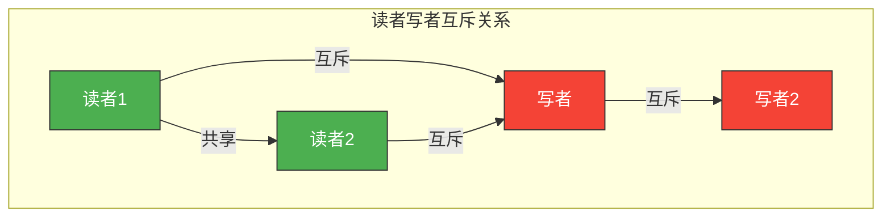
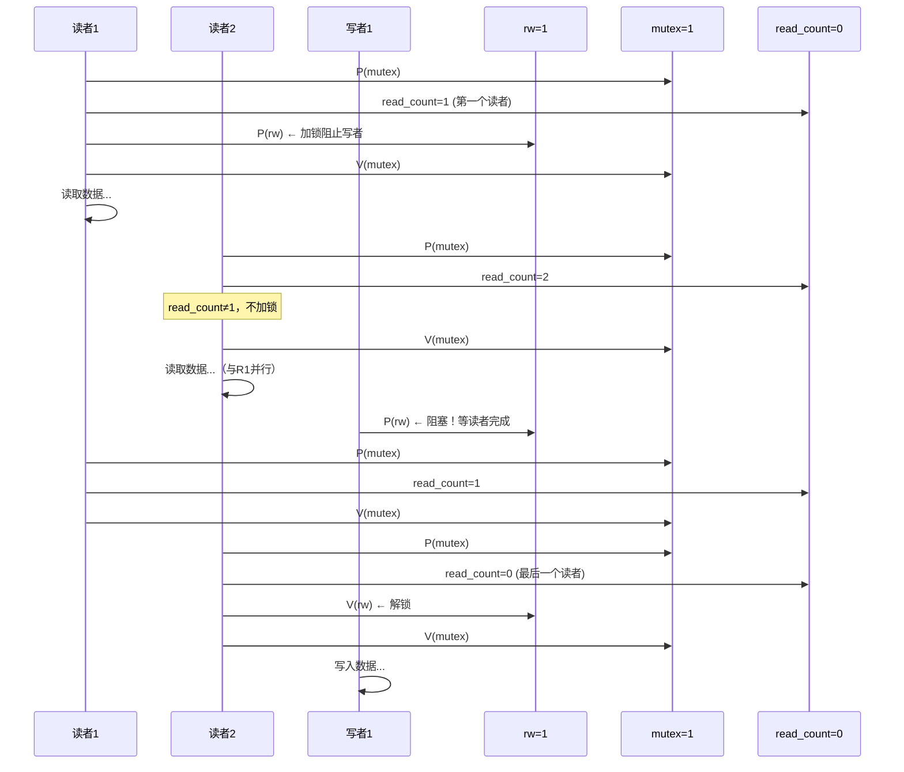
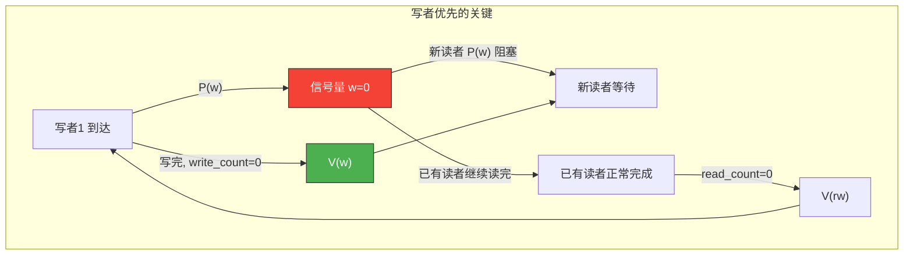

# 读者写者问题

> 读者写者问题刻画了"读读共享、读写互斥"的经典场景——多个读者可以同时读，但写者必须独占。就像图书馆：多人可以同时看书，但有人在修改书架时，其他人都得等着。

## 一、问题描述

- **读者**：可以多个同时读，不互斥
- **写者**：必须独占访问，与任何读者/写者互斥
- **规则**：读读共享、读写互斥、写写互斥



---

## 二、读者优先策略

### 2.1 同步变量分析

| 关系 | 信号量 | 说明 |
|------|--------|------|
| 读写互斥 | `rw = 1` | 控制读/写对数据的互斥访问 |
| 读者间互斥 | `mutex = 1` | 保护 read_count 的互斥修改 |
| 读者计数 | `read_count = 0` | 当前正在读的读者数量 |

```c
// 信号量定义
Semaphore rw = 1;       // 读写互斥信号量
Semaphore mutex = 1;    // 保护 read_count
int read_count = 0;     // 读者计数
```

### 2.2 完整伪代码

```c
// 读者优先——读者进程
void reader() {
    while (true) {
        P(mutex);               // ① 保护 read_count
        read_count++;           // 读者数+1
        if (read_count == 1) {  // ② 第一个读者负责加锁
            P(rw);              //   阻止写者
        }
        V(mutex);               // ③ 释放 read_count 的锁

        // --- 读操作（可多个读者同时） ---
        read_data();

        P(mutex);               // ④ 保护 read_count
        read_count--;           // 读者数-1
        if (read_count == 0) {  // ⑤ 最后一个读者负责解锁
            V(rw);              //   允许写者
        }
        V(mutex);               // ⑥ 释放 read_count 的锁
    }
}

// 读者优先——写者进程
void writer() {
    while (true) {
        P(rw);          // ① 申请写权限

        // --- 写操作（独占） ---
        write_data();

        V(rw);          // ② 释放写权限
    }
}
```

### 2.3 执行流程图解



::: warning 读者优先的"写者饥饿"
只要不断有新读者到来，read_count 就不会降为 0，写者就一直等。这就是**写者饥饿**问题。
:::

---

## 三、写者优先策略

### 3.1 核心思想

当有写者等待时，新来的读者不能先读——让写者优先获得访问权。

### 3.2 同步变量分析

```c
Semaphore rw = 1;        // 读写互斥
Semaphore mutex = 1;     // 保护 read_count
Semaphore w = 1;         // 写优先信号量（阻止新读者）
Semaphore mutex_w = 1;   // 保护 write_count
int read_count = 0;
int write_count = 0;
```

### 3.3 完整伪代码

```c
// 写者优先——读者进程
void reader_writer_priority() {
    while (true) {
        P(w);                // ① 在写者优先信号量处排队
        P(mutex);            // ② 保护 read_count
        read_count++;
        if (read_count == 1) {
            P(rw);           // ③ 第一个读者加锁
        }
        V(mutex);
        V(w);                // ④ 允许后续读者/写者竞争

        read_data();

        P(mutex);
        read_count--;
        if (read_count == 0) {
            V(rw);           // ⑤ 最后一个读者解锁
        }
        V(mutex);
    }
}

// 写者优先——写者进程
void writer_writer_priority() {
    while (true) {
        P(mutex_w);          // ① 保护 write_count
        write_count++;
        if (write_count == 1) {
            P(w);            // ② 第一个写者阻止新读者
        }
        V(mutex_w);

        P(rw);               // ③ 申请写权限
        write_data();
        V(rw);               // ④ 释放写权限

        P(mutex_w);
        write_count--;
        if (write_count == 0) {
            V(w);            // ⑤ 最后一个写者允许读者
        }
        V(mutex_w);
    }
}
```



---

## 四、读写公平策略

### 4.1 核心思想

用**一个信号量**控制读者和写者的公平竞争，先来先服务。

### 4.2 完整伪代码

```c
Semaphore rw = 1;       // 读写互斥
Semaphore mutex = 1;    // 保护 read_count
Semaphore fair = 1;     // 公平信号量，读写排队
int read_count = 0;

// 公平策略——读者
void reader_fair() {
    while (true) {
        P(fair);            // ① 公平排队
        P(mutex);           // ② 保护 read_count
        read_count++;
        if (read_count == 1) {
            P(rw);          // ③ 第一个读者加锁
        }
        V(mutex);
        V(fair);            // ④ 允许下一个排队者

        read_data();

        P(mutex);
        read_count--;
        if (read_count == 0) {
            V(rw);          // ⑤ 最后一个读者解锁
        }
        V(mutex);
    }
}

// 公平策略——写者
void writer_fair() {
    while (true) {
        P(fair);            // ① 公平排队
        P(rw);              // ② 申请写权限
        V(fair);            // ③ 允许下一个排队者

        write_data();

        V(rw);              // ④ 释放写权限
    }
}
```

::: important fair 信号量的作用
`fair` 信号量让读者和写者**按到达顺序排队**。没有它，读者之间不互斥，可以不断插队（读者优先）。有了它，写者 P(fair) 后，后来的读者也会在 fair 上排队，保证先到先服务。
:::

---

## 五、三种策略对比

| 策略 | 读者 | 写者 | 问题 |
|------|------|------|------|
| **读者优先** | 优待 | 可能饥饿 | 写者饥饿 |
| **写者优先** | 可能等待 | 优待 | 读者饥饿 |
| **读写公平** | 按序 | 按序 | 无饥饿 |

```c
// 策略选择
policy_t choose_reader_writer_policy() {
    if (read_mostly) return READER_PRIORITY;     // 读多写少
    if (write_urgent) return WRITER_PRIORITY;     // 写优先级高
    return FAIR;                                  // 默认公平
}
```

---

## 六、读者计数的关键逻辑

```
第一个读者：负责"上锁"  →  if (read_count == 1) P(rw)
最后一个读者：负责"解锁" →  if (read_count == 0) V(rw)
中间读者：什么都不做（只改计数）

这个设计的精妙之处：
- 多个读者可以同时进入（只检查计数）
- 只有第一个/最后一个读者操作 rw 信号量
- 避免了每个读者都 P/V(rw) 导致读读互斥
```

---

::: tip 面试速查
1. **核心规则**：读读共享、读写互斥、写写互斥
2. **读者优先**：第一个读者 P(rw) 加锁，最后一个读者 V(rw) 解锁
3. **read_count 需要mutex 保护**——多个读者同时修改计数会出错
4. **读者优先导致写者饥饿**——新读者不断到来，read_count 不降为0
5. **写者优先**：增加 w 信号量，第一个写者 P(w) 阻止新读者
6. **公平策略**：增加 fair 信号量，读写按到达顺序排队
7. 写者只操作 rw 信号量，不需要计数
:::

---

::: info 原著参考
- 小林 coding《图解操作系统》——经典同步问题篇
- 王道考研《操作系统》——第二章 读者写者问题
- CSAPP 第十二章《并发编程》
:::
