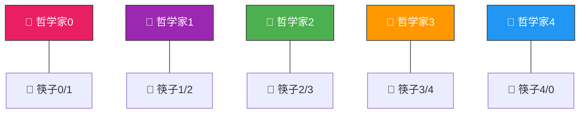
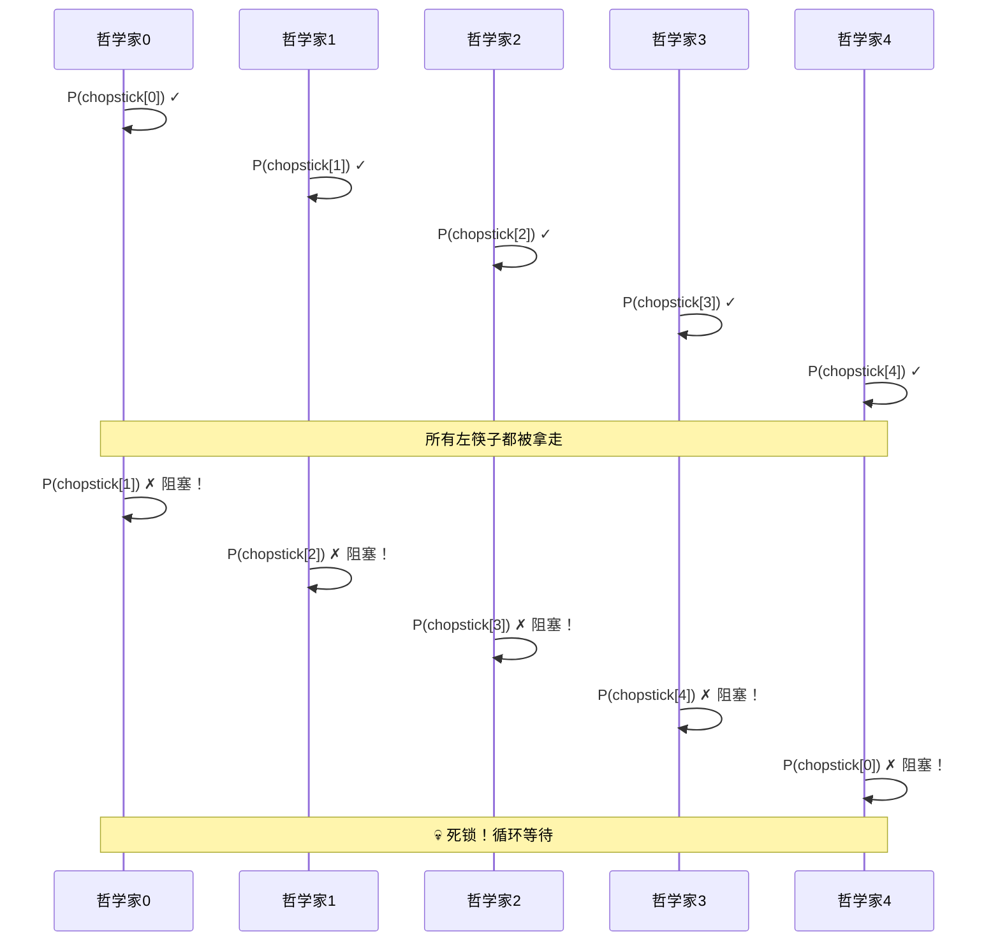
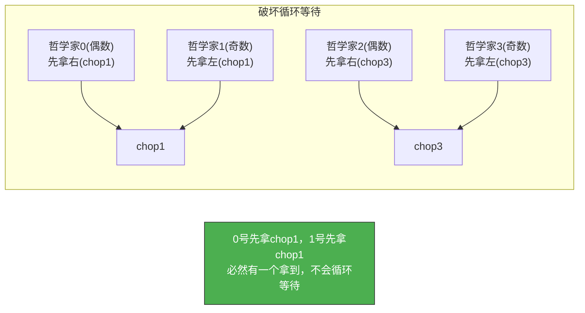

# 哲学家就餐问题

> 五个哲学家围坐圆桌，每人面前一盘面，相邻两人之间一支筷子——要吃面必须拿到左右两支筷子。如果所有人同时拿起左手边的筷子，就再也拿不到右手边的筷子，死锁！

## 一、问题描述



- 5 个哲学家，5 支筷子
- 每个哲学家需要**左右两支筷子**才能进餐
- 思考→拿左筷子→拿右筷子→进餐→放右筷子→放左筷子→思考

### 核心矛盾

| 关系 | 类型 | 说明 |
|------|------|------|
| 相邻哲学家 | **互斥** | 共享一支筷子，不能同时拿 |

---

## 二、朴素解法（会死锁！）

### 2.1 直接给每支筷子一个信号量

```c
Semaphore chopstick[5] = {1, 1, 1, 1, 1};  // 5支筷子

void philosopher(int i) {
    while (true) {
        think();

        P(chopstick[i]);           // 拿左边筷子
        P(chopstick[(i+1) % 5]);   // 拿右边筷子

        eat();                      // 进餐

        V(chopstick[(i+1) % 5]);   // 放右边筷子
        V(chopstick[i]);           // 放左边筷子
    }
}
```

### 2.2 死锁场景



::: warning 死锁原因
5 个哲学家各拿 1 支左筷子，等待右筷子——满足死锁四个条件：互斥、不可剥夺、请求并保持、循环等待。
:::

---

## 三、防死锁方案

### 方案1：限制并发人数

最多允许 4 个哲学家同时尝试拿筷子——至少有 1 人能拿到两支。

```c
Semaphore limit = 4;  // 最多4人同时尝试
Semaphore chopstick[5] = {1, 1, 1, 1, 1};

void philosopher_v1(int i) {
    while (true) {
        think();

        P(limit);                    // 限制并发
        P(chopstick[i]);
        P(chopstick[(i+1) % 5]);

        eat();

        V(chopstick[(i+1) % 5]);
        V(chopstick[i]);
        V(limit);
    }
}
```

### 方案2：奇偶编号，破坏循环等待

- **奇数号**哲学家先拿左筷子再拿右筷子
- **偶数号**哲学家先拿右筷子再拿左筷子

```c
Semaphore chopstick[5] = {1, 1, 1, 1, 1};

void philosopher_v2(int i) {
    while (true) {
        think();

        if (i % 2 == 1) {
            // 奇数：先左后右
            P(chopstick[i]);
            P(chopstick[(i+1) % 5]);
        } else {
            // 偶数：先右后左
            P(chopstick[(i+1) % 5]);
            P(chopstick[i]);
        }

        eat();

        V(chopstick[i]);
        V(chopstick[(i+1) % 5]);
    }
}
```



::: tip 为什么奇偶能破死锁？
假设 0 号先拿右筷子（chop1），1 号先拿左筷子（chop1）——他们竞争同一支筷子，必然有一个拿不到而等待，另一个拿到后可以继续拿第二支。消除了"每个人各拿一支"的循环等待局面。
:::

### 方案3：AND 型信号量（同时拿两支）

要么同时拿到两支筷子，要么一支都不拿。

```c
Semaphore chopstick[5] = {1, 1, 1, 1, 1};

void philosopher_v3(int i) {
    while (true) {
        think();

        // AND 型 P 操作：同时申请两支筷子
        Swait(chopstick[i], chopstick[(i+1) % 5]);

        eat();

        // AND 型 V 操作：同时释放
        Ssignal(chopstick[i], chopstick[(i+1) % 5]);
    }
}

// AND 型 P 操作伪代码
void Swait(Semaphore *s1, Semaphore *s2) {
    // 原子操作：要么全部获得，要么全部不获得
    while (true) {
        disable_interrupts();
        if (s1->value >= 1 && s2->value >= 1) {
            s1->value--;
            s2->value--;
            enable_interrupts();
            return;  // 成功
        }
        enable_interrupts();
        // 等待后重试
        wait_and_retry();
    }
}
```

### 方案4：管程解法

用管程封装筷子分配逻辑，由管程统一判断是否可以分配。

```c
monitor DiningPhilosophers {
    enum {THINKING, HUNGRY, EATING} state[5];
    condition self[5];  // 每个哲学家一个条件变量

    void pickup(int i) {
        state[i] = HUNGRY;
        test(i);              // 检查能否进餐
        if (state[i] != EATING)
            wait(self[i]);    // 不能则等待
    }

    void putdown(int i) {
        state[i] = THINKING;
        test((i+4) % 5);     // 检查左邻居能否进餐
        test((i+1) % 5);     // 检查右邻居能否进餐
    }

    void test(int i) {
        // 左右邻居都没在吃 → 自己可以吃
        if (state[i] == HUNGRY &&
            state[(i+4) % 5] != EATING &&
            state[(i+1) % 5] != EATING) {
            state[i] = EATING;
            signal(self[i]);  // 唤醒等待的哲学家
        }
    }
}
```

---

## 四、四种方案对比

| 方案 | 核心 | 死锁 | 饥饿 | 实现难度 |
|------|------|------|------|---------|
| 限制人数 | limit=4 | ✗ | 可能 | 简单 |
| 奇偶编号 | 破坏循环等待 | ✗ | ✗ | 简单 |
| AND信号量 | 原子获取 | ✗ | ✗ | 中等 |
| 管程 | 封装判断 | ✗ | ✗ | 中等 |

```c
// 方案选择策略
philosophy_t choose_solution() {
    if (has_and_semaphore) return AND_SEMAPHORE;  // 最佳
    if (simple_preferred) return ODD_EVEN;         // 最简单
    return LIMIT_CONCURRENT;                        // 备选
}
```

---

## 五、同步变量分析总结

```
哲学家就餐问题的本质：
- 互斥关系：相邻哲学家共享筷子
- 死锁风险：循环等待 → 所有方案都围绕"破坏循环等待"

朴素解法：每支筷子一个信号量
- 死锁原因：5人各拿1支，循环等待

防死锁方案的核心思路：
1. 限制人数(limit=4)：不可能5人各拿1支
2. 奇偶编号：破坏循环等待链
3. AND信号量：原子操作，要么全拿要么不拿
4. 管程：集中管理，检查邻居状态才分配
```

::: tip 面试速查
1. **死锁原因**：5人同时拿左筷子→循环等待
2. **限制人数法**：Semaphore limit=4，最多4人同时拿筷子
3. **奇偶编号法**：奇数先左后右，偶数先右后左，破坏循环等待
4. **AND信号量法**：Swait 同时申请两支，原子操作
5. **管程法**：检查左右邻居状态，都不在吃才能吃
6. 本质是**破坏死锁的"循环等待"条件**
7. 筷子是互斥资源，不存在同步关系（只有互斥）
:::

---

::: info 原著参考
- 小林 coding《图解操作系统》——经典同步问题篇
- 王道考研《操作系统》——第二章 哲学家就餐问题
- CSAPP 第十二章《并发编程》
:::
