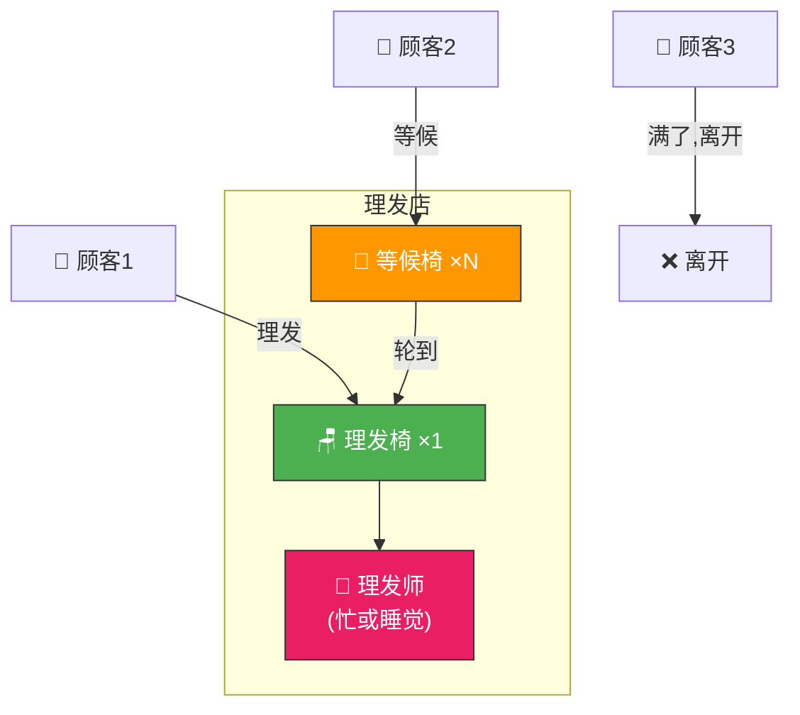
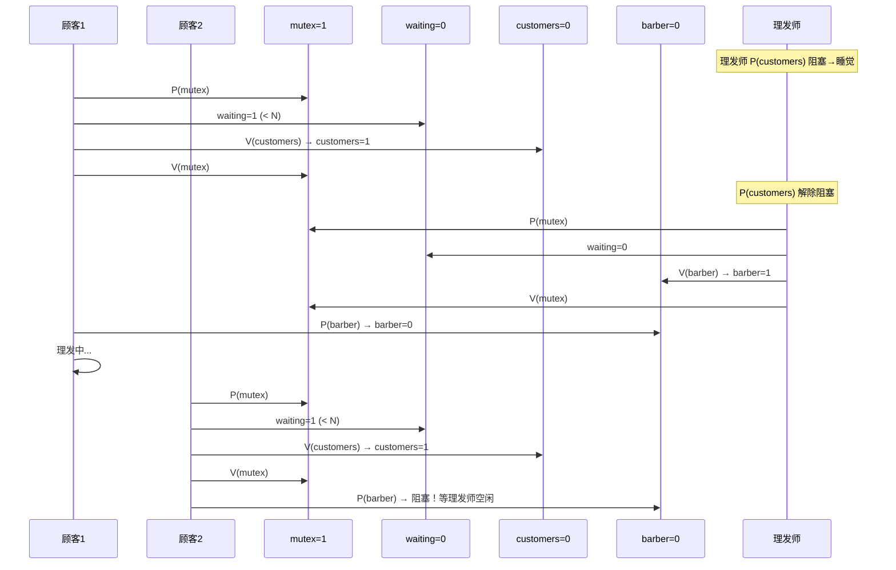
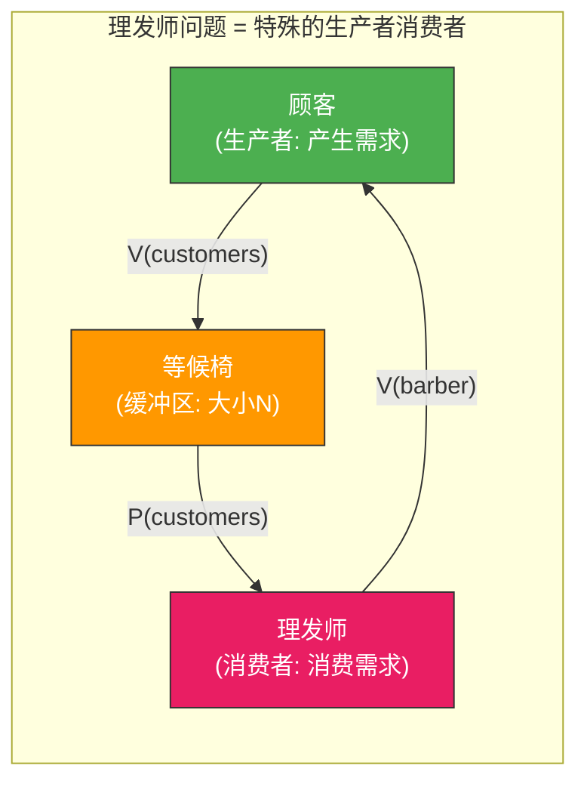

# 理发师问题

> 理发店有一位理发师、一把理发椅和 N 把等候椅。有顾客时理发师理发，没顾客时理发师睡觉。顾客来时如果理发师在睡就叫醒他，如果等候椅满了就离开——这是一个经典的"服务者-客户"同步模型。

## 一、问题描述

### 1.1 场景设定

- 1 位理发师，1 把理发椅，N 把等候椅
- 理发师无顾客时在理发椅上睡觉
- 顾客到来时：
  - 理发师在睡 → 叫醒理发师，坐上理发椅
  - 理发师在忙 → 有空等候椅就坐下等，满了就离开
- 理发师理完一个顾客后，检查等候椅有无顾客



### 1.2 同步关系分析

| 关系 | 类型 | 说明 |
|------|------|------|
| 顾客 → 理发师 | **同步** | 顾客叫醒理发师 |
| 理发师 → 顾客 | **同步** | 理发师理完通知顾客 |
| 等候椅 | **互斥** | 多个顾客竞争有限等候椅 |
| waiting 计数 | **互斥** | 修改等候人数需互斥 |

---

## 二、同步变量定义

```c
Semaphore customers = 0;    // 等候的顾客数（理发师关注）
Semaphore barber = 0;       // 理发师是否空闲（顾客关注）
Semaphore mutex = 1;        // 保护 waiting 变量
int waiting = 0;            // 等候的顾客数（含正在理发的）
int CHAIRS = N;             // 等候椅数量
```

| 变量 | 初值 | 含义 |
|------|------|------|
| `customers` | 0 | 有多少顾客在等/正在理发 |
| `barber` | 0 | 理发师是否就绪（0=忙/睡觉） |
| `mutex` | 1 | 保护 waiting 的互斥信号量 |
| `waiting` | 0 | 当前等候的顾客总数 |

---

## 三、标准解法

### 3.1 完整伪代码

```c
Semaphore customers = 0;    // 顾客信号量
Semaphore barber = 0;       // 理发师信号量
Semaphore mutex = 1;        // 互斥信号量
int waiting = 0;            // 等候顾客数
int CHAIRS = N;             // 等候椅数量

// 理发师进程
void barber_process() {
    while (true) {
        P(customers);       // ① 等待顾客（无顾客则睡觉）
        P(mutex);           // ② 保护 waiting
        waiting--;          // 顾客数-1
        V(barber);          // ③ 通知顾客：理发师准备好了
        V(mutex);           // ④ 释放 waiting 的锁

        cut_hair();         // ⑤ 理发（临界区外，可耗时）
    }
}

// 顾客进程
void customer_process() {
    P(mutex);               // ① 保护 waiting
    if (waiting < CHAIRS) { // ② 有等候椅吗？
        waiting++;          // 等候人数+1
        V(customers);       // ③ 通知理发师：有顾客来了
        V(mutex);           // ④ 释放 waiting 的锁

        P(barber);          // ⑤ 等待理发师准备好

        get_haircut();      // ⑥ 理发
    } else {
        V(mutex);           // ⑦ 等候椅满了，离开
        // 顾客离开，不等待
    }
}
```

### 3.2 执行流程图解



---

## 四、关键细节分析

### 4.1 为什么需要 barber 信号量？

```c
// 如果没有 barber 信号量：
void customer_WRONG() {
    P(mutex);
    waiting++;
    V(customers);
    V(mutex);
    // 直接坐上理发椅？
    // 问题：理发师可能还没准备好！
    // 顾客和理发师需要同步：理发师准备好 → 顾客才开始
    get_haircut();  // ❌ 可能理发师还在理上一个人
}

// 有 barber 信号量：
P(barber);  // 确保理发师准备好了才开始
get_haircut();  // ✅
```

### 4.2 顾客检查等候椅的时机

```c
// 顾客在 P(mutex) 保护下检查 waiting < CHAIRS
// 这确保了 waiting 的读写是原子的

P(mutex);
if (waiting < CHAIRS) {
    waiting++;
    V(customers);
    V(mutex);
    P(barber);
    get_haircut();
} else {
    V(mutex);
    // 离开——不参与竞争
}
```

::: important 满了就走的逻辑
顾客在 P(mutex) 保护下判断等候椅是否满。如果满了，V(mutex) 后离开，不 V(customers)，所以不会唤醒理发师。这避免了无效的唤醒。
:::

### 4.3 V(mutex) 在 P(barber) 之前

```c
// ✅ 正确顺序
V(mutex);       // 先释放 waiting 的锁
P(barber);      // 再等理发师

// ❌ 错误顺序
P(barber);      // 先等理发师
V(mutex);       // 问题：持有 mutex 等待理发师
// 理发师 P(mutex) 会被阻塞 → 死锁！
```

这与生产者消费者问题一致：**先释放互斥锁，再等待同步信号量**。

---

## 五、变体问题

### 5.1 理发师理发完成后通知顾客

增加一个 haircut_done 信号量，让理发师通知顾客理发完成。

```c
Semaphore haircut_done = 0;

void barber_process_v2() {
    while (true) {
        P(customers);
        P(mutex);
        waiting--;
        V(barber);
        V(mutex);

        cut_hair();
        V(haircut_done);   // 通知顾客理发完成
    }
}

void customer_process_v2() {
    P(mutex);
    if (waiting < CHAIRS) {
        waiting++;
        V(customers);
        V(mutex);

        P(barber);
        get_haircut();
        P(haircut_done);   // 等待理发完成
    } else {
        V(mutex);
    }
}
```

### 5.2 多理发师问题

如果有 M 个理发师：

```c
Semaphore customers = 0;
Semaphore barbers = M;     // M 个理发师
Semaphore mutex = 1;
int waiting = 0;
int CHAIRS = N;

void barber_multi() {
    while (true) {
        P(customers);
        P(mutex);
        waiting--;
        V(barbers);        // 一个理发师就绪
        V(mutex);
        cut_hair();
    }
}

void customer_multi() {
    P(mutex);
    if (waiting < CHAIRS) {
        waiting++;
        V(customers);
        V(mutex);
        P(barbers);        // 等任一理发师就绪
        get_haircut();
    } else {
        V(mutex);
    }
}
```

### 5.3 不离开的顾客（一直等）

如果顾客不离开，等候椅满了就在门外等：

```c
void customer_patient() {
    P(mutex);
    waiting++;
    V(customers);
    V(mutex);

    P(barber);            // 一直等到有理发师空闲
    get_haircut();
}
// 不需要检查 waiting < CHAIRS
```

---

## 六、与其他经典问题的对比

| 问题 | 互斥 | 同步 | 核心模型 |
|------|------|------|---------|
| 生产者消费者 | 缓冲区互斥 | 满/空同步 | 有界缓冲 |
| 读者写者 | 读写互斥 | 无 | 共享读、排他写 |
| 哲学家就餐 | 筷子互斥 | 无 | 环形资源竞争 |
| 理发师 | waiting互斥 | 顾客↔理发师 | 服务者-客户 |



::: tip 理发师问题的本质
理发师问题本质上是生产者消费者问题的变体：顾客是"生产者"（产生理发需求），理发师是"消费者"（消费理发需求），等候椅是"缓冲区"。额外特点：
1. 缓冲区满时生产者离开（不等）
2. 消费者空闲时睡眠（等待生产者唤醒）
3. 有"双向同步"——顾客等理发师就绪(barber)，理发师等顾客到来(customers)
:::

---

## 七、同步变量分析总结

```
理发师问题的四组P/V：

1. 互斥关系（保护 waiting 变量）
   P(mutex) ... V(mutex)

2. 同步关系1：理发师等待顾客
   顾客: V(customers)  // 通知有顾客
   理发师: P(customers) // 等待顾客

3. 同步关系2：顾客等待理发师就绪
   理发师: V(barber)    // 通知准备好了
   顾客: P(barber)      // 等待理发师

关键顺序：
- 顾客: V(mutex) 在 P(barber) 之前
- 理发师: V(barber) 在 V(mutex) 之后？不，V(barber) 在 V(mutex) 之前也行
  因为 V 操作不阻塞
```

::: tip 面试速查
1. **四个同步变量**：customers=0, barber=0, mutex=1, waiting=0
2. **双向同步**：V(customers)叫醒理发师，V(barber)通知顾客理发师就绪
3. **满了就走**：waiting >= CHAIRS 时顾客 V(mutex) 后离开
4. **P操作顺序**：V(mutex) 在 P(barber) 之前，否则死锁
5. **理发师P(customers)在外层循环**：无顾客则睡眠
6. 理发师问题本质 = 带双向同步 + 缓冲区满则丢弃的生产者消费者
7. 多理发师扩展：Semaphore barbers = M
:::

---

::: info 原著参考
- 小林 coding《图解操作系统》——经典同步问题篇
- 王道考研《操作系统》——第二章 理发师问题
- CSAPP 第十二章《并发编程》
:::
