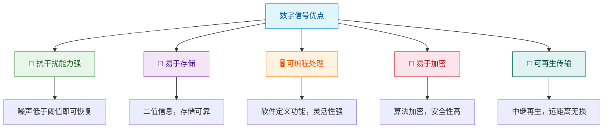
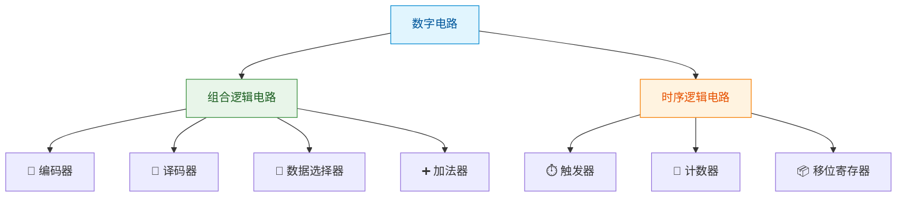

> 如果把信息比作河流，那么模拟信号就是潺潺流水——连续不断、变化万千；而数字信号则是河面上的石墩——一块一块、清晰分明。正是这种"分明"，赋予了数字电路无与伦比的抗干扰能力和处理灵活性。

## 一、模拟信号与数字信号

### 1.1 基本概念

**模拟信号（Analog Signal）**：在时间和幅值上都是连续变化的信号。自然界中大多数物理量（温度、声音、光强）对应的电信号都是模拟信号。

**数字信号（Digital Signal）**：在时间和幅值上都是离散的信号。通常只取两个离散值（0 和 1），用高/低电平表示。


### 1.2 模拟信号与数字信号对比

| 对比项 | 模拟信号 | 数字信号 |
|--------|---------|---------|
| 时间 | 连续 | 离散 |
| 幅值 | 连续 | 离散（通常为0和1） |
| 抗干扰 | 差，干扰叠加后难以消除 | 强，只需判断高低电平 |
| 存储 | 难以精确存储 | 易于存储和复制 |
| 传输 | 远距离传输有衰减 | 可再生，无损传输 |
| 处理 | 模拟电路处理 | 可编程，灵活处理 |
| 加密 | 困难 | 容易实现加密 |
| 精度 | 受元器件精度限制 | 由位数决定，可提高 |

::: important 核心区别
数字信号的核心优势在于**离散性**——只要噪声不超过阈值，就可以完全恢复原始信号。而模拟信号的噪声是**不可逆叠加**的。
:::

### 1.3 数字信号的优点



## 二、数字电路的分类

### 2.1 组合逻辑电路

**特点**：输出仅取决于当前输入，与电路原来的状态无关，即**无记忆功能**。

典型电路：编码器、译码器、数据选择器、加法器等。

### 2.2 时序逻辑电路

**特点**：输出不仅取决于当前输入，还与电路原来的状态有关，即**有记忆功能**。

典型电路：触发器、计数器、移位寄存器等。



| 对比项 | 组合逻辑电路 | 时序逻辑电路 |
|--------|-------------|-------------|
| 输出与输入关系 | 仅与当前输入有关 | 与当前输入和历史状态有关 |
| 记忆功能 | 无 | 有 |
| 包含元件 | 逻辑门 | 逻辑门 + 存储元件 |
| 描述工具 | 真值表、逻辑表达式 | 状态表、状态图 |
| 典型应用 | 编码/译码/运算 | 计数/存储/控制 |

## 三、数制

### 3.1 常用数制

| 数制 | 基数 | 数字符号 | 权 | 应用场景 |
|------|------|---------|-----|---------|
| 二进制 | 2 | 0, 1 | $2^n$ | 计算机内部运算 |
| 八进制 | 8 | 0~7 | $8^n$ | 简化二进制表示 |
| 十进制 | 10 | 0~9 | $10^n$ | 日常使用 |
| 十六进制 | 16 | 0~9, A~F | $16^n$ | 地址、数据表示 |

### 3.2 二进制的特殊地位

::: tip 为什么计算机用二进制？
1. **物理实现简单**：只需要两种状态（高/低电平、通/断），制造容易
2. **可靠性高**：两种状态区分明显，抗干扰能力强
3. **运算规则简单**：加法和乘法规则各只有4条
4. **逻辑代数的天然载体**：0/1 与 真/假 完美对应
:::

### 3.3 十六进制的便捷性

十六进制与二进制的对应关系：每4位二进制对应1位十六进制。

| 十六进制 | 二进制 | 十进制 | 十六进制 | 二进制 | 十进制 |
|---------|--------|--------|---------|--------|--------|
| 0 | 0000 | 0 | 8 | 1000 | 8 |
| 1 | 0001 | 1 | 9 | 1001 | 9 |
| 2 | 0010 | 2 | A | 1010 | 10 |
| 3 | 0011 | 3 | B | 1011 | 11 |
| 4 | 0100 | 4 | C | 1100 | 12 |
| 5 | 0101 | 5 | D | 1101 | 13 |
| 6 | 0110 | 6 | E | 1110 | 14 |
| 7 | 0111 | 7 | F | 1111 | 15 |

## 四、码制

### 4.1 BCD码（Binary-Coded Decimal）

BCD码用4位二进制表示1位十进制数。

**8421 BCD码**：最常用的BCD码，4位二进制的权分别为8、4、2、1。

| 十进制 | 8421 BCD | 十进制 | 8421 BCD |
|--------|----------|--------|----------|
| 0 | 0000 | 5 | 0101 |
| 1 | 0001 | 6 | 0110 |
| 2 | 0010 | 7 | 0111 |
| 3 | 0011 | 8 | 1000 |
| 4 | 0100 | 9 | 1001 |

::: warning BCD码不是二进制
8421 BCD码中，1010~1111 这6个编码是**非法码**，不对应任何十进制数字。
例如：十进制 12 的 8421 BCD 码是 `0001 0010`，而不是二进制的 `1100`。
:::

### 4.2 格雷码（Gray Code）

格雷码的特点：**相邻两个码之间只有1位不同**，因此也称为循环码或反射码。

| 十进制 | 二进制 | 格雷码 | 十进制 | 二进制 | 格雷码 |
|--------|--------|--------|--------|--------|--------|
| 0 | 000 | 000 | 4 | 100 | 110 |
| 1 | 001 | 001 | 5 | 101 | 111 |
| 2 | 010 | 011 | 6 | 110 | 101 |
| 3 | 011 | 010 | 7 | 111 | 100 |

**二进制转格雷码方法**：

1. 格雷码最高位 = 二进制最高位
2. 格雷码其余位 = 二进制对应位与高一位**异或**

```
二进制：  1  0  1  1
         ↓  ↓  ↓  ↓
异或：   1 (1⊕0)(0⊕1)(1⊕1)
格雷码： 1  1  1  0
```

### 4.3 余3码

余3码 = 8421 BCD码 + 0011，即每个十进制数字对应的编码比8421 BCD码大3。

| 十进制 | 8421 BCD | 余3码 | 十进制 | 8421 BCD | 余3码 |
|--------|----------|-------|--------|----------|-------|
| 0 | 0000 | 0011 | 5 | 0101 | 1000 |
| 1 | 0001 | 0100 | 6 | 0110 | 1001 |
| 2 | 0010 | 0101 | 7 | 0111 | 1010 |
| 3 | 0011 | 0110 | 8 | 1000 | 1011 |
| 4 | 0100 | 0111 | 9 | 1001 | 1100 |

::: tip 余3码的自补性
余3码的一个重要性质：0和9、1和8、2和7、3和6、4和5的编码**互为反码**，这称为**自补性**，在减法运算中非常有用。
:::

### 4.4 常用编码对比

| 编码 | 位数 | 特点 | 主要应用 |
|------|------|------|---------|
| 8421 BCD | 4 | 有权码，权为8421 | 十进制数的数字表示 |
| 格雷码 | 4 | 相邻码仅1位不同 | 减少转换错误 |
| 余3码 | 4 | 无权码，自补性 | 减法运算 |
| ASCII | 7/8 | 字符编码 | 文本信息交换 |

---

## 练习题

### 练习1

将十进制数 25 转换为 8421 BCD 码。

::: details 答案与解析

2 → 0010，5 → 0101

所以 (25)₁₀ = (0010 0101)₈₄₂₁BCD

:::

### 练习2

将二进制数 1101 转换为格雷码。

::: details 答案与解析

二进制：1 1 0 1

格雷码第1位 = 1

格雷码第2位 = 1 ⊕ 1 = 0

格雷码第3位 = 1 ⊕ 0 = 1

格雷码第4位 = 0 ⊕ 1 = 1

所以格雷码为 **1011**

:::

### 练习3

判断题：8421 BCD 码 1010 是合法的 BCD 编码。

::: details 答案与解析

**错误**。8421 BCD码中，1010~1111是非法码，因为十进制只有0~9，对应的4位编码只用到了0000~1001。

:::

---

::: tip 面试速查
- 数字信号核心优势：抗干扰、易存储、可编程、可加密
- 组合逻辑 vs 时序逻辑：有无记忆功能
- BCD码 ≠ 二进制：BCD是逐位编码
- 格雷码特点：相邻码仅1位不同，减少转换毛刺
- 余3码特点：自补性，便于减法运算
:::

::: info 原著参考
- 阎石《数字电子技术基础》第1章 1.1~1.3节
- 康华光《电子技术基础·数字部分》第1章
- Floyd《Digital Fundamentals》Chapter 1
:::
