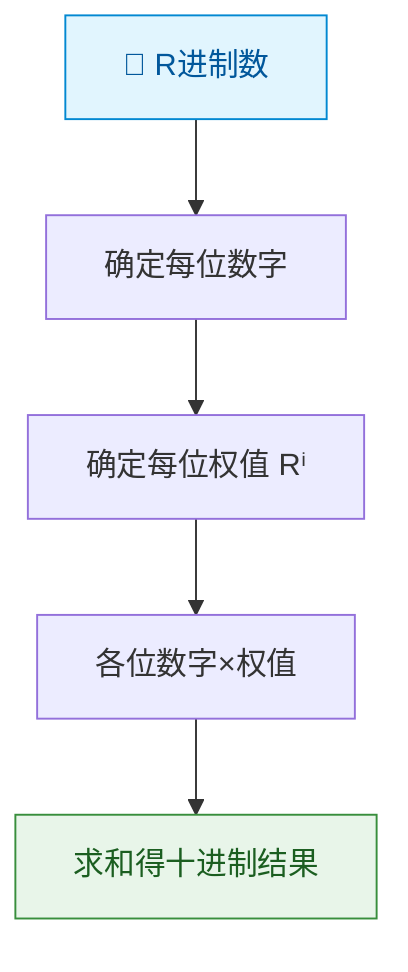
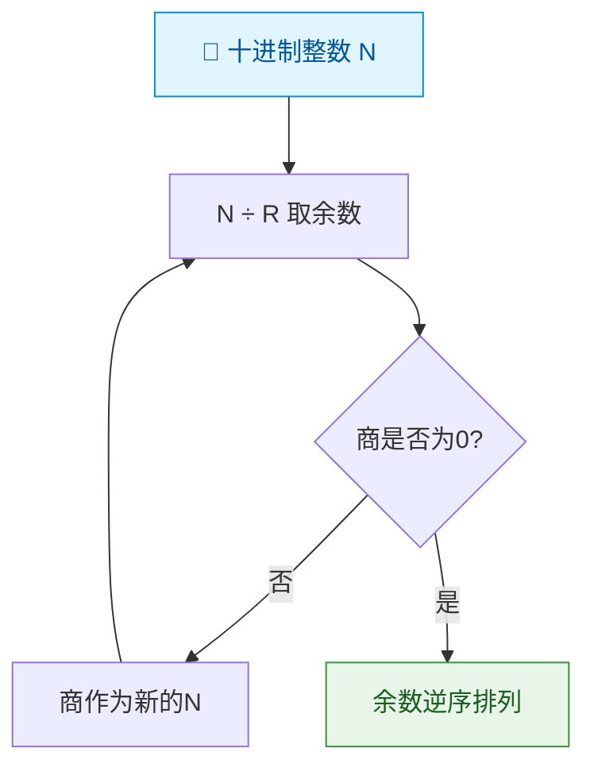
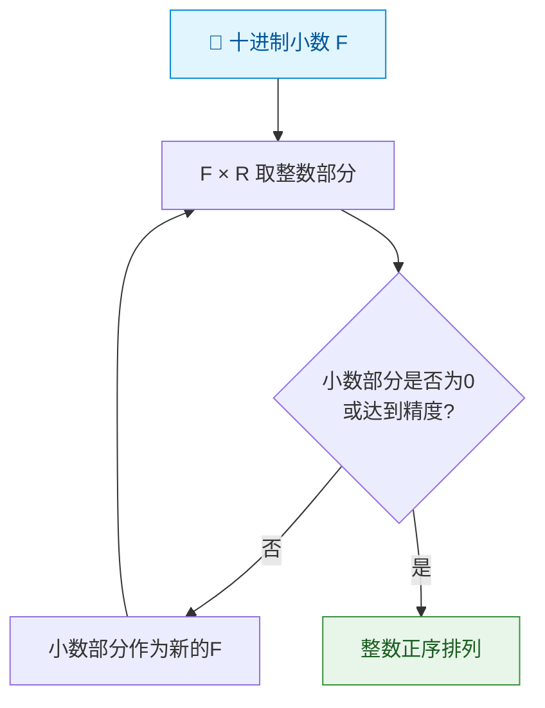
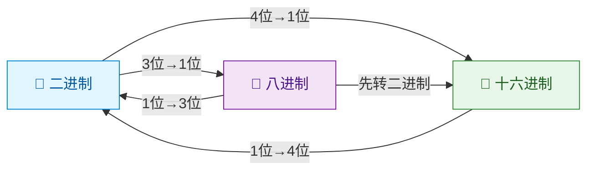
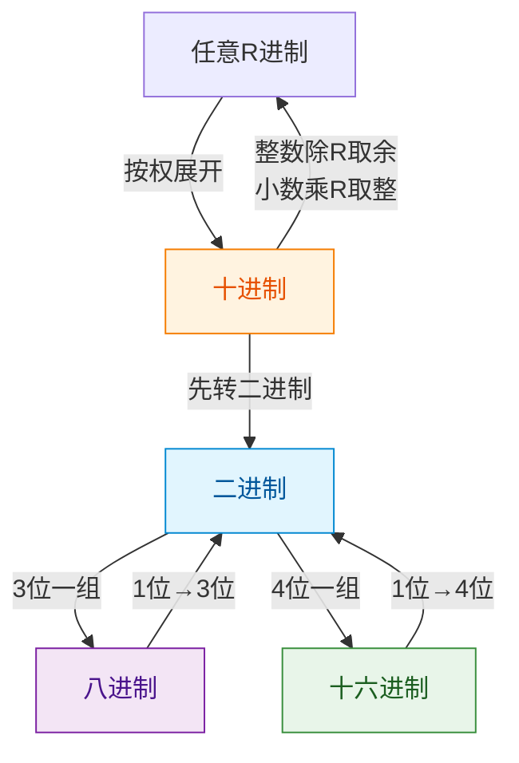

> 如果把数制比作各国货币，那么数制转换就是汇率换算——虽然面值不同，但价值相等。掌握"汇率"的算法，就能在不同数制间自由穿梭。

## 一、任意进制转十进制——按权展开法

### 1.1 基本原理

将任意 R 进制数按权展开求和：

$$(d_{n-1}d_{n-2}\cdots d_1 d_0 . d_{-1} d_{-2}\cdots)_R = \sum_{i} d_i \times R^i$$

其中 $d_i$ 为第 $i$ 位上的数字，$R^i$ 为该位的权。

### 1.2 转换流程

### 1.3 示例

**例1**：将 $(1011.01)_2$ 转换为十进制。

$$1 \times 2^3 + 0 \times 2^2 + 1 \times 2^1 + 1 \times 2^0 + 0 \times 2^{-1} + 1 \times 2^{-2}$$
$$= 8 + 0 + 2 + 1 + 0 + 0.25 = 11.25$$

**例2**：将 $(2A.4)_{16}$ 转换为十进制。

$$2 \times 16^1 + 10 \times 16^0 + 4 \times 16^{-1} = 32 + 10 + 0.25 = 42.25$$

**例3**：将 $(37.2)_8$ 转换为十进制。

$$3 \times 8^1 + 7 \times 8^0 + 2 \times 8^{-1} = 24 + 7 + 0.25 = 31.25$$

## 二、十进制转任意进制

### 2.1 整数部分——除基取余法

**方法**：将十进制整数反复除以基数 R，直到商为0，将每次得到的余数**逆序排列**。

**例4**：将 $(25)_{10}$ 转换为二进制。

| 步骤 | 运算 | 商 | 余数 |
|------|------|-----|------|
| 1 | 25 ÷ 2 | 12 | **1** |
| 2 | 12 ÷ 2 | 6 | **0** |
| 3 | 6 ÷ 2 | 3 | **0** |
| 4 | 3 ÷ 2 | 1 | **1** |
| 5 | 1 ÷ 2 | 0 | **1** |

逆序读取余数：$(25)_{10} = (11001)_2$

### 2.2 小数部分——乘基取整法

**方法**：将十进制小数反复乘以基数 R，取整数部分，将小数部分继续乘，直到小数为0或达到所需精度，整数部分**正序排列**。

**例5**：将 $(0.625)_{10}$ 转换为二进制。

| 步骤 | 运算 | 整数部分 | 小数部分 |
|------|------|---------|---------|
| 1 | 0.625 × 2 = 1.25 | **1** | 0.25 |
| 2 | 0.25 × 2 = 0.5 | **0** | 0.5 |
| 3 | 0.5 × 2 = 1.0 | **1** | 0.0 |

正序读取整数部分：$(0.625)_{10} = (0.101)_2$

::: warning 精度问题
并非所有十进制小数都能精确转换为二进制小数！例如 $(0.1)_{10}$ 在二进制中是无限循环小数 $0.0001100110011\cdots$，这是浮点数误差的根本来源。
:::

## 三、二进制、八进制、十六进制之间的直接转换

### 3.1 转换关系

由于 $8 = 2^3$，$16 = 2^4$，因此：

- **二 → 八**：每3位二进制 → 1位八进制（不足补0）
- **二 → 十六**：每4位二进制 → 1位十六进制（不足补0）
- **八 → 二**：每位八进制 → 3位二进制
- **十六 → 二**：每位十六进制 → 4位二进制

### 3.2 二进制转八进制示例

**例6**：将 $(11010.1011)_2$ 转换为八进制。

整数部分从小数点向左，每3位一组：`011` `010` → 3 2

小数部分从小数点向右，每3位一组：`101` `100` → 5 4

所以 $(11010.1011)_2 = (32.54)_8$

### 3.3 二进制转十六进制示例

**例7**：将 $(11010.1011)_2$ 转换为十六进制。

整数部分从小数点向左，每4位一组：`0001` `1010` → 1 A

小数部分从小数点向右，每4位一组：`1011` → B

所以 $(11010.1011)_2 = (1A.B)_{16}$

### 3.4 八进制与十六进制互转

八进制与十六进制之间的转换通常**以二进制为桥梁**：

$$\text{八进制} \xrightarrow{1位→3位} \text{二进制} \xrightarrow{4位→1位} \text{十六进制}$$

## 四、数制转换总结

---

## 练习题

### 练习1

将 $(10110.11)_2$ 转换为十进制。

::: details 答案与解析

按权展开：

$1 \times 2^4 + 0 \times 2^3 + 1 \times 2^2 + 1 \times 2^1 + 0 \times 2^0 + 1 \times 2^{-1} + 1 \times 2^{-2}$

$= 16 + 0 + 4 + 2 + 0 + 0.5 + 0.25 = 22.75$

所以 $(10110.11)_2 = (22.75)_{10}$

:::

### 练习2

将 $(100)_{10}$ 转换为二进制。

::: details 答案与解析

除2取余：

| 步骤 | 运算 | 商 | 余数 |
|------|------|-----|------|
| 1 | 100 ÷ 2 | 50 | **0** |
| 2 | 50 ÷ 2 | 25 | **0** |
| 3 | 25 ÷ 2 | 12 | **1** |
| 4 | 12 ÷ 2 | 6 | **0** |
| 5 | 6 ÷ 2 | 3 | **0** |
| 6 | 3 ÷ 2 | 1 | **1** |
| 7 | 1 ÷ 2 | 0 | **1** |

逆序读取余数：$(100)_{10} = (1100100)_2$

:::

### 练习3

将 $(0.3)_{10}$ 转换为二进制，保留6位小数。

::: details 答案与解析

乘2取整：

| 步骤 | 运算 | 整数部分 | 小数部分 |
|------|------|---------|---------|
| 1 | 0.3 × 2 = 0.6 | **0** | 0.6 |
| 2 | 0.6 × 2 = 1.2 | **1** | 0.2 |
| 3 | 0.2 × 2 = 0.4 | **0** | 0.4 |
| 4 | 0.4 × 2 = 0.8 | **0** | 0.8 |
| 5 | 0.8 × 2 = 1.6 | **1** | 0.6 |
| 6 | 0.6 × 2 = 1.2 | **1** | 0.2 |

正序读取：$(0.3)_{10} ≈ (0.010011)_2$

可以看到这是一个**无限循环**小数，循环部分为 `010011...`，说明 0.3 无法精确表示为二进制。

:::

### 练习4

将 $(3F2)_{16}$ 转换为十进制。

::: details 答案与解析

按权展开：

$3 \times 16^2 + 15 \times 16^1 + 2 \times 16^0$

$= 3 \times 256 + 15 \times 16 + 2 \times 1$

$= 768 + 240 + 2 = 1010$

所以 $(3F2)_{16} = (1010)_{10}$

:::

### 练习5

将 $(537.1)_8$ 转换为十六进制。

::: details 答案与解析

先转二进制（1位八进制 → 3位二进制）：

5 → 101，3 → 011，7 → 111，1 → 001

所以 $(537.1)_8 = (101 011 111 . 001)_2$

再转十六进制（4位二进制 → 1位十六进制）：

整数部分：`0001` `0101` `1111` → 1 5 F

小数部分：`0010` → 2

所以 $(537.1)_8 = (15F.2)_{16}$

:::

### 练习6

将 $(255)_{10}$ 分别转换为二进制、八进制和十六进制。

::: details 答案与解析

**转为二进制**：

| 步骤 | 运算 | 商 | 余数 |
|------|------|-----|------|
| 1 | 255 ÷ 2 | 127 | **1** |
| 2 | 127 ÷ 2 | 63 | **1** |
| 3 | 63 ÷ 2 | 31 | **1** |
| 4 | 31 ÷ 2 | 15 | **1** |
| 5 | 15 ÷ 2 | 7 | **1** |
| 6 | 7 ÷ 2 | 3 | **1** |
| 7 | 3 ÷ 2 | 1 | **1** |
| 8 | 1 ÷ 2 | 0 | **1** |

$(255)_{10} = (11111111)_2$

**转为八进制**：由二进制每3位一组：`011` `111` `111` → 3 7 7

$(255)_{10} = (377)_8$

**转为十六进制**：由二进制每4位一组：`1111` `1111` → F F

$(255)_{10} = (FF)_{16}$

:::

---

::: tip 面试速查
- R → 十进制：按权展开求和
- 十进制 → R（整数）：除 R 取余，逆序排列
- 十进制 → R（小数）：乘 R 取整，正序排列
- 二 ↔ 八：3位一组
- 二 ↔ 十六：4位一组
- 八 ↔ 十六：以二进制为桥梁
- 注意：并非所有十进制小数都能精确转换为二进制
:::

::: info 原著参考
- 阎石《数字电子技术基础》第1章 1.3节
- 康华光《电子技术基础·数字部分》第1章 1.2节
- Floyd《Digital Fundamentals》Chapter 2
:::
