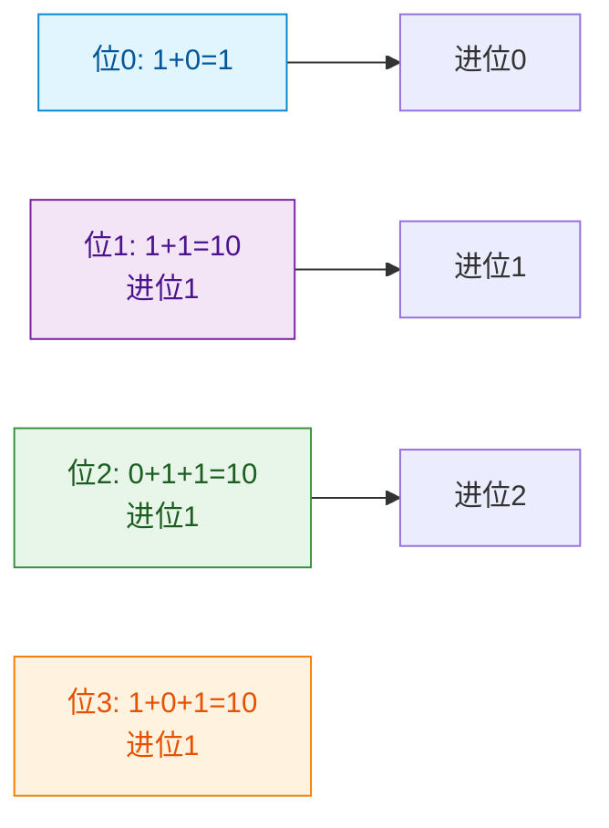
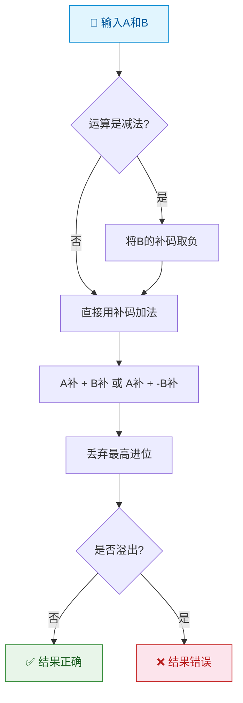
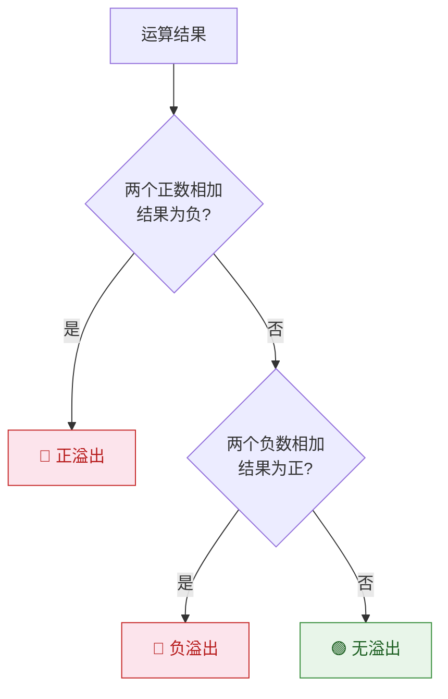

> 如果把二进制比作数字世界的算盘，那么补码就是这把算盘上的"借位珠"——它让减法变成加法，让正负号消融在统一的运算规则中，堪称数字电路最精妙的发明之一。

## 一、二进制加法

### 1.1 无符号二进制加法

规则与十进制加法类似，逢2进1：

| 被加数 | 加数 | 进位 | 和 |
|--------|------|------|-----|
| 0 | 0 | 0 | 0 |
| 0 | 1 | 0 | 1 |
| 1 | 0 | 0 | 1 |
| 1 | 1 | 1 | 0 |

**例1**：计算 $1011 + 0110$

```
  1 0 1 1
+ 0 1 1 0
---------
  1 0 0 0 1
```

### 1.2 多位加法的进位

从最低位开始，逐位相加，产生进位向高位传递。



## 二、有符号数的表示

### 2.1 三种表示法

| 表示法 | 正数 | 负数 | 特点 |
|--------|------|------|------|
| 原码 | 符号位0 + 绝对值 | 符号位1 + 绝对值 | 直观，但0有两种表示 |
| 反码 | 同原码 | 符号位1 + 绝对值按位取反 | 过渡表示 |
| 补码 | 同原码 | 反码 + 1 | 0唯一，减法变加法 |

**例2**：以4位二进制表示 +5 和 -5

| 表示法 | +5 | -5 |
|--------|-----|-----|
| 原码 | 0101 | 1101 |
| 反码 | 0101 | 1010 |
| 补码 | 0101 | 1011 |

::: important 补码的核心意义
补码使得减法运算可以转化为加法运算，计算机只需实现加法器即可完成加减法，极大简化了硬件设计。
:::

### 2.2 补码求法

**负数补码的两种求法**：

1. **反码加1法**：原码 → 符号位不变，其余位取反 → 加1
2. **按权展开法**：符号位权值为 $-2^{n-1}$，其余位权值正常

**例3**：求 -6 的8位补码

方法1：6的原码 00000110 → 取反 11111001 → 加1 → **11111010**

方法2：$-128 + 64 + 32 + 16 + 8 + 2 = -6$，所以补码为 **11111010**

### 2.3 补码的表示范围

| 位数 | 原码范围 | 补码范围 |
|------|---------|---------|
| 4 | -7~+7 | -8~+7 |
| 8 | -127~+127 | -128~+127 |
| n | $-(2^{n-1}-1) \sim +(2^{n-1}-1)$ | $-2^{n-1} \sim +(2^{n-1}-1)$ |

::: tip 补码的"多出一个"
n位补码比原码多表示一个负数：$-2^{n-1}$。这个数没有对应的原码和反码。例如8位补码10000000表示-128，但-128没有8位原码表示。
:::

## 三、补码加减法运算

### 3.1 补码加法

**规则**：连同符号位一起相加，符号位产生的进位丢弃。

$$[A+B]_补 = [A]_补 + [B]_补$$

**例4**：用8位补码计算 6 + (-3)

$[6]_补 = 00000110$，$[-3]_补 = 11111101$

```
  00000110
+ 11111101
----------
 100000011  → 丢弃最高进位 → 00000011 = 3 ✓
```

### 3.2 补码减法

**规则**：减法变加法，$A - B = A + (-B)$

$$[A-B]_补 = [A]_补 + [-B]_补$$

**例5**：用8位补码计算 5 - 9

$[5]_补 = 00000101$，$[-9]_补 = 11110111$

```
  00000101
+ 11110111
----------
 11111100 → 这是补码，求原码：取反加1 → 00000100 = -4 ✓
```

### 3.3 补码运算流程



## 四、溢出判断

### 4.1 什么是溢出

运算结果超出了补码所能表示的范围，称为溢出。溢出会导致结果错误。

**例6**：用4位补码计算 5 + 4

```
  0101  (+5)
+ 0100  (+4)
------
  1001  → 符号位为1，被解释为-7 ✗
```

两个正数相加得到负数，这就是溢出！

### 4.2 溢出判断方法

**方法一：双进位法**

观察符号位的进位 $C_s$ 和最高数值位的进位 $C_p$：

- $C_s \oplus C_p = 1$ → 溢出
- $C_s \oplus C_p = 0$ → 无溢出

**方法二：符号位观察法**

- 正 + 正 = 负 → 上溢（正溢出）
- 负 + 负 = 正 → 下溢（负溢出）
- 正 + 负 → 不可能溢出



### 4.3 溢出判断示例

**例7**：判断4位补码运算 $(-3) + (-6)$ 是否溢出。

$[-3]_补 = 1101$，$[-6]_补 = 1010$

```
  1101
+ 1010
------
 10111  → 丢弃进位 → 0111 = +7
```

两个负数相加得到正数，**负溢出**。

验证：$-3 + (-6) = -9$，超出了4位补码范围 $[-8, +7]$，确实溢出。

## 五、二进制乘法

### 5.1 乘法规则

| 被乘数 | 乘数 | 积 |
|--------|------|-----|
| 0 | 0 | 0 |
| 0 | 1 | 0 |
| 1 | 0 | 0 |
| 1 | 1 | 1 |

### 5.2 乘法运算过程

类似于十进制的竖式乘法，逐位相乘后左移，再相加。

**例8**：计算 $1011 \times 101$

```
      1 0 1 1    被乘数
    ×   1 0 1    乘数
    ---------
      1 0 1 1    ×1（第0位）
    0 0 0 0      ×0（第1位），左移1位
  1 0 1 1        ×1（第2位），左移2位
  ---------
  1 1 0 1 1 1
```

## 六、二进制除法

### 6.1 除法运算过程

类似于十进制的长除法，逐位试商。

**例9**：计算 $110111 ÷ 101$

```
        1 0 1 1     商
      ---------
1 0 1 / 1 1 0 1 1 1
        1 0 1
        -----
          1 1 1
          1 0 1
          -----
            1 0 1
            1 0 1
            -----
              0      余数
```

结果：$110111 ÷ 101 = 1011$，余数为 $0$

## 七、符号扩展

### 7.1 什么是符号扩展

将一个较小位数的补码扩展为较大位数时，需要在高位填充符号位（正数填0，负数填1）。

### 7.2 符号扩展规则

| 原补码 | 扩展后（8位） | 说明 |
|--------|-------------|------|
| 0101 (+5) | 00000101 | 正数，高位填0 |
| 1011 (-5) | 11111011 | 负数，高位填1 |

::: warning 符号扩展不是简单补零
负数的补码扩展时，高位必须填1，否则数值会改变！
例如：4位补码 1011 表示 -5，如果简单补0变成 00001011，则表示 +11，完全错误。
:::

---

## 练习题

### 练习1

用8位补码计算 $25 + (-18)$。

::: details 答案与解析

$[25]_补 = 00011001$

$[-18]_补$：18的原码 00010010 → 取反 11101101 → 加1 → 11101110

```
  00011001
+ 11101110
----------
 100000111 → 丢弃进位 → 00000111 = 7
```

验证：$25 + (-18) = 7$ ✓

:::

### 练习2

用4位补码计算 $5 + 6$，并判断是否溢出。

::: details 答案与解析

$[5]_补 = 0101$，$[6]_补 = 0110$

```
  0101
+ 0110
------
  1011 → 符号位为1，表示负数
```

两个正数相加结果为负，**正溢出**。

验证：$5 + 6 = 11$，超出4位补码范围 $[-8, +7]$，确实溢出。

:::

### 练习3

将8位补码 11110010 转换为十进制。

::: details 答案与解析

符号位为1，是负数。

方法1（取反加1）：11110010 → 取反 00001101 → 加1 00001110 = 14，所以原数为 **-14**

方法2（按权展开）：$-128 + 64 + 32 + 16 + 2 = -14$ ✓

:::

### 练习4

计算 $1101 \times 110$。

::: details 答案与解析

```
      1 1 0 1
    ×   1 1 0
    ---------
      0 0 0 0    ×0
    1 1 0 1      ×1，左移1位
  1 1 0 1        ×1，左移2位
  ---------
  1 0 0 1 1 1 0
```

验证：$1101 = 13$，$110 = 6$，$13 \times 6 = 78$，$1001110 = 64 + 8 + 4 + 2 = 78$ ✓

:::

### 练习5

将4位补码表示的 -7 扩展为8位。

::: details 答案与解析

$[-7]_{4位补码} = 1001$

因为是负数，符号扩展时高位填1：

$[-7]_{8位补码} = 11111001$

验证：$-128 + 64 + 32 + 16 + 8 + 1 = -7$ ✓

:::

---

::: tip 面试速查
- 补码核心作用：减法变加法，统一加减法运算
- 补码求法：原码取反加1（负数）
- 补码范围：n位补码表示 $-2^{n-1} \sim 2^{n-1}-1$
- 溢出判断：正+正=负（上溢），负+负=正（下溢），或 $C_s \oplus C_p = 1$
- 符号扩展：正数高位填0，负数高位填1
:::

::: info 原著参考
- 阎石《数字电子技术基础》第1章 1.4节
- 康华光《电子技术基础·数字部分》第1章 1.3节
- Floyd《Digital Fundamentals》Chapter 2
:::
