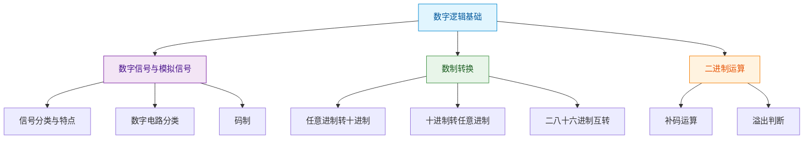

> 如果把数字电路比作一门语言，那么数字逻辑基础就是它的字母表和发音规则——不了解这些，你将无法读懂任何一句"电路之语"。

## 本章概览

本章介绍数字电路的基本概念，包括模拟信号与数字信号的区别、各种数制及其转换方法、二进制运算规则等。这些内容是后续学习逻辑代数和电路分析的基石。

## 本章文章

- [数字信号与模拟信号](01_数字信号与模拟信号.md)
- [数制转换](02_数制转换.md)
- [二进制运算](03_二进制运算.md)
