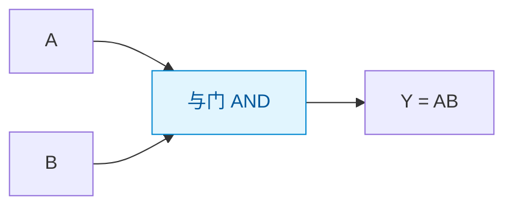
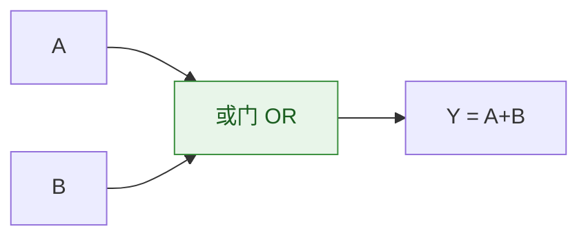
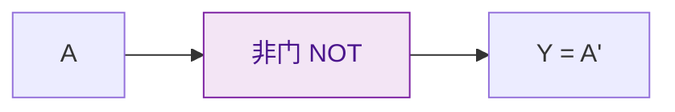
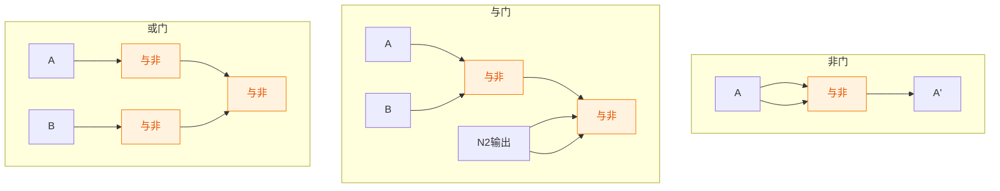
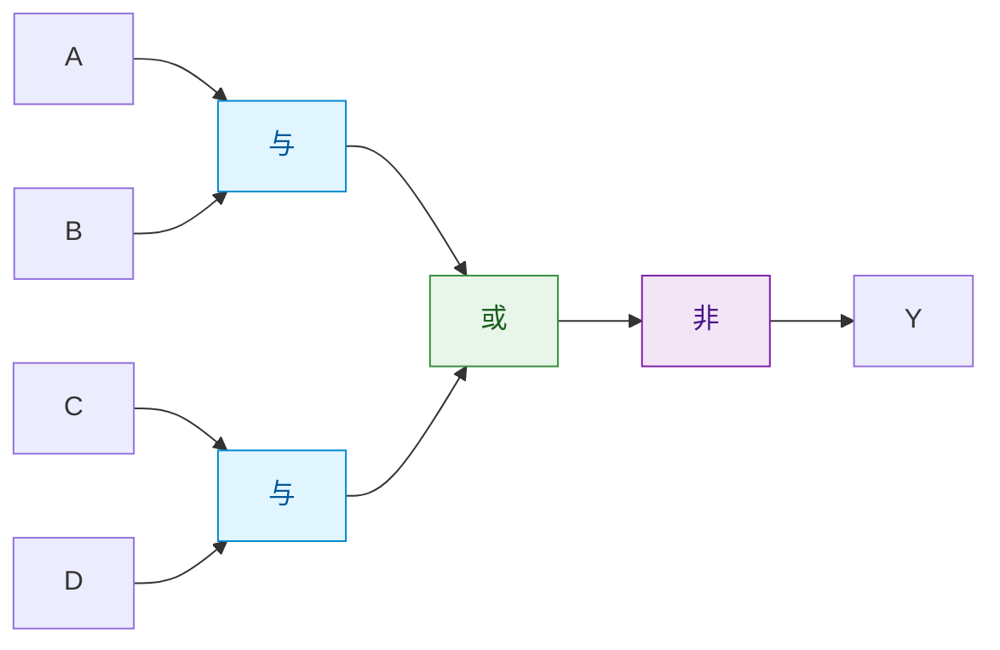
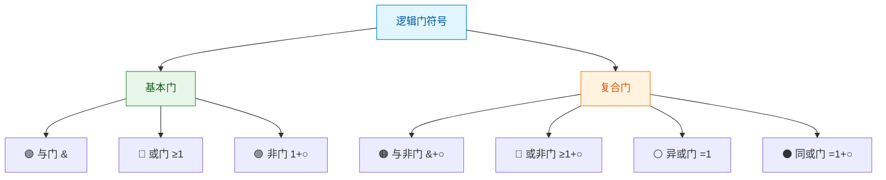

> 如果把数字电路比作一场精密的交响乐，那么与、或、非就是三种最基本的音符——它们各自简单，却能组合出无穷的逻辑旋律。

## 一、三种基本逻辑运算

### 1.1 与运算（AND）

**逻辑含义**：所有条件都满足时，结果才成立。"同真则真，有假则假"。

**逻辑表达式**：$Y = A \cdot B = AB$

**逻辑符号**：



**真值表**：

| A | B | Y = AB |
|---|---|--------|
| 0 | 0 | 0 |
| 0 | 1 | 0 |
| 1 | 0 | 0 |
| 1 | 1 | 1 |

**生活中的类比**：串联开关——两个开关同时闭合，灯才亮。

```verilog
// Verilog 与门
assign Y = A & B;
```

### 1.2 或运算（OR）

**逻辑含义**：任一条件满足，结果就成立。"有真则真，同假则假"。

**逻辑表达式**：$Y = A + B$

**逻辑符号**：



**真值表**：

| A | B | Y = A+B |
|---|---|---------|
| 0 | 0 | 0 |
| 0 | 1 | 1 |
| 1 | 0 | 1 |
| 1 | 1 | 1 |

**生活中的类比**：并联开关——任一开关闭合，灯就亮。

```verilog
// Verilog 或门
assign Y = A | B;
```

### 1.3 非运算（NOT）

**逻辑含义**：条件取反。"真变假，假变真"。

**逻辑表达式**：$Y = \overline{A}$ 或 $Y = A'$

**逻辑符号**：



**真值表**：

| A | Y = A' |
|---|--------|
| 0 | 1 |
| 1 | 0 |

```verilog
// Verilog 非门
assign Y = ~A;
```

### 1.4 三种基本运算对比

| 运算 | 表达式 | 口诀 | 逻辑含义 |
|------|--------|------|---------|
| 与 AND | $Y = AB$ | 同真则真 | 所有条件都满足 |
| 或 OR | $Y = A+B$ | 有真则真 | 任一条件满足 |
| 非 NOT | $Y = \overline{A}$ | 取反 | 条件取反 |

## 二、复合逻辑运算

### 2.1 与非运算（NAND）

**定义**：先与后非。$Y = \overline{AB}$

| A | B | AB | Y = $\overline{AB}$ |
|---|---|-----|-----|
| 0 | 0 | 0 | 1 |
| 0 | 1 | 0 | 1 |
| 1 | 0 | 0 | 1 |
| 1 | 1 | 1 | 0 |

::: important 与非门的特殊地位
与非门被称为**万能门**（Universal Gate），因为仅用与非门就可以实现与、或、非三种基本运算。同理，或非门也是万能门。
:::

**仅用与非门实现三种基本运算**：



```verilog
// Verilog 与非门
assign Y = ~(A & B);
```

### 2.2 或非运算（NOR）

**定义**：先或后非。$Y = \overline{A+B}$

| A | B | A+B | Y = $\overline{A+B}$ |
|---|---|-----|-----|
| 0 | 0 | 0 | 1 |
| 0 | 1 | 1 | 0 |
| 1 | 0 | 1 | 0 |
| 1 | 1 | 1 | 0 |

```verilog
// Verilog 或非门
assign Y = ~(A | B);
```

### 2.3 与或非运算（AND-OR-NOT）

**定义**：先与后或再非。$Y = \overline{AB + CD}$



```verilog
// Verilog 与或非
assign Y = ~(A & B | C & D);
```

### 2.4 异或运算（XOR）

**定义**：两输入不同时输出1，相同时输出0。$Y = A \oplus B = \overline{A}B + A\overline{B}$

| A | B | Y = A⊕B |
|---|---|---------|
| 0 | 0 | 0 |
| 0 | 1 | 1 |
| 1 | 0 | 1 |
| 1 | 1 | 0 |

::: tip 异或的记忆
**异**或——"**异**则1，**同**则0"。两输入相异输出1，相同输出0。
:::

**异或的重要性质**：

1. $A \oplus 0 = A$（与0异或，不变）
2. $A \oplus 1 = \overline{A}$（与1异或，取反）
3. $A \oplus A = 0$（自异或为0）
4. 交换律、结合律成立

```verilog
// Verilog 异或门
assign Y = A ^ B;
```

### 2.5 同或运算（XNOR）

**定义**：两输入相同时输出1，不同时输出0。$Y = A \odot B = \overline{A \oplus B} = AB + \overline{A}\overline{B}$

| A | B | Y = A⊙B |
|---|---|---------|
| 0 | 0 | 1 |
| 0 | 1 | 0 |
| 1 | 0 | 0 |
| 1 | 1 | 1 |

::: tip 同或的记忆
**同**或——"**同**则1，**异**则0"。与异或互为反运算。
:::

```verilog
// Verilog 同或门
assign Y = A ~^ B;  // 或 assign Y = ~(A ^ B);
```

### 2.6 复合运算对比

| 运算 | 表达式 | 特征 | 记忆口诀 |
|------|--------|------|---------|
| 与非 NAND | $\overline{AB}$ | 全1出0 | 有0出1，全1出0 |
| 或非 NOR | $\overline{A+B}$ | 全0出1 | 有1出0，全0出1 |
| 与或非 AOI | $\overline{AB+CD}$ | 先与后或再非 | — |
| 异或 XOR | $A \oplus B$ | 异出1 | 异则1，同则0 |
| 同或 XNOR | $A \odot B$ | 同出1 | 同则1，异则0 |

## 三、逻辑符号

### 3.1 国标符号与美标符号

逻辑门电路的符号有国标（中国标准GB/T）和美标（ANSI/IEEE）两种常见表示。

| 逻辑门 | 国标符号特点 | 美标符号特点 |
|--------|-------------|-------------|
| 与门 | 方框内 & | 类D形 |
| 或门 | 方框内 ≥1 | 类盾形 |
| 非门 | 方框后小圆圈 | 三角形+小圆圈 |
| 与非门 | 与门+小圆圈 | D形+小圆圈 |
| 或非门 | 或门+小圆圈 | 盾形+小圆圈 |
| 异或门 | 方框内 =1 | 类盾形+异或线 |

::: info 国标符号中的标记
- **&**：与运算
- **≥1**：或运算（输入≥1时输出1）
- **=1**：异或运算（输入恰好=1时输出1）
- **1**：缓冲/非运算
- 小圆圈表示取反
:::

### 3.2 常用逻辑门电路符号一览



### 3.3 正逻辑与负逻辑

- **正逻辑**：高电平 = 1，低电平 = 0（最常用）
- **负逻辑**：高电平 = 0，低电平 = 1

::: warning 正负逻辑的转换
同一个电路，采用正逻辑是"与门"，采用负逻辑可能变成"或门"。正逻辑的与非门 = 负逻辑的或非门。这就是**对偶关系**的物理体现。
:::

---

## 练习题

### 练习1

写出三输入与门 $Y = ABC$ 的真值表。

::: details 答案与解析

| A | B | C | Y = ABC |
|---|---|---|---------|
| 0 | 0 | 0 | 0 |
| 0 | 0 | 1 | 0 |
| 0 | 1 | 0 | 0 |
| 0 | 1 | 1 | 0 |
| 1 | 0 | 0 | 0 |
| 1 | 0 | 1 | 0 |
| 1 | 1 | 0 | 0 |
| 1 | 1 | 1 | 1 |

只有当 A、B、C 全为 1 时，输出才为 1。

:::

### 练习2

证明仅用与非门可以实现或运算 $Y = A + B$。

::: details 答案与解析

根据德摩根定律：$A + B = \overline{\overline{A} \cdot \overline{B}}$

实现方法：
1. 用与非门实现非门：$A$ 两端接入与非门 → $\overline{A \cdot A} = \overline{A}$
2. 同理 $B$ → $\overline{B}$
3. 将 $\overline{A}$ 和 $\overline{B}$ 接入与非门 → $\overline{\overline{A} \cdot \overline{B}} = A + B$

```verilog
// 仅用与非门实现或门
wire na = ~(A & A);  // 等价于 ~A
wire nb = ~(B & B);  // 等价于 ~B
assign Y = ~(na & nb);  // 等价于 A | B
```

:::

### 练习3

已知 $A = 1$，$B = 0$，$C = 1$，求下列逻辑表达式的值：

(1) $Y_1 = \overline{AB}$
(2) $Y_2 = A \oplus B$
(3) $Y_3 = \overline{A + C}$
(4) $Y_4 = A \odot C$

::: details 答案与解析

(1) $Y_1 = \overline{1 \cdot 0} = \overline{0} = 1$

(2) $Y_2 = 1 \oplus 0 = 1$（异则1）

(3) $Y_3 = \overline{1 + 1} = \overline{1} = 0$

(4) $Y_4 = 1 \odot 1 = 1$（同则1）

:::

---

::: tip 面试速查
- 三种基本运算：与（同真则真）、或（有真则真）、非（取反）
- 与非门/或非门是万能门，可替代所有基本门
- 异或：异则1，同则0；同或：同则1，异则0
- 异或性质：$A \oplus 0 = A$，$A \oplus 1 = \overline{A}$，$A \oplus A = 0$
- 国标符号：&（与）、≥1（或）、=1（异或）、○（取反）
:::

::: info 原著参考
- 阎石《数字电子技术基础》第2章 2.1节
- 康华光《电子技术基础·数字部分》第2章 2.1节
- Floyd《Digital Fundamentals》Chapter 3
:::
