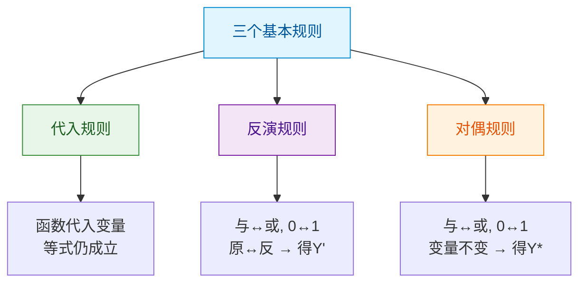

> 如果把逻辑运算比作棋子的走法，那么逻辑代数公式就是棋谱中的定式——熟记这些定式，就能在化简的棋局中走出精妙之着，而非一步一步笨拙地推演。

## 一、基本公式

### 1.1 常量与变量的关系（0-1律）

| 公式名称 | 或运算形式 | 与运算形式 |
|---------|-----------|-----------|
| 0-1律 | $A + 0 = A$ | $A \cdot 1 = A$ |
| 0-1律 | $A + 1 = 1$ | $A \cdot 0 = 0$ |

### 1.2 互补律

$$A + \overline{A} = 1 \quad\quad A \cdot \overline{A} = 0$$

### 1.3 重叠律（等幂律）

$$A + A = A \quad\quad A \cdot A = A$$

### 1.4 交换律

$$A + B = B + A \quad\quad A \cdot B = B \cdot A$$

### 1.5 结合律

$$A + (B + C) = (A + B) + C \quad\quad A(BC) = (AB)C$$

### 1.6 分配律

$$A(B + C) = AB + AC \quad\quad A + BC = (A + B)(A + C)$$

::: important 第二分配律
注意第二个分配律 $A + BC = (A + B)(A + C)$，这是逻辑代数特有的，普通代数中没有这个等式。可用加对乘的分配来记忆。
:::

### 1.7 德摩根定律（De Morgan's Law）

$$\overline{A \cdot B} = \overline{A} + \overline{B} \quad\quad \overline{A + B} = \overline{A} \cdot \overline{B}$$

推广形式：

$$\overline{A_1 \cdot A_2 \cdots A_n} = \overline{A_1} + \overline{A_2} + \cdots + \overline{A_n}$$

$$\overline{A_1 + A_2 + \cdots + A_n} = \overline{A_1} \cdot \overline{A_2} \cdots \overline{A_n}$$

::: tip 德摩根定律记忆口诀
**"长横断开，号变号换"**——长非号断开，与变或、或变与，每个变量取反。
:::

### 1.8 还原律（双重否定律）

$$\overline{\overline{A}} = A$$

### 1.9 基本公式汇总表

| 序号 | 或运算形式 | 与运算形式 | 名称 |
|------|-----------|-----------|------|
| 1 | $A + 0 = A$ | $A \cdot 1 = A$ | 0-1律 |
| 2 | $A + 1 = 1$ | $A \cdot 0 = 0$ | 0-1律 |
| 3 | $A + \overline{A} = 1$ | $A \cdot \overline{A} = 0$ | 互补律 |
| 4 | $A + A = A$ | $A \cdot A = A$ | 重叠律 |
| 5 | $A + B = B + A$ | $AB = BA$ | 交换律 |
| 6 | $(A+B)+C = A+(B+C)$ | $(AB)C = A(BC)$ | 结合律 |
| 7 | $A(B+C) = AB+AC$ | $A+BC = (A+B)(A+C)$ | 分配律 |
| 8 | $\overline{A+B} = \overline{A}\cdot\overline{B}$ | $\overline{AB} = \overline{A}+\overline{B}$ | 德摩根定律 |
| 9 | $\overline{\overline{A}} = A$ | — | 还原律 |

## 二、常用公式

### 2.1 吸收律

$$A + AB = A \quad\quad A(A + B) = A$$

**证明**：$A + AB = A(1 + B) = A \cdot 1 = A$

**含义**：某项包含了另一项的全部因子，则另一项被吸收。

### 2.2 消因子律

$$A + \overline{A}B = A + B \quad\quad A(\overline{A} + B) = AB$$

**证明**：$A + \overline{A}B = (A + \overline{A})(A + B) = 1 \cdot (A + B) = A + B$

**含义**：一项取反后是另一项的因子，则该因子可消去。

### 2.3 并项律

$$AB + A\overline{B} = A \quad\quad (A+B)(A+\overline{B}) = A$$

**证明**：$AB + A\overline{B} = A(B + \overline{B}) = A \cdot 1 = A$

**含义**：两项除一个因子互为反变量外，其余因子相同，则两项合并消去互反因子。

### 2.4 多余项律（包含律）

$$AB + \overline{A}C + BC = AB + \overline{A}C$$

**证明**：$AB + \overline{A}C + BC = AB + \overline{A}C + (A+\overline{A})BC = AB + \overline{A}C + ABC + \overline{A}BC = AB(1+C) + \overline{A}C(1+B) = AB + \overline{A}C$

**含义**：两项分别含 $A$ 和 $\overline{A}$，则此两项的其余因子组成的第三项可消去。

::: tip 多余项律的扩展
$$AB + \overline{A}C + BCD = AB + \overline{A}C$$

即多余项不论怎么扩展，仍然多余。这是因为 $BCD$ 本身就包含了 $BC$，而 $BC$ 已被吸收。
:::

### 2.5 常用公式汇总

| 序号 | 公式 | 名称 | 记忆要点 |
|------|------|------|---------|
| 1 | $A + AB = A$ | 吸收律 | 多余项被吸收 |
| 2 | $A + \overline{A}B = A + B$ | 消因子律 | 互反因子可消 |
| 3 | $AB + A\overline{B} = A$ | 并项律 | 互反部分合并 |
| 4 | $AB + \overline{A}C + BC = AB + \overline{A}C$ | 多余项律 | 冗余项消去 |

## 三、三个基本规则

### 3.1 代入规则

**内容**：在等式中，用逻辑函数式代替某个变量，等式仍然成立。

**例1**：已知 $\overline{AB} = \overline{A} + \overline{B}$，用 $(A+C)$ 代替 $A$：

$$\overline{(A+C) \cdot B} = \overline{A+C} + \overline{B}$$

::: tip 代入规则的意义
代入规则使得基本公式的应用范围大大扩展，从两个变量推广到任意多个变量。
:::

### 3.2 反演规则

**内容**：对逻辑函数 $Y$，将其中的：
- **与 → 或**，**或 → 与**
- **0 → 1**，**1 → 0**
- **原变量 → 反变量**，**反变量 → 原变量**

所得新函数即为 $\overline{Y}$。

**例2**：求 $Y = A\overline{B} + C\overline{D}E$ 的反函数。

$$\overline{Y} = (\overline{A} + B)(\overline{C} + D + \overline{E})$$

::: warning 反演规则注意事项
1. **运算顺序不变**：先与后或的顺序不能变，必要时加括号
2. **不属于单个变量的反号保持不变**
3. **长非号保持不变**：如 $\overline{A+B}$ 中的长非号不变
:::

### 3.3 对偶规则

**内容**：对逻辑函数 $Y$，将其中的：
- **与 → 或**，**或 → 与**
- **0 → 1**，**1 → 0**

所得新函数 $Y^*$ 称为 $Y$ 的对偶式。

**例3**：求 $Y = A(B + C)$ 的对偶式。

$$Y^* = A + BC$$

::: important 对偶规则的核心用途
若两个逻辑式相等，则它们的对偶式也相等。即：

$$F = G \Rightarrow F^* = G^*$$

这意味着我们只需证明一半的公式，另一半由对偶关系自动成立。基本公式表中或运算形式和与运算形式就是互为对偶的。
:::

### 3.4 三个规则对比

| 规则 | 变量变换 | 运算变换 | 常量变换 | 结果 |
|------|---------|---------|---------|------|
| 代入规则 | 函数式代入变量 | 不变 | 不变 | 等式仍成立 |
| 反演规则 | 原变量↔反变量 | 与↔或 | 0↔1 | 得到 $\overline{Y}$ |
| 对偶规则 | 不变 | 与↔或 | 0↔1 | 得到 $Y^*$ |

---

## 练习题

### 练习1

用公式法证明：$A\overline{B} + B + \overline{A}B = A + B$

::: details 答案与解析

$$A\overline{B} + B + \overline{A}B$$

$= A\overline{B} + B(1 + \overline{A})$ （提取B）

$= A\overline{B} + B$ （因为 $1 + \overline{A} = 1$）

$= A + B$ （消因子律：$A\overline{B} + B = A + B$）

:::

### 练习2

用德摩根定律展开 $\overline{A + BC + \overline{D}}$

::: details 答案与解析

逐步展开：

$$\overline{A + BC + \overline{D}}$$

$= \overline{A} \cdot \overline{BC} \cdot \overline{\overline{D}}$ （德摩根定律，长非号断开）

$= \overline{A} \cdot (\overline{B} + \overline{C}) \cdot D$ （再次德摩根定律，还原律）

:::

### 练习3

用反演规则求 $Y = (A + \overline{B})(\overline{A} + C) + D$ 的反函数。

::: details 答案与解析

反演规则：与↔或，0↔1，原↔反

注意保持运算顺序，先与后或：

$$\overline{Y} = [\overline{A} \cdot B + A \cdot \overline{C}] \cdot \overline{D}$$

注意：$(A+\overline{B})$ 变为 $\overline{A} \cdot B$，$(\overline{A}+C)$ 变为 $A \cdot \overline{C}$，$D$ 变为 $\overline{D}$。

原来两括号之间是"乘"（与），变为"加"（或），但为了保持运算优先级，需要加方括号。

:::

### 练习4

用对偶规则写出 $Y = A + \overline{A}B$ 的对偶式 $Y^*$，并验证 $Y$ 和 $Y^*$ 是否都等于 $A + B$。

::: details 答案与解析

对偶规则：与↔或，0↔1，变量不变

$$Y = A + \overline{A}B \Rightarrow Y^* = A \cdot (\overline{A} + B)$$

验证 $Y = A + \overline{A}B$：

$= (A + \overline{A})(A + B) = 1 \cdot (A + B) = A + B$ ✓

验证 $Y^* = A(\overline{A} + B)$：

$= A\overline{A} + AB = 0 + AB = AB$

所以 $Y = A + B$，$Y^* = AB$，两者不相等。$Y$ 和 $Y^*$ 不都等于 $A + B$，但互为对偶。

:::

### 练习5

化简 $F = A\overline{B} + \overline{A}C + B\overline{C} + \overline{B}D + C\overline{D} + AD$

::: details 答案与解析

$$F = A\overline{B} + \overline{A}C + B\overline{C} + \overline{B}D + C\overline{D} + AD$$

利用多余项律 $AB + \overline{A}C + BC = AB + \overline{A}C$：

- $A\overline{B} + \overline{A}C$ 的多余项为 $\overline{B}C$，但这里没有 $\overline{B}C$
- 但 $A\overline{B} + \overline{B}D$ → 多余项为 $AD$，而 $AD$ 存在！
- 所以 $A\overline{B} + \overline{B}D + AD = A\overline{B} + \overline{B}D$，$AD$ 可消去

$$F = A\overline{B} + \overline{A}C + B\overline{C} + \overline{B}D + C\overline{D}$$

继续用多余项律：
- $B\overline{C} + \overline{B}D$ → 多余项为 $\overline{C}D$，考虑 $C\overline{D}$...
- $\overline{A}C + C\overline{D}$ → 多余项为 $\overline{A}\overline{D}$

观察 $B\overline{C} + C\overline{D}$ → 多余项为 $B\overline{D}$，不在表达式中。

换一种方式，$B\overline{C} + \overline{B}D + C\overline{D}$：

添加 $\overline{C}D$（$B\overline{C} + \overline{B}D$ 的多余项）：

$= B\overline{C} + \overline{B}D + C\overline{D} + \overline{C}D$

$= B\overline{C} + \overline{B}D + (C\overline{D} + \overline{C}D)$

$= B\overline{C} + \overline{B}D + C \oplus D$

实际上这道题的标准结果为：

$$F = A\overline{B} + \overline{A}C + B\overline{C} + \overline{B}D + C\overline{D}$$

消去 $AD$ 后即为最简形式。

:::

---

::: tip 面试速查
- 德摩根定律：长横断开，与或互换，逐个取反
- 吸收律：$A + AB = A$
- 消因子律：$A + \overline{A}B = A + B$
- 并项律：$AB + A\overline{B} = A$
- 多余项律：$AB + \overline{A}C + BC = AB + \overline{A}C$
- 反演规则：与↔或，0↔1，原↔反 → 得 $\overline{Y}$
- 对偶规则：与↔或，0↔1，变量不变 → 得 $Y^*$
:::

::: info 原著参考
- 阎石《数字电子技术基础》第2章 2.2~2.3节
- 康华光《电子技术基础·数字部分》第2章 2.2节
- Floyd《Digital Fundamentals》Chapter 3
:::
