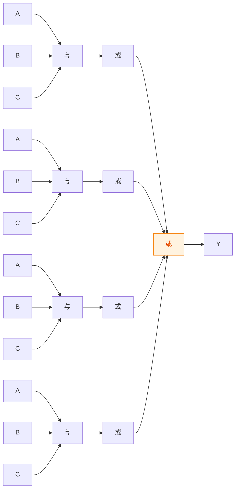
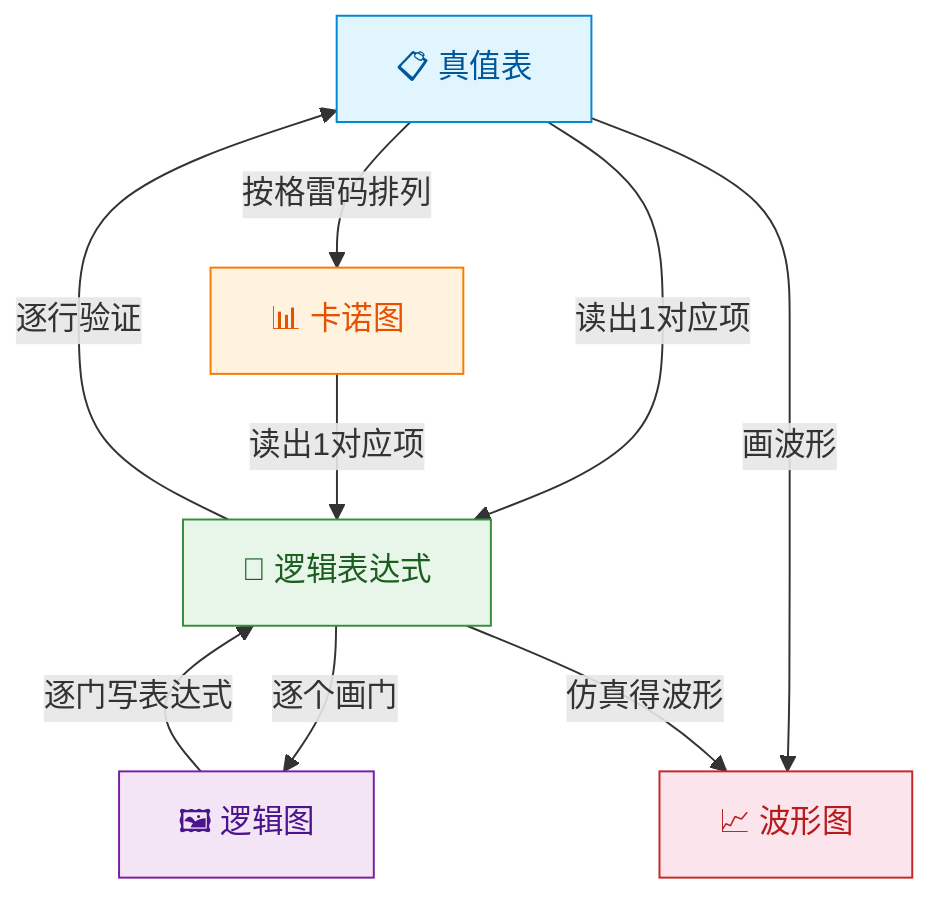
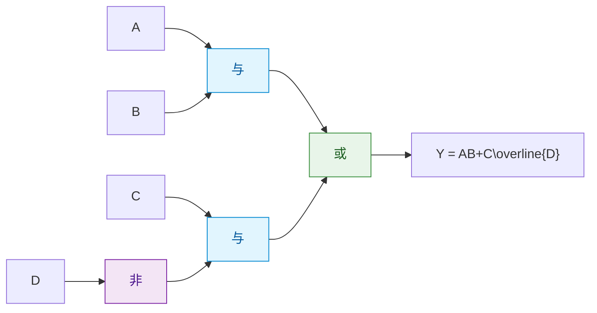
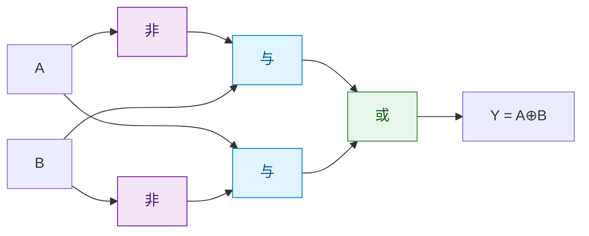

> 如果把逻辑函数比作一首诗，那么真值表是诗的译文、逻辑表达式是诗的原文、逻辑图是诗的配画、卡诺图是诗的图谱、波形图是诗的乐谱——五种形式，同一个灵魂。

## 一、五种表示方法

### 1.1 真值表

**定义**：将输入变量的所有取值组合与对应的输出值列成表格。

**特点**：
- 唯一确定一个逻辑函数
- 直观，但变量多时规模庞大（n个变量有 $2^n$ 行）

**示例**：三人表决器真值表（多数同意则通过）

| A | B | C | Y |
|---|---|---|---|
| 0 | 0 | 0 | 0 |
| 0 | 0 | 1 | 0 |
| 0 | 1 | 0 | 0 |
| 0 | 1 | 1 | 1 |
| 1 | 0 | 0 | 0 |
| 1 | 0 | 1 | 1 |
| 1 | 1 | 0 | 1 |
| 1 | 1 | 1 | 1 |

### 1.2 逻辑表达式

**定义**：用逻辑运算符连接变量构成的表达式。

**示例**：三人表决器的逻辑表达式

$$Y = \overline{A}BC + A\overline{B}C + AB\overline{C} + ABC$$

**特点**：
- 形式不唯一（同一函数可有多种表达式）
- 便于用公式法化简
- 是电路设计的直接依据

### 1.3 逻辑图

**定义**：用逻辑符号连接而成的电路图。

**示例**：三人表决器的逻辑图



**特点**：
- 接近实际电路
- 与逻辑表达式一一对应
- 但化简前后逻辑图不同

```verilog
// 三人表决器 Verilog 实现
assign Y = (A & B) | (A & C) | (B & C);
```

### 1.4 卡诺图

**定义**：将真值表按照格雷码排列规则排列成的方格图。

**特点**：
- 几何相邻对应逻辑相邻（仅1位不同）
- 直观地用于化简
- 变量多时不适用（一般不超过4~5变量）

（卡诺图的详细用法见下一章"逻辑函数的化简"）

### 1.5 波形图

**定义**：以时间为横轴，画出输入输出信号随时间变化的波形。

**特点**：
- 体现信号的时序关系
- 用于电路仿真验证
- 直观展示动态行为

## 二、表示方法之间的转换

### 2.1 转换关系图



### 2.2 真值表 → 逻辑表达式

**方法**：
1. 找出输出为1的所有行
2. 对每行，输入为1的取原变量，为0的取反变量，相乘得到一个乘积项
3. 所有乘积项相加

**示例**（三人表决器）：

| 输出为1的行 | 乘积项 |
|------------|--------|
| A=0, B=1, C=1 | $\overline{A}BC$ |
| A=1, B=0, C=1 | $A\overline{B}C$ |
| A=1, B=1, C=0 | $AB\overline{C}$ |
| A=1, B=1, C=1 | $ABC$ |

$$Y = \overline{A}BC + A\overline{B}C + AB\overline{C} + ABC$$

### 2.3 逻辑表达式 → 真值表

**方法**：
1. 列出所有输入组合
2. 将每组取值代入表达式计算输出

### 2.4 逻辑表达式 → 逻辑图

**方法**：逐层用逻辑门实现运算。

**示例**：$Y = AB + C\overline{D}$



## 三、最小项与最大项

### 3.1 最小项（Minterm）

**定义**：在 n 个变量的逻辑函数中，包含所有变量的乘积项，其中每个变量以原变量或反变量形式出现且仅出现一次。

n 个变量共有 $2^n$ 个最小项。

**三变量最小项**：

| 十进制 | A | B | C | 最小项 | 编号 $m_i$ |
|--------|---|---|---|--------|-----------|
| 0 | 0 | 0 | 0 | $\overline{A}\overline{B}\overline{C}$ | $m_0$ |
| 1 | 0 | 0 | 1 | $\overline{A}\overline{B}C$ | $m_1$ |
| 2 | 0 | 1 | 0 | $\overline{A}B\overline{C}$ | $m_2$ |
| 3 | 0 | 1 | 1 | $\overline{A}BC$ | $m_3$ |
| 4 | 1 | 0 | 0 | $A\overline{B}\overline{C}$ | $m_4$ |
| 5 | 1 | 0 | 1 | $A\overline{B}C$ | $m_5$ |
| 6 | 1 | 1 | 0 | $AB\overline{C}$ | $m_6$ |
| 7 | 1 | 1 | 1 | $ABC$ | $m_7$ |

::: tip 最小项的三个重要性质
1. **唯一性**：每个最小项只有一组取值使其为1
2. **完备性**：任意两个不同最小项的乘积为0
3. **全体性**：所有最小项之和为1
:::

### 3.2 最大项（Maxterm）

**定义**：在 n 个变量的逻辑函数中，包含所有变量的和项，其中每个变量以原变量或反变量形式出现且仅出现一次。

**三变量最大项**：

| 十进制 | A | B | C | 最大项 | 编号 $M_i$ |
|--------|---|---|---|--------|-----------|
| 0 | 0 | 0 | 0 | $A+B+C$ | $M_0$ |
| 1 | 0 | 0 | 1 | $A+B+\overline{C}$ | $M_1$ |
| 2 | 0 | 1 | 0 | $A+\overline{B}+C$ | $M_2$ |
| 3 | 0 | 1 | 1 | $A+\overline{B}+\overline{C}$ | $M_3$ |
| 4 | 1 | 0 | 0 | $\overline{A}+B+C$ | $M_4$ |
| 5 | 1 | 0 | 1 | $\overline{A}+B+\overline{C}$ | $M_5$ |
| 6 | 1 | 1 | 0 | $\overline{A}+\overline{B}+C$ | $M_6$ |
| 7 | 1 | 1 | 1 | $\overline{A}+\overline{B}+\overline{C}$ | $M_7$ |

::: warning 最小项与最大项的对应关系
编号相同的最小项和最大项互为反函数：

$$m_i = \overline{M_i} \quad\quad M_i = \overline{m_i}$$

注意：最小项中0对应反变量，1对应原变量；最大项恰好相反，0对应原变量，1对应反变量。
:::

### 3.3 最小项与最大项对比

| 对比项 | 最小项 | 最大项 |
|--------|--------|--------|
| 形式 | 乘积项（与项） | 和项（或项） |
| 变量出现 | 每个变量出现一次 | 每个变量出现一次 |
| 使其为1的取值 | 唯一 | — |
| 使其为0的取值 | — | 唯一 |
| 性质 | 不同最小项之积为0 | 不同最大项之和为1 |
| 全体求和/积 | 全体之和为1 | 全体之积为0 |

## 四、标准与或式与标准或与式

### 4.1 标准与或式（标准积之和式）

**定义**：由最小项之和构成的逻辑表达式。

$$Y = \sum m_i$$

**示例**：三人表决器

$$Y = m_3 + m_5 + m_6 + m_7 = \sum m(3,5,6,7)$$

### 4.2 标准或与式（标准和之积式）

**定义**：由最大项之积构成的逻辑表达式。

$$Y = \prod M_j$$

**示例**：三人表决器

$$Y = M_0 \cdot M_1 \cdot M_2 \cdot M_4 = \prod M(0,1,2,4)$$

### 4.3 两种标准式的转换

**关键关系**：若标准与或式取最小项集合为 $\{m_i\}$，则标准或与式取最大项集合为 $\{M_j\}$，其中 $j$ 是 $i$ 的补集。

$$\sum m(i_1, i_2, \ldots) = \prod M(j_1, j_2, \ldots)$$

其中 $\{j_1, j_2, \ldots\}$ 是 $\{0, 1, \ldots, 2^n-1\}$ 中除去 $\{i_1, i_2, \ldots\}$ 的集合。

**示例**：三人表决器

$Y = \sum m(3,5,6,7) = \prod M(0,1,2,4)$

---

## 练习题

### 练习1

将逻辑函数 $Y = AB + AC$ 转换为标准与或式。

::: details 答案与解析

补齐缺失变量：

$AB = AB(C + \overline{C}) = ABC + AB\overline{C} = m_7 + m_6$

$AC = A(B + \overline{B})C = ABC + A\overline{B}C = m_7 + m_5$

$Y = m_5 + m_6 + m_7 = \sum m(5,6,7)$

注意：$m_7$ 出现两次，但 $m_7 + m_7 = m_7$（重叠律）。

:::

### 练习2

根据以下真值表，写出标准与或式和标准或与式。

| A | B | Y |
|---|---|---|
| 0 | 0 | 1 |
| 0 | 1 | 0 |
| 1 | 0 | 0 |
| 1 | 1 | 1 |

::: details 答案与解析

**标准与或式**（Y=1的行对应最小项）：

行0：$A=0, B=0$ → $\overline{A}\overline{B} = m_0$

行3：$A=1, B=1$ → $AB = m_3$

$$Y = m_0 + m_3 = \sum m(0,3)$$

**标准或与式**（Y=0的行对应最大项）：

行1：$A=0, B=1$ → $A + \overline{B} = M_1$

行2：$A=1, B=0$ → $\overline{A} + B = M_2$

$$Y = M_1 \cdot M_2 = \prod M(1,2)$$

验证：$\sum m(0,3) = \prod M(1,2)$，最小项集合 $\{0,3\}$ 与最大项集合 $\{1,2\}$ 互为补集。✓

:::

### 练习3

画出 $Y = A\overline{B} + \overline{A}B$ 的逻辑图。

::: details 答案与解析

这是异或运算 $Y = A \oplus B$。



```verilog
assign Y = (A & ~B) | (~A & B);  // 等价于 A ^ B
```

:::

---

::: tip 面试速查
- 五种表示法：真值表、逻辑表达式、逻辑图、卡诺图、波形图
- 真值表→表达式：找Y=1的行，原反变量相乘后相加
- 最小项：含所有变量的乘积项，编号下0反1原
- 最大项：含所有变量的和项，编号下0原1反
- $m_i$ 与 $M_i$ 互为反函数
- 标准与或式 $= \sum m$，标准或与式 $= \prod M$，二者互补
:::

::: info 原著参考
- 阎石《数字电子技术基础》第2章 2.4~2.5节
- 康华光《电子技术基础·数字部分》第2章 2.3节
- Floyd《Digital Fundamentals》Chapter 4
:::
