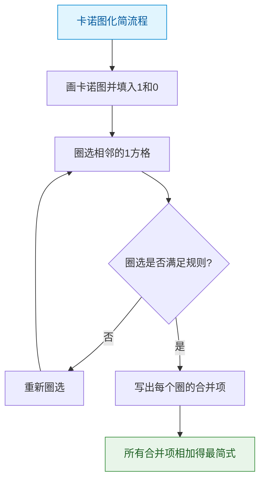
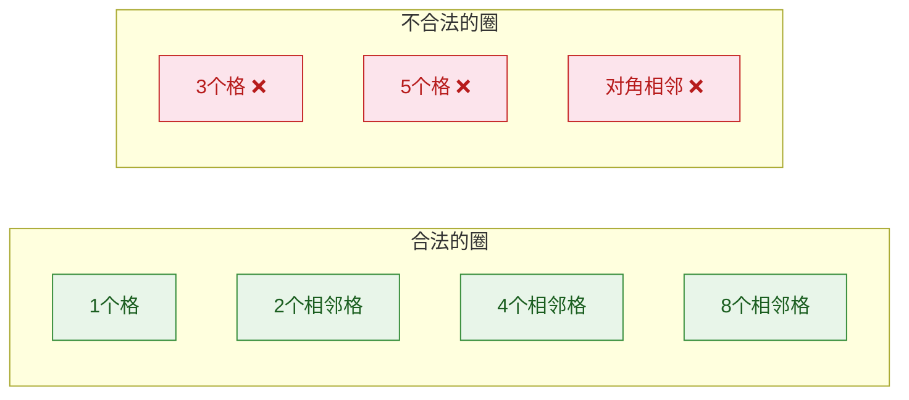

> 如果把逻辑函数比作一块璞玉，那么化简就是雕刻师的凿刀——去除冗余的石料，让最简洁的逻辑之美显露出来。化简后的电路门数更少、速度更快、成本更低。

## 一、公式化简法

### 1.1 并项法

**原理**：利用 $AB + A\overline{B} = A$，将两项合并为一项。

**例1**：化简 $Y = A\overline{B}C + A\overline{B}\overline{C}$

$$Y = A\overline{B}(C + \overline{C}) = A\overline{B} \cdot 1 = A\overline{B}$$

### 1.2 吸收法

**原理**：利用 $A + AB = A$，吸收多余项。

**例2**：化简 $Y = \overline{A}B + \overline{A}BCD$

$$Y = \overline{A}B(1 + CD) = \overline{A}B$$

### 1.3 消去法

**原理**：利用 $A + \overline{A}B = A + B$，消去多余因子。

**例3**：化简 $Y = AB + \overline{A}C + \overline{B}C$

$$Y = AB + (\overline{A} + \overline{B})C = AB + \overline{AB} \cdot C = AB + C$$

### 1.4 配项法

**原理**：利用 $A = A(B + \overline{B})$ 展开后再合并。

**例4**：化简 $Y = A\overline{B} + \overline{A}B + B\overline{C} + \overline{B}C$

$$Y = A\overline{B} + \overline{A}B(C + \overline{C}) + B\overline{C} + \overline{B}C(A + \overline{A})$$

$= A\overline{B} + \overline{A}BC + \overline{A}B\overline{C} + B\overline{C} + A\overline{B}C + \overline{A}\overline{B}C$

$= A\overline{B}(1 + C) + \overline{A}C(B + \overline{B}) + B\overline{C}(\overline{A} + 1)$

$= A\overline{B} + \overline{A}C + B\overline{C}$

### 1.5 公式化简法小结

| 方法 | 利用公式 | 核心操作 |
|------|---------|---------|
| 并项法 | $AB + A\overline{B} = A$ | 合并同类项 |
| 吸收法 | $A + AB = A$ | 吸收多余项 |
| 消去法 | $A + \overline{A}B = A + B$ | 消去互反因子 |
| 配项法 | $A = A(B + \overline{B})$ | 展开后再合并 |

::: warning 公式化简法的局限
公式化简法没有固定步骤，依赖经验和对公式的熟练程度。不同人可能化简出不同结果，难以判断是否已达最简。因此，对于3~4变量的函数，卡诺图化简法更为可靠。
:::

## 二、卡诺图化简法

### 2.1 卡诺图的构成

卡诺图是将真值表按照**格雷码**排列规则重新排列的方格图，使得**几何相邻**的方格对应的取值**逻辑相邻**（仅1位不同）。

### 2.2 二变量卡诺图

```
         B
     0    1
   +----+----+
A=0 | m0 | m1 |
   +----+----+
A=1 | m2 | m3 |
   +----+----+
```

| 格 | 对应最小项 | 取值 |
|----|----------|------|
| m0 | $\overline{A}\overline{B}$ | 00 |
| m1 | $\overline{A}B$ | 01 |
| m2 | $A\overline{B}$ | 10 |
| m3 | $AB$ | 11 |

### 2.3 三变量卡诺图

```
          BC
     00  01  11  10    ← 格雷码排列
   +----+----+----+----+
A=0 | m0 | m1 | m3 | m2 |
   +----+----+----+----+
A=1 | m4 | m5 | m7 | m6 |
   +----+----+----+----+
```

::: important 卡诺图的相邻性
卡诺图中的**相邻**不仅指上下左右相邻，还包括：
- **行首与行尾**相邻（上下卷绕）
- **列首与列尾**相邻（左右卷绕）

这是因为格雷码的循环特性。
:::

### 2.4 四变量卡诺图

```
           CD
     00  01  11  10    ← 格雷码
   +----+----+----+----+
AB  00 | m0 | m1 | m3 | m2 |
   +----+----+----+----+
   01 | m4 | m5 | m7 | m6 |
   +----+----+----+----+
   11 | m12|m13|m15|m14|
   +----+----+----+----+
   10 | m8 | m9 | m11|m10|
   +----+----+----+----+
```



### 2.5 卡诺图化简步骤

1. **画卡诺图**：根据变量数画出卡诺图
2. **填入函数值**：将逻辑函数为1的最小项对应格填1，其余填0
3. **圈选相邻1格**：按照圈选原则画圈
4. **写出合并项**：每个圈中保持不变的变量组成合并项
5. **求和**：所有合并项相加得到最简与或式

### 2.6 卡诺图圈选原则

::: important 圈选四大原则
1. **圈1不圈0**：只圈填1的方格
2. **圈数最少**：圈数 = 乘积项数，越少越简
3. **圈尽可能大**：每个圈包含 $2^n$ 个1格（1, 2, 4, 8, 16...），圈越大项越简
4. **每个1至少被圈一次**：不能遗漏，但同一个1可被多个圈包含
5. **每个圈至少包含1个"新"1**：避免冗余圈
:::



### 2.7 三变量卡诺图化简示例

**例5**：化简 $Y = \sum m(1, 3, 5, 7)$

卡诺图填入：

```
          BC
     00  01  11  10
   +----+----+----+----+
A=0 | 0  | 1  | 1  | 0  |     m1, m3
   +----+----+----+----+
A=1 | 0  | 1  | 1  | 0  |     m5, m7
   +----+----+----+----+
```

圈选：m1, m3, m5, m7 可圈为一个4格圈

观察不变变量：B=1（C变化，A变化），所以合并项为 **B**

$$Y = B$$

验证：$m_1 = \overline{A}\overline{B}C$，$m_3 = \overline{A}BC$，$m_5 = A\overline{B}C$，$m_7 = ABC$... 

等等，重新检查编号：m1=001, m3=011, m5=101, m7=111

在卡诺图上，m1(01列)和m3(11列)在A=0行相邻，m5(01列)和m7(11列)在A=1行相邻，且上下也相邻，四个格构成矩形。

不变变量：C=1（这些格的BC分别为01,11,01,11，B变化A变化C恒为1）

$$Y = C$$

### 2.8 四变量卡诺图化简示例

**例6**：化简 $Y = \sum m(0, 2, 8, 10)$

卡诺图填入：

```
           CD
     00  01  11  10
   +----+----+----+----+
AB  00 | 1  | 0  | 0  | 1  |    m0, m2
   +----+----+----+----+
   01 | 0  | 0  | 0  | 0  |
   +----+----+----+----+
   11 | 0  | 0  | 0  | 0  |
   +----+----+----+----+
   10 | 1  | 0  | 0  | 1  |    m8, m10
   +----+----+----+----+
```

圈选：m0, m2, m8, m10 构成四角相邻（卷绕相邻），圈为一个4格圈

不变变量：B=0, D=0（A和C变化）

$$Y = \overline{B}\overline{D}$$

::: tip 四角相邻
卡诺图的四个角是相邻的！因为上下卷绕 + 左右卷绕，四个角格构成一个2×2的"虚拟矩形"。这是卡诺图卷绕特性的体现。
:::

## 三、具有无关项的化简

### 3.1 什么是无关项

在实际问题中，有些输入组合不会出现，或者对这些组合的输出不作要求，这些输入组合对应的最小项称为**无关项**（Don't Care），记作 $\times$ 或 $d$。

### 3.2 无关项的处理原则

- 无关项既可视为1，也可视为0
- **有利于化简时取1**，不利于化简时取0
- 目标：使圈更大、圈更少

### 3.3 无关项化简示例

**例7**：化简 $Y = \sum m(1, 3, 5, 7) + \sum d(0, 2)$

卡诺图填入：

```
          BC
     00  01  11  10
   +----+----+----+----+
A=0 | ×  | 1  | 1  | ×  |     d0, m1, m3, d2
   +----+----+----+----+
A=1 | 0  | 1  | 1  | 0  |     m5, m7
   +----+----+----+----+
```

**不利用无关项**：m1, m3, m5, m7 圈为4格圈 → $Y = C$

**利用无关项**：d0, d2 视为1，则 m0, m1, m2, m3 构成4格圈，加上 m5, m7 的2格圈

其实不利用无关项已经得到 $Y = C$，非常简洁。但如果换个例子：

**例8**：化简 $Y = \sum m(0, 1) + \sum d(2, 3)$

不利用无关项：$Y = \overline{A}\overline{B} + \overline{A}B$... 不对。

$Y = \sum m(0, 1) = \overline{A}\overline{B} + \overline{A}B = \overline{A}$，已经很简单。

利用无关项 d2, d3 后：m0, m1, d2, d3 构成4格圈 → $Y = \overline{A}$，结果相同。

**例9**：化简 $Y = \sum m(2, 6) + \sum d(0, 1, 4, 5)$

```
          BC
     00  01  11  10
   +----+----+----+----+
A=0 | ×  | ×  | 0  | 1  |     d0, d1, m2
   +----+----+----+----+
A=1 | ×  | ×  | 0  | 1  |     d4, d5, m6
   +----+----+----+----+
```

利用无关项 d0, d1, d4, d5，与 m2, m6 一起构成4格圈（00列+10列）：

不变变量：C=0（D在3变量中不存在，这里B变化A变化C恒0）

$Y = \overline{C}$

不利用无关项：$Y = \overline{A}B\overline{C} + AB\overline{C} = B\overline{C}$，不如 $\overline{C}$ 简洁。

::: important 无关项使用总结
- 无关项是化简的"自由度"，合理利用可使结果更简
- 但**不能**把无关项单独圈起来（它们不代表必须为1的输出）
- 无关项只用于扩大已有的圈或连接不相连的1格
:::

---

## 练习题

### 练习1

用公式法化简 $Y = A\overline{B} + B\overline{C} + \overline{B}C + \overline{A}B$

::: details 答案与解析

$Y = A\overline{B} + B\overline{C} + \overline{B}C + \overline{A}B$

用配项法，给 $A\overline{B}$ 配项：

$= A\overline{B}(C + \overline{C}) + B\overline{C} + \overline{B}C + \overline{A}B$

$= A\overline{B}C + A\overline{B}\overline{C} + B\overline{C} + \overline{B}C + \overline{A}B$

用多余项律：$A\overline{B}C + \overline{B}C$ → 不直接适用

换思路：利用多余项律 $AB + \overline{A}C + BC = AB + \overline{A}C$

观察 $A\overline{B} + \overline{B}C$ → 多余项为 $AC$，但原式没有

观察 $\overline{A}B + B\overline{C}$ → 多余项为 $\overline{A}\overline{C}$

考虑：$A\overline{B} + \overline{A}B$ → $A \oplus B$，$B\overline{C} + \overline{B}C$ → $B \oplus C$

实际上：

$Y = A\overline{B} + \overline{A}B + B\overline{C} + \overline{B}C$

利用消去法：$A\overline{B} + \overline{B}C = \overline{B}(A + C)$

$\overline{A}B + B\overline{C} = B(\overline{A} + \overline{C})$

$Y = \overline{B}(A + C) + B(\overline{A} + \overline{C})$

这并不是最简。正确的化简结果为：

$$Y = A\overline{B} + \overline{A}C + B\overline{C}$$

或 $$Y = A\overline{C} + \overline{B}C + \overline{A}B$$

这两个都是最简形式，但形式不同。这体现了公式化简法的局限性——结果不唯一。用卡诺图可验证两者都正确。

:::

### 练习2

用卡诺图化简 $Y = \sum m(0, 1, 2, 4, 5, 6)$（三变量）

::: details 答案与解析

三变量卡诺图：

```
          BC
     00  01  11  10
   +----+----+----+----+
A=0 | 1  | 1  | 0  | 1  |    m0, m1, m2
   +----+----+----+----+
A=1 | 1  | 1  | 0  | 1  |    m4, m5, m6
   +----+----+----+----+
```

圈选：
- 圈1：m0, m1, m4, m5（00列和01列，4格）→ 不变变量 A变化, B=0 → $\overline{B}$
- 圈2：m0, m2, m4, m6（00行+10行，4格）→ 不变变量 A变化, C=0 → $\overline{C}$

等等，m0被圈了两次可以。但m0, m1, m4, m5中，B=0（BC为00和01，B恒0），C变化。→ $\overline{B}$ ✓

m0, m2, m4, m6中，C=0（BC为00和10，C恒0），B变化。→ $\overline{C}$ ✓

$$Y = \overline{B} + \overline{C}$$

:::

### 练习3

用卡诺图化简 $Y = \sum m(0, 1, 2, 5, 6, 7)$（三变量）

::: details 答案与解析

```
          BC
     00  01  11  10
   +----+----+----+----+
A=0 | 1  | 1  | 0  | 1  |    m0, m1, m2
   +----+----+----+----+
A=1 | 0  | 1  | 1  | 1  |    m5, m7, m6
   +----+----+----+----+
```

圈选：
- 圈1：m6, m7（AB=11列，2格）→ A=1, B=1 → $AB$
- 圈2：m1, m5（01列，2格）→ B=0, C=1 → $\overline{B}C$
- 圈3：m0, m2（00行+10列，需要检查相邻性）

m0(000)和m2(010)在卡诺图上是左右相邻的（00列和10列，卷绕相邻），构成2格圈 → A=0, C=0 → $\overline{A}\overline{C}$

$$Y = AB + \overline{B}C + \overline{A}\overline{C}$$

:::

### 练习4

用卡诺图化简 $Y = \sum m(0, 2, 5, 7, 8, 10, 13, 15)$（四变量）

::: details 答案与解析

```
           CD
     00  01  11  10
   +----+----+----+----+
AB  00 | 1  | 0  | 0  | 1  |    m0, m2
   +----+----+----+----+
   01 | 0  | 1  | 1  | 0  |    m5, m7
   +----+----+----+----+
   11 | 0  | 1  | 1  | 0  |    m13, m15
   +----+----+----+----+
   10 | 1  | 0  | 0  | 1  |    m8, m10
   +----+----+----+----+
```

圈选：
- 圈1：m0, m2, m8, m10（四角，4格圈）→ B=0, D=0 → $\overline{B}\overline{D}$
- 圈2：m5, m7, m13, m15（01列和11列，01行和11行，4格圈）→ B=1, D=1 → $BD$

$$Y = \overline{B}\overline{D} + BD$$

这是同或关系：$Y = B \odot D$

:::

### 练习5

化简 $Y = \sum m(1, 5, 6, 7) + \sum d(0, 2, 3)$（三变量，含无关项）

::: details 答案与解析

```
          BC
     00  01  11  10
   +----+----+----+----+
A=0 | ×  | 1  | ×  | ×  |    d0, m1, d3, d2
   +----+----+----+----+
A=1 | 0  | 1  | 1  | 1  |    m5, m7, m6
   +----+----+----+----+
```

利用无关项：
- 将 d0, d2, d3 视为1
- A=0行全部为1：m0(d), m1, m3(d), m2(d) → 4格圈 → $\overline{A}$
- m5, m7 → 2格圈 → $A\overline{B}C$... 不对

m5(101)和m7(111)：BC为01和11，A=1 → B变化，D... 这是三变量，m5=101, m7=111，不变的是 A=1, C=1 → $AC$

m6(110)和m7(111)：不变的是 A=1, B=1 → $AB$

但如果把A=0行全利用：4格圈 → $\overline{A}$

剩余m5(101), m6(110), m7(111)：m5和m7 → $AC$；m6和m7 → $AB$

但m5, m6, m7可以圈在一起吗？m5(01列), m6(10列), m7(11列)...

m5, m7在01和11列（相邻），m6, m7在11和10列（相邻），但m5和m6不相邻（01和10列不相邻）。

所以：
- 圈1：A=0行4格 → $\overline{A}$
- 圈2：m5, m7 → $AC$
- 圈3：m6, m7 → $AB$

但m7被圈了两次，可以。不过m5, m6, m7其实可以优化：

利用多余项律：$AC + AB$ 中 $C$ 和 $B$ 没有互反关系...

最终结果：$Y = \overline{A} + AB + AC$

或者可以进一步：$AB + AC = A(B+C)$... 但这不是更简。

实际上，另一个圈法：
- 圈1：A=0行 → $\overline{A}$
- 圈2：m6, m7 → $AB$
- m5还需要被覆盖，m5 = $A\overline{B}C$，与m7配对 → $AC$

$$Y = \overline{A} + AB + AC$$

这可以进一步化简：$\overline{A} + AB + AC = \overline{A} + A(B+C) = \overline{A} + B + C$

验证：$\overline{A} + A(B+C)$，利用消去律 $A + \overline{A}B = A+B$... 不完全适用。

$\overline{A} + AB = \overline{A} + B$（消去律）

$\overline{A} + B + AC = \overline{A} + B + AC$

$\overline{A} + AC = \overline{A} + C$（消去律）

所以 $Y = \overline{A} + B + C$

或者直接用卡诺图：A=0全行 + m5(101) + m6(110) + m7(111)

如果取 d0, d2, d3 为1，则A=0行全为1，加上A=1行中 m5, m6, m7 也全为1

那实际上填1的格为：m0, m1, m2, m3, m5, m6, m7

唯一为0的是 m4(100) → $\overline{A}\overline{B}...$ 不对，m4 = $A\overline{B}\overline{C}$

$$Y = \overline{A\overline{B}\overline{C}} = \overline{A} + B + C$$

所以最简结果为 $Y = \overline{A} + B + C$。

:::

---

::: tip 面试速查
- 公式化简法：并项法、吸收法、消去法、配项法
- 卡诺图化简法：几何相邻=逻辑相邻，圈1不圈0
- 圈选原则：圈数最少、圈尽可能大、每个1至少被圈一次、每个圈有新1
- 圈的大小必须是 $2^n$（1, 2, 4, 8, 16）
- 无关项：有利于化简时取1，否则取0
- 卡诺图适用范围：2~4变量，5变量以上不实用
:::

::: info 原著参考
- 阎石《数字电子技术基础》第2章 2.5~2.7节
- 康华光《电子技术基础·数字部分》第2章 2.4节
- Floyd《Digital Fundamentals》Chapter 4~5
:::
