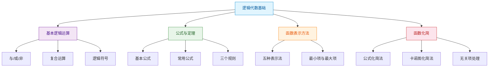

> 如果把数字电路比作建筑工程，那么逻辑代数就是工程师手中的图纸——它用数学语言精确描述了"什么条件下应该做什么"，是所有数字系统设计的理论根基。

## 本章概览

本章介绍逻辑代数的基本概念，包括基本逻辑运算、逻辑代数公式与定理、逻辑函数的表示方法与化简方法。这些内容是分析和设计数字电路的核心工具。

## 本章文章

- [基本逻辑运算](01_基本逻辑运算.md)
- [逻辑代数公式与定理](02_逻辑代数公式与定理.md)
- [逻辑函数的表示方法](03_逻辑函数的表示方法.md)
- [逻辑函数的化简](04_逻辑函数的化简.md)
