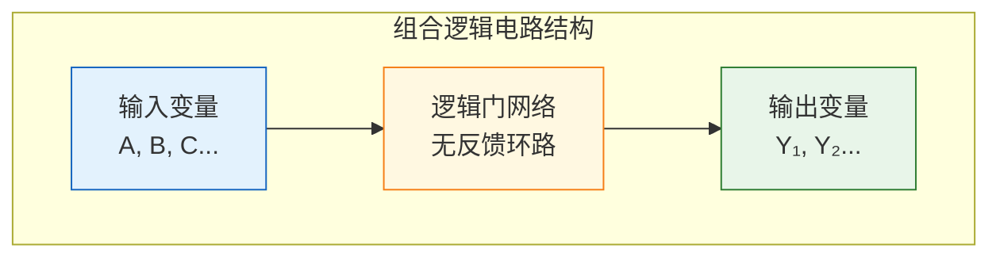
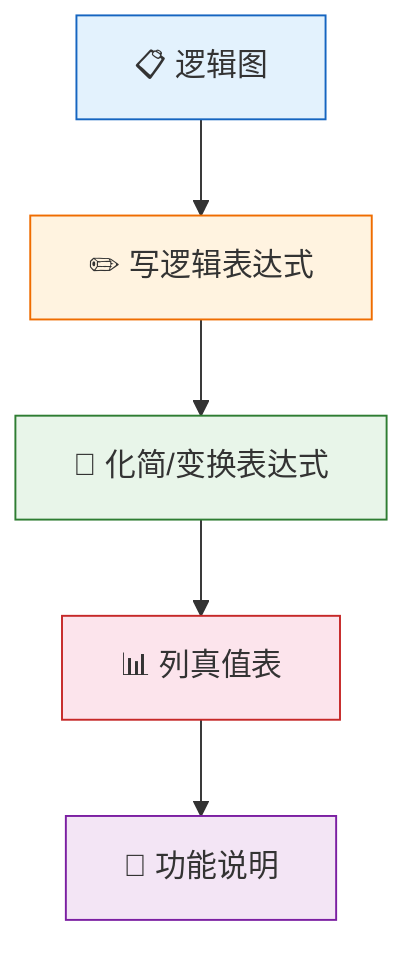
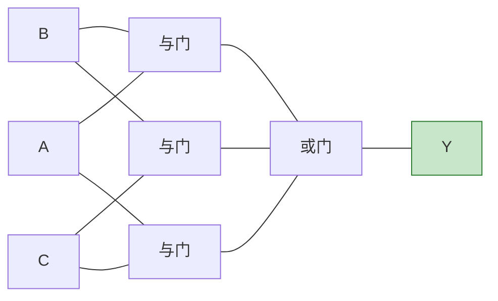

# 组合逻辑电路分析

> 组合逻辑电路分析就像"侦探破案"——从现场的线索（逻辑图）出发，层层推理，最终揭示事件真相（电路功能）。

## 一、组合逻辑电路的特点

组合逻辑电路是数字电路中最基本的一类电路，其核心特征可以概括为：

::: tip 核心特征
**输出仅取决于当前输入**，与电路原来的状态无关。
:::

### 1.1 结构特征



- **无反馈环路**：信号从输入到输出单向流动，不存在输出反馈到输入的通路
- **无存储元件**：电路中不包含触发器等记忆元件
- **输出方程**：每个输出都可以表示为输入变量的布尔函数

### 1.2 功能特征

| 特征 | 描述 |
|------|------|
| 无记忆性 | 输出仅由当前输入决定，与历史状态无关 |
| 确定性 | 同一组输入始终产生相同的输出 |
| 瞬时性 | 输入变化后，输出经传输延迟后即稳定 |

### 1.3 逻辑描述方法

组合逻辑电路可以用以下方法描述：

| 方法 | 特点 |
|------|------|
| 逻辑表达式 | 用布尔代数表示输出与输入的关系 |
| 真值表 | 列出所有输入组合及对应输出，最直观 |
| 逻辑图 | 用逻辑门符号表示电路结构 |
| 卡诺图 | 用于化简逻辑函数 |
| 波形图 | 用时序波形表示输入输出关系 |

---

## 二、组合逻辑电路的分析步骤

分析组合逻辑电路，就是从给定的逻辑图出发，推导出电路的逻辑功能。

### 2.1 分析流程



### 2.2 详细步骤

**第一步：写逻辑表达式**

从逻辑图的输入端开始，逐级写出每个门的输出表达式，最终得到输出端的逻辑函数。

**第二步：化简/变换表达式**

使用代数法或卡诺图法化简逻辑表达式，使其成为最简形式，便于理解电路功能。

**第三步：列真值表**

将所有输入组合代入化简后的表达式，求出对应的输出值，列成真值表。

**第四步：功能说明**

根据真值表，用文字描述电路的逻辑功能。

::: warning 注意
分析时要注意逻辑门类型（与、或、非、与非、或非、异或等），以及信号的有效电平（高电平有效/低电平有效）。
:::

---

## 三、分析实例

### 3.1 例一：两输入组合电路

分析以下逻辑图所示的电路功能：

```
A ──┐
    ├──[与]──┐
B ──┘       ├──[或]── Y
    │      │
A ──┘      │
```

**逻辑表达式推导：**

设与门输出为 P，则：

$$P = A \cdot B$$

$$Y = P + A = AB + A = A$$

::: info 化简过程
利用吸收律：$AB + A = A(1 + B) = A \cdot 1 = A$
:::

**真值表：**

| A | B | P = AB | Y = A |
|---|---|--------|-------|
| 0 | 0 | 0 | 0 |
| 0 | 1 | 0 | 0 |
| 1 | 0 | 0 | 1 |
| 1 | 1 | 1 | 1 |

**功能说明：** 输出 Y 等于输入 A，与输入 B 无关。该电路实际上是一个冗余电路，B 输入是多余的。

### 3.2 例二：异或功能识别

分析以下电路：

```
A ─┬──[非]──[与]──┐
   │              ├──[或]── Y
B ─┼────────[与]──┘
   │
   └──[与]────────[或]的另一路
```

更准确地说，电路表达式为：

$$Y = A\overline{B} + \overline{A}B$$

**真值表：**

| A | B | $\overline{A}$ | $\overline{B}$ | $A\overline{B}$ | $\overline{A}B$ | Y |
|---|---|----------|----------|-----------|----------|---|
| 0 | 0 | 1 | 1 | 0 | 0 | 0 |
| 0 | 1 | 1 | 0 | 0 | 1 | 1 |
| 1 | 0 | 0 | 1 | 1 | 0 | 1 |
| 1 | 1 | 0 | 0 | 0 | 0 | 0 |

**功能说明：** 当 A、B 取值不同时，输出为 1；相同时，输出为 0。这是一个**异或电路**，即 $Y = A \oplus B$。

::: tip 异或的常见应用
- 奇偶校验位生成
- 加法器中的本位和
- 可控反相器（与 1 异或取反，与 0 异或保持）
:::

### 3.3 例三：多数表决电路

分析一个三输入电路，逻辑表达式为：

$$Y = AB + BC + AC$$

**化简验证：** 该表达式已为最简形式（卡诺图中无法进一步合并）。

**真值表：**

| A | B | C | AB | BC | AC | Y |
|---|---|---|----|----|----|---|
| 0 | 0 | 0 | 0 | 0 | 0 | 0 |
| 0 | 0 | 1 | 0 | 0 | 0 | 0 |
| 0 | 1 | 0 | 0 | 0 | 0 | 0 |
| 0 | 1 | 1 | 0 | 1 | 0 | 1 |
| 1 | 0 | 0 | 0 | 0 | 0 | 0 |
| 1 | 0 | 1 | 0 | 0 | 1 | 1 |
| 1 | 1 | 0 | 1 | 0 | 0 | 1 |
| 1 | 1 | 1 | 1 | 1 | 1 | 1 |

**功能说明：** 当三个输入中**两个或两个以上为 1** 时，输出为 1。这是一个**多数表决电路**（三输入表决器）。



---

## 四、分析技巧总结

### 4.1 识别常见功能模块

| 输出表达式 | 功能 |
|-----------|------|
| $Y = A \oplus B$ | 异或（不相同判断） |
| $Y = \overline{A \oplus B}$ | 同或（相同判断） |
| $Y = AB + BC + AC$ | 多数表决 |
| $Y = A + B + C$ | 或逻辑 |
| $Y = \overline{A}B + A\overline{B}$ | 异或（等价形式） |

### 4.2 注意事项

::: important 分析要点
1. **逐级推导**：从输入端开始，逐级标注中间变量
2. **化简确认**：化简后表达式可能揭示隐藏的简洁功能
3. **真值表验证**：真值表是判断功能的最可靠依据
4. **术语规范**：功能描述要使用标准术语（如"与""或""异或""多数表决"等）
:::

---

## 五、练习题

### 题目一

分析以下逻辑表达式所描述的电路功能：

$$Y = \overline{A}B + A\overline{B} + AB$$

::: details 参考解答

**化简：**

$$Y = \overline{A}B + A\overline{B} + AB = \overline{A}B + A(\overline{B} + B) = \overline{A}B + A = A + B$$

（利用吸收律：$A + \overline{A}B = A + B$）

**真值表：**

| A | B | Y = A + B |
|---|---|-----------|
| 0 | 0 | 0 |
| 0 | 1 | 1 |
| 1 | 0 | 1 |
| 1 | 1 | 1 |

**功能说明：** 这是一个**或逻辑**电路。
:::

### 题目二

分析以下电路的表达式：$Y = \overline{AB} \cdot \overline{CD}$，说明其功能。

::: details 参考解答

**变换：**

$$Y = \overline{AB} \cdot \overline{CD} = \overline{AB + CD}$$

（利用德摩根律）

**功能说明：** 这是一个**与或非门**电路。当 A、B 同时为 1 或 C、D 同时为 1 时，输出为 0；否则输出为 1。

**真值表**（简表）：

| AB | CD | AB+CD | Y |
|----|-----|-------|---|
| 00 | 00 | 0 | 1 |
| 00 | 11 | 1 | 0 |
| 11 | 00 | 1 | 0 |
| 11 | 11 | 1 | 0 |
:::

### 题目三

分析逻辑函数 $Y = \overline{A}\,\overline{B}C + \overline{A}B\overline{C} + A\overline{B}\,\overline{C} + ABC$ 的功能。

::: details 参考解答

观察最小项：m₁ + m₂ + m₄ + m₇

画卡诺图：

| AB\C | 0 | 1 |
|------|---|---|
| 00 | 0 | 1 |
| 01 | 1 | 0 |
| 10 | 1 | 0 |
| 11 | 0 | 1 |

卡诺图无法进一步合并，函数已为最简。

**功能分析：** 从真值表看，当输入中 1 的个数为奇数时，输出为 1。这是一个**奇校验电路**（三输入奇校验器），等价于 $Y = A \oplus B \oplus C$。

验证：$A \oplus B \oplus C$ 的真值表与上述一致。
:::

---

::: tip 面试速查
- 组合逻辑电路分析四步法：**逻辑图 → 表达式 → 化简 → 真值表 → 功能说明**
- 核心特征：**无记忆、无反馈、输出仅取决于当前输入**
- 常见功能识别：异或（不同为1）、同或（相同为1）、多数表决（过半为1）
:::

::: info 原著参考
- 阎石《数字电子技术基础》第六版 第3章
- 康华光《电子技术基础·数字部分》第七版 第3章
