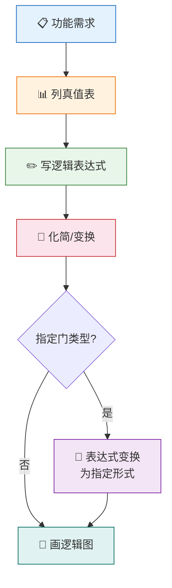
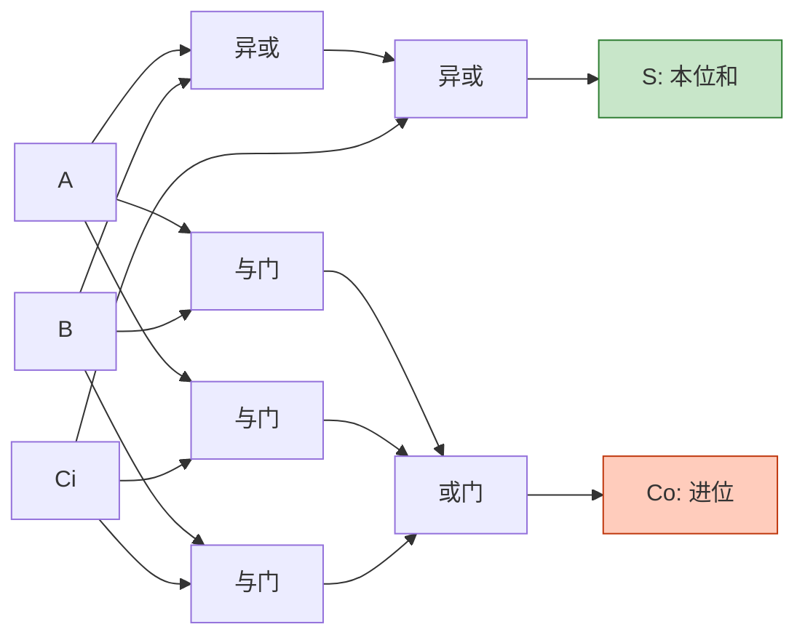
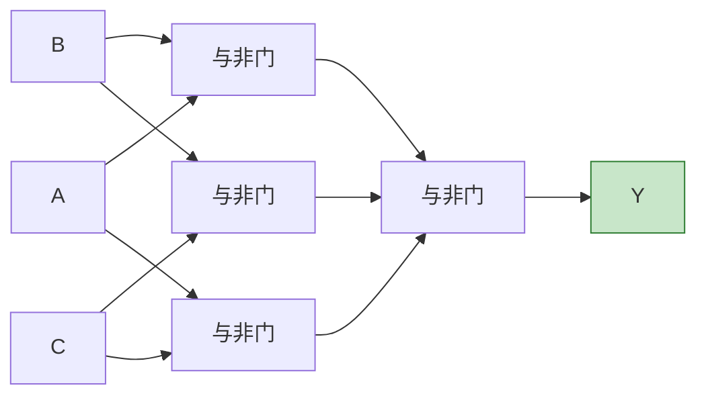

# 组合逻辑电路设计

> 组合逻辑电路设计就像"建筑蓝图绘制"——从需求出发，精心规划，最终落笔成图，让每一根逻辑连线都恰到好处。

## 一、组合逻辑电路设计步骤

设计是分析的逆过程：从逻辑功能需求出发，最终得到逻辑电路图。

### 1.1 设计流程



### 1.2 详细步骤

| 步骤 | 内容 | 注意事项 |
|------|------|---------|
| 1. 需求分析 | 确定输入、输出变量及逻辑含义 | 变量定义要明确，0/1含义要一致 |
| 2. 列真值表 | 列出所有输入组合及对应输出 | 不可遗漏任何组合 |
| 3. 写表达式 | 由真值表写出最小项之和（或最大项之积） | 根据输出1（或0）的个数选择写法 |
| 4. 化简变换 | 用卡诺图或代数法化简 | 注意无关项的利用 |
| 5. 画逻辑图 | 用逻辑门符号画出电路 | 尽量减少门的数量和级数 |

::: tip 设计原则
- **最简**：使用最少的门电路和最少的输入端
- **可行**：满足给定的器件约束（如只能用与非门）
- **可靠**：尽量减少门的级数，降低传输延迟
:::

---

## 二、设计实例

### 2.1 例一：一位全加器设计

**需求：** 设计一个一位全加器，输入为被加数 A、加数 B 和低位进位 Cᵢ，输出为本位和 S 和向高位的进位 Cₒ。

**第一步：列真值表**

| A | B | Cᵢ | S | Cₒ |
|---|---|-----|---|-----|
| 0 | 0 | 0 | 0 | 0 |
| 0 | 0 | 1 | 1 | 0 |
| 0 | 1 | 0 | 1 | 0 |
| 0 | 1 | 1 | 0 | 1 |
| 1 | 0 | 0 | 1 | 0 |
| 1 | 0 | 1 | 0 | 1 |
| 1 | 1 | 0 | 0 | 1 |
| 1 | 1 | 1 | 1 | 1 |

**第二步：写表达式并化简**

本位和 S：

$$S = \overline{A}\,\overline{B}C_i + \overline{A}B\overline{C_i} + A\overline{B}\,\overline{C_i} + ABC_i$$

观察规律：S 在输入中有奇数个 1 时为 1。

$$S = A \oplus B \oplus C_i$$

进位 Cₒ：

$$C_o = \overline{A}BC_i + A\overline{B}C_i + AB\overline{C_i} + ABC_i$$

用卡诺图化简：

| AB\Cᵢ | 0 | 1 |
|--------|---|---|
| 00 | 0 | 0 |
| 01 | 0 | 1 |
| 10 | 0 | 1 |
| 11 | 1 | 1 |

$$C_o = AB + AC_i + BC_i$$

**第三步：画逻辑图**

```verilog
// 一位全加器
module full_adder(
    input  A,
    input  B,
    input  Ci,
    output S,
    output Co
);
    assign S  = A ^ B ^ Ci;
    assign Co = (A & B) | (A & Ci) | (B & Ci);
endmodule
```



::: important 全加器核心公式
- **本位和**：$S = A \oplus B \oplus C_i$
- **进位输出**：$C_o = AB + AC_i + BC_i$
:::

---

### 2.2 例二：代码转换器（8421BCD → 余3码）

**需求：** 设计一个将 8421BCD 码转换为余3码的组合电路。

**编码规则：** 余3码 = 8421BCD码 + 3（即0011）

**第一步：列真值表**

| 8421 BCD | DCBA | 余3码 | Y₄Y₃Y₂Y₁ |
|----------|------|-------|-----------|
| 0 | 0000 | 3 | 0011 |
| 1 | 0001 | 4 | 0100 |
| 2 | 0010 | 5 | 0101 |
| 3 | 0011 | 6 | 0110 |
| 4 | 0100 | 7 | 0111 |
| 5 | 0101 | 8 | 1000 |
| 6 | 0110 | 9 | 1001 |
| 7 | 0111 | 10 | 1010 |
| 8 | 1000 | 11 | 1011 |
| 9 | 1001 | 12 | 1100 |

**注意：** 1010~1111 为无效码（无关项），在化简时可利用。

**第二步：卡诺图化简各输出**

Y₁ 的卡诺图：

| DC\BA | 00 | 01 | 11 | 10 |
|--------|-----|-----|-----|-----|
| 00 | 1 | 0 | 0 | 1 |
| 01 | 1 | 0 | 0 | 1 |
| 10 | × | × | × | × |
| 11 | × | 1 | 0 | × |

$$Y_1 = \overline{A}$$  （仅对有效输入）

实际上利用无关项化简后：

$$Y_1 = \overline{A}$$

类似地，可以化简得到：

$$Y_2 = A\overline{B} + \overline{A}B = A \oplus B$$

$$Y_3 = \overline{A}\,\overline{B}\,\overline{C} + AB + BC$$

$$Y_4 = D + BC + BA$$

::: warning 无效码处理
8421BCD码中1010~1111为无效码。设计时将这些组合作为无关项处理，可简化电路；但实际应用中需考虑输入是否可能出现无效码。
:::

---

### 2.3 例三：三输入表决器设计

**需求：** 设计一个三输入表决器，当两个或两个以上输入为1时，输出为1。

**第一步：列真值表**

| A | B | C | Y |
|---|---|---|---|
| 0 | 0 | 0 | 0 |
| 0 | 0 | 1 | 0 |
| 0 | 1 | 0 | 0 |
| 0 | 1 | 1 | 1 |
| 1 | 0 | 0 | 0 |
| 1 | 0 | 1 | 1 |
| 1 | 1 | 0 | 1 |
| 1 | 1 | 1 | 1 |

**第二步：卡诺图化简**

| AB\C | 0 | 1 |
|------|---|---|
| 00 | 0 | 0 |
| 01 | 0 | 1 |
| 11 | 1 | 1 |
| 10 | 0 | 1 |

合并得：

$$Y = AB + BC + AC$$

**第三步：变换为与非-与非形式（如果要求只用与非门）**

两次取反：

$$Y = \overline{\overline{AB + BC + AC}} = \overline{\overline{AB} \cdot \overline{BC} \cdot \overline{AC}}$$

**第四步：逻辑图**

```verilog
// 三输入表决器（与非门实现）
module voter(
    input  A,
    input  B,
    input  C,
    output Y
);
    wire n1, n2, n3;
    assign n1 = ~(A & B);  // 与非门
    assign n2 = ~(B & C);
    assign n3 = ~(A & C);
    assign Y = ~(n1 & n2 & n3);  // 与非门
endmodule
```



---

## 三、多输出组合电路设计

### 3.1 设计要点

当电路有多个输出时，需要注意：

::: important 多输出设计原则
1. **共享逻辑项**：不同输出之间可能存在公共的与项，应尽量共享以减少门数
2. **整体最简**：不能只追求单个输出的最简，要追求整体最简
3. **综合考虑**：在卡诺图化简时，注意各输出卡诺图之间的公共合并区域
:::

### 3.2 示例：全加器的多输出设计

回顾全加器设计，两个输出：

$$S = A \oplus B \oplus C_i$$
$$C_o = AB + AC_i + BC_i$$

注意到：

$$C_o = AB + (A \oplus B)C_i$$

这样，$A \oplus B$ 可以在 S 和 Cₒ 之间共享：

$$S = (A \oplus B) \oplus C_i$$
$$C_o = AB + (A \oplus B)C_i$$

```verilog
// 全加器 - 共享中间信号
module full_adder_shared(
    input  A, B, Ci,
    output S, Co
);
    wire P, G;
    assign P  = A ^ B;       // 传播信号（共享）
    assign G  = A & B;       // 产生信号
    assign S  = P ^ Ci;      // 本位和
    assign Co = G | (P & Ci); // 进位
endmodule
```

这种实现只用了 2 个异或门、2 个与门和 1 个或门，比独立实现更简洁。

---

## 四、设计方法比较

| 设计方法 | 适用场景 | 优点 | 缺点 |
|---------|---------|------|------|
| 与或表达式 | 一般设计 | 直观 | 可能用不同类型门 |
| 与非-与非 | 只用与非门 | 器件统一 | 级数可能增多 |
| 或非-或非 | 只用或非门 | 器件统一 | 级数可能增多 |
| 与或非 | 与或非门可用 | 级数少 | 需要与或非门 |

---

## 五、练习题

### 题目一

设计一个三输入判奇电路：当三个输入中1的个数为奇数时输出1。

::: details 参考解答

**真值表：**

| A | B | C | Y |
|---|---|---|---|
| 0 | 0 | 0 | 0 |
| 0 | 0 | 1 | 1 |
| 0 | 1 | 0 | 1 |
| 0 | 1 | 1 | 0 |
| 1 | 0 | 0 | 1 |
| 1 | 0 | 1 | 0 |
| 1 | 1 | 0 | 0 |
| 1 | 1 | 1 | 1 |

**表达式：** $Y = A \oplus B \oplus C$

**电路：** 两个异或门级联即可实现。
:::

### 题目二

设计一个将4位二进制码转换为格雷码的转换电路。

::: details 参考解答

**转换规则：** 格雷码的第 i 位 = 二进制码的第 i 位与第 i+1 位异或。

即：$G_i = B_i \oplus B_{i+1}$（最高位 $G_3 = B_3$）

| 二进制 B₃B₂B₁B₀ | 格雷码 G₃G₂G₁G₀ |
|-------------------|-------------------|
| 0000 | 0000 |
| 0001 | 0001 |
| 0010 | 0011 |
| 0011 | 0010 |
| 0100 | 0110 |
| 0101 | 0111 |
| 0110 | 0101 |
| 0111 | 0100 |
| 1000 | 1100 |
| 1001 | 1101 |
| 1010 | 1111 |
| 1011 | 1110 |
| 1100 | 1010 |
| 1101 | 1011 |
| 1110 | 1001 |
| 1111 | 1000 |

**表达式：**

$$G_3 = B_3$$
$$G_2 = B_3 \oplus B_2$$
$$G_1 = B_2 \oplus B_1$$
$$G_0 = B_1 \oplus B_0$$

**电路：** 只需3个异或门。
:::

### 题目三

用与非门设计一个电路：输入 A、B、C，当 A=1 且 B、C 不全为1时输出1。

::: details 参考解答

**真值表分析：** Y=1 的条件是 A=1 且 BC≠11，即 A=1 且 $\overline{BC}$=1。

**表达式：**

$$Y = A\overline{BC}$$

**变换为与非形式：**

$$Y = A\overline{BC} = A \cdot \overline{BC} = \overline{\overline{A \cdot \overline{BC}}}$$

用与非门实现：

1. 与非门1：$N_1 = \overline{BC}$
2. 与非门2：$N_2 = \overline{A \cdot N_1} = \overline{A \cdot \overline{BC}}$
3. 与非门3：$Y = \overline{N_2} = A \cdot \overline{BC}$（需要再接一个与非门当非门用）

或者更简洁：$Y = \overline{\overline{A \cdot \overline{BC}}}$，需要2个与非门（一个对BC取与非，一个对A和N1取与非后取非）。

实际需要3个与非门：$\overline{BC}$ → 与非A和$\overline{BC}$ → 取非得结果。
:::

---

::: tip 面试速查
- 设计五步法：**需求分析 → 真值表 → 表达式 → 化简变换 → 逻辑图**
- 全加器核心：$S = A \oplus B \oplus C_i$，$C_o = AB + AC_i + BC_i$
- 与非门万能：任何组合逻辑都可以只用与非门实现（两次取反+德摩根律）
- 多输出设计：关注输出间的共享项，追求整体最简
:::

::: info 原著参考
- 阎石《数字电子技术基础》第六版 第3.2节
- 康华光《电子技术基础·数字部分》第七版 第3.2节
