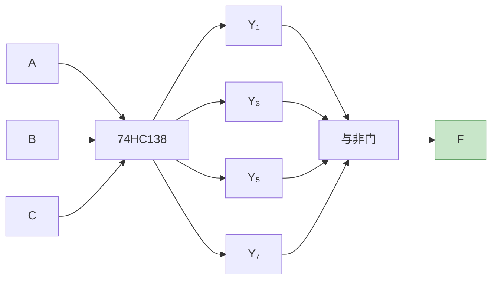
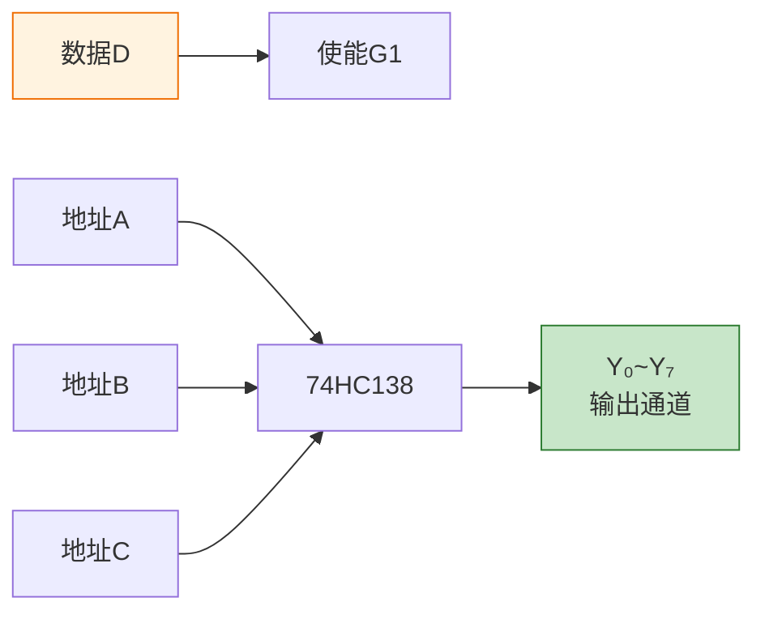

# 编码器与译码器

> 编码器与译码器就像"翻译官"——编码器将人类的请求翻译成机器码，译码器将机器码翻译回人类可读的信号。

## 一、编码器

编码器的功能是**将输入的每一个有效信号编成对应的二进制代码**。

### 1.1 普通编码器

普通编码器（也称互斥编码器）在任何时刻只允许**一个**输入有效。

**4线-2线编码器真值表：**

| I₃ | I₂ | I₁ | I₀ | Y₁ | Y₀ |
|----|----|----|----|----|----|
| 0 | 0 | 0 | 1 | 0 | 0 |
| 0 | 0 | 1 | 0 | 0 | 1 |
| 0 | 1 | 0 | 0 | 1 | 0 |
| 1 | 0 | 0 | 0 | 1 | 1 |

**逻辑表达式：**

$$Y_1 = I_2 + I_3$$
$$Y_0 = I_1 + I_3$$

::: warning 普通编码器的局限
- 任何时刻只允许一个输入有效，多个输入同时有效时输出混乱
- 当所有输入都无效时，输出为 00，与 I₀ 有效时相同，无法区分
:::

### 1.2 优先编码器

优先编码器允许**多个输入同时有效**，但只对**优先级最高的输入**进行编码。

#### 74HC147 优先编码器（10线-4线）

74HC147 是一个十进制-BCD优先编码器，输入低电平有效。

**逻辑符号：**

```
        ┌──────────┐
  1 ───┤          │
  2 ───┤          │
  3 ───┤ 74HC147 ├── Y₃
  4 ───┤          ├── Y₂
  5 ───┤          ├── Y₁
  6 ───┤          ├── Y₀
  7 ───┤          │
  8 ───┤          │
  9 ───┤          │
        └──────────┘
```

**功能表：**

| 输入 | | | | | | | | | | 输出 | | | |
|------|-|-|-|-|-|-|-|-|-|------|-|-|-|
| 9 | 8 | 7 | 6 | 5 | 4 | 3 | 2 | 1 | 0 | D̅ | C̅ | B̅ | A̅ |
| H | H | H | H | H | H | H | H | H | H | H | H | H | H |
| X | X | X | X | X | X | X | X | X | L | L | L | L | H |
| X | X | X | X | X | X | X | X | L | H | L | L | H | L |
| X | X | X | X | X | X | X | L | H | H | L | L | H | H |
| X | X | X | X | X | X | L | H | H | H | L | H | L | L |
| X | X | X | X | X | L | H | H | H | H | L | H | L | H |
| X | X | X | X | L | H | H | H | H | H | L | H | H | L |
| X | X | X | L | H | H | H | H | H | H | L | H | H | H |
| X | X | L | H | H | H | H | H | H | H | H | L | L | L |
| X | L | H | H | H | H | H | H | H | H | H | L | L | H |
| L | H | H | H | H | H | H | H | H | H | H | L | H | L |

::: important 优先级规则
74HC147 的优先级从高到低为：9 > 8 > 7 > 6 > 5 > 4 > 3 > 2 > 1。输入为低电平有效（0=有效），输出为 BCD 的反码（1's complement）。输入0的编码与所有输入无效时的输出相同（均为HHHH），这是74HC147的一个特点。
:::

---

## 二、译码器

译码器的功能是**将二进制代码翻译成对应的输出信号**，是编码器的逆操作。

### 2.1 二进制译码器

#### 74HC138 3线-8线译码器

74HC138 是最常用的3线-8线译码器，具有3个使能输入端。

**逻辑符号：**

```
        ┌──────────┐
  A ───┤          ├── Y₀
  B ───┤ 74HC138  ├── Y₁
  C ───┤          ├── Y₂
 G1 ───┤          ├── Y₃
G2A───┤          ├── Y₄
G2B───┤          ├── Y₅
        │          ├── Y₆
        │          ├── Y₇
        └──────────┘
```

**使能条件：** G1=H 且 G2A=L 且 G2B=L 时，译码器工作。

**74HC138 真值表：**

| C | B | A | Y₀ | Y₁ | Y₂ | Y₃ | Y₄ | Y₅ | Y₆ | Y₇ |
|---|---|---|----|----|----|----|----|----|----|----|
| 0 | 0 | 0 | 0 | 1 | 1 | 1 | 1 | 1 | 1 | 1 |
| 0 | 0 | 1 | 1 | 0 | 1 | 1 | 1 | 1 | 1 | 1 |
| 0 | 1 | 0 | 1 | 1 | 0 | 1 | 1 | 1 | 1 | 1 |
| 0 | 1 | 1 | 1 | 1 | 1 | 0 | 1 | 1 | 1 | 1 |
| 1 | 0 | 0 | 1 | 1 | 1 | 1 | 0 | 1 | 1 | 1 |
| 1 | 0 | 1 | 1 | 1 | 1 | 1 | 1 | 0 | 1 | 1 |
| 1 | 1 | 0 | 1 | 1 | 1 | 1 | 1 | 1 | 0 | 1 |
| 1 | 1 | 1 | 1 | 1 | 1 | 1 | 1 | 1 | 1 | 0 |

::: tip 输出特点
74HC138 的输出为**低电平有效**——被选中的输出为0，其余为1。这个特点在级联和实现逻辑函数时非常有用。
:::

### 2.2 显示译码器

#### 74HC48 七段显示译码器

74HC48 将 BCD 码译成七段显示器的段选信号，高电平有效。

**七段显示器结构：**

```
    aaaa
   f    b
   f    b
    gggg
   e    c
   e    c
    dddd
```

**74HC48 功能表（部分）：**

| DCBA | a | b | c | d | e | f | g | 显示 |
|------|---|---|---|---|---|---|---|------|
| 0000 | 1 | 1 | 1 | 1 | 1 | 1 | 0 | 0 |
| 0001 | 0 | 1 | 1 | 0 | 0 | 0 | 0 | 1 |
| 0010 | 1 | 1 | 0 | 1 | 1 | 0 | 1 | 2 |
| 0011 | 1 | 1 | 1 | 1 | 0 | 0 | 1 | 3 |
| 0100 | 0 | 1 | 1 | 0 | 0 | 1 | 1 | 4 |
| 0101 | 1 | 0 | 1 | 1 | 0 | 1 | 1 | 5 |
| 0110 | 1 | 0 | 1 | 1 | 1 | 1 | 1 | 6 |
| 0111 | 1 | 1 | 1 | 0 | 0 | 0 | 0 | 7 |
| 1000 | 1 | 1 | 1 | 1 | 1 | 1 | 1 | 8 |
| 1001 | 1 | 1 | 1 | 1 | 0 | 1 | 1 | 9 |

---

## 三、编码器与译码器的应用

### 3.1 用译码器实现逻辑函数

74HC138 的每个输出对应一个最小项的非：

$$\overline{Y_i} = \overline{m_i}$$

因此，任何组合逻辑函数都可以用74HC138加一个与非门实现。

**示例：** 用74HC138实现 $F = \sum m(1,3,5,7)$

$$F = m_1 + m_3 + m_5 + m_7 = \overline{\overline{m_1} \cdot \overline{m_3} \cdot \overline{m_5} \cdot \overline{m_7}} = \overline{Y_1 \cdot Y_3 \cdot Y_5 \cdot Y_7}$$



::: important 译码器实现逻辑函数的步骤
1. 将函数表示为最小项之和形式
2. 将输入变量接译码器的地址输入
3. 将对应最小项的输出接与非门（低电平有效输出时）
4. 与非门输出即为所需函数
:::

### 3.2 数据分配器

将74HC138的使能端作为数据输入，地址端作为选择信号，可以实现数据分配器。



**工作原理：** 当 D=1 时，译码器正常工作，选中地址对应的输出为0；当 D=0 时，译码器不工作，所有输出为1。因此选中的输出通道随 D 变化，实现了数据分配。

### 3.3 译码器的扩展

用两片74HC138可以扩展为4线-16线译码器：

```verilog
// 4线-16线译码器（两片74HC138级联）
module decoder_4to16(
    input  [3:0] A,
    output [15:0] Y
);
    wire en1 = A[3];       // 高位片使能
    wire en2 = ~A[3];     // 低位片使能

    // 低位片：A[3]=0 时工作
    // 高位片：A[3]=1 时工作
endmodule
```

| A₃ | 工作芯片 | 输出范围 |
|-----|---------|---------|
| 0 | 低位片（第1片） | Y₀ ~ Y₇ |
| 1 | 高位片（第2片） | Y₈ ~ Y₁₅ |

---

## 四、编码器与译码器对比

| 特性 | 编码器 | 译码器 |
|------|--------|--------|
| 功能 | 多输入→少输出（编码） | 少输入→多输出（解码） |
| 输入线数 | 多（如10线） | 少（如4线） |
| 输出线数 | 少（如4线） | 多（如10线/7段） |
| 典型芯片 | 74HC147 | 74HC138, 74HC48 |
| 应用 | 键盘编码、中断优先级 | 地址译码、显示驱动 |

---

## 五、练习题

### 题目一

用74HC138和必要的逻辑门实现逻辑函数 $F(A,B,C) = \sum m(0,2,4,6)$。

::: details 参考解答

$F = m_0 + m_2 + m_4 + m_6$

由于74HC138输出低电平有效：$\overline{Y_i} = \overline{m_i}$

$$F = \overline{\overline{m_0} \cdot \overline{m_2} \cdot \overline{m_4} \cdot \overline{m_6}} = \overline{Y_0 \cdot Y_2 \cdot Y_4 \cdot Y_6}$$

将A、B、C分别接74HC138的A、B、C输入端，将Y₀、Y₂、Y₄、Y₆接一个四输入与非门，输出即为F。

观察：F 在 A=0 或 C=0 时为1（偶数下标），实际上 $F = \overline{C}$（当A、B为任意值时，只有C=0的项被选中），即 $F = \overline{A \cdot C}$，不对。

重新分析：$F = \overline{B}$（m₀=000, m₂=010, m₄=100, m₆=110，B始终为0）。即 $F = \overline{B}$。
:::

### 题目二

用两片74HC138设计一个4线-16线译码器，画出级联连接图。

::: details 参考解答

**连接方式：**

- 输入 A₀、A₁、A₂ 分别接两片138的 A、B、C
- 输入 A₃ 接第1片（低位片）的 G2A（低电平使能），取反后接第2片（高位片）的 G1
- 两片的 G1/G2 使能端按以下方式连接：
  - 第1片：G1=1, G2A=A₃, G2B=0
  - 第2片：G1=A₃, G2A=0, G2B=0

当 A₃=0 时，第1片工作，输出 Y₀~Y₇
当 A₃=1 时，第2片工作，输出 Y₈~Y₁₅
:::

### 题目三

用74HC138实现一位全加器。

::: details 参考解答

全加器有两个输出：

- $S(A,B,C_i) = \sum m(1,2,4,7)$
- $C_o(A,B,C_i) = \sum m(3,5,6,7)$

**S 的实现：**

$$S = \overline{Y_1 \cdot Y_2 \cdot Y_4 \cdot Y_7}$$

将 Y₁、Y₂、Y₄、Y₇ 接四输入与非门。

**Cₒ 的实现：**

$$C_o = \overline{Y_3 \cdot Y_5 \cdot Y_6 \cdot Y_7}$$

将 Y₃、Y₅、Y₆、Y₇ 接另一个四输入与非门。

总共需要1片74HC138 + 2个四输入与非门。
:::

---

::: tip 面试速查
- 编码器：多入少出，优先编码器允许同时多输入有效，只编码最高优先级
- 译码器：少入多出，74HC138 输出**低电平有效**
- 74HC138 使能条件：G1=H, G2A=L, G2B=L
- 用译码器实现逻辑函数：$F = \sum m_i = \overline{\prod Y_i}$（接与非门）
- 译码器作数据分配器：数据接使能端，地址接选择端
:::

::: info 原著参考
- 阎石《数字电子技术基础》第六版 第3.3节
- 康华光《电子技术基础·数字部分》第七版 第3.3节
