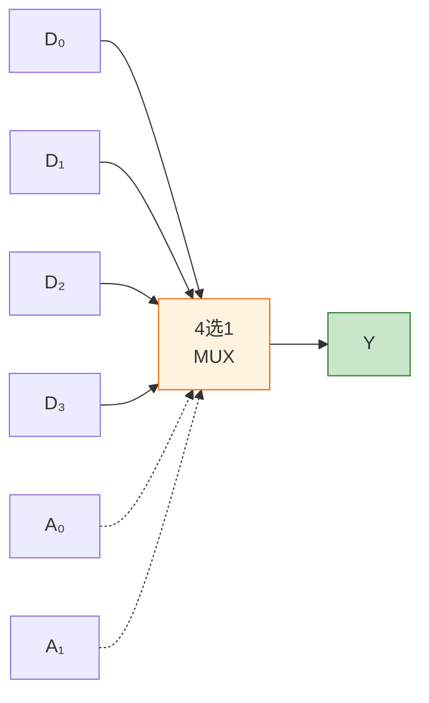
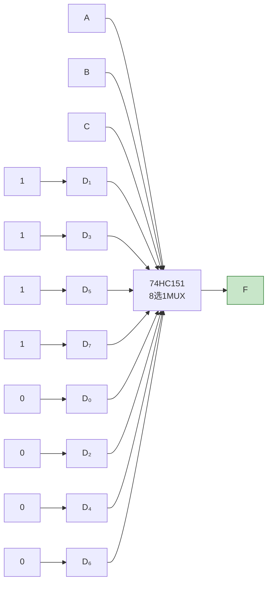

# 数据选择器与分配器

> 数据选择器就像"铁路道岔"——根据调度指令，将多条轨道上的列车引导到一条主干道上；数据分配器则恰好相反。

## 一、数据选择器原理

数据选择器（Multiplexer，MUX）的功能是**从多路输入数据中选择一路输出**，又称多路选择器。

### 1.1 4选1数据选择器

**基本结构：**



**4选1数据选择器真值表：**

| A₁ | A₀ | Y |
|----|----|----|
| 0 | 0 | D₀ |
| 0 | 1 | D₁ |
| 1 | 0 | D₂ |
| 1 | 1 | D₃ |

**逻辑表达式：**

$$Y = \overline{A_1}\,\overline{A_0}D_0 + \overline{A_1}A_0D_1 + A_1\overline{A_0}D_2 + A_1A_0D_3$$

$$Y = \sum_{i=0}^{3} m_i D_i$$

其中 $m_i$ 为选择变量 A₁A₀ 的最小项。

### 1.2 8选1数据选择器 74HC151

74HC151 是最常用的8选1数据选择器，具有互补输出。

**逻辑符号：**

```
        ┌──────────┐
  D₀──┤          │
  D₁──┤          ├── Y
  D₂──┤ 74HC151  │
  D₃──┤          ├── Ȳ
  D₄──┤          │
  D₅──┤          │
  D₆──┤          │
  D₇──┤          │
  A₀──┤          │
  A₁──┤          │
  A₂──┤          │
  Ē───┤          │
        └──────────┘
```

**74HC151 真值表：**

| Ē | A₂ | A₁ | A₀ | Y | Ȳ |
|---|----|----|----|---|---|
| 1 | × | × | × | 0 | 1 |
| 0 | 0 | 0 | 0 | D₀ | $\overline{D_0}$ |
| 0 | 0 | 0 | 1 | D₁ | $\overline{D_1}$ |
| 0 | 0 | 1 | 0 | D₂ | $\overline{D_2}$ |
| 0 | 0 | 1 | 1 | D₃ | $\overline{D_3}$ |
| 0 | 1 | 0 | 0 | D₄ | $\overline{D_4}$ |
| 0 | 1 | 0 | 1 | D₅ | $\overline{D_5}$ |
| 0 | 1 | 1 | 0 | D₆ | $\overline{D_6}$ |
| 0 | 1 | 1 | 1 | D₇ | $\overline{D_7}$ |

**输出表达式：**

$$Y = \sum_{i=0}^{7} m_i D_i$$

$$\overline{Y} = \overline{\sum_{i=0}^{7} m_i D_i}$$

::: tip 关键特性
- 使能端 Ē 低电平有效
- Y 和 Ȳ 互补输出
- 当 Ē=1 时，Y=0（所有数据被封锁）
:::

---

## 二、数据分配器原理

数据分配器（Demultiplexer，DEMUX）的功能是**将一路输入数据分配到多路输出中的某一路**。

### 2.1 1-to-4 数据分配器

**真值表：**

| A₁ | A₀ | D | Y₀ | Y₁ | Y₂ | Y₃ |
|----|----|---|----|----|----|----|
| 0 | 0 | D | D | 0 | 0 | 0 |
| 0 | 1 | D | 0 | D | 0 | 0 |
| 1 | 0 | D | 0 | 0 | D | 0 |
| 1 | 1 | D | 0 | 0 | 0 | D |

::: important 数据分配器的实现
数据分配器可以用译码器实现——将数据接译码器的使能端，地址接译码器的选择端。这与前面介绍的"译码器作数据分配器"完全一致。
:::

---

## 三、用数据选择器实现逻辑函数

这是数据选择器最重要的应用之一。核心原理：

$$Y = \sum m_i D_i$$

当 $D_i$ 取0或1时，MUX可以产生选择变量的**任意逻辑函数**。

### 3.1 实现方法

| 变量数 | 选择器 | 接法 |
|--------|--------|------|
| n变量，n位选择 | 2ⁿ选1 MUX | 函数变量接选择端，数据端接0/1 |
| n变量，n-1位选择 | 2ⁿ⁻¹选1 MUX | n-1个变量接选择端，数据端接第n个变量或其反 |

### 3.2 例一：用8选1 MUX实现三变量函数

实现 $F = \sum m(1,3,5,7)$

**方法：** 将A、B、C分别接A₂、A₁、A₀

| 最小项 | A₂A₁A₀ | Dᵢ |
|--------|---------|-----|
| m₀=0 | 000 | D₀=0 |
| m₁=1 | 001 | D₁=1 |
| m₂=0 | 010 | D₂=0 |
| m₃=1 | 011 | D₃=1 |
| m₄=0 | 100 | D₄=0 |
| m₅=1 | 101 | D₅=1 |
| m₆=0 | 110 | D₆=0 |
| m₇=1 | 111 | D₇=1 |

**接法：** D₁=D₃=D₅=D₇=1，其余Dᵢ=0



**观察：** F=C（所有C=1的项输出为1），即 $F = A \oplus B \oplus C$ 中的 $F = C$（对特定函数）... 实际上 $F = C$（因为当C=1时F恒为1，无论A、B如何）。验证：m₁(001), m₃(011), m₅(101), m₇(111) 中 C 恒为1。正确，$F = C$。

### 3.3 例二：用4选1 MUX实现三变量函数

实现 $F(A,B,C) = \sum m(2,3,5,7)$

**方法：** A、B 接选择端 A₁、A₀，C 通过数据端引入。

| A₁A₀ | 对应最小项 | Dᵢ 取值 |
|-------|-----------|---------|
| 00 | m₀(A=0,B=0,C=0), m₁(A=0,B=0,C=1) | $F|_{AB=00} = 0 \cdot \overline{C} + 0 \cdot C = 0$ → D₀=0 |
| 01 | m₂(A=0,B=1,C=0), m₃(A=0,B=1,C=1) | $F|_{AB=01} = 1 \cdot \overline{C} + 1 \cdot C = 1$ → D₁=1 |
| 10 | m₄(A=1,B=0,C=0), m₅(A=1,B=0,C=1) | $F|_{AB=10} = 0 \cdot \overline{C} + 1 \cdot C = C$ → D₂=C |
| 11 | m₆(A=1,B=1,C=0), m₇(A=1,B=1,C=1) | $F|_{AB=11} = 0 \cdot \overline{C} + 1 \cdot C = C$ → D₃=C |

**接法：** D₀=0, D₁=1, D₂=C, D₃=C

::: important 降维法
用 2ⁿ⁻¹选1 MUX 实现n变量函数时，将n-1个变量接选择端，第n个变量（或其反、0、1）接数据端。数据端的取值有四种可能：0、1、C、$\overline{C}$。
:::

### 3.4 例三：用4选1 MUX实现四变量函数

实现 $F(A,B,C,D) = \sum m(0,1,2,5,8,10,11,13,15)$

**方法：** A、B 接选择端，C、D 通过数据端引入。

对每个 AB 组合，列出 CD 对应的输出：

| A₁A₀ | CD=00 | CD=01 | CD=11 | CD=10 | Dᵢ |
|-------|-------|-------|-------|-------|-----|
| 00 | 1 | 1 | 0 | 1 | $\overline{CD}$ |
| 01 | 0 | 1 | 0 | 0 | $C\overline{D}$ |
| 10 | 1 | 0 | 1 | 1 | $C+\overline{D}$ |
| 11 | 0 | 1 | 1 | 0 | $D$ |

简化处理：

- D₀ = $F|_{AB=00}$：CD=00→1, 01→1, 11→0, 10→1 → $D_0 = \overline{CD}$

- D₁ = $F|_{AB=01}$：CD=00→0, 01→1, 11→0, 10→0 → $D_1 = C\overline{D}$

- D₂ = $F|_{AB=10}$：CD=00→1, 01→0, 11→1, 10→1 → $D_2 = C+\overline{D}$

- D₃ = $F|_{AB=11}$：CD=00→0, 01→1, 11→1, 10→0 → $D_3 = D$

---

## 四、数据选择器的扩展

### 4.1 位扩展

将两片74HC151并联，可以实现**2位8选1**数据选择器。

### 4.2 字扩展

用使能端控制，将两片74HC151级联可以实现**16选1**数据选择器。

```verilog
// 16选1数据选择器（两片74HC151级联）
module mux_16to1(
    input  [3:0] A,      // 4位选择
    input  [15:0] D,     // 16路数据
    output Y
);
    wire Y_low, Y_high;
    wire en_low = ~A[3];  // A3=0时低位片工作
    wire en_high = A[3];   // A3=1时高位片工作

    // 低位片：A3=0时选择D0~D7
    // 高位片：A3=1时选择D8~D15
    // 最终输出 Y = Y_low | Y_high（利用使能端控制）
endmodule
```

| A₃ | 工作芯片 | 数据范围 |
|-----|---------|---------|
| 0 | 低位片 | D₀ ~ D₇ |
| 1 | 高位片 | D₈ ~ D₁₅ |

---

## 五、选择器与分配器对比

| 特性 | 数据选择器（MUX） | 数据分配器（DEMUX） |
|------|-------------------|---------------------|
| 功能 | 多路→一路 | 一路→多路 |
| 信号方向 | 汇聚 | 分散 |
| 数据线 | 多输入，单输出 | 单输入，多输出 |
| 选择线 | 选择哪路输入 | 选择哪路输出 |
| 典型芯片 | 74HC151 | 74HC138（可代用） |
| 应用 | 数据采集、函数实现 | 数据分发 |

---

## 六、练习题

### 题目一

用4选1数据选择器实现 $F = \overline{A}B + AB\overline{C}$。

::: details 参考解答

展开为最小项：

$F = \overline{A}B\overline{C} + \overline{A}BC + AB\overline{C}$

即 $F = m_2 + m_3 + m_6 = \sum m(2,3,6)$

用4选1 MUX，A、B接选择端：

| A₁A₀ | 对应最小项 | Dᵢ |
|-------|-----------|-----|
| 00 | m₀,m₁ | 0,0 → D₀=0 |
| 01 | m₂,m₃ | 1,1 → D₁=1 |
| 10 | m₄,m₅ | 0,0 → D₂=0 |
| 11 | m₆,m₇ | 1,0 → D₃=$\overline{C}$ |

**接法：** D₀=0, D₁=1, D₂=0, D₃=$\overline{C}$
:::

### 题目二

用8选1数据选择器74HC151实现 $F(A,B,C) = \sum m(0,2,6,7)$。

::: details 参考解答

将A、B、C接A₂、A₁、A₀，根据最小项设置Dᵢ：

| Dᵢ | 值 |
|----|-----|
| D₀ | 1（m₀∈F） |
| D₁ | 0 |
| D₂ | 1（m₂∈F） |
| D₃ | 0 |
| D₄ | 0 |
| D₅ | 0 |
| D₆ | 1（m₆∈F） |
| D₇ | 1（m₇∈F） |

接法：D₀=D₂=D₆=D₇接高电平（1），其余接低电平（0）。
:::

### 题目三

用74HC151实现一位全加器。

::: details 参考解答

全加器有两个输出 S 和 Cₒ。需要两片74HC151。

**S 的实现：** $S = \sum m(1,2,4,7)$

- D₁=D₂=D₄=D₇=1，其余为0

**Cₒ 的实现：** $C_o = \sum m(3,5,6,7)$

- D₃=D₅=D₆=D₇=1，其余为0

A、B、Cᵢ分别接两片74HC151的 A₂、A₁、A₀。
:::

---

::: tip 面试速查
- 数据选择器：多入一出，$Y = \sum m_i D_i$
- 用MUX实现逻辑函数：函数变量接选择端，数据端接0/1/变量/反变量
- 降维法：2ⁿ⁻¹选1 MUX可实现n变量函数（第n个变量通过数据端引入）
- 74HC151：8选1，低电平使能，互补输出
- 数据分配器可用译码器实现（数据接使能端）
:::

::: info 原著参考
- 阎石《数字电子技术基础》第六版 第3.4节
- 康华光《电子技术基础·数字部分》第七版 第3.4节
