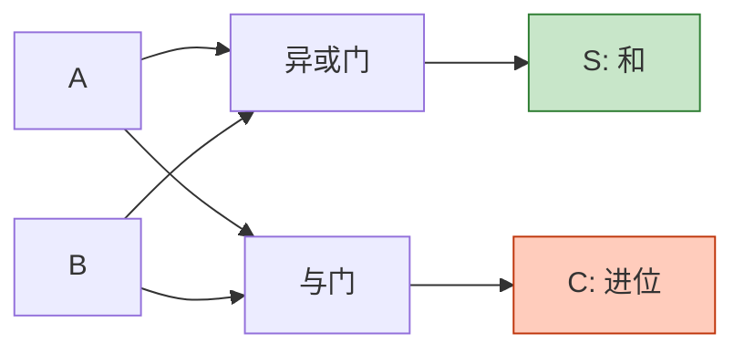
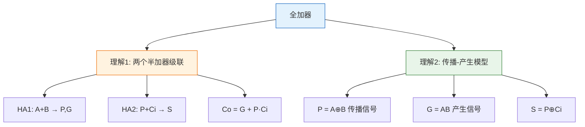
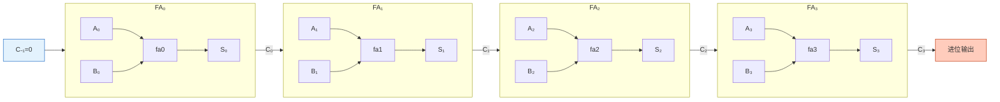
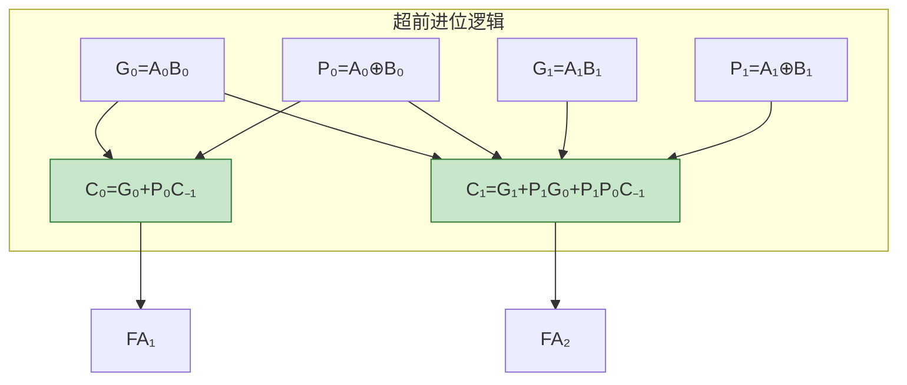

# 加法器与比较器

> 加法器是数字系统的"心脏"——一切算术运算归根结底都是加法；比较器则是"裁判"——判定两个数的大小关系。

## 一、半加器

半加器（Half Adder）是最简单的加法电路，**不考虑低位来的进位**。

### 1.1 逻辑功能

| A | B | S（和） | C（进位） |
|---|---|---------|-----------|
| 0 | 0 | 0 | 0 |
| 0 | 1 | 1 | 0 |
| 1 | 0 | 1 | 0 |
| 1 | 1 | 0 | 1 |

**逻辑表达式：**

$$S = A \oplus B$$
$$C = AB$$

### 1.2 逻辑图

```verilog
// 半加器
module half_adder(
    input  A, B,
    output S, C
);
    assign S = A ^ B;
    assign C = A & B;
endmodule
```



::: warning 半加器的局限
半加器只能处理最低位的加法，因为它没有进位输入端。对于多位加法，必须使用全加器。
:::

---

## 二、全加器

全加器（Full Adder）在半加器的基础上增加了**低位进位输入 Cᵢ**。

### 2.1 逻辑功能

| A | B | Cᵢ | S | Cₒ |
|---|---|-----|---|-----|
| 0 | 0 | 0 | 0 | 0 |
| 0 | 0 | 1 | 1 | 0 |
| 0 | 1 | 0 | 1 | 0 |
| 0 | 1 | 1 | 0 | 1 |
| 1 | 0 | 0 | 1 | 0 |
| 1 | 0 | 1 | 0 | 1 |
| 1 | 1 | 0 | 0 | 1 |
| 1 | 1 | 1 | 1 | 1 |

**逻辑表达式：**

$$S = A \oplus B \oplus C_i$$
$$C_o = AB + AC_i + BC_i = AB + (A \oplus B)C_i$$

### 2.2 全加器的两种理解



**传播-产生模型：**

- **产生信号 G = AB**：当 A、B 都为1时，无论 Cᵢ 如何，必定产生进位
- **传播信号 P = A ⊕ B**：当 A、B 中恰好一个为1时，进位 Cᵢ 将被传播到 Cₒ

$$C_o = G + PC_i$$

---

## 三、多位加法器

### 3.1 串行进位加法器

将多个全加器级联，低位进位输出连接到高位进位输入。



::: warning 串行进位的缺点
进位信号必须逐级传递，**延迟与位数成正比**。n位加法器的总延迟约为 n × t_carry，速度慢。
:::

### 3.2 超前进位加法器（74HC283）

超前进位加法器（Carry Lookahead Adder, CLA）通过**并行计算所有进位**来消除进位传播延迟。

**核心原理：**

对于第 i 位：

$$G_i = A_i B_i \quad \text{(产生信号)}$$
$$P_i = A_i \oplus B_i \quad \text{(传播信号)}$$

各进位并行计算：

$$C_0 = G_0 + P_0 C_{-1}$$

$$C_1 = G_1 + P_1 G_0 + P_1 P_0 C_{-1}$$

$$C_2 = G_2 + P_2 G_1 + P_2 P_1 G_0 + P_2 P_1 P_0 C_{-1}$$

$$C_3 = G_3 + P_3 G_2 + P_3 P_2 G_1 + P_3 P_2 P_1 G_0 + P_3 P_2 P_1 P_0 C_{-1}$$



**74HC283 特性：**

| 特性 | 说明 |
|------|------|
| 位数 | 4位二进制全加器 |
| 进位方式 | 超前进位 |
| 延迟 | 仅2级门延迟（与串行进位的4级相比） |
| 引脚 | A[3:0], B[3:0], C₀, S[3:0], C₄ |

::: important 串行进位 vs 超前进位
| 指标 | 串行进位 | 超前进位 |
|------|---------|---------|
| 速度 | 慢（延迟∝n） | 快（延迟∝1） |
| 电路复杂度 | 简单 | 复杂 |
| 适用 | 低位数 | 高位数 |
:::

---

## 四、数值比较器

### 4.1 一位数值比较器

比较两个一位二进制数 A 和 B 的大小关系。

| A | B | A>B | A=B | A<B |
|---|---|-----|-----|-----|
| 0 | 0 | 0 | 1 | 0 |
| 0 | 1 | 0 | 0 | 1 |
| 1 | 0 | 1 | 0 | 0 |
| 1 | 1 | 0 | 1 | 0 |

**逻辑表达式：**

$$F_{A>B} = A\overline{B}$$
$$F_{A=B} = \overline{A \oplus B} = A\odot B$$
$$F_{A<B} = \overline{A}B$$

### 4.2 多位数值比较器 74HC85

74HC85 是4位数值比较器，具有级联输入端，可扩展为更多位的比较。

**逻辑符号：**

```
        ┌──────────┐
 A₃──┤          │
 A₂──┤          ├── FA>B
 A₁──┤ 74HC85   ├── FA=B
 A₀──┤          ├── FA<B
 B₃──┤          │
 B₂──┤          │
 B₁──┤          │
 B₀──┤          │
I(A>B)──┤          │
I(A=B)──┤          │
I(A<B)──┤          │
        └──────────┘
```

**比较规则：**

1. 从最高位开始比较
2. 高位大者，整个数大
3. 高位相等，比较次高位
4. 依此类推，所有位都相等时，看级联输入

**74HC85 真值表（部分）：**

| A₃,B₃ | A₂,B₂ | A₁,B₁ | A₀,B₀ | I(A>B) | I(A=B) | I(A<B) | F(A>B) | F(A=B) | F(A<B) |
|--------|--------|--------|--------|--------|--------|--------|--------|--------|--------|
| A₃>B₃ | × | × | × | × | × | × | 1 | 0 | 0 |
| A₃<B₃ | × | × | × | × | × | × | 0 | 0 | 1 |
| A₃=B₃ | A₂>B₂ | × | × | × | × | × | 1 | 0 | 0 |
| A₃=B₃ | A₂<B₂ | × | × | × | × | × | 0 | 0 | 1 |
| A₃=B₃ | A₂=B₂ | A₁>B₁ | × | × | × | × | 1 | 0 | 0 |
| A₃=B₃ | A₂=B₂ | A₁=B₁ | A₀>B₀ | × | × | × | 1 | 0 | 0 |
| A₃=B₃ | A₂=B₂ | A₁=B₁ | A₀=B₀ | × | 1 | × | 0 | 1 | 0 |
| A₃=B₃ | A₂=B₂ | A₁=B₁ | A₀=B₀ | 1 | 0 | 0 | 1 | 0 | 0 |

::: important 级联输入的使用
- 比较最低位片时，级联输入 I(A=B)=1, I(A>B)=0, I(A<B)=0
- 多片级联时，低位片的输出接高位片的级联输入
:::

---

## 五、加法器的应用

### 5.1 减法运算

利用补码，减法可以转化为加法：

$$A - B = A + [B]_补 = A + \overline{B} + 1$$

```verilog
// 4位加减法器
module add_sub(
    input  [3:0] A, B,
    input  M,           // M=0加法, M=1减法
    output [3:0] S,
    output Cout
);
    wire [3:0] Bx = M ? ~B : B;  // 减法时取反
    wire C0 = M;                   // 减法时加1

    // 使用74HC283实现
    assign {Cout, S} = A + Bx + C0;
endmodule
```

### 5.2 代码转换

利用加法器可以实现 BCD 码加法。当两个 BCD 码相加结果超过9时，需要加6修正：

| 二进制和 | 修正 | BCD结果 |
|---------|------|---------|
| 0~9 | 不修正 | 直接输出 |
| 10~15 | +6 | 产生进位，个位修正 |
| 16~18 | +6 | 产生进位，个位修正 |

### 5.3 乘法运算

多位乘法可通过"移位+加法"实现：

$$A \times B = A \times \sum b_i \cdot 2^i = \sum (A \cdot b_i) \cdot 2^i$$

---

## 六、练习题

### 题目一

用两片74HC283设计一个8位二进制加法器。

::: details 参考解答

将两片74HC283级联：

- 低位片（片1）：A[3:0]、B[3:0] 相加，C₀=0（最低位无进位）
- 低位片的 C₄ 接高位片的 C₀
- 高位片（片2）：A[7:4]、B[7:4] 相加
- 最终结果：S[7:0]，进位输出为高位片的 C₄

注意：两片74HC283之间是**串行进位**连接，只有片内是超前进位。如需全超前进位，需要额外的超前进位产生器。
:::

### 题目二

用74HC283和必要的逻辑门设计一个4位加减法器（M=0加法，M=1减法）。

::: details 参考解答

**设计思路：**

减法时，$A - B = A + \overline{B} + 1$

- 当 M=0（加法）：B 直接输入，C₀=0
- 当 M=1（减法）：B 取反输入，C₀=1

**实现：**

1. 在 B 的每个输入端加一个异或门：$B_i' = B_i \oplus M$
   - M=0 时 $B_i' = B_i$（加法）
   - M=1 时 $B_i' = \overline{B_i}$（减法取反）
2. C₀ = M
   - M=0 时 C₀=0（加法无额外进位）
   - M=1 时 C₀=1（减法加1补码）

**溢出判断：** 减法时 C₄=1 表示结果为正，C₄=0 表示结果为负（补码形式）。
:::

### 题目三

用74HC85设计一个8位数值比较器。

::: details 参考解答

用两片74HC85级联：

- 低位片（片1）：比较 A[3:0] 和 B[3:0]
  - 级联输入：I(A>B)=0, I(A=B)=1, I(A<B)=0
- 低位片的三个输出分别接高位片的级联输入
- 高位片（片2）：比较 A[7:4] 和 B[7:4]
  - 输出即为8位比较结果

当高4位不相等时，高位片直接给出比较结果；当高4位相等时，由低位片的比较结果通过级联输入传递到输出。
:::

---

::: tip 面试速查
- 半加器：$S = A \oplus B$，$C = AB$（无进位输入）
- 全加器：$S = A \oplus B \oplus C_i$，$C_o = AB + (A \oplus B)C_i$
- 传播-产生模型：$G_i = A_iB_i$，$P_i = A_i \oplus B_i$，$C_i = G_i + P_iC_{i-1}$
- 超前进位：进位并行计算，延迟与位数无关
- 74HC283：4位超前进位加法器
- 74HC85：4位数值比较器，有级联输入
- 减法用补码：$A - B = A + \overline{B} + 1$
:::

::: info 原著参考
- 阎石《数字电子技术基础》第六版 第3.5节
- 康华光《电子技术基础·数字部分》第七版 第3.5节
