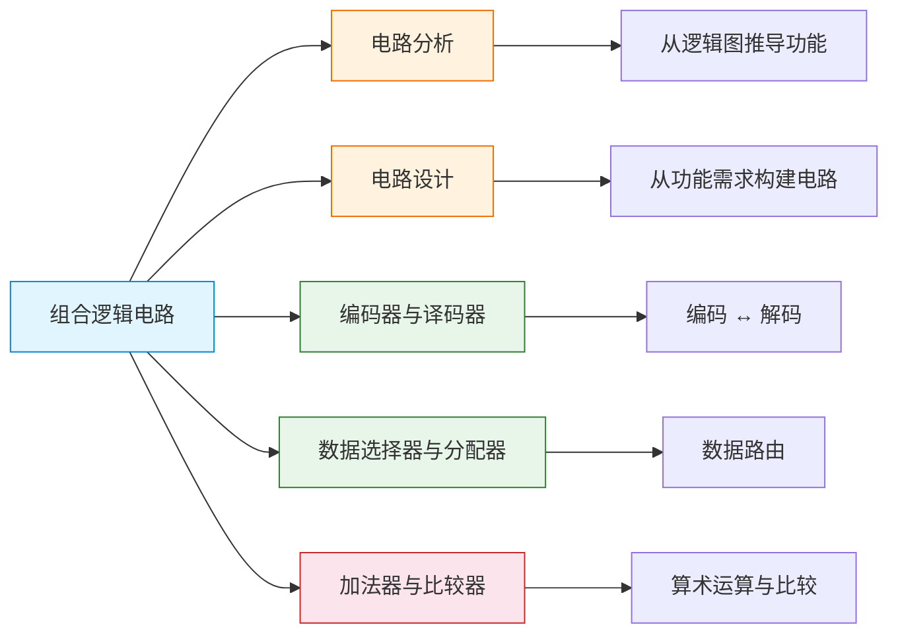

# 组合逻辑电路

> 组合逻辑电路就像一台"无记忆的计算器"——输出完全由当前输入决定，不留任何"历史痕迹"。

## 章节导览

## 本章概述

组合逻辑电路是数字系统的核心组成部分，其**输出仅取决于当前输入**，与电路过去的状态无关。这使得组合逻辑电路具有无记忆性、无反馈环路的特点，是构建算术运算、数据选择、编码解码等功能的基础。

### 核心特征

| 特征 | 说明 |
|------|------|
| 无记忆性 | 输出仅由当前输入决定 |
| 无反馈 | 信号从输入到输出单向流动 |
| 瞬时性 | 输入变化后输出立即响应（忽略传输延迟） |
| 确定性 | 相同输入始终产生相同输出 |

### 学习路线

1. **组合电路分析** —— 掌握从逻辑图到功能描述的逆向推理能力
2. **组合电路设计** —— 掌握从功能需求到逻辑图的正向设计能力
3. **编码器与译码器** —— 理解编码/解码的基本原理与典型芯片
4. **数据选择器与分配器** —— 理解数据路由的原理与逻辑函数实现
5. **加法器与比较器** —— 理解算术运算电路与数值比较的实现

::: important 核心要点
组合逻辑电路的分析与设计是互逆过程：分析是"看图说话"，设计是"按需画图"。熟练掌握两者，是后续学习时序逻辑电路的基石。
:::
