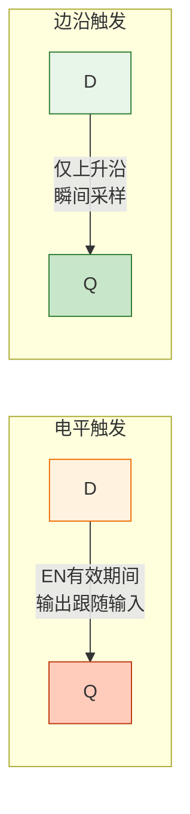
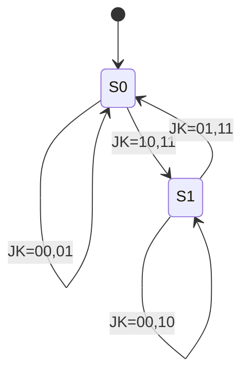
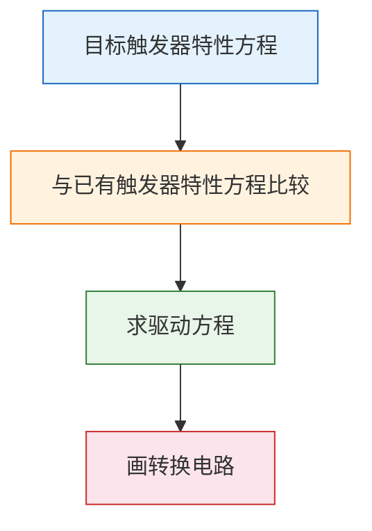
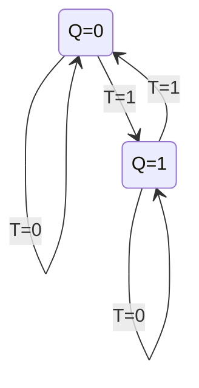

# 触发器

> 触发器就像"开关"——可以被置位或复位，一旦设定就保持状态，直到新的信号到来才改变。它是数字系统记忆功能的基石。

## 一、SR锁存器

### 1.1 基本SR锁存器（或非门构成）

**电路结构：** 两个或非门交叉耦合。

```
        ┌─────────────┐
   S ───┤ NOR ├──┬─── Q
         │     │  │
         └─────┘  │
              ┌────┘
              │
         ┌────┘
   R ───┤ NOR ├──┴─── Q̄
         │     │
         └─────┘
```

**功能表：**

| S | R | Q | Q̄ | 功能 |
|---|---|---|----|------|
| 0 | 0 | 不变 | 不变 | 保持 |
| 0 | 1 | 0 | 1 | 复位（Reset） |
| 1 | 0 | 1 | 0 | 置位（Set） |
| 1 | 1 | 0 | 0 | 禁止（非法） |

::: warning 约束条件
S=1 且 R=1 时，Q 和 Q̄ 同时为0，违反互补输出约定。当 S 和 R 同时撤消时，输出状态不确定。因此**不允许 S=R=1**，约束条件为 SR=0。
:::

### 1.2 门控SR锁存器

在基本SR锁存器前增加使能门，由使能信号 EN 控制。

| EN | S | R | Q⁺ | 功能 |
|----|---|---|-----|------|
| 0 | × | × | Q | 保持 |
| 1 | 0 | 0 | Q | 保持 |
| 1 | 0 | 1 | 0 | 复位 |
| 1 | 1 | 0 | 1 | 置位 |
| 1 | 1 | 1 | × | 禁止 |

---

## 二、D锁存器

D锁存器解决了SR锁存器的约束问题，用 D 端代替 S 和 R。

**逻辑功能：** 当 EN=1 时，Q 跟随 D；当 EN=0 时，Q 保持。

| EN | D | Q⁺ |
|----|---|-----|
| 0 | × | Q |
| 1 | 0 | 0 |
| 1 | 1 | 1 |

**特性方程：** $Q^{n+1} = EN \cdot D + \overline{EN} \cdot Q^n$

::: important 锁存器 vs 触发器
- **锁存器**：电平触发，在使能有效期间输出跟随输入变化（透明性）
- **触发器**：边沿触发，只在时钟跳变瞬间采样输入
:::

---

## 三、边沿触发器

### 3.1 边沿触发的原理

边沿触发器只在时钟信号的**上升沿或下降沿**时刻采样输入，避免了电平触发期间的"透明"问题。



### 3.2 D触发器

D触发器是最常用的触发器，**上升沿采样 D 端数据**。

**特性表：**

| CLK | D | Q⁺ |
|-----|---|-----|
| ↑ | 0 | 0 |
| ↑ | 1 | 1 |
| 非上升沿 | × | Q |

**特性方程：** $Q^{n+1} = D$

```verilog
// D触发器
module d_flipflop(
    input  CLK,
    input  D,
    output reg Q
);
    always @(posedge CLK)
        Q <= D;
endmodule
```

**时序图：**

```
CLK ──┐  ┌──┐  ┌──┐  ┌──┐  ┌──
      └──┘  └──┘  └──┘  └──┘
D    ──────┐        ┌──────────
          └────────┘
Q    ────────┐        ┌───────
            └────────┘
          ↑↑      ↑↑
       采样点   采样点
```

### 3.3 JK触发器

JK触发器是最通用的触发器，J 和 K 分别对应置位和复位，但 **J=K=1 时触发器翻转**。

**特性表：**

| J | K | Q⁺ | 功能 |
|---|---|-----|------|
| 0 | 0 | Q | 保持 |
| 0 | 1 | 0 | 复位 |
| 1 | 0 | 1 | 置位 |
| 1 | 1 | Q̄ | 翻转 |

**特性方程：**

$$Q^{n+1} = J\overline{Q^n} + \overline{K}Q^n$$

**状态图：**



### 3.4 T触发器

T触发器只有一个控制端 T，**T=1 时翻转，T=0 时保持**。

**特性表：**

| T | Q⁺ | 功能 |
|---|-----|------|
| 0 | Q | 保持 |
| 1 | Q̄ | 翻转 |

**特性方程：**

$$Q^{n+1} = T\overline{Q^n} + \overline{T}Q^n = T \oplus Q^n$$

### 3.5 T'触发器

T'触发器（翻转触发器）**每个时钟沿都翻转**，无需控制输入。

$$Q^{n+1} = \overline{Q^n}$$

---

## 四、触发器功能转换

利用已有触发器加组合逻辑，可以实现其他类型触发器。

### 4.1 转换方法



### 4.2 JK → D 转换

**目标：** $Q^{n+1} = D$

**JK特性方程：** $Q^{n+1} = J\overline{Q^n} + \overline{K}Q^n$

将目标方程变形为JK形式：

$$D = D(Q^n + \overline{Q^n}) = D\overline{Q^n} + DQ^n$$

比较得：$J = D$，$K = \overline{D}$

### 4.3 JK → T 转换

**目标：** $Q^{n+1} = T\overline{Q^n} + \overline{T}Q^n$

比较JK特性方程：

$J = T$，$K = T$

### 4.4 D → JK 转换

**目标：** $Q^{n+1} = J\overline{Q^n} + \overline{K}Q^n$

由D触发器特性方程：$Q^{n+1} = D$

因此：$D = J\overline{Q^n} + \overline{K}Q^n$

需要用组合逻辑实现 D 端的驱动方程。

### 4.5 转换对照表

| 已知→目标 | 驱动方程 |
|-----------|---------|
| JK→D | J=D, K=$\overline{D}$ |
| JK→T | J=T, K=T |
| D→JK | D=J$\overline{Q^n}$+$\overline{K}Q^n$ |
| D→T | D=T$\oplus Q^n$ |
| JK→T' | J=1, K=1 |
| D→T' | D=$\overline{Q^n}$ |

---

## 五、触发器特性方程与状态图汇总

| 触发器 | 特性方程 | 状态0→0 | 状态0→1 | 状态1→0 | 状态1→1 |
|--------|---------|---------|---------|---------|---------|
| SR | $Q^+=S+\overline{R}Q^n$ | SR=00,01 | SR=10 | SR=01 | SR=00,10 |
| JK | $Q^+=J\overline{Q^n}+\overline{K}Q^n$ | JK=00,01 | JK=10,11 | JK=01,11 | JK=00,10 |
| D | $Q^+=D$ | D=0 | D=1 | D=0 | D=1 |
| T | $Q^+=T \oplus Q^n$ | T=0 | T=1 | T=1 | T=0 |



---

## 六、异步控制端

实际触发器通常还有**异步置位端**（Preset, $S_D$）和**异步复位端**（Clear, $R_D$），它们不受时钟控制，优先级最高。

| $S_D$ | $R_D$ | CLK | Q | 功能 |
|--------|--------|-----|---|------|
| 0 | 0 | × | × | 禁止 |
| 1 | 0 | × | 0 | 异步复位 |
| 1 | 1 | ↑ | 正常 | 同步工作 |
| 0 | 1 | × | 1 | 异步置位 |

::: warning 异步端使用注意
- 异步端通常低电平有效
- 不允许两个异步端同时有效
- 正常工作时，异步端应处于无效状态
:::

---

## 七、练习题

### 题目一

画出D触发器的时序图。给定CLK和D的波形如下：

```
CLK ──┐  ┌──┐  ┌──┐  ┌──┐  ┌──
      └──┘  └──┘  └──┘  └──┘
D    ───┐     ┌──────┐
        └─────┘      └──────
```

::: details 参考解答

D触发器在CLK上升沿采样D值：

- 第1个上升沿：D=0 → Q=0
- 第2个上升沿：D=1 → Q=1
- 第3个上升沿：D=0 → Q=0
- 第4个上升沿：D=1 → Q=1（假设D在此时为1）

Q的波形相对于D在上升沿处变化，其余时间保持。
:::

### 题目二

用JK触发器实现T触发器，画出转换电路图。

::: details 参考解答

由转换对照表：J=T, K=T

将JK触发器的J端和K端短接，作为T输入端即可。

```
T ──┬── J
    │
    └── K
```

验证：当T=0时，JK=00，保持；当T=1时，JK=11，翻转。符合T触发器功能。
:::

### 题目三

用D触发器和门电路实现JK触发器。

::: details 参考解答

驱动方程：$D = J\overline{Q^n} + \overline{K}Q^n$

用逻辑门实现：

1. 与门1：$J\overline{Q^n}$ → J 和 $\overline{Q}$ 相与
2. 与门2：$\overline{K}Q^n$ → $\overline{K}$ 和 Q 相与
3. 或门：两个与门输出相或得到 D

D端接到D触发器的输入，Q端反馈回与门1和与门2。

```verilog
module jk_from_d(
    input  CLK, J, K,
    output Q
);
    wire D;
    assign D = (J & ~Q) | (~K & Q);
    d_flipflop dff(.CLK(CLK), .D(D), .Q(Q));
endmodule
```
:::

---

::: tip 面试速查
- 锁存器电平触发（透明），触发器边沿触发（非透明）
- 四种触发器特性方程：
  - **D**: $Q^+=D$
  - **JK**: $Q^+=J\overline{Q}+\overline{K}Q$
  - **T**: $Q^+=T\oplus Q$
  - **SR**: $Q^+=S+\overline{R}Q$（约束SR=0）
- 功能转换核心：令目标方程=已有方程，比较得驱动方程
- JK触发器最通用（无约束），D触发器最常用（简单）
:::

::: info 原著参考
- 阎石《数字电子技术基础》第六版 第4章
- 康华光《电子技术基础·数字部分》第七版 第4章
