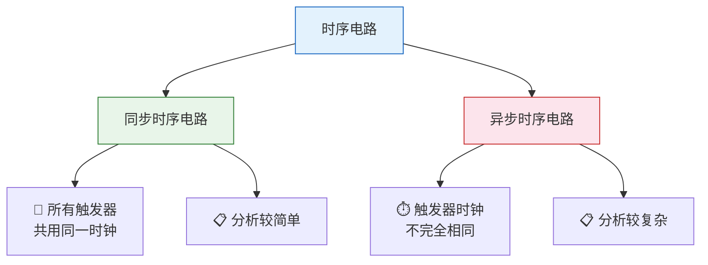
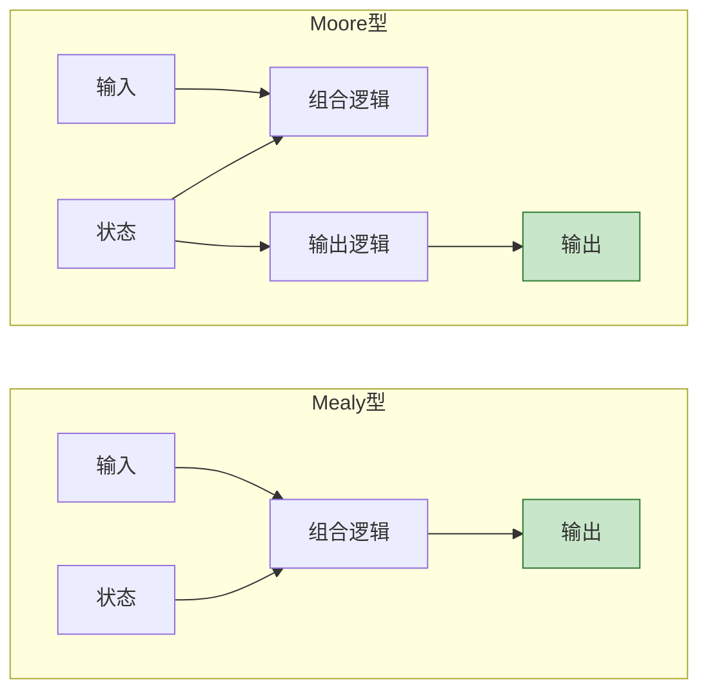
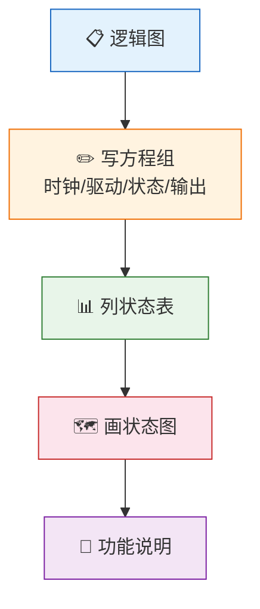
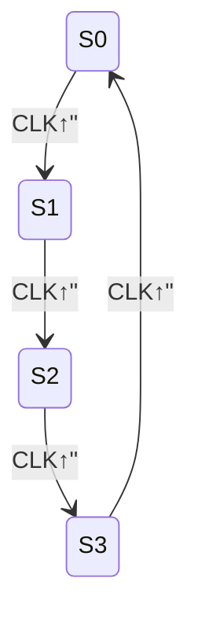
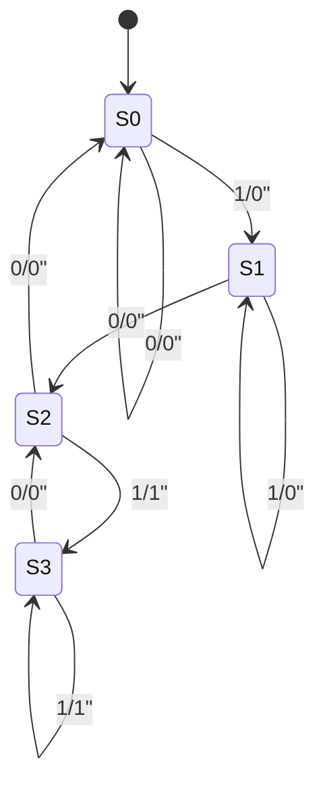
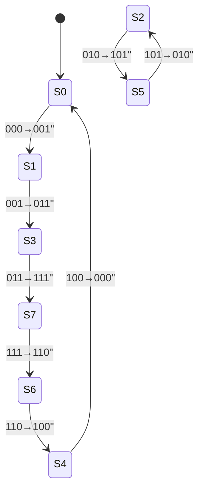

# 时序电路分析

> 时序电路分析就像"解读密码机"——从电路结构出发，推导出状态转换规律，揭示电路的动态行为。

## 一、时序电路的分类

### 1.1 按时钟分类

| 分类 | 特点 | 优点 | 缺点 |
|------|------|------|------|
| 同步 | 统一时钟 | 可靠、易分析 | 时钟偏移问题 |
| 异步 | 无统一时钟 | 速度快、功耗低 | 竞争冒险、分析难 |

### 1.2 按输出分类

| 分类 | 输出依赖 | 特点 |
|------|---------|------|
| Mealy型 | 输出 = f(输入, 状态) | 输出与输入和状态都有关 |
| Moore型 | 输出 = f(状态) | 输出仅与状态有关 |

---

## 二、同步时序电路分析步骤

### 2.1 分析流程

### 2.2 详细步骤

**第一步：写方程组**

1. **时钟方程**：各触发器时钟信号的逻辑表达式（同步电路中通常相同）
2. **驱动方程**：各触发器输入端的逻辑表达式
3. **状态方程**：将驱动方程代入触发器特性方程得到的次态表达式
4. **输出方程**：输出信号与输入、状态的关系

**第二步：列状态表**

将所有输入和现态的组合代入状态方程和输出方程，求出次态和输出。

**第三步：画状态图**

用圆圈表示状态，箭头表示转换，标注输入/输出。

**第四步：功能说明**

根据状态图描述电路的逻辑功能。

---

## 三、分析实例

### 3.1 例一：模4计数器

**电路描述：** 两个JK触发器组成的同步电路，无外部输入。

**驱动方程：**

$$J_0 = K_0 = 1$$
$$J_1 = K_1 = Q_0^n$$

**状态方程：**（代入JK触发器特性方程 $Q^{n+1} = J\overline{Q^n} + \overline{K}Q^n$）

$$Q_0^{n+1} = 1 \cdot \overline{Q_0^n} + \overline{1} \cdot Q_0^n = \overline{Q_0^n}$$

$$Q_1^{n+1} = Q_0^n\overline{Q_1^n} + \overline{Q_0^n}Q_1^n = Q_0^n \oplus Q_1^n$$

**状态表：**

| $Q_1^n$ | $Q_0^n$ | $Q_1^{n+1}$ | $Q_0^{n+1}$ | 十进制 |
|---------|---------|-------------|-------------|--------|
| 0 | 0 | 0 | 1 | 0→1 |
| 0 | 1 | 1 | 0 | 1→2 |
| 1 | 0 | 1 | 1 | 2→3 |
| 1 | 1 | 0 | 0 | 3→0 |

**状态图：**

**功能说明：** 这是一个**模4同步计数器**（两位二进制计数器），按00→01→10→11循环计数。

### 3.2 例二：序列检测器（检测"101"）

**电路描述：** 两个D触发器，输入X，输出Y。

**驱动方程：**

$$D_1 = X \cdot Q_0^n$$
$$D_0 = X$$

**输出方程：**

$$Y = X \cdot Q_1^n$$

**状态方程：**

$$Q_1^{n+1} = X \cdot Q_0^n$$
$$Q_0^{n+1} = X$$

**状态表：**

| $Q_1^n$ | $Q_0^n$ | X | $Q_1^{n+1}$ | $Q_0^{n+1}$ | Y |
|---------|---------|---|-------------|-------------|---|
| 0 | 0 | 0 | 0 | 0 | 0 |
| 0 | 0 | 1 | 0 | 1 | 0 |
| 0 | 1 | 0 | 0 | 0 | 0 |
| 0 | 1 | 1 | 1 | 1 | 0 |
| 1 | 0 | 0 | 0 | 0 | 0 |
| 1 | 0 | 1 | 0 | 1 | 1 |
| 1 | 1 | 0 | 0 | 0 | 0 |
| 1 | 1 | 1 | 1 | 1 | 1 |

**状态图（Mealy型）：**

::: info 分析
- S0：初始状态，未收到有效输入
- S1：收到"1"
- S2：收到"10"
- S3：收到"101"（检测到序列，输出1）

当输入序列中出现"101"时，输出Y=1。这是Mealy型，因为Y同时取决于X和Q₁。
:::

### 3.3 例三：扭环形计数器

**电路描述：** 3个D触发器，$D_0 = \overline{Q_2^n}$，$D_1 = Q_0^n$，$D_2 = Q_1^n$。

**状态方程：**

$$Q_0^{n+1} = \overline{Q_2^n}$$
$$Q_1^{n+1} = Q_0^n$$
$$Q_2^{n+1} = Q_1^n$$

**状态表：**

| $Q_2^n$ | $Q_1^n$ | $Q_0^n$ | $Q_2^{n+1}$ | $Q_1^{n+1}$ | $Q_0^{n+1}$ |
|---------|---------|---------|-------------|-------------|-------------|
| 0 | 0 | 0 | 0 | 0 | 1 |
| 0 | 0 | 1 | 0 | 1 | 1 |
| 0 | 1 | 0 | 1 | 0 | 1 |
| 0 | 1 | 1 | 1 | 1 | 1 |
| 1 | 0 | 0 | 0 | 0 | 0 |
| 1 | 0 | 1 | 0 | 1 | 0 |
| 1 | 1 | 0 | 1 | 0 | 0 |
| 1 | 1 | 1 | 1 | 1 | 0 |

**状态图：**

**功能说明：** 有效循环为000→001→011→111→110→100→000（6个状态），010和101构成无效循环。这是**模6扭环形计数器**。

::: warning 自启动问题
该电路不能自启动——如果落入无效循环（010↔101），电路将永远无法回到有效循环。需要修改设计以实现自启动。
:::

---

## 四、异步时序电路分析要点

异步时序电路的分析比同步电路复杂，主要区别在于：

| 方面 | 同步电路 | 异步电路 |
|------|---------|---------|
| 时钟 | 统一 | 各触发器时钟不同 |
| 状态转换 | 同时 | 依时钟先后 |
| 分析方法 | 统一处理 | 需考虑触发顺序 |

**异步分析额外步骤：**

1. 写出每个触发器的时钟方程
2. 确定每个触发器的触发条件
3. 只有满足触发条件时，才计算次态

---

## 五、练习题

### 题目一

分析以下同步时序电路：两个JK触发器，驱动方程为 $J_0 = \overline{Q_1^n}$，$K_0 = 1$，$J_1 = Q_0^n$，$K_1 = 1$。画出状态图并说明功能。

::: details 参考解答

**状态方程：**

$Q_0^{n+1} = \overline{Q_1^n}\overline{Q_0^n} + \overline{1} \cdot Q_0^n = \overline{Q_1^n}\overline{Q_0^n}$

$Q_1^{n+1} = Q_0^n\overline{Q_1^n} + \overline{1} \cdot Q_1^n = Q_0^n\overline{Q_1^n}$

**状态表：**

| $Q_1^n$ | $Q_0^n$ | $Q_1^{n+1}$ | $Q_0^{n+1}$ |
|---------|---------|-------------|-------------|
| 0 | 0 | 0 | 1 |
| 0 | 1 | 1 | 0 |
| 1 | 0 | 0 | 0 |
| 1 | 1 | 0 | 0 |

**状态图：**

00 → 01 → 10 → 00

状态11→00，可以自启动。

**功能：模3计数器**，有效状态为00、01、10。
:::

### 题目二

分析一个由两个D触发器组成的同步时序电路：$D_0 = X \oplus Q_0^n$，$D_1 = Q_0^n$，输出 $Y = Q_1^n \cdot \overline{Q_0^n}$。列出状态表，画出状态图。

::: details 参考解答

**状态方程：**

$Q_0^{n+1} = X \oplus Q_0^n$
$Q_1^{n+1} = Q_0^n$

**输出方程：** $Y = Q_1^n \cdot \overline{Q_0^n}$

**状态表：**

| $Q_1^n$ | $Q_0^n$ | X | $Q_1^{n+1}$ | $Q_0^{n+1}$ | Y |
|---------|---------|---|-------------|-------------|---|
| 0 | 0 | 0 | 0 | 0 | 0 |
| 0 | 0 | 1 | 0 | 1 | 0 |
| 0 | 1 | 0 | 1 | 1 | 0 |
| 0 | 1 | 1 | 1 | 0 | 0 |
| 1 | 0 | 0 | 0 | 0 | 1 |
| 1 | 0 | 1 | 0 | 1 | 1 |
| 1 | 1 | 0 | 1 | 1 | 0 |
| 1 | 1 | 1 | 1 | 0 | 0 |

**Moore型输出**：Y仅与状态有关。状态10时输出1。

**功能分析：** 当X=0时，电路按00→00/01→11→10→00循环（取决于初始状态）。当X=1时，Q₀翻转。Y在状态10时为1。
:::

### 题目三

分析一个三位扭环形计数器（4个D触发器），$D_0 = \overline{Q_3^n}$，$D_i = Q_{i-1}^n$（i=1,2,3），画出完整状态图，判断能否自启动。

::: details 参考解答

**状态方程：**

$Q_0^{n+1} = \overline{Q_3^n}$，$Q_1^{n+1} = Q_0^n$，$Q_2^{n+1} = Q_1^n$，$Q_3^{n+1} = Q_2^n$

**有效循环（8个状态）：**

0000 → 0001 → 0011 → 0111 → 1111 → 1110 → 1100 → 1000 → 0000

**无效状态：**

0010 → 0101 → 1011 → 0110 → 1101 → 1010 → 0100 → 1001 → 0010

两个循环（各8个状态），无法自启动。

要实现自启动，需修改 $D_0$ 的反馈逻辑，打破无效循环。
:::

---

::: tip 面试速查
- 时序电路分析四步法：**方程组 → 状态表 → 状态图 → 功能说明**
- Mealy vs Moore：输出是否与输入有关
- 同步 vs 异步：时钟是否统一
- 自启动：所有无效状态都能在有限步内回到有效循环
- 状态方程求法：驱动方程代入触发器特性方程
:::

::: info 原著参考
- 阎石《数字电子技术基础》第六版 第5章
- 康华光《电子技术基础·数字部分》第七版 第5章
