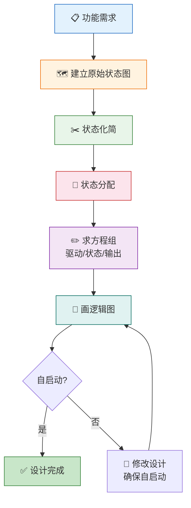
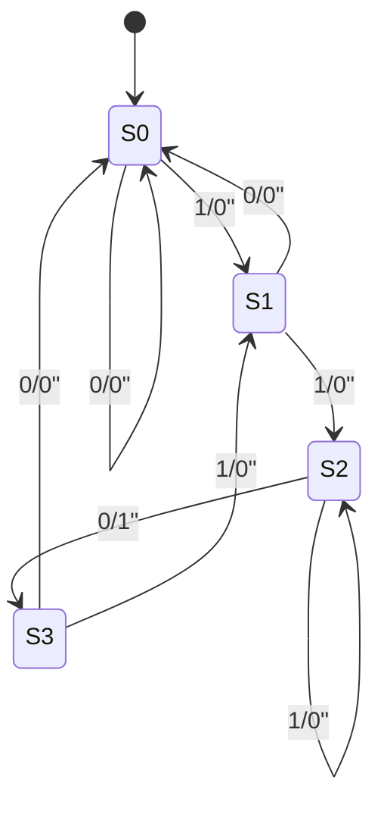
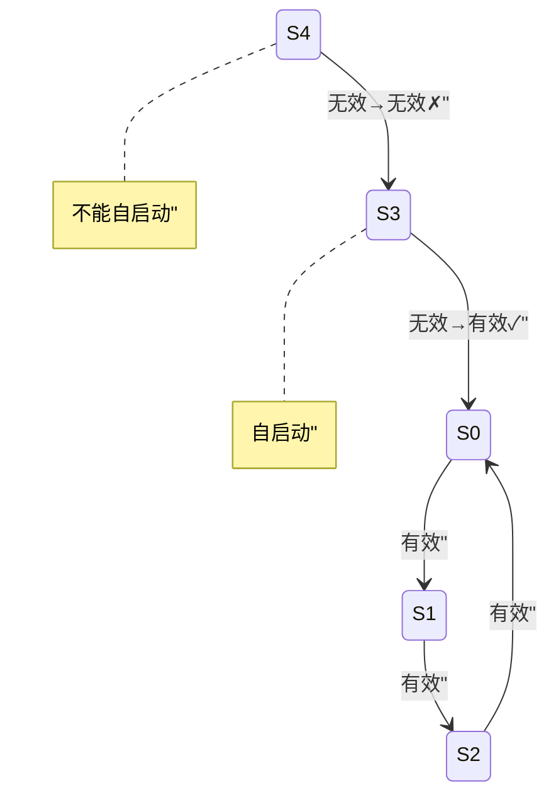

# 时序电路设计

> 时序电路设计就像"编排交响乐"——每个乐章（状态）的衔接、每个声部（触发器）的配合，都需要精心编排，才能奏出完美的功能乐章。

## 一、同步时序电路设计步骤

### 1.1 设计流程



### 1.2 详细步骤

| 步骤 | 内容 | 关键点 |
|------|------|--------|
| 1. 建立原始状态图 | 根据功能需求画出状态转换图 | 状态宁多勿少，确保功能完整 |
| 2. 状态化简 | 合并等价状态 | 等价状态：输入相同→输出相同、次态相同 |
| 3. 状态分配 | 给每个状态分配二进制编码 | 相邻状态尽量分配相邻编码 |
| 4. 求方程组 | 求驱动方程、输出方程 | 用卡诺图化简 |
| 5. 画逻辑图 | 用触发器和门电路实现 | 注意触发器类型选择 |
| 6. 自启动检查 | 检查无效状态能否回到有效循环 | 不能自启动则修改设计 |

---

## 二、设计实例

### 2.1 例一：序列检测器（检测"110"）

**需求：** 设计一个Mealy型序列检测器，当输入序列中出现"110"时输出1。

**第一步：建立原始状态图**

设定状态含义：

- S₀：初始状态，未收到有效序列
- S₁：收到"1"
- S₂：收到"11"
- S₃：收到"110"（检测到）



::: important 状态含义
- S₀ 收到0 → 仍在S₀（无有效前缀）
- S₁ 收到1 → 进入S₂（收到"11"）
- S₂ 收到0 → 检测到"110"，输出1，进入S₃
- S₃ 收到1 → 相当于收到新的"1"，进入S₁
:::

**第二步：状态化简**

观察S₀和S₃：在相同输入下，输出相同且次态相同（输入0都到S₀/0，输入1都到S₁/0），因此S₀和S₃**等价**，可以合并。

化简后的状态：S₀、S₁、S₂

**第三步：状态分配**

3个状态需要2个触发器（$2^2 = 4 > 3$）：

| 状态 | Q₁ Q₀ |
|------|--------|
| S₀ | 0 0 |
| S₁ | 0 1 |
| S₂ | 1 0 |

（11为无效状态）

**第四步：列状态表并求方程**

| $Q_1^n Q_0^n$ | X | $Q_1^{n+1} Q_0^{n+1}$ | Y |
|----------------|---|------------------------|---|
| 00 | 0 | 00 | 0 |
| 00 | 1 | 01 | 0 |
| 01 | 0 | 00 | 0 |
| 01 | 1 | 10 | 0 |
| 10 | 0 | 00 | 1 |
| 10 | 1 | 10 | 0 |
| 11 | 0 | ×× | × |
| 11 | 1 | ×× | × |

用D触发器实现（$D_i = Q_i^{n+1}$），由卡诺图化简：

$$D_1 = Q_0^n X + Q_1^n X$$
$$D_0 = \overline{Q_1^n}\,\overline{Q_0^n}X$$
$$Y = Q_1^n\overline{X}$$

**第五步：自启动检查**

无效状态11：
- X=0：$Q_1^{n+1}Q_0^{n+1}$ = 00（回到有效状态）
- X=1：$Q_1^{n+1}Q_0^{n+1}$ = 10（回到有效状态）

**可以自启动**。

```verilog
// 110序列检测器
module seq_detector_110(
    input  CLK, X,
    output Y
);
    reg Q1, Q0;
    wire D1, D0;

    assign D1 = (Q0 & X) | (Q1 & X);
    assign D0 = ~Q1 & ~Q0 & X;
    assign Y  = Q1 & ~X;

    always @(posedge CLK) begin
        Q1 <= D1;
        Q0 <= D0;
    end
endmodule
```

---

### 2.2 例二：模5计数器

**需求：** 设计一个同步模5计数器（计数0~4），用JK触发器实现。

**第一步：确定触发器个数**

5个状态需要3个JK触发器（$2^3 = 8 > 5$）。

**第二步：状态分配**

| 状态 | Q₂ Q₁ Q₀ |
|------|-----------|
| 0 | 0 0 0 |
| 1 | 0 0 1 |
| 2 | 0 1 0 |
| 3 | 0 1 1 |
| 4 | 1 0 0 |

无效状态：101、110、111

**第三步：列状态表并求驱动方程**

| $Q_2^n Q_1^n Q_0^n$ | $Q_2^{n+1} Q_1^{n+1} Q_0^{n+1}$ |
|----------------------|----------------------------------|
| 000 | 001 |
| 001 | 010 |
| 010 | 011 |
| 011 | 100 |
| 100 | 000 |
| 101 | ××× |
| 110 | ××× |
| 111 | ××× |

**用卡诺图化简（利用无关项）：**

$Q_2^{n+1}$ 的卡诺图：

| $Q_2Q_1$ \ $Q_0$ | 0 | 1 |
|--------------------|---|---|
| 00 | 0 | 0 |
| 01 | 0 | 1 |
| 11 | × | × |
| 10 | 0 | × |

$$Q_2^{n+1} = Q_1^n Q_0^n$$

$Q_1^{n+1}$ 的卡诺图：

| $Q_2Q_1$ \ $Q_0$ | 0 | 1 |
|--------------------|---|---|
| 00 | 0 | 1 |
| 01 | 1 | 0 |
| 11 | × | × |
| 10 | 0 | × |

$$Q_1^{n+1} = Q_1^n \oplus Q_0^n$$

$Q_0^{n+1}$ 的卡诺图：

| $Q_2Q_1$ \ $Q_0$ | 0 | 1 |
|--------------------|---|---|
| 00 | 1 | 0 |
| 01 | 1 | 0 |
| 11 | × | × |
| 10 | 0 | × |

$$Q_0^{n+1} = \overline{Q_2^n}\,\overline{Q_0^n}$$

**JK驱动方程：** 由 $Q^{n+1} = J\overline{Q^n} + \overline{K}Q^n$ 比较：

$Q_2^{n+1} = Q_1^n Q_0^n$ → $J_2 = Q_1^n Q_0^n$，$K_2 = 1$（当 $Q_2^n=1$ 时次态为0）

$Q_1^{n+1} = Q_1^n \oplus Q_0^n$ → $J_1 = Q_0^n$，$K_1 = Q_0^n$

$Q_0^{n+1} = \overline{Q_2^n}\,\overline{Q_0^n}$ → $J_0 = \overline{Q_2^n}$，$K_0 = 1$

**第四步：自启动检查**

| 无效状态 | 次态 | 能否回到有效循环 |
|---------|------|----------------|
| 101 | $Q_2^+=1\cdot1=1, Q_1^+=0, Q_0^+=\overline{1}\cdot\overline{1}=0$ → 100 | 能 |
| 110 | $Q_2^+=1\cdot0=0, Q_1^+=1\oplus0=1, Q_0^+=\overline{1}\cdot\overline{0}=0$ → 010 | 能 |
| 111 | $Q_2^+=1\cdot1=1, Q_1^+=1\oplus1=0, Q_0^+=\overline{1}\cdot\overline{1}=0$ → 100 | 能 |

**可以自启动**。

---

## 三、自启动设计

### 3.1 什么是自启动

当电路因干扰等原因进入**无效状态**时，经过若干时钟周期后能**自动回到有效循环**，则称电路可以自启动。



### 3.2 实现自启动的方法

1. **利用无关项**：在卡诺图化简时，使无效状态的次态指向有效状态
2. **修改反馈逻辑**：调整驱动方程，打破无效循环
3. **强制复位**：用检测电路检测无效状态并异步复位

::: important 自启动设计原则
- 在卡诺图化简时，不要随意圈无关项，要使无效状态的次态指向有效状态
- 如果最简表达式不满足自启动，可以适当增加电路复杂度来实现自启动
- 自启动是时序电路设计的基本要求，不可省略
:::

### 3.3 自启动设计示例

**问题：** 扭环形计数器（3位），有效循环为000→001→011→111→110→100，无效循环为010↔101。

**修改方法：** 改变 $D_0$ 的方程，使状态010的次态变为011而非101。

原方程：$D_0 = \overline{Q_2^n}$

新方程：在状态010时，使 $D_0 = 1$ 而非0。

$D_0 = \overline{Q_2^n} + \overline{Q_1^n}Q_0^n = \overline{Q_2^n} + \overline{Q_1^n \cdot \overline{Q_0^n}}$

验证状态010：$D_0 = \overline{0} + \overline{1 \cdot \overline{0}} = 1 + 0 = 1$，次态为011（有效）✓

---

## 四、设计方法总结

| 方法 | 适用场景 | 触发器选择 |
|------|---------|-----------|
| 状态图法 | 通用 | JK或D均可 |
| 修改计数法 | 计数器设计 | JK更方便 |
| 反馈移位法 | 移位型计数器 | D触发器 |

### 触发器选择建议

| 触发器 | 适用场景 | 理由 |
|--------|---------|------|
| JK触发器 | 通用时序电路 | 功能最全，驱动方程灵活 |
| D触发器 | 移位寄存器、简单计数器 | $D_i = Q_i^{n+1}$，直接对应 |

---

## 五、练习题

### 题目一

设计一个Mealy型序列检测器，检测输入序列"1011"，画出原始状态图。

::: details 参考解答

设定状态：

- S₀：初始状态
- S₁：收到"1"
- S₂：收到"10"
- S₃：收到"101"

状态图：

```
S₀ ──0/0──→ S₀
S₀ ──1/0──→ S₁
S₁ ──0/0──→ S₂
S₁ ──1/0──→ S₁（收到"11"，最后一个1仍有效）
S₂ ──0/0──→ S₀
S₂ ──1/0──→ S₃
S₃ ──0/0──→ S₂（"1010"中的"10"仍有效）
S₃ ──1/1──→ S₁（检测到"1011"，输出的1相当于新的起始"1"）
```

注意S₃收到1时输出1，且进入S₁（因为"1011"中最后的1可以作为新序列的起始）。
:::

### 题目二

用JK触发器设计一个模6计数器（0~5循环），确保能自启动。

::: details 参考解答

需要3个JK触发器，状态分配：

| 状态 | Q₂Q₁Q₀ |
|------|---------|
| 0 | 000 |
| 1 | 001 |
| 2 | 010 |
| 3 | 011 |
| 4 | 100 |
| 5 | 101 |

无效状态：110、111

状态表及次态（利用无关项化简）：

| $Q_2Q_1Q_0$ | $Q_2^+Q_1^+Q_0^+$ |
|-------------|-------------------|
| 000 | 001 |
| 001 | 010 |
| 010 | 011 |
| 011 | 100 |
| 100 | 101 |
| 101 | 000 |
| 110 | ××× → 设为000 |
| 111 | ××× → 设为000 |

由卡诺图化简次态方程：

$Q_2^+ = Q_1^n Q_0^n$（与模5计数器类似）
$Q_1^+ = Q_1^n \oplus Q_0^n$，但需考虑Q₂的影响

更精确的化简（确保110→000, 111→000）：

$Q_2^+ = \overline{Q_2^n}Q_1^nQ_0^n$（当Q₂=1时Q₂^+=0）

$Q_1^+ = \overline{Q_2^n}Q_0^n + Q_1^n\overline{Q_0^n}$... 需仔细卡诺图化简。

实际上模6计数器可以看作模8计数器（自然二进制）跳过110和111，利用清零实现。
:::

### 题目三

设计一个同步时序电路，输入X，当连续收到3个或3个以上1时输出1。用D触发器实现。

::: details 参考解答

**状态设定：**

- S₀：初始/收到0
- S₁：收到1个1
- S₂：收到2个1
- S₃：收到3个或以上1

**状态图（Moore型）：**

```
S₀ ──0──→ S₀ (输出0)
S₀ ──1──→ S₁ (输出0)
S₁ ──0──→ S₀ (输出0)
S₁ ──1──→ S₂ (输出0)
S₂ ──0──→ S₀ (输出0)
S₂ ──1──→ S₃ (输出1)
S₃ ──0──→ S₀ (输出0)
S₃ ──1──→ S₃ (输出1)
```

需要2个D触发器（4个状态刚好）：

| 状态 | Q₁Q₀ | Y |
|------|-------|---|
| S₀ | 00 | 0 |
| S₁ | 01 | 0 |
| S₂ | 10 | 0 |
| S₃ | 11 | 1 |

**驱动方程：**

$D_1 = Q_1^n Q_0^n X + \overline{Q_1^n}Q_0^n X + Q_1^n\overline{Q_0^n}X = Q_0^n X + Q_1^n X$

$D_0 = X$

**输出方程：** $Y = Q_1^n Q_0^n$（Moore型，仅取决于状态）

自启动：无无效状态，无需检查。
:::

---

::: tip 面试速查
- 时序电路设计六步法：**原始状态图 → 状态化简 → 状态分配 → 求方程 → 画逻辑图 → 自启动检查**
- 状态化简：合并等价状态（同输入→同输出+同次态）
- 状态分配：相邻状态分配相邻编码（减少激励函数复杂度）
- 自启动：无效状态必须能在有限步内回到有效循环
- D触发器：$D_i = Q_i^{n+1}$，直接由次态卡诺图得到
- JK触发器：比较次态与现态求J、K值
:::

::: info 原著参考
- 阎石《数字电子技术基础》第六版 第5章
- 康华光《电子技术基础·数字部分》第七版 第5章
