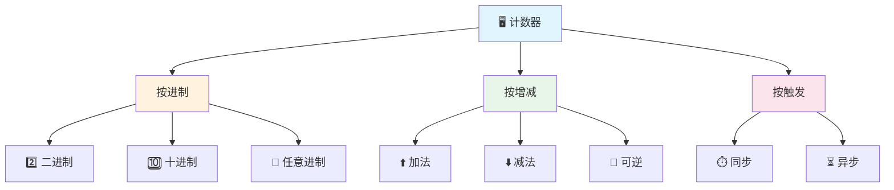
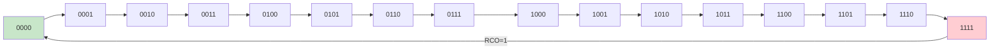
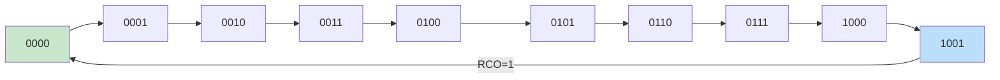
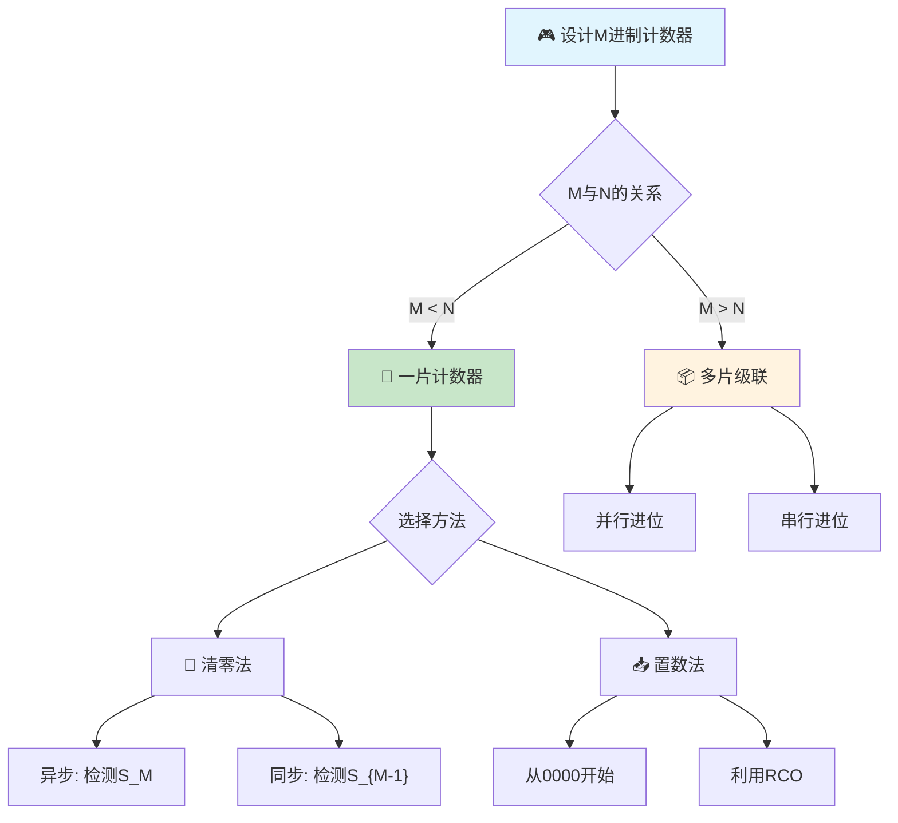

> 计数器如同数字世界的节拍器，每一个时钟脉冲都是一次心跳，它忠实记录着脉冲的来去，将时间的流逝转化为二进制的计数。

---

## 一、计数器的分类

计数器是数字系统中应用最广泛的时序逻辑电路之一，其基本功能是对输入时钟脉冲进行计数。

### 1.1 按计数进制分类

| 分类 | 说明 | 典型模值 |
|------|------|----------|
| 二进制计数器 | 模 $M = 2^n$ | 2, 4, 8, 16... |
| 十进制计数器 | 模 $M = 10$ | 10 |
| 任意进制计数器 | 模 $M$ 为任意值 | 5, 6, 7, 12... |

### 1.2 按计数增减分类

| 分类 | 说明 | 特点 |
|------|------|------|
| 加法计数器 | 每来一个CP，计数值加1 | 最常用 |
| 减法计数器 | 每来一个CP，计数值减1 | 可由加法计数器转换 |
| 可逆计数器 | 可加可减，由控制信号决定 | 灵活性高 |

### 1.3 按触发方式分类

| 分类 | 说明 | 特点 |
|------|------|------|
| 同步计数器 | 所有触发器共用同一CP | 工作频率高，无过渡状态 |
| 异步计数器 | 触发器CP来源不同 | 电路简单，工作速度慢 |



---

## 二、同步二进制计数器

### 2.1 同步四位二进制加法计数器

同步二进制计数器的构成规律：

- **每一位**：由JK触发器构成，$J = K = 1$（T'触发器）
- **进位条件**：第 $i$ 位翻转的条件是低 $i-1$ 位全为1
- 驱动方程：$T_i = Q_{i-1} \cdot Q_{i-2} \cdots Q_1 \cdot Q_0$

::: important 同步二进制计数器的进位规律
第 $i$ 位触发器的驱动信号为：
$$T_i = \prod_{j=0}^{i-1} Q_j$$

即：只有当所有低位都为1时，高位才翻转。这就是"逢二进一"的硬件实现。
:::

### 2.2 74HC161 —— 同步四位二进制计数器

74HC161 是最常用的同步四位二进制加法计数器，具有同步预置、异步清零功能。

#### 引脚与功能

| 引脚 | 名称 | 功能 |
|------|------|------|
| CLK | 时钟输入 | 上升沿触发 |
| $\overline{CLR}$ | 异步清零 | 低电平有效，优先级最高 |
| $\overline{LD}$ | 同步置数 | 低电平有效，在CP↑时将D→Q |
| ENP | 计数使能P | 高电平有效 |
| ENT | 计数使能T | 高电平有效，同时控制RCO |
| D₃D₂D₁D₀ | 并行数据输入 | 预置数输入端 |
| Q₃Q₂Q₁Q₀ | 计数输出 | 四位二进制输出 |
| RCO | 进位输出 | $RCO = ENT \cdot Q_3 \cdot Q_2 \cdot Q_1 \cdot Q_0$ |

#### 功能表

| $\overline{CLR}$ | $\overline{LD}$ | ENP | ENT | CLK | 功能 |
|:-:|:-:|:-:|:-:|:-:|------|
| 0 | × | × | × | × | 异步清零 $Q = 0000$ |
| 1 | 0 | × | × | ↑ | 同步置数 $Q = D$ |
| 1 | 1 | 1 | 1 | ↑ | 同步计数 |
| 1 | 1 | 0 | × | × | 保持 |
| 1 | 1 | × | 0 | × | 保持（$RCO = 0$） |

::: tip 74HC161控制优先级
$\overline{CLR}$ > $\overline{LD}$ > ENP·ENT > 保持

异步清零最优先，不需要等时钟；同步置数需要等时钟上升沿。
:::

#### 状态转换图



---

## 三、同步十进制计数器

### 3.1 74HC160 —— 同步十进制计数器

74HC160 与 74HC161 引脚完全相同，区别在于模值：161 是模16，160 是模10。

| 特性 | 74HC160 | 74HC161 |
|------|---------|---------|
| 计数模值 | 10 | 16 |
| 计数范围 | 0000~1001 | 0000~1111 |
| RCO条件 | $ENT \cdot Q_3 \cdot Q_0$ | $ENT \cdot Q_3 \cdot Q_2 \cdot Q_1 \cdot Q_0$ |
| 状态跳转 | 1001→0000 | 1111→0000 |

#### 十进制计数状态图



::: warning 74HC160的无效状态
状态 1010~1111 为无效状态。若计数器进入无效状态，正常情况下应能自启动回到有效循环。设计时需验证自启动性。
:::

---

## 四、异步计数器

### 4.1 异步二进制计数器

异步计数器的特点：高位触发器的时钟来自低位的输出，而非外部CP。


#### 异步计数器 vs 同步计数器

| 比较项 | 同步计数器 | 异步计数器 |
|--------|-----------|-----------|
| 时钟 | 共用CP | 逐级传递 |
| 工作速度 | 快 | 慢（延时累积） |
| 电路复杂度 | 较复杂（需进位逻辑） | 简单 |
| 过渡状态 | 无 | 有（可能产生竞争冒险） |
| 最高工作频率 | $f_{max}$ 由最慢触发器决定 | $f_{max}$ 受延时累积限制 |

### 4.2 异步十进制计数器（74HC290）

74HC290 是一种常用的异步二-五-十进制计数器：

- 可以作为模2计数器（CP₀输入，Q₀输出）
- 可以作为模5计数器（CP₁输入，Q₃Q₂Q₁输出）
- 将Q₀连到CP₁，构成模10计数器（8421BCD码）
- 将Q₃连到CP₀，构成模10计数器（5421BCD码）

---

## 五、任意进制计数器的设计

利用已有的 $N$ 进制计数器（如74HC161模16），构成 $M$ 进制计数器（$M < N$）。

### 5.1 清零法（复位法）

**原理**：当计数到目标状态时，产生清零信号，使计数器归零。

#### 异步清零法（适用于$\overline{CLR}$异步清零端）

- 检测状态：$S_M$（即第 $M$ 个状态，实际不在有效循环中）
- 反馈逻辑：$\overline{CLR} = \overline{\prod Q_i}$（$Q_i$为$S_M$中为1的位）

::: warning 异步清零法的过渡状态
异步清零法中，状态 $S_M$ 只是一个短暂的过渡状态，持续极短时间后立即被清零。因此，**有效状态为 $S_0 \sim S_{M-1}$，共 $M$ 个状态**。$S_M$ 不是稳定状态！
:::

#### 同步清零法（适用于同步清零端）

- 检测状态：$S_{M-1}$（因为是同步清零，需在CP到来时才清零）
- 反馈逻辑：同步清零端有效条件为 $S_{M-1}$

### 5.2 置数法（预置数法）

**原理**：当计数到某个状态时，将预置数加载到计数器，跳过不需要的状态。

#### 置数法设计步骤

1. 确定预置数值 $D$
2. 确定置数信号产生条件
3. 写出反馈逻辑

::: important 清零法 vs 置数法
| 比较项 | 清零法 | 置数法 |
|--------|--------|--------|
| 清零/置数端 | $\overline{CLR}$ | $\overline{LD}$ |
| 起始状态 | 固定从0000开始 | 可从任意状态开始 |
| 灵活性 | 低 | 高 |
| 过渡状态 | 异步清零有 | 无 |
| 适用范围 | $M < N$ | $M < N$，且可利用任意中间状态 |
:::

### 5.3 设计示例

**例1**：用74HC161设计模12计数器（异步清零法）

$$S_{12} = 1100$$

反馈逻辑：$\overline{CLR} = \overline{Q_3 \cdot Q_2}$

有效状态：0000~1011（12个状态）

**例2**：用74HC161设计模12计数器（同步置数法，从0000开始）

$$S_{11} = 1011$$

当 $Q_3Q_2Q_1Q_0 = 1011$ 时，$\overline{LD} = 0$

下一个CP↑时 $Q = D_3D_2D_1D_0 = 0000$

**例3**：用74HC161设计模12计数器（同步置数法，利用进位输出）

当 $RCO = 1$（即$Q = 1111$）时，$\overline{LD} = 0$

下一个CP↑时 $Q = D_3D_2D_1D_0 = 0100$（即$16 - 12 = 4$）

有效状态：0100~1111（12个状态）



---

## 六、计数器的级联扩展

### 6.1 级联方式

当需要计数的模值 $M > N$（单片计数器模值）时，需要将多片计数器级联。

| 级联方式 | 说明 | 特点 |
|----------|------|------|
| 并行进位（同步级联） | 所有芯片共用CP，用RCO控制使能端 | 速度快，需要使能逻辑 |
| 串行进位（异步级联） | 低位RCO作为高位CP | 速度慢，电路简单 |

### 6.2 并行进位级联

以两片74HC161构成模256计数器为例：

- 两片共用同一CP
- 低位片的RCO连接高位片的ENT和ENP
- 低位计满（1111）时，RCO=1，高位片使能，下一个CP↑高位加1

### 6.3 串行进位级联

- 低位片的RCO取反后连接高位片的CP
- 低位计满（1111→0000）时，RCO下降沿经取反变为上升沿，驱动高位

### 6.4 任意大模数计数器设计

**例**：用74HC161设计模60计数器

$60 = 10 \times 6$

方案：一片构成模10（74HC160或74HC161+清零法），一片构成模6（74HC161+清零法），两片串行级联。

```verilog
// 模60计数器（Verilog行为描述）
module counter60(
    input clk,
    input rst_n,
    output [5:0] count
);
    reg [5:0] count;
    always @(posedge clk or negedge rst_n) begin
        if (!rst_n)
            count <= 6'd0;
        else if (count == 6'd59)
            count <= 6'd0;
        else
            count <= count + 1;
    end
endmodule
```

---

## 七、典型习题与详解

### 习题1：用74HC161设计模7计数器

**要求**：分别用异步清零法和同步置数法实现。

**解（异步清零法）**：

$M = 7$，检测状态 $S_7 = 0111$

反馈逻辑：$\overline{CLR} = \overline{Q_2 \cdot Q_1 \cdot Q_0}$

有效状态：0000→0001→0010→0011→0100→0101→0110→(0111瞬间清零)→0000

**解（同步置数法，从0000开始）**：

$M = 7$，检测状态 $S_6 = 0110$

当 $Q_3Q_2Q_1Q_0 = 0110$ 时，$\overline{LD} = 0$，$D_3D_2D_1D_0 = 0000$

下一个CP↑时，$Q = 0000$

有效状态：0000→0001→0010→0011→0100→0101→0110→0000

### 习题2：用74HC160设计模24计数器

**要求**：用两片74HC160级联实现。

**解**：

$24 = 10 \times 2 + 4$（不便于拆分）或 $24 = 6 \times 4$

采用串行级联+清零法：

- 个位片：模10计数器（74HC160本身），RCO输出连十位片的使能端
- 十位片：用74HC160，当计到0010且个位计到0011时（即23），同步置数为0000

或者更简单：两片74HC160构成模100计数器，当十位=0010、个位=0011时（即23），产生清零信号。

有效状态：00~23，共24个状态。

### 习题3：分析如下计数器电路

已知74HC161的$\overline{LD}$端连接到$\overline{Q_3}$，$D_3D_2D_1D_0 = 0000$，分析计数模值。

**解**：

当 $Q_3 = 0$ 时，$\overline{LD} = 1$，正常计数

当 $Q_3 = 1$ 时，$\overline{LD} = 0$，下一个CP↑时 $Q = 0000$

计数序列：0000→0001→0010→0011→0100→0101→0110→0111→1000→(置数)→0000

模值 = 9

---

::: tip 面试速查
- 74HC161：四位同步二进制计数器，模16，异步清零，同步置数
- 74HC160：四位同步十进制计数器，模10，异步清零，同步置数
- 异步清零法检测 $S_M$，同步清零法/置数法检测 $S_{M-1}$
- 级联方式：并行进位（速度快）、串行进位（电路简单）
- RCO = ENT · Q₃ · Q₂ · Q₁ · Q₀（161）或 ENT · Q₃ · Q₀（160）
:::

::: info 原著参考
- 阎石《数字电子技术基础》第六版，第6章 时序逻辑电路
- 康华光《电子技术基础·数字部分》第七版，第6章
:::
