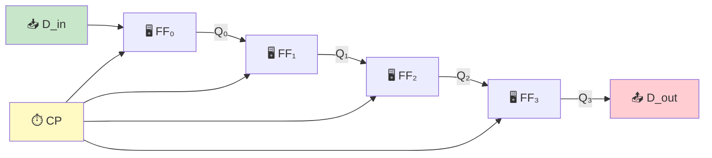
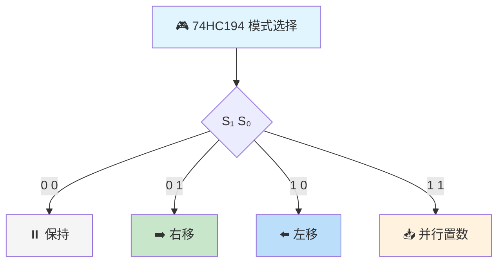
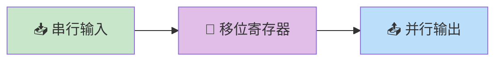
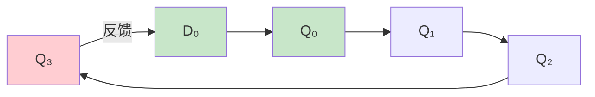
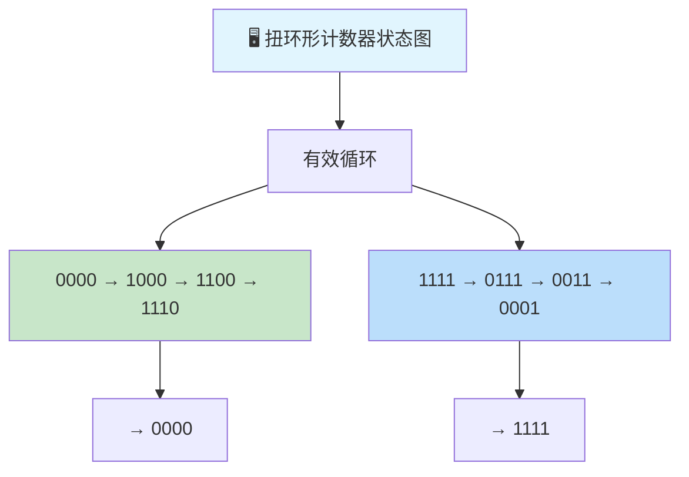

> 移位寄存器犹如数字世界中的传送带，数据位在其上依次流动，或左或右，将并行化为串行，将串行编织为并行，在时间的维度中完成数据的搬运与变换。

---

## 一、寄存器基本概念

### 1.1 什么是寄存器

寄存器是用于暂存二进制数据的时序逻辑电路，由触发器和控制门组成。

- **基本寄存器**：只能存储数据，不具备移位功能
- **移位寄存器**：在时钟脉冲作用下，数据可以逐位左移或右移

### 1.2 寄存器的基本结构



::: important 寄存器 vs 移位寄存器
- **寄存器**：并行输入、并行输出，只存不移
- **移位寄存器**：数据可在寄存器中逐位移动，实现串并转换、延时、序列生成等功能
:::

---

## 二、移位寄存器

### 2.1 右移寄存器

数据从左向右移动，每个CP上升沿，各位数据右移一位。

| CP序号 | D_SR | Q₀ | Q₁ | Q₂ | Q₃ |
|:------:|:----:|:--:|:--:|:--:|:--:|
| 0 | × | 0 | 0 | 0 | 0 |
| 1 | 1 | 1 | 0 | 0 | 0 |
| 2 | 0 | 0 | 1 | 0 | 0 |
| 3 | 1 | 1 | 0 | 1 | 0 |
| 4 | 1 | 1 | 1 | 0 | 1 |

驱动方程：$D_i = Q_{i-1}$，$D_0 = D_{SR}$

### 2.2 左移寄存器

数据从右向左移动，每个CP上升沿，各位数据左移一位。

驱动方程：$D_i = Q_{i+1}$，$D_n = D_{SL}$

### 2.3 双向移位寄存器 —— 74HC194

74HC194 是四位双向移位寄存器，具有并行输入、左移、右移、保持四种工作模式。

#### 引脚功能

| 引脚 | 名称 | 功能 |
|------|------|------|
| CLK | 时钟输入 | 上升沿触发 |
| $\overline{CLR}$ | 异步清零 | 低电平有效 |
| S₁, S₀ | 模式控制 | 选择工作方式 |
| D_SR | 右移串行输入 | 右移时数据输入端 |
| D_SL | 左移串行输入 | 左移时数据输入端 |
| D₃D₂D₁D₀ | 并行数据输入 | 并行置数输入端 |
| Q₃Q₂Q₁Q₀ | 输出端 | 四位并行输出 |

#### 功能表

| $\overline{CLR}$ | S₁ | S₀ | CLK | 功能 |
|:-:|:-:|:-:|:-:|------|
| 0 | × | × | × | 异步清零 $Q = 0000$ |
| 1 | 0 | 0 | ↑ | 保持 |
| 1 | 0 | 1 | ↑ | 右移（$D_{SR} \to Q_0$，$Q_i \to Q_{i+1}$） |
| 1 | 1 | 0 | ↑ | 左移（$D_{SL} \to Q_3$，$Q_i \to Q_{i-1}$） |
| 1 | 1 | 1 | ↑ | 并行置数 $Q = D$ |



::: tip 74HC194移位方向
- **右移**：数据从$D_{SR}$进入$Q_0$，$Q_0 \to Q_1 \to Q_2 \to Q_3$，$Q_3$移出
- **左移**：数据从$D_{SL}$进入$Q_3$，$Q_3 \to Q_2 \to Q_1 \to Q_0$，$Q_0$移出
- 注意"右移"的物理含义：下标递增方向
:::

---

## 三、移位寄存器的应用

### 3.1 延时功能

输入信号经过 $n$ 级移位寄存器后，延迟 $n$ 个时钟周期输出。

$$t_d = n \cdot T_{CP}$$

其中 $T_{CP}$ 为时钟周期，$n$ 为移位寄存器位数。

### 3.2 串并转换

#### 串入并出

数据从串行输入端逐位移入，$n$ 位数据需要 $n$ 个CP后，从并行输出端一次读出。



#### 并入串出

数据并行置入后，通过移位操作逐位从一端串行输出。

### 3.3 序列信号发生器

利用移位寄存器产生特定的序列信号。

**设计方法**：

1. 确定要产生的序列 $S = s_0 s_1 s_2 \cdots s_{L-1}$
2. 根据序列长度确定移位寄存器位数 $n$（$2^n \geq L$）
3. 设计反馈函数

**例**：设计产生序列 1011 的序列信号发生器

序列长度 $L = 4$，需要 $n = 2$ 位移位寄存器

| CP | Q₁ | Q₀ | 反馈F |
|:--:|:--:|:--:|:-----:|
| 0 | 1 | 0 | 1 |
| 1 | 0 | 1 | 1 |
| 2 | 1 | 1 | 0 |
| 3 | 1 | 1 | - |

$F = \overline{Q_1} \cdot Q_0 + Q_1 \cdot \overline{Q_0} + Q_1 \cdot Q_0 = Q_0 + Q_1$（需验证）

实际上更常用的是用移位寄存器的串行输入端接入反馈逻辑网络来实现。

```verilog
// 序列信号发生器（产生1011序列）
module seq_gen_1011(
    input clk,
    input rst_n,
    output reg seq_out
);
    reg [1:0] state;
    always @(posedge clk or negedge rst_n) begin
        if (!rst_n) begin
            state <= 2'b10;
            seq_out <= 1'b1;
        end else begin
            case (state)
                2'b10: begin state <= 2'b01; seq_out <= 1'b0; end
                2'b01: begin state <= 2'b11; seq_out <= 1'b1; end
                2'b11: begin state <= 2'b00; seq_out <= 1'b1; end
                2'b00: begin state <= 2'b10; seq_out <= 1'b1; end
                default: state <= 2'b10;
            endcase
        end
    end
endmodule
```

---

## 四、环形计数器

### 4.1 基本环形计数器

将移位寄存器的串行输出端反馈到串行输入端，构成环形计数器。

**结构**：$D_0 = Q_{n-1}$（右移寄存器首尾相连）

四位环形计数器的有效状态只有4个（占16个状态的1/4），状态利用率极低。



#### 状态转换

| 有效状态 | 说明 |
|----------|------|
| 1000 | 第1个CP |
| 0100 | 第2个CP |
| 0010 | 第3个CP |
| 0001 | 第4个CP |

::: warning 环形计数器的自启动问题
四位环形计数器有12个无效状态。若上电后进入无效状态（如1100），计数器将在无效循环中运行。必须加自启动逻辑。

自启动方法：将反馈函数改为 $D_0 = \overline{Q_0} \cdot \overline{Q_1} \cdot \overline{Q_2}$，即只有当$Q_0Q_1Q_2$全为0时才输入1。
:::

### 4.2 扭环形计数器（Johnson计数器）

将移位寄存器的反相输出端反馈到串行输入端。

**结构**：$D_0 = \overline{Q_{n-1}}$

四位扭环形计数器的有效状态有8个（占16个状态的1/2），状态利用率比环形计数器提高一倍。



| 特性 | 环形计数器 | 扭环形计数器 |
|------|-----------|-------------|
| 有效状态数 | $n$ | $2n$ |
| 状态利用率 | $n/2^n$ | $2n/2^n$ |
| 编码特点 | 单热码 | 循环码（相邻仅1位不同） |
| 译码逻辑 | 不需译码器 | 需2输入与门 |
| 自启动 | 需加逻辑 | 需加逻辑 |

::: important 扭环形计数器的编码优势
扭环形计数器的相邻状态仅有一位不同，属于循环码编码。这种特性使得：
1. 译码时不会产生竞争冒险
2. 适合用于需要无毛刺输出的场合
3. 译码逻辑只需2输入与门
:::

---

## 五、典型习题与详解

### 习题1：74HC194应用

用74HC194实现8位右移寄存器。

**解**：

使用两片74HC194级联：

- 片1的$Q_3$连接片2的$D_{SR}$
- 两片共用CLK、$\overline{CLR}$、$S_1$、$S_0$
- 串行数据从片1的$D_{SR}$输入
- 片1的$S_1S_0 = 01$（右移模式）
- 片2的$S_1S_0 = 01$（右移模式）

8位数据需要8个CP完成串入并出。

### 习题2：环形计数器自启动设计

设计一个能自启动的四位环形计数器。

**解**：

基本反馈函数：$D_0 = Q_3$

修改为：$D_0 = \overline{Q_0} \cdot \overline{Q_1} \cdot \overline{Q_2}$

验证自启动：

| 当前状态 | $\overline{Q_0} \cdot \overline{Q_1} \cdot \overline{Q_2}$ | 下一状态 |
|----------|:-:|----------|
| 0000 | 1 | 1000（有效） |
| 1000 | 0 | 0100（有效） |
| 0100 | 0 | 0010（有效） |
| 0010 | 0 | 0001（有效） |
| 0001 | 0 | 1000（有效×，应为0000→1000） |
| 1100 | 0 | 0110→...→0010（最终进入有效循环） |

### 习题3：序列检测器设计

用移位寄存器设计一个序列检测器，检测串行输入中的"1101"序列。

**解**：

使用4位移位寄存器存储最近4位输入。

当 $Q_3Q_2Q_1Q_0 = 1101$ 时，输出 $Y = 1$。

检测逻辑：$Y = Q_3 \cdot Q_2 \cdot \overline{Q_1} \cdot Q_0$

```verilog
// 序列检测器：检测1101
module seq_detector_1101(
    input clk,
    input rst_n,
    input din,
    output reg detected
);
    reg [3:0] shift_reg;
    always @(posedge clk or negedge rst_n) begin
        if (!rst_n)
            shift_reg <= 4'b0;
        else
            shift_reg <= {shift_reg[2:0], din};
    end
    always @(*) begin
        detected = (shift_reg == 4'b1101) ? 1'b1 : 1'b0;
    end
endmodule
```

---

::: tip 面试速查
- 74HC194：四位双向移位寄存器，S₁S₀控制模式（00保持/01右移/10左移/11置数）
- 移位寄存器三大应用：延时、串并转换、序列发生器
- 环形计数器：$D_0 = Q_{n-1}$，有效状态$n$个，单热码
- 扭环形计数器：$D_0 = \overline{Q_{n-1}}$，有效状态$2n$个，循环码
- 扭环形计数器相邻状态仅1位不同，译码无竞争冒险
:::

::: info 原著参考
- 阎石《数字电子技术基础》第六版，第6章 时序逻辑电路
- 康华光《电子技术基础·数字部分》第七版，第6章
:::
