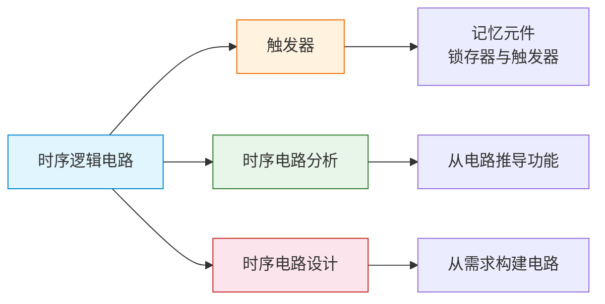

# 时序逻辑电路

> 时序逻辑电路就像"有记忆的棋手"——每一步决策不仅看当前局面，还依赖过去的积累与经验。

## 章节导览

## 本章概述

与组合逻辑电路不同，时序逻辑电路的**输出不仅取决于当前输入，还与电路过去的状态有关**。这种"记忆"能力是通过**触发器**等存储元件实现的。

### 核心特征

| 特征 | 说明 |
|------|------|
| 有记忆性 | 输出取决于当前输入和电路状态 |
| 有反馈 | 存在从输出到输入的反馈通路 |
| 有存储元件 | 电路中包含触发器等记忆元件 |
| 时钟控制 | 同步时序电路受时钟信号控制 |

### 与组合逻辑电路的对比

| 特性 | 组合逻辑电路 | 时序逻辑电路 |
|------|-------------|-------------|
| 记忆性 | 无 | 有 |
| 反馈 | 无 | 有 |
| 延迟影响 | 仅影响速度 | 影响功能（需同步） |
| 典型器件 | 编码器、译码器、加法器 | 触发器、计数器、寄存器 |

### 学习路线

1. **触发器** —— 理解时序电路的记忆元件，掌握各类触发器的功能与转换
2. **时序电路分析** —— 从给定时序电路推导其逻辑功能
3. **时序电路设计** —— 从功能需求设计时序电路

::: important 核心要点
触发器是时序逻辑电路的基石。理解触发器的触发方式、特性方程和状态转换，是学习时序电路分析与设计的前提。
:::
