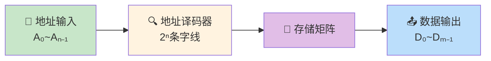
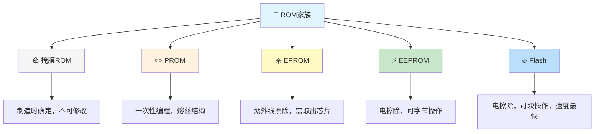
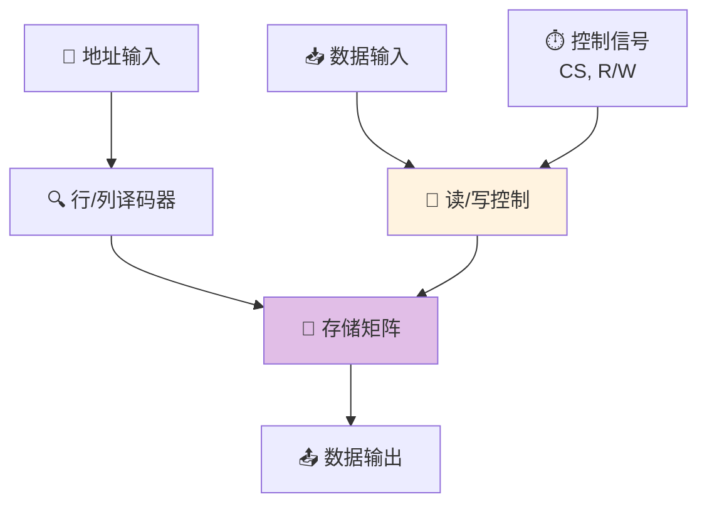
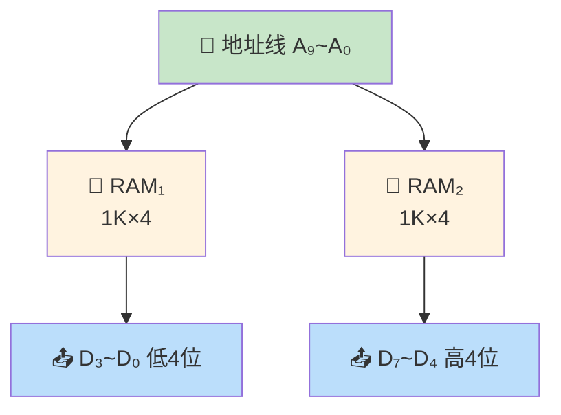
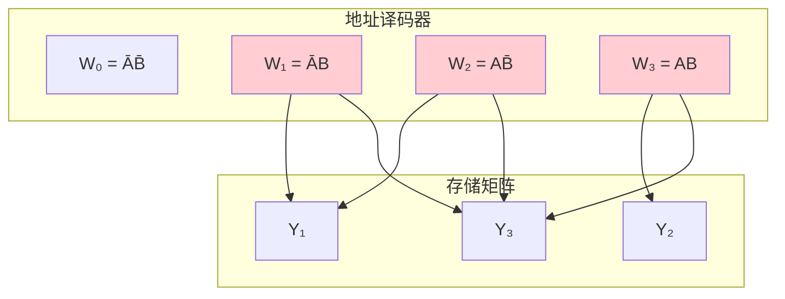

> 存储器是数字系统的记忆之海，ROM如同刻在石碑上的铭文，一旦写入便不可轻易更改；RAM如同沙滩上的字迹，可以随时抹去重写，却也会在断电的潮水中消逝无踪。

---

## 一、只读存储器（ROM）

### 1.1 ROM的基本结构

ROM由地址译码器和存储矩阵组成：

- **地址译码器**：$n$条地址线 → $2^n$条字线（全译码）
- **存储矩阵**：字线×位线的交叉点决定存储内容
- **容量**：$2^n \times m$ 位（$n$位地址，$m$位数据输出）

::: important ROM的读出过程
1. 给定地址码 $A_{n-1} \cdots A_1 A_0$
2. 地址译码器选中对应字线 $W_i = 1$
3. 存储矩阵中与$W_i$相连的位线输出1，其余为0
4. 输出缓冲器输出数据 $D_{m-1} \cdots D_1 D_0$
:::

### 1.2 ROM的分类

| 类型 | 全称 | 写入方式 | 擦除方式 | 擦写次数 |
|------|------|----------|----------|----------|
| 掩膜ROM | Mask ROM | 制造时写入 | 不可擦除 | 0 |
| PROM | Programmable ROM | 用户一次性写入 | 不可擦除 | 0 |
| EPROM | Erasable PROM | 用户写入 | 紫外线整体擦除 | ~100 |
| EEPROM | Electrically EPROM | 用户写入 | 电可擦除（字节级） | ~10⁵ |
| Flash | Flash Memory | 用户写入 | 电可擦除（块级） | ~10⁶ |

::: tip Flash存储器
Flash是当前最主流的非易失性存储器，分为：
- **NOR Flash**：随机读取快，适合存储代码（如BIOS）
- **NAND Flash**：密度高、成本低，适合大量数据存储（如SSD、U盘）
:::

---

## 二、随机存取存储器（RAM）

### 2.1 RAM的基本结构

RAM由存储矩阵、地址译码器、读/写控制电路组成：

### 2.2 静态RAM（SRAM）

**存储单元**：六管结构（6T），由两个交叉耦合的反相器构成双稳态触发器。

| 特性 | 说明 |
|------|------|
| 存储原理 | 触发器自锁 |
| 读出方式 | 非破坏性读出 |
| 刷新 | 不需要刷新 |
| 速度 | 快（ns级） |
| 集成度 | 低（6管/单元） |
| 功耗 | 较高 |
| 应用 | CPU Cache |

### 2.3 动态RAM（DRAM）

**存储单元**：单管结构（1T1C），利用电容存储电荷。

| 特性 | 说明 |
|------|------|
| 存储原理 | 电容充放电 |
| 读出方式 | 破坏性读出（需重写） |
| 刷新 | 必须定时刷新（2ms/4ms/8ms） |
| 速度 | 较慢（需要刷新周期） |
| 集成度 | 高（1管1电容/单元） |
| 功耗 | 较低 |
| 应用 | 主存储器（DDR系列） |

::: warning DRAM刷新
DRAM必须定期刷新的原因：电容上的电荷会随时间慢慢泄漏。刷新方式有三种：

1. **集中刷新**：在刷新周期内集中安排刷新时间，存在"死时间"
2. **分散刷新**：每个存取周期中安排刷新，无死时间但速度慢
3. **异步刷新**：将刷新分散到整个刷新间隔中，是前两者的折中
:::

### 2.4 SRAM vs DRAM对比

| 比较项 | SRAM | DRAM |
|--------|------|------|
| 存储单元 | 6管 | 1管1电容 |
| 是否需要刷新 | 否 | 是 |
| 存取速度 | 快（1~10ns） | 较慢（10~100ns） |
| 集成度 | 低 | 高 |
| 成本 | 高 | 低 |
| 功耗 | 较高 | 较低 |
| 典型应用 | Cache | 主存 |

---

## 三、存储器容量扩展

当单片存储器容量不够时，需要进行扩展。

### 3.1 位扩展（字长扩展）

**适用场景**：字数够，位数不够。

**方法**：将多片存储器的地址线、控制线并联，数据线分别引出。

**例**：用 $1K \times 4$ 位RAM扩展为 $1K \times 8$ 位RAM

- 使用2片 $1K \times 4$ 位RAM
- 地址线A₉~A₀并联
- 片选$\overline{CS}$并联
- 读/写$\overline{WE}$并联
- 片1输出D₃~D₀作为低4位
- 片2输出D₃~D₀作为高4位

### 3.2 字扩展（地址扩展）

**适用场景**：位数够，字数不够。

**方法**：增加地址线，用高位地址经译码器选择不同的芯片。

**例**：用 $1K \times 8$ 位RAM扩展为 $2K \times 8$ 位RAM

- 使用2片 $1K \times 8$ 位RAM
- 低位地址A₉~A₀并联连接各芯片
- 高位地址A₁₀接译码器，输出分别控制各片$\overline{CS}$

| A₁₀ | 选中芯片 | 地址范围 |
|:----:|----------|----------|
| 0 | RAM₁ | 000H~3FFH |
| 1 | RAM₂ | 400H~7FFH |

### 3.3 字位同时扩展

**适用场景**：字数和位数都不够。

**例**：用 $1K \times 4$ 位RAM扩展为 $4K \times 8$ 位RAM

- 位扩展：2片一组，$1K \times 4 \to 1K \times 8$，共4组
- 字扩展：4组用2位地址经2-4译码器选择
- 总共需要 $2 \times 4 = 8$ 片

::: important 存储器扩展公式
- 位扩展芯片数：$m_{目标}/m_{单片}$
- 字扩展芯片数：$字_{目标}/字_{单片}$
- 总芯片数 = 位扩展数 × 字扩展数
:::

---

## 四、用ROM实现组合逻辑函数

### 4.1 基本原理

ROM的地址译码器产生所有最小项，存储矩阵实现最小项的"或"运算。

$$Y_i = \sum m_j$$（点阵中连接的最小项求或）

因此，ROM可以实现任意 $n$ 变量的 $m$ 个组合逻辑函数。

### 4.2 设计步骤

1. 将逻辑函数化为最小项之和形式
2. 将输入变量接地址线
3. 在存储矩阵中，函数包含的最小项对应位线与字线的交叉点连接

### 4.3 设计示例

**例**：用ROM实现以下多输出函数：

$$Y_1 = \overline{A}B + A\overline{B}$$
$$Y_2 = AB$$
$$Y_3 = A + B$$

化为最小项之和：

$$Y_1 = m_1 + m_2$$
$$Y_2 = m_3$$
$$Y_3 = m_1 + m_2 + m_3$$

ROM点阵图：

| 地址 | A | B | 字线 | Y₁ | Y₂ | Y₃ |
|:----:|:-:|:-:|:----:|:--:|:--:|:--:|
| 0 | 0 | 0 | W₀ | 0 | 0 | 0 |
| 1 | 0 | 1 | W₁ | 1 | 0 | 1 |
| 2 | 1 | 0 | W₂ | 1 | 0 | 1 |
| 3 | 1 | 1 | W₃ | 0 | 1 | 1 |

---

## 五、典型习题与详解

### 习题1：存储器容量计算

某存储器有12位地址线，16位数据线，求存储容量。

**解**：

$$容量 = 2^{12} \times 16 = 4096 \times 16 = 65536 \text{ 位} = 64\text{Kbit} = 8\text{KB}$$

### 习题2：存储器扩展设计

用 $256 \times 4$ 位RAM扩展为 $1K \times 8$ 位RAM，需要多少片？画出连接方案。

**解**：

位扩展：$8/4 = 2$ 片（一组两片，扩展为$256 \times 8$）

字扩展：$1K/256 = 4$ 组（需要2位地址经2-4译码器选择）

总芯片数：$2 \times 4 = 8$ 片

地址分配：

| A₁₁A₁₀ | 选中组 | 地址范围 |
|:-------:|--------|----------|
| 00 | 第1组 | 000H~0FFH |
| 01 | 第2组 | 100H~1FFH |
| 10 | 第3组 | 200H~2FFH |
| 11 | 第4组 | 300H~3FFH |

### 习题3：用ROM实现全加器

用ROM实现一位全加器，列出存储内容表。

**解**：

输入变量：$A_i$（被加数）、$B_i$（加数）、$C_{i-1}$（低位进位）

输出：$S_i$（和）、$C_i$（向高位进位）

| Aᵢ | Bᵢ | Cᵢ₋₁ | Sᵢ | Cᵢ |
|:--:|:--:|:-----:|:--:|:--:|
| 0 | 0 | 0 | 0 | 0 |
| 0 | 0 | 1 | 1 | 0 |
| 0 | 1 | 0 | 1 | 0 |
| 0 | 1 | 1 | 0 | 1 |
| 1 | 0 | 0 | 1 | 0 |
| 1 | 0 | 1 | 0 | 1 |
| 1 | 1 | 0 | 0 | 1 |
| 1 | 1 | 1 | 1 | 1 |

需要 $8 \times 2$ 位ROM（3位地址，2位数据输出）。

---

::: tip 面试速查
- ROM：只读存储器，非易失性，地址译码器+存储矩阵
- RAM：随机存取存储器，易失性，SRAM（6管，快，贵）/DRAM（1T1C，慢，便宜，需刷新）
- 位扩展：地址线并联，数据线分列
- 字扩展：增加地址线，译码器选片
- ROM实现组合逻辑：地址=输入，数据=输出，最小项之和
- Flash：NOR快读（代码存储），NAND高密度（数据存储）
:::

::: info 原著参考
- 阎石《数字电子技术基础》第六版，第7章 半导体存储器
- 康华光《电子技术基础·数字部分》第七版，第8章
:::
