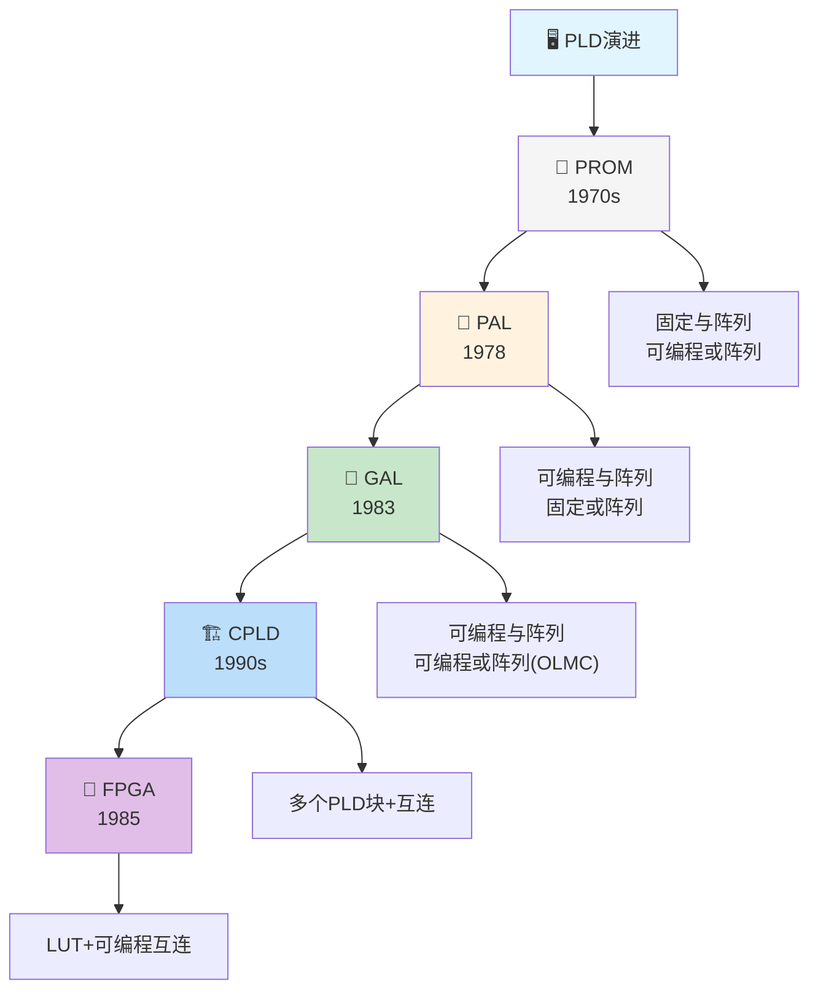
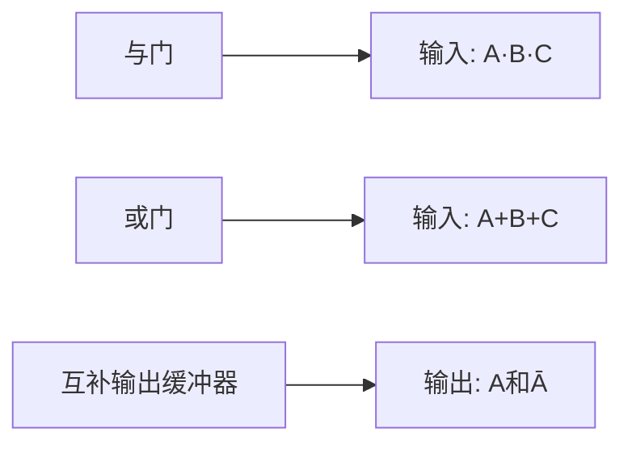
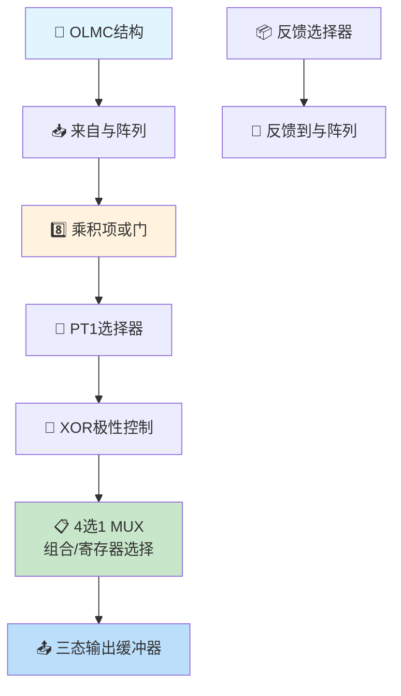
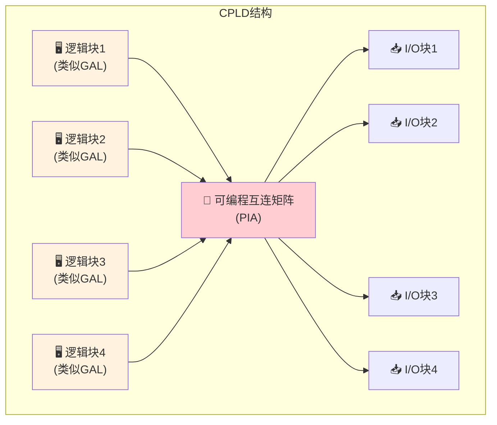
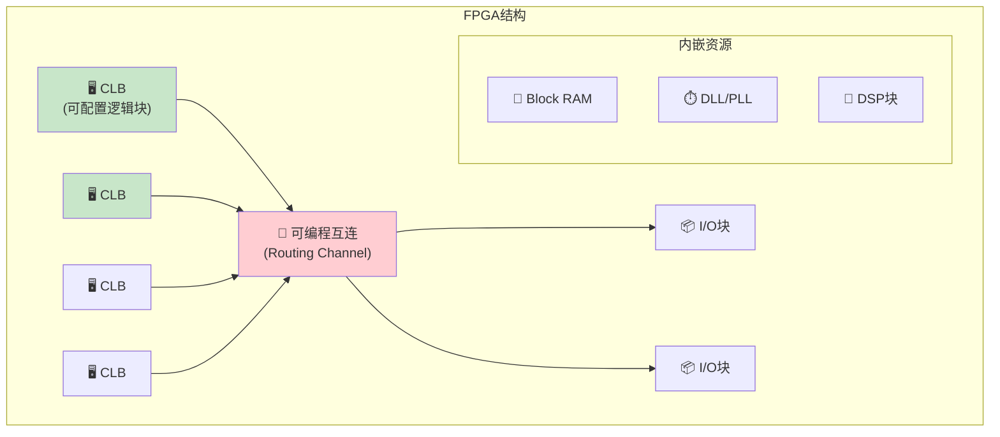
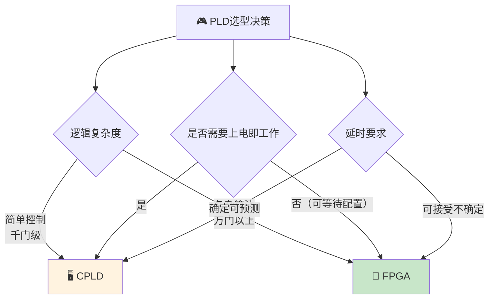

> 可编程逻辑器件如同数字世界的空白画布，工程师以HDL为画笔，以逻辑综合为调色，在硅片上描绘出心中的电路蓝图。从PROM的只读画册到FPGA的实时画卷，可编程性赋予了硬件灵魂般的灵活性。

---

## 一、PLD的分类与演进

### 1.1 PLD的基本概念

可编程逻辑器件（Programmable Logic Device, PLD）是一种由用户通过编程来确定逻辑功能的集成电路。

### 1.2 PLD分类总览

| 类型 | 与阵列 | 或阵列 | 输出方式 | 编程次数 | 典型器件 |
|------|--------|--------|----------|----------|----------|
| PROM | 固定 | 可编程 | 三态/寄存 | 1次 | 27系列 |
| PAL | 可编程 | 固定 | 多种 | 1次 | PAL16L8 |
| GAL | 可编程 | 固定 | OLMC可配置 | 多次 | GAL16V8 |
| CPLD | 可编程 | 可编程 | 多种 | 多次 | MAX7000 |
| FPGA | LUT | - | 多种 | 多次 | XC系列 |

::: important PLD的核心思想
PLD的本质是**与或阵列**：

$$F = \text{与阵列（产生乘积项）} \to \text{或阵列（求和）}$$

- PROM：与阵列固定（全译码），或阵列可编程 → 适合查表
- PAL：与阵列可编程，或阵列固定 → 适合组合逻辑
- GAL：与阵列可编程，或阵列通过OLMC可配置 → 更灵活
:::

---

## 二、PLD的电路表示方法

### 2.1 PLD约定符号

在PLD电路图中，使用特殊的表示方法：

| 符号 | 含义 |
|------|------|
| 实心圆点（●） | 固定连接，不可编程 |
| 叉号（×） | 可编程连接（编程后连通） |
| 无标记 | 可编程断开（编程后断路） |

### 2.2 PLD基本门表示

| 门类型 | PLD表示 | 标准逻辑式 |
|--------|---------|-----------|
| 与门 | 输入线汇合后单线出 | $Y = A \cdot B \cdot C$ |
| 或门 | 输入线汇合后单线出 | $Y = A + B + C$ |
| 互补缓冲 | 一入两出（原反） | $Y_1 = A$，$Y_2 = \overline{A}$ |

---

## 三、PAL —— 可编程阵列逻辑

### 3.1 PAL的结构特点

PAL（Programmable Array Logic）的结构为：

- **与阵列可编程**：用户可定义所需的乘积项
- **或阵列固定**：每个输出的或项数固定
- 输出形式多样：组合输出、寄存器输出、I/O等

::: tip PAL的命名规则
以PAL16L8为例：
- 16：与阵列输入变量数（16个输入端）
- L：输出低电平有效（Active Low）
- 8：输出端数（8个输出）

常见的输出类型代码：
- L：低有效，H：高有效，C：互补，R：寄存器，V：可编程
:::

### 3.2 PAL的局限性

- 或阵列固定，每个输出的乘积项数有限（通常7~8个）
- 一次性编程（熔丝/反熔丝），不可重复使用
- 输出结构固定，灵活性不足

---

## 四、GAL —— 通用阵列逻辑

### 4.1 GAL的结构特点

GAL（Generic Array Logic）在PAL的基础上改进：

- 采用EECMOS工艺，可重复编程（~100次）
- **输出逻辑宏单元（OLMC）**：输出结构可由用户配置

### 4.2 OLMC（输出逻辑宏单元）

OLMC是GAL的核心创新，使同一器件可实现多种输出结构。

#### OLMC的五种工作模式

| 模式 | SYN | AC₀ | AC₁(n) | 输出性质 | 说明 |
|:----:|:---:|:---:|:-------:|----------|------|
| 专用输入 | 1 | 0 | 1 | 输入 | 三态门禁止，引脚作输入 |
| 专用组合输出 | 1 | 0 | 0 | 组合 | 三态门常通，无反馈 |
| 组合I/O | 1 | 1 | 1 | 组合I/O | 三态门受乘积项控制 |
| 寄存器组合I/O | 0 | 1 | 1 | 组合I/O | 本单元组合输出，其他单元有寄存器 |
| 寄存器输出 | 0 | 1 | 0 | 寄存器 | 时钟同步，D触发器输出 |

::: important GAL16V8
GAL16V8是最常用的GAL器件：
- 16个输入（8个独立输入 + 8个I/O可配置为输入）
- 8个OLMC
- 64个乘积项（每个OLMC最多8个）
- 工作频率约几十MHz
:::

---

## 五、CPLD

### 5.1 CPLD基本结构

CPLD（Complex PLD）是将多个类似GAL的逻辑块通过可编程互连矩阵连接而成。

### 5.2 CPLD特点

| 特点 | 说明 |
|------|------|
| 结构 | 逻辑块 + 互连矩阵 + I/O块 |
| 编程 | 基于乘积项（与或阵列） |
| 互连 | 集中式互连（确定性延时） |
| 存储 | EEPROM/Flash，非易失性 |
| 规模 | 几千~几万逻辑门 |
| 功耗 | 较高 |
| 应用 | 控制逻辑、接口转换、地址译码 |

---

## 六、FPGA

### 6.1 FPGA基本结构

FPGA（Field Programmable Gate Array）采用查找表（LUT）+ 可编程互连的结构。

### 6.2 LUT（查找表）

LUT是FPGA实现组合逻辑的基本单元。

**原理**：$n$ 输入LUT是一个 $2^n \times 1$ 的存储器，存储真值表的内容。

以2输入LUT为例：

| A | B | LUT存储位 | 输出 |
|:-:|:-:|:---------:|:----:|
| 0 | 0 | D₀ | D₀ |
| 0 | 1 | D₁ | D₁ |
| 1 | 0 | D₂ | D₂ |
| 1 | 1 | D₃ | D₃ |

::: important LUT实现任意组合逻辑
一个$n$输入LUT可以实现**任意**$n$变量组合逻辑函数，只需将函数的真值表存入LUT即可。

例如：实现 $Y = A \cdot B + \overline{A} \cdot \overline{B}$

| A | B | Y |
|:-:|:-:|:-:|
| 0 | 0 | 1 |
| 0 | 1 | 0 |
| 1 | 0 | 0 |
| 1 | 1 | 1 |

LUT内容：$D_0D_1D_2D_3 = 1001$
:::

### 6.3 CLB（可配置逻辑块）

CLB是FPGA的基本逻辑单元，通常包含：

- **多个LUT**：实现组合逻辑（4输入或6输入LUT）
- **触发器**：实现时序逻辑
- **进位链**：快速算术运算
- **多路选择器**：灵活布线

### 6.4 FPGA特点

| 特点 | 说明 |
|------|------|
| 结构 | LUT + 可编程互连 |
| 编程 | 基于查找表 |
| 互连 | 分布式互连（延时不固定） |
| 存储 | SRAM，易失性（需配置芯片） |
| 规模 | 百万~千万逻辑门 |
| 功耗 | 较低 |
| 应用 | 数字信号处理、算法加速、原型验证 |

---

## 七、CPLD与FPGA对比

| 比较项 | CPLD | FPGA |
|--------|------|-------|
| 基本逻辑单元 | 乘积项（与或阵列） | 查找表（LUT） |
| 互连方式 | 集中式（PIA） | 分布式（布线矩阵） |
| 延时特性 | 确定可预测 | 路径相关，不确定 |
| 编程工艺 | EEPROM/Flash | SRAM |
| 是否易失 | 否 | 是（需外挂配置ROM） |
| 逻辑规模 | 小~中 | 中~大 |
| 功耗 | 较高 | 较低 |
| 重新配置 | 次数有限 | 无限次 |
| 适用场景 | 控制逻辑、接口 | 数据处理、算法加速 |
| 代表厂商 | Altera(MAX), Xilinx(XC9500) | Altera(Cyclone), Xilinx(Spartan) |

---

## 八、典型习题与详解

### 习题1：PLD分类判断

判断以下各器件的与阵列和或阵列是否可编程：

PROM、PAL、GAL

**解**：

| 器件 | 与阵列 | 或阵列 |
|------|--------|--------|
| PROM | 固定（全译码） | 可编程 |
| PAL | 可编程 | 固定 |
| GAL | 可编程 | 固定（但OLMC可配置） |

### 习题2：用LUT实现逻辑函数

用4输入LUT实现 $Y = A\overline{B}C + \overline{A}B\overline{C} + D$，写出LUT的存储内容。

**解**：

将$A, B, C, D$分别接LUT的输入端，输入顺序为$A$（最高位）$B, C, D$（最低位）。

逐行填写真值表：

| ABCD | $A\overline{B}C$ | $\overline{A}B\overline{C}$ | $D$ | Y |
|:----:|:-----------------:|:--------------------------:|:---:|:-:|
| 0000 | 0 | 0 | 0 | 0 |
| 0001 | 0 | 0 | 1 | 1 |
| 0010 | 0 | 0 | 0 | 0 |
| 0011 | 0 | 0 | 1 | 1 |
| 0100 | 0 | 1 | 0 | 1 |
| 0101 | 0 | 1 | 1 | 1 |
| 0110 | 0 | 0 | 0 | 0 |
| 0111 | 0 | 0 | 1 | 1 |
| 1000 | 0 | 0 | 0 | 0 |
| 1001 | 0 | 0 | 1 | 1 |
| 1010 | 1 | 0 | 0 | 1 |
| 1011 | 1 | 0 | 1 | 1 |
| 1100 | 0 | 0 | 0 | 0 |
| 1101 | 0 | 0 | 1 | 1 |
| 1110 | 0 | 0 | 0 | 0 |
| 1111 | 0 | 0 | 1 | 1 |

LUT存储内容（D₀~D₁₅）：0101101101010101（即0x5B55）

### 习题3：CPLD与FPGA选型

某项目需要实现一个SPI接口转换器（逻辑简单，约500门，上电即工作），应选择CPLD还是FPGA？

**解**：

选择**CPLD**。原因：

1. 逻辑简单（500门），CPLD的规模足够
2. 上电即工作：CPLD采用EEPROM/Flash，无需配置时间
3. SPI接口为控制逻辑，CPLD的乘积项结构更适合
4. 延时确定可预测，适合时序要求严格的接口

---

::: tip 面试速查
- PLD核心：与或阵列，PROM（与固定/或可编），PAL（与可编/或固定），GAL（与可编/或固定+OLMC）
- OLMC五种模式：专用输入、专用组合输出、组合I/O、寄存器组合I/O、寄存器输出
- CPLD：乘积项+集中式互连+EEPROM，非易失，延时确定，适合控制逻辑
- FPGA：LUT+分布式互连+SRAM，易失需配置，规模大，适合数据处理
- LUT：$n$输入LUT = $2^n \times 1$存储器，可实现任意$n$变量组合逻辑
:::

::: info 原著参考
- 阎石《数字电子技术基础》第六版，第8章 可编程逻辑器件
- 康华光《电子技术基础·数字部分》第七版，第8章
:::
