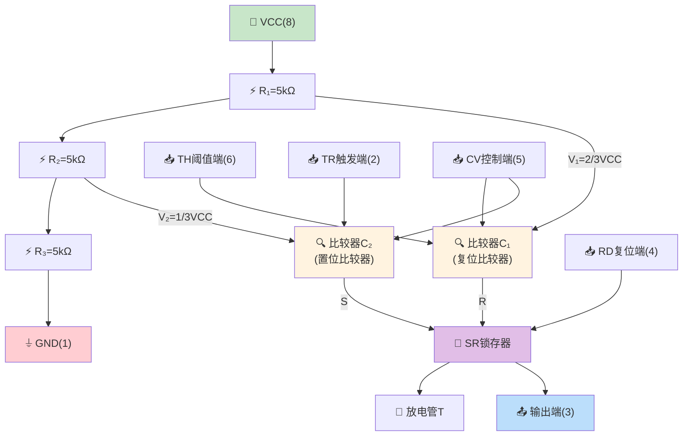
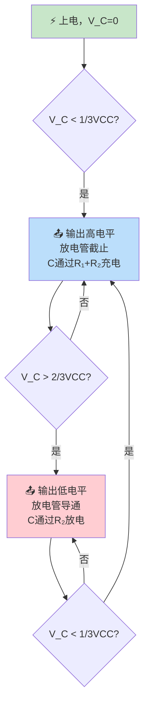
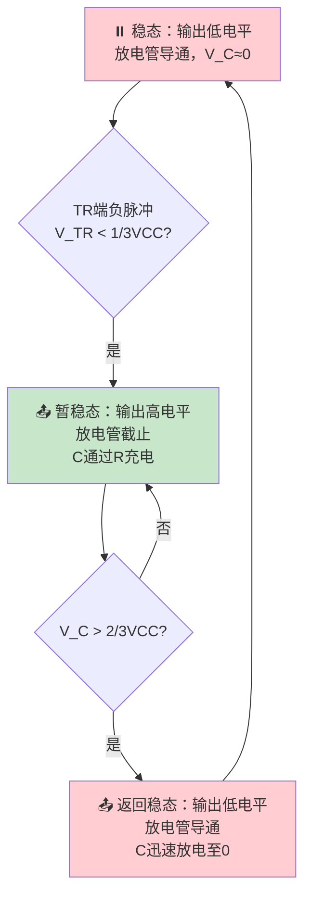
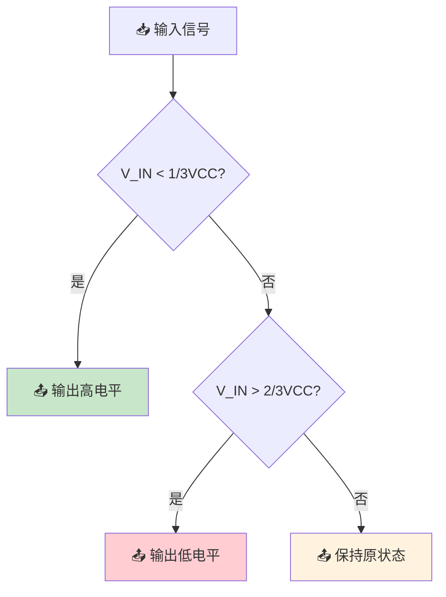
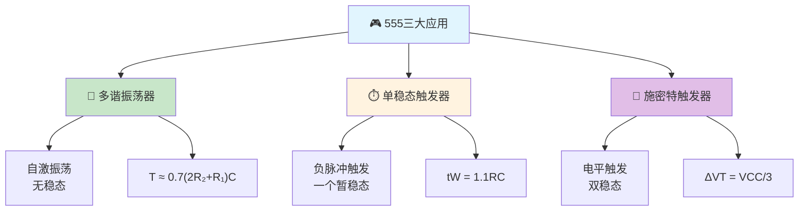

> 555定时器如同一把万能钥匙，仅凭三个5kΩ电阻和两个比较器的精妙配合，便能开启脉冲世界的大门——无论是自由振荡的脉冲之泉、一触即发的单次脉冲，还是滤除抖动的整形利器，皆在其掌控之中。

---

## 一、555定时器内部结构

### 1.1 内部电路组成

555定时器由以下部分组成：



### 1.2 引脚功能

| 引脚号 | 名称 | 功能 |
|:------:|------|------|
| 1 | GND | 接地端 |
| 2 | $\overline{TR}$ | 触发输入端（低电平触发，< 1/3VCC时置位） |
| 3 | OUT | 输出端 |
| 4 | $\overline{R_D}$ | 异步复位端（低电平有效，优先级最高） |
| 5 | CV | 控制电压端（可外接电压改变比较器参考值） |
| 6 | TH | 阈值输入端（高电平触发，> 2/3VCC时复位） |
| 7 | DIS | 放电端（放电管集电极开路输出） |
| 8 | VCC | 电源端（4.5~16V） |

### 1.3 工作原理

555定时器的核心是SR锁存器，由两个比较器驱动：

| 条件 | C₁输出(R) | C₂输出(S) | 锁存器 | 输出 | 放电管 |
|------|:---------:|:---------:|--------|:----:|--------|
| $V_{TH} > \frac{2}{3}V_{CC}$，$V_{TR} > \frac{1}{3}V_{CC}$ | 1 | 0 | 复位 | 0 | 导通 |
| $V_{TH} < \frac{2}{3}V_{CC}$，$V_{TR} < \frac{1}{3}V_{CC}$ | 0 | 1 | 置位 | 1 | 截止 |
| $V_{TH} < \frac{2}{3}V_{CC}$，$V_{TR} > \frac{1}{3}V_{CC}$ | 0 | 0 | 保持 | 保持 | 保持 |
| $V_{TH} > \frac{2}{3}V_{CC}$，$V_{TR} < \frac{1}{3}V_{CC}$ | 1 | 1 | 不定 | - | - |

::: important 555定时器的两个阈值
- **上阈值**：$\frac{2}{3}V_{CC}$（TH端，高电平触发复位）
- **下阈值**：$\frac{1}{3}V_{CC}$（TR端，低电平触发置位）
- 若CV端外接电压$V_C$，则上阈值变为$V_C$，下阈值变为$\frac{1}{2}V_C$
:::

---

## 二、多谐振荡器

### 2.1 电路结构

用555定时器构成多谐振荡器，无需外部触发信号即可自动产生矩形波。

**外部元件**：$R_1$、$R_2$、$C$

- $R_1$连接VCC和DIS端
- $R_2$连接DIS端和TH/TR端
- $C$连接TH/TR端和GND
- TH和TR短接

### 2.2 工作原理



### 2.3 参数计算

**充电时间**（高电平持续时间）：

$$t_{WH} = 0.693(R_1 + R_2)C \approx 0.7(R_1 + R_2)C$$

**放电时间**（低电平持续时间）：

$$t_{WL} = 0.693R_2C \approx 0.7R_2C$$

**振荡周期**：

$$T = t_{WH} + t_{WL} \approx 0.7(2R_2 + R_1)C$$

**振荡频率**：

$$f = \frac{1}{T} = \frac{1.43}{(2R_2 + R_1)C}$$

**占空比**：

$$q = \frac{t_{WH}}{T} = \frac{R_1 + R_2}{2R_2 + R_1}$$

::: warning 占空比的范围
由于 $R_1 + R_2 > R_2$，所以占空比 $q > 50\%$，无法实现50%以下的占空比。

若需要小于50%的占空比，可利用二极管将充电和放电通路分开：
- 充电经$R_1$和二极管
- 放电经$R_2$和二极管
- 此时 $q = \frac{R_1}{R_1 + R_2}$
:::

---

## 三、单稳态触发器

### 3.1 电路结构

用555定时器构成单稳态触发器，有一个稳态和一个暂稳态。

**外部元件**：$R$、$C$

- $R$连接VCC和TH端
- $C$连接TH端和GND
- TR端接触发信号（负脉冲触发）

### 3.2 工作原理



### 3.3 参数计算

**输出脉冲宽度**（暂稳态持续时间）：

$$t_W = 1.1RC$$

::: important 单稳态触发器的特点
1. **只有一个稳态**：无触发信号时保持低电平
2. **触发后自动返回**：不需要复位信号
3. **脉冲宽度由R、C决定**：与触发脉冲宽度无关
4. **不可重触发**：暂稳态期间新的触发信号无效（基本型）
5. **最小触发间隔**：$T_{min} > t_W + t_{re}$（$t_{re}$为恢复时间）
:::

---

## 四、施密特触发器

### 4.1 电路结构

用555定时器构成施密特触发器，只需将TH和TR短接作为输入端。

**接线方式**：
- TH和TR短接，作为信号输入端
- 无需外部定时元件（R、C）
- 输出端为3脚

### 4.2 工作原理



### 4.3 回差特性

施密特触发器具有**回差电压**（滞后特性）：

- **正向阈值电压**：$V_{T+} = \frac{2}{3}V_{CC}$
- **负向阈值电压**：$V_{T-} = \frac{1}{3}V_{CC}$
- **回差电压**：$\Delta V_T = V_{T+} - V_{T-} = \frac{1}{3}V_{CC}$

| 特性 | 说明 |
|------|------|
| 回差电压 | $\Delta V_T = \frac{1}{3}V_{CC}$ |
| 作用 | 提高抗干扰能力 |
| 传输特性 | 迟滞回环，非反相输出 |

::: warning 回差电压的意义
回差电压的作用：
1. **提高抗干扰能力**：输入信号在阈值附近波动时，输出不会反复跳变
2. **波形整形**：将缓慢变化的信号整形成边沿陡峭的矩形波
3. **消除抖动**：机械开关的弹跳噪声被回差吸收

若CV端外接电压$V_C$，可调节回差大小：$\Delta V_T = \frac{1}{2}V_C$
:::

---

## 五、三种应用电路对比

| 比较项 | 多谐振荡器 | 单稳态触发器 | 施密特触发器 |
|--------|-----------|-------------|-------------|
| 稳态数 | 无稳态（2个暂稳态） | 1个稳态+1个暂稳态 | 2个稳态 |
| 外部元件 | R₁, R₂, C | R, C | 无需定时元件 |
| 触发方式 | 自激振荡 | 外部负脉冲 | 信号电平 |
| 输出波形 | 矩形波 | 单次正脉冲 | 整形后的矩形波 |
| 主要用途 | 时钟源 | 定时、延时 | 整形、鉴幅 |



---

## 六、典型习题与详解

### 习题1：多谐振荡器参数计算

用555定时器构成多谐振荡器，$R_1 = 10k\Omega$，$R_2 = 20k\Omega$，$C = 0.1\mu F$。求振荡频率和占空比。

**解**：

$$t_{WH} = 0.7(R_1 + R_2)C = 0.7 \times 30 \times 10^3 \times 0.1 \times 10^{-6} = 2.1\text{ms}$$

$$t_{WL} = 0.7R_2C = 0.7 \times 20 \times 10^3 \times 0.1 \times 10^{-6} = 1.4\text{ms}$$

$$T = t_{WH} + t_{WL} = 2.1 + 1.4 = 3.5\text{ms}$$

$$f = \frac{1}{T} = \frac{1}{3.5 \times 10^{-3}} \approx 285.7\text{Hz}$$

$$q = \frac{t_{WH}}{T} = \frac{2.1}{3.5} = 60\%$$

### 习题2：单稳态触发器设计

用555定时器设计一个延时1秒的单稳态触发器，$C = 10\mu F$，求电阻$R$的值。

**解**：

由 $t_W = 1.1RC$ 得：

$$R = \frac{t_W}{1.1C} = \frac{1}{1.1 \times 10 \times 10^{-6}} \approx 90.9k\Omega$$

取标称值 $R = 91k\Omega$。

### 习题3：施密特触发器应用

555定时器构成的施密特触发器，$V_{CC} = 9V$，求正向阈值、负向阈值和回差电压。若CV端接6V电压，重新计算。

**解**：

**无外接CV时**：

$$V_{T+} = \frac{2}{3}V_{CC} = \frac{2}{3} \times 9 = 6\text{V}$$

$$V_{T-} = \frac{1}{3}V_{CC} = \frac{1}{3} \times 9 = 3\text{V}$$

$$\Delta V_T = V_{T+} - V_{T-} = 6 - 3 = 3\text{V}$$

**CV端接6V时**：

$$V_{T+} = V_C = 6\text{V}$$

$$V_{T-} = \frac{1}{2}V_C = 3\text{V}$$

$$\Delta V_T = 6 - 3 = 3\text{V}$$

### 习题4：综合设计

设计一个救护车警报音模拟电路：用两片555定时器，一片产生低频方波（1Hz）控制另一片的高低音切换（700Hz/1kHz），画出方框图并计算参数。

**解**：

**片1（低频控制）**：多谐振荡器，$f = 1Hz$

取 $C_1 = 10\mu F$

$T = 1/f = 1s$，即 $0.7(2R_2 + R_1)C_1 = 1$

取 $R_1 = R_2$，则 $0.7 \times 3R_1 \times 10 \times 10^{-6} = 1$

$R_1 = \frac{1}{0.7 \times 3 \times 10 \times 10^{-6}} \approx 47.6k\Omega$

取 $R_1 = R_2 = 47k\Omega$

**片2（音频振荡）**：多谐振荡器，频率受片1输出控制

片1输出高电平→片2的CV端电压升高→频率降低→低音（700Hz）

片1输出低电平→片2的CV端电压降低→频率升高→高音（1kHz）

```verilog
// 555多谐振荡器仿真模型（Verilog行为描述）
module multivibrator_555(
    input rst_n,
    output reg wave_out
);
    parameter R1 = 10000;  // 10kΩ
    parameter R2 = 20000;  // 20kΩ
    parameter C  = 0.0000001; // 0.1μF
    real t_wh, t_wl, t_period;
    real time_count;

    initial begin
        t_wh = 0.7 * (R1 + R2) * C * 1e9; // 转换为ns
        t_wl = 0.7 * R2 * C * 1e9;
        t_period = t_wh + t_wl;
        time_count = 0;
    end

    always begin
        if (!rst_n) begin
            wave_out = 0;
            #10;
        end else begin
            wave_out = 1;
            #(t_wh);
            wave_out = 0;
            #(t_wl);
        end
    end
endmodule
```

---

::: tip 面试速查
- 555三个5kΩ电阻分压：上阈值2/3VCC，下阈值1/3VCC
- 多谐振荡器：无稳态，$T \approx 0.7(2R_2+R_1)C$，占空比 > 50%
- 单稳态触发器：一稳态一暂稳态，$t_W = 1.1RC$，负脉冲触发
- 施密特触发器：双稳态，回差$\Delta V_T = V_{CC}/3$，CV端可调
- 多谐振荡器占空比 < 50%需加二极管
:::

::: info 原著参考
- 阎石《数字电子技术基础》第六版，第9章 脉冲波形的产生与变换
- 康华光《电子技术基础·数字部分》第七版，第9章
:::
