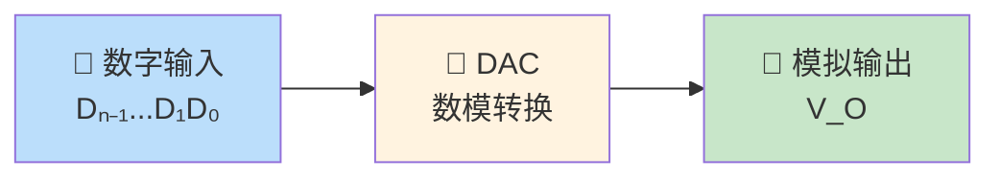
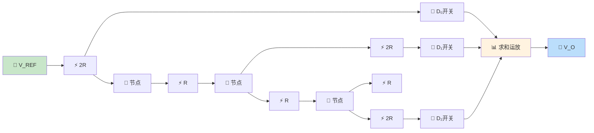
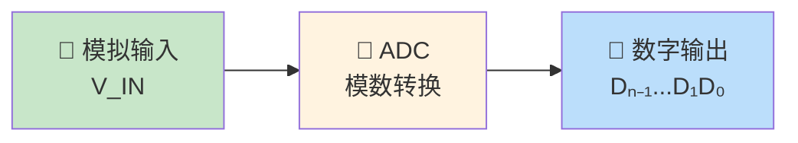
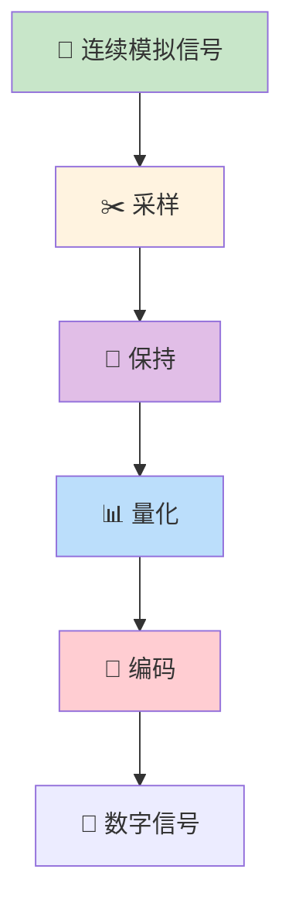
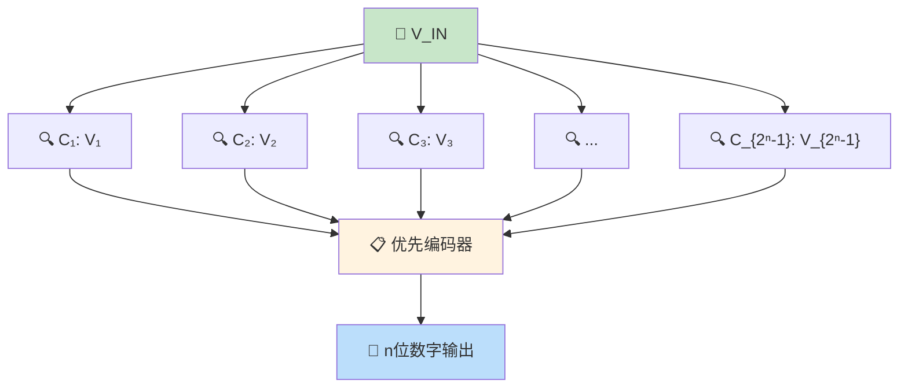
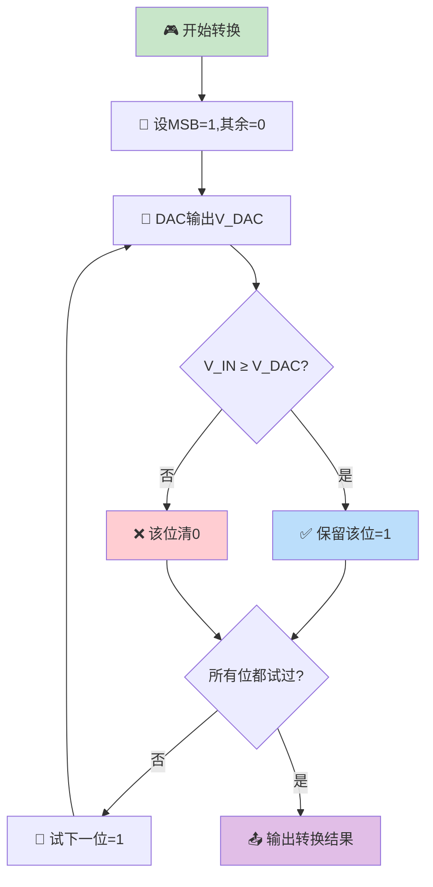
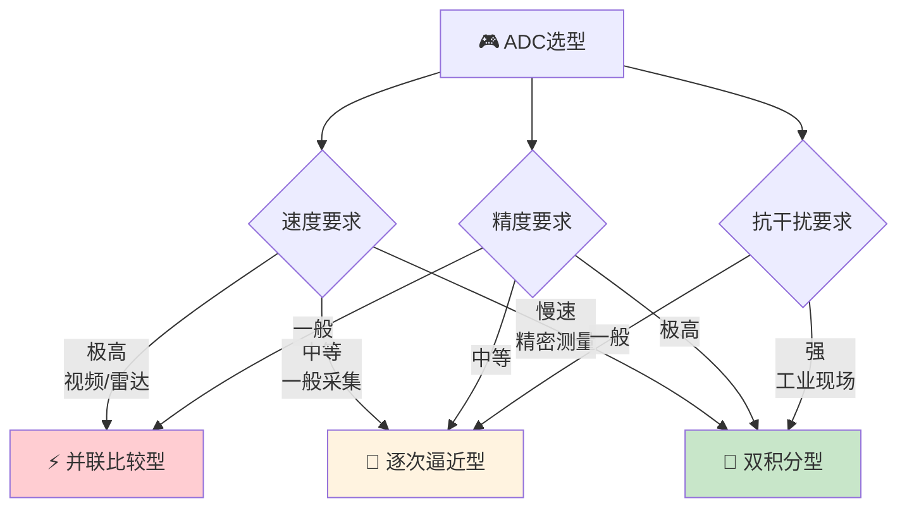

> DAC与ADC是横跨模拟与数字两大王国的桥梁——DAC如同一位精密的翻译官，将冰冷的数字编码还原为连续的模拟信号；ADC则如一位敏锐的采样者，将缤纷的模拟世界量化为离散的数字语言。

---

## 一、数模转换器（DAC）

### 1.1 DAC的基本原理

DAC将输入的数字量转换为与之成正比的模拟量（电压或电流）。

$$V_O = V_{REF} \times \frac{D}{2^n}$$

其中 $D$ 为输入数字量，$n$ 为位数，$V_{REF}$ 为参考电压。

### 1.2 权电阻网络DAC

#### 电路结构

$n$ 位权电阻DAC包含 $n$ 个权电阻和 $n$ 个电子开关。

| 位 | 权重 | 电阻值 |
|:--:|:----:|:------:|
| D₀ | $2^0$ | $2^{n-1}R$ |
| D₁ | $2^1$ | $2^{n-2}R$ |
| ... | ... | ... |
| Dₙ₋₁ | $2^{n-1}$ | $R$ |

#### 输出电压

$$V_O = -\frac{V_{REF}}{2^n} \sum_{i=0}^{n-1} D_i \cdot 2^i = -\frac{V_{REF}}{2^n} \cdot D$$

::: warning 权电阻DAC的缺点
电阻种类多（$R, 2R, 4R, \ldots, 2^{n-1}R$），高位和低位电阻值相差 $2^{n-1}$ 倍。当 $n$ 较大时，高位电阻的精度难以保证，集成制造困难。
:::

### 1.3 倒T形电阻网络DAC

倒T形电阻网络是**最常用**的DAC结构，只用R和2R两种电阻。

#### 电路结构

#### 工作原理

倒T形网络的关键特性：

1. 从任一节点向右看，等效电阻均为 $2R$
2. 电流每经过一个节点被分流一半
3. 各位开关电流为 $\frac{I}{2}, \frac{I}{2^2}, \ldots, \frac{I}{2^n}$

$$I = \frac{V_{REF}}{2R}$$

$$V_O = -\frac{V_{REF}}{2^n} \cdot D$$

::: important 倒T形DAC的优点
1. **电阻种类少**：仅用R和2R两种电阻，便于集成
2. **开关切换时电流不变**：从参考源看，无论开关状态如何，总负载始终为$R$
3. **转换速度快**：各支路电流同时到达求和点，无延时差
4. **精度高**：电流加权方式，电阻精度要求低
:::

### 1.4 权电流型DAC

用恒流源代替电阻网络中的电阻，进一步提高了精度。

| 特性 | 权电阻 | 倒T形 | 权电流 |
|------|--------|-------|--------|
| 电阻种类 | 多 | R, 2R | 无电阻 |
| 精度 | 低 | 中 | 高 |
| 速度 | 慢 | 快 | 最快 |
| 成本 | 低 | 中 | 高 |
| 应用 | 简单场合 | 通用 | 高精度 |

### 1.5 DAC主要参数

| 参数 | 定义 | 说明 |
|------|------|------|
| 分辨率 | $\frac{1}{2^n - 1}$ 或 $\frac{V_{FSR}}{2^n}$ | 最小输出增量，位数越多分辨率越高 |
| 转换精度 | 实际值与理想值的偏差 | 用LSB的分数表示 |
| 建立时间 | 输入变化到输出稳定在±½LSB内的时间 | 决定最高转换速率 |
| 线性度 | 实际传输特性与理想直线的偏差 | INL/DNL |
| 偏移误差 | 输入全0时输出不为0 | 零点偏移 |
| 增益误差 | 实际比例系数与理想值的偏差 | 斜率偏差 |

::: tip 分辨率的表示
- 用位数表示：8位、10位、12位DAC
- 用百分数表示：$n$位DAC的分辨率为 $\frac{1}{2^n} \times 100\%$
- 8位DAC分辨率：$\frac{1}{256} \approx 0.39\%$
- 12位DAC分辨率：$\frac{1}{4096} \approx 0.024\%$
:::

---

## 二、模数转换器（ADC）

### 2.1 ADC的基本原理

ADC将连续的模拟信号转换为离散的数字量。

### 2.2 采样与保持

ADC转换需要时间，在转换期间输入信号应保持不变。

#### 采样定理

$$f_s \geq 2f_{max}$$

其中 $f_s$ 为采样频率，$f_{max}$ 为信号最高频率分量。

这是**奈奎斯特采样定理**，$2f_{max}$ 称为奈奎斯特频率。

::: warning 采样定理的重要性
- 若 $f_s < 2f_{max}$，将产生**混叠现象**，无法恢复原始信号
- 实际工程中通常取 $f_s = (5 \sim 10)f_{max}$
- 采样前应加抗混叠滤波器（低通），滤除高于 $f_s/2$ 的频率分量
:::

### 2.3 量化与编码

**量化**：将采样值归入有限个离散电平中。

| 量化方式 | 说明 | 最大量化误差 |
|----------|------|:-----------:|
| 只舍不入（截断） | 向下取整 | $\Delta$ |
| 有舍有入（四舍五入） | 四舍五入 | $\Delta/2$ |

其中 $\Delta = \frac{V_{FSR}}{2^n}$ 为量化单位（1LSB对应的电压）。

**编码**：将量化后的电平用二进制码表示（常用自然二进制码、BCD码等）。

---

## 三、ADC的类型

### 3.1 并联比较型ADC（Flash ADC）

#### 结构与原理

用 $2^n - 1$ 个比较器，将输入电压与所有量化电平同时比较，编码器输出结果。

#### 特点

| 特点 | 说明 |
|------|------|
| 速度 | 最快（一次比较，纳秒级） |
| 比较器数 | $2^n - 1$（8位需255个比较器） |
| 面积/功耗 | 大（随位数指数增长） |
| 适用位数 | 通常≤8位 |
| 应用 | 视频处理、雷达信号 |

### 3.2 逐次逼近型ADC（SAR ADC）

#### 工作原理

类似天平称重，从最高位开始逐位试探：

#### 转换过程示例

设3位ADC，$V_{REF} = 8V$，$V_{IN} = 5V$

| 步骤 | 试探值 | DAC输出 | V_IN ≥ V_DAC? | 结果 |
|:----:|:------:|:-------:|:-------------:|:----:|
| 1 | 100 | 4V | 5≥4 是 | D₂=1 |
| 2 | 110 | 6V | 5≥6 否 | D₁=0 |
| 3 | 101 | 5V | 5≥5 是 | D₀=1 |

转换结果：101（即5V）

#### 特点

| 特点 | 说明 |
|------|------|
| 速度 | 中等（$n$个时钟周期） |
| 比较器数 | 1个 |
| 面积/功耗 | 小 |
| 适用位数 | 8~16位 |
| 应用 | 通用数据采集 |

### 3.3 双积分型ADC

#### 工作原理

分为两个阶段：

1. **第一阶段（定时积分）**：对$V_{IN}$积分固定时间$T_1$（$2^n$个CP）
2. **第二阶段（定斜率积分）**：对$-V_{REF}$反向积分至0，计时$T_2$

$$V_O = -\frac{V_{IN}}{RC}T_1 + \frac{V_{REF}}{RC}T_2 = 0$$

$$T_2 = \frac{V_{IN}}{V_{REF}} \cdot T_1$$

$$D = \frac{V_{IN}}{V_{REF}} \cdot 2^n$$

::: important 双积分型ADC的优势
1. **精度高**：RC时间常数在两次积分中消去，不影响精度
2. **抗干扰强**：若选$T_1$为工频周期的整数倍，可有效抑制50Hz干扰
3. **无需精密元件**：对R、C精度要求低
4. **缺点**：速度最慢（转换时间与输入电压成正比）
:::

### 3.4 三种ADC对比

| 比较项 | 并联比较型 | 逐次逼近型 | 双积分型 |
|--------|-----------|-----------|---------|
| 转换速度 | 最快（ns级） | 中等（μs级） | 最慢（ms级） |
| 精度 | 低 | 中 | 高 |
| 比较器数 | $2^n - 1$ | 1 | 1 |
| 抗干扰 | 差 | 中 | 强 |
| 电路复杂度 | 高 | 中 | 低 |
| 适用位数 | ≤8 | 8~16 | 12~20 |
| 典型应用 | 视频A/D | 通用采集 | 数字万用表 |

### 3.5 ADC主要参数

| 参数 | 定义 | 说明 |
|------|------|------|
| 分辨率 | $\frac{V_{FSR}}{2^n}$ | 1LSB对应的模拟量 |
| 转换精度 | 实际值与理想值的偏差 | 用±LSB表示 |
| 转换时间 | 完成一次转换所需时间 | 从启动到输出的时间 |
| 量化误差 | ±½LSB（四舍五入量化） | 有限位数导致的理论误差 |
| 采样率 | 每秒完成转换的次数 | $f_s = 1/t_{convert}$ |

---

## 四、典型习题与详解

### 习题1：DAC输出计算

一个8位倒T形DAC，$V_{REF} = 10V$，求输入为$(10110010)_2 = 178$时的输出电压。

**解**：

$$V_O = -\frac{V_{REF}}{2^n} \times D = -\frac{10}{256} \times 178 = -6.953V$$

### 习题2：ADC分辨率计算

一个10位ADC，参考电压$V_{REF} = 5V$，求分辨率和量化误差。

**解**：

$$分辨率 = \frac{V_{REF}}{2^n} = \frac{5}{1024} \approx 4.88\text{mV}$$

采用四舍五入量化时：

$$量化误差 = \pm \frac{1}{2}LSB = \pm \frac{4.88}{2} \approx \pm 2.44\text{mV}$$

### 习题3：逐次逼近型ADC转换过程

一个4位逐次逼近型ADC，$V_{REF} = 16V$，输入$V_{IN} = 10.5V$，写出转换过程。

**解**：

1LSB = 16/16 = 1V

| 步骤 | 试探值 | DAC输出(V) | V_IN ≥ V_DAC? | 结果 |
|:----:|:------:|:----------:|:-------------:|:----:|
| 1 | 1000 | 8 | 10.5≥8 是 | D₃=1 |
| 2 | 1100 | 12 | 10.5≥12 否 | D₂=0 |
| 3 | 1010 | 10 | 10.5≥10 是 | D₁=1 |
| 4 | 1011 | 11 | 10.5≥11 否 | D₀=0 |

转换结果：1010（对应10V，误差0.5V = 0.5LSB）

### 习题4：双积分型ADC计算

一个12位双积分型ADC，时钟频率$f_{CP} = 1MHz$，$V_{REF} = 10V$，输入$V_{IN} = 6.5V$，求转换时间和输出数字量。

**解**：

第一阶段积分时间：$T_1 = 2^{12}/f_{CP} = 4096\mu s = 4.096ms$

输出数字量：

$$D = \frac{V_{IN}}{V_{REF}} \times 2^n = \frac{6.5}{10} \times 4096 = 2662.4 \approx 2662$$

第二阶段积分时间：$T_2 = D/f_{CP} = 2662\mu s = 2.662ms$

总转换时间：$T = T_1 + T_2 = 4.096 + 2.662 = 6.758ms$

---

::: tip 面试速查
- DAC核心公式：$V_O = -\frac{V_{REF}}{2^n} \cdot D$
- 倒T形DAC：仅R和2R，速度最快、精度最高、最常用
- 采样定理：$f_s \geq 2f_{max}$，实际取5~10倍
- 并联比较型ADC：最快，$2^n-1$个比较器，≤8位
- 逐次逼近型ADC：$n$个时钟周期，1个比较器，8~16位，最常用
- 双积分型ADC：最慢但最准，抗50Hz干扰，数字万用表用
- 量化误差：四舍五入±½LSB，截断法±1LSB
:::

::: info 原著参考
- 阎石《数字电子技术基础》第六版，第10章 数模与模数转换
- 康华光《电子技术基础·数字部分》第七版，第9章
:::
