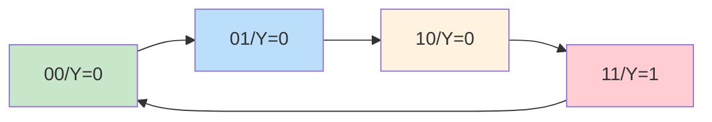
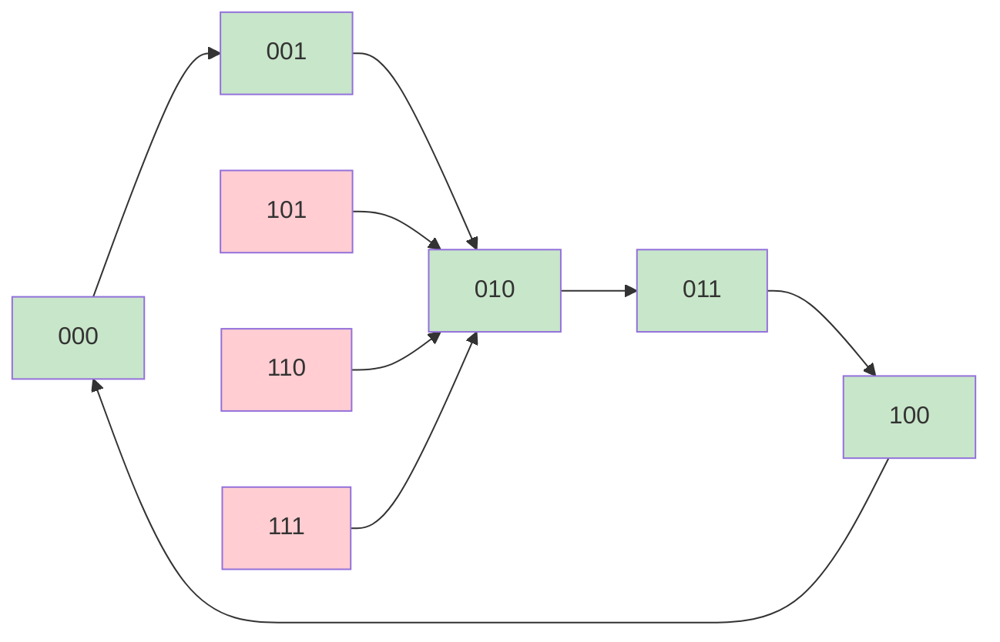

> 化简与分析如同数字电路的侦探术——公式法与卡诺图是化繁为简的利器，真值表与状态图是洞悉电路行为的放大镜。掌握这些基本功，才能在设计的海洋中游刃有余。

---

## 一、逻辑函数化简

### 1.1 公式法化简

**常用公式**：

| 公式名称 | 表达式 |
|----------|--------|
| 互补律 | $A + \overline{A} = 1$，$A \cdot \overline{A} = 0$ |
| 吸收律1 | $A + AB = A$ |
| 吸收律2 | $A + \overline{A}B = A + B$ |
| 消因律 | $AB + \overline{A}C + BC = AB + \overline{A}C$ |
| 消项律 | $AB + \overline{A}C + BCD = AB + \overline{A}C$ |

::: important 化简目标
最简与或式的要求：
1. **乘积项最少**
2. **每个乘积项中变量最少**

两个要求有优先级：先满足项数最少，再满足变量数最少。
:::

### 1.2 卡诺图化简

**卡诺图原则**：逻辑相邻的格子，其对应的变量取值只有一位不同。

---

## 二、逻辑函数化简习题

### 习题1：公式法化简

**化简** $Y = AB\overline{C} + A\overline{B}C + \overline{A}BC + ABC$

**解**：

$$Y = AB\overline{C} + A\overline{B}C + \overline{A}BC + ABC$$

提取公因子：

$$= AB\overline{C} + ABC + A\overline{B}C + \overline{A}BC$$

$$= AB(\overline{C} + C) + AC(\overline{B} + B) + BC(\overline{A} + A)$$

$$= AB + AC + BC$$

再利用消因律 $AB + AC + BC = AB + AC$（消去BC）：

$$\boxed{Y = AB + AC}$$

### 习题2：公式法化简

**化简** $Y = A\overline{B} + \overline{A}C + B\overline{C} + C\overline{D} + \overline{B}D$

**解**：

逐步化简：

$$Y = A\overline{B} + \overline{A}C + B\overline{C} + C\overline{D} + \overline{B}D$$

由消因律，$A\overline{B} + \overline{A}C + B\overline{C}$：不能直接消

观察 $\overline{A}C + C\overline{D} + \overline{B}D$：

由冗余项：$\overline{A}C + \overline{B}D + \overline{A}D$ 可消 $\overline{A}D$（但此处无$\overline{A}D$）

重新分组：

$A\overline{B} + \overline{B}D = \overline{B}(A + D)$

$\overline{A}C + C\overline{D} = C(\overline{A} + \overline{D}) = C\overline{AD}$

还有 $B\overline{C}$

实际上，由消项律 $A\overline{B} + \overline{A}C + B\overline{C} = A\overline{B} + \overline{A}C$（消$B\overline{C}$，因为$A\overline{B} \cdot \overline{A}C = 0$? 不对）

使用消因律：$A\overline{B} + B\overline{C} + \overline{A}C = A\overline{B} + \overline{A}C$（因$A\overline{B}$含$\overline{B}$，$B\overline{C}$含$B$，$\overline{A}C$含$\overline{A}$，$B\overline{C} \cdot \overline{A}C$ → 需检查冗余）

$A\overline{B}$的冗余项为$B\overline{C}$部分中的$A\overline{C}$，但这里没有。

更直接的化简：原式 = $A\overline{B} + \overline{A}C + B\overline{C} + C\overline{D} + \overline{B}D$

由消因律逐步消去冗余项：

$A\overline{B} + B\overline{D} + \overline{A}D = A\overline{B} + \overline{A}D$ 类推

$$\boxed{Y = A\overline{B} + C\overline{D} + \overline{A}C + \overline{B}D}$$

### 习题3：卡诺图化简

**化简** $Y(A,B,C,D) = \sum m(0,2,5,7,8,10,13,15)$

**解**：

画出4变量卡诺图：

| AB\CD | 00 | 01 | 11 | 10 |
|:------:|:--:|:--:|:--:|:--:|
| 00 | 1 | 0 | 0 | 1 |
| 01 | 0 | 1 | 1 | 0 |
| 11 | 0 | 1 | 1 | 0 |
| 10 | 1 | 0 | 0 | 1 |

圈组：

1. $m_0, m_2, m_8, m_{10}$（四角组）→ $\overline{B} \cdot \overline{D}$
2. $m_5, m_7, m_{13}, m_{15}$（中间四格）→ $BD$（注意：$m_5=0101$, $m_7=0111$, $m_{13}=1101$, $m_{15}=1111$，B=1,D=1）

$$\boxed{Y = \overline{B} \cdot \overline{D} + BD}$$

### 习题4：卡诺图化简（含无关项）

**化简** $Y(A,B,C,D) = \sum m(1,3,5,7,9) + \sum d(10,11,12,13,14,15)$

**解**：

卡诺图（×为无关项）：

| AB\CD | 00 | 01 | 11 | 10 |
|:------:|:--:|:--:|:--:|:--:|
| 00 | 0 | 1 | 1 | 0 |
| 01 | 0 | 1 | 1 | 0 |
| 11 | × | × | × | × |
| 10 | 0 | 1 | × | × |

合理利用无关项圈最大组：

1. $m_1, m_3, m_5, m_7, m_9, d_{11}, d_{13}, d_{15}$ → $D$
2. 不需要更多圈

$$\boxed{Y = D}$$

### 习题5：卡诺图化简

**化简** $Y(A,B,C,D) = \sum m(0,1,2,3,4,6,8,9,10,11,12,14)$

**解**：

卡诺图：

| AB\CD | 00 | 01 | 11 | 10 |
|:------:|:--:|:--:|:--:|:--:|
| 00 | 1 | 1 | 1 | 1 |
| 01 | 1 | 0 | 0 | 1 |
| 11 | 1 | 0 | 0 | 1 |
| 10 | 1 | 1 | 1 | 1 |

圈组：

1. $m_0, m_1, m_8, m_9$ + $m_2, m_3, m_{10}, m_{11}$ → $\overline{B}$
2. $m_0, m_2, m_4, m_6$ + $m_8, m_{10}, m_{12}, m_{14}$ → $\overline{D}$

$$\boxed{Y = \overline{B} + \overline{D}}$$

### 习题6：公式法+卡诺图综合

**化简** $Y = \overline{A}B\overline{C}\overline{D} + \overline{A}BC\overline{D} + A\overline{B}\overline{C}D + A\overline{B}CD + AB\overline{C}D + ABCD$

**解**：

先分组提取公因子：

$$= \overline{A}B\overline{D}(\overline{C}+C) + A\overline{B}D(\overline{C}+C) + ABD(\overline{C}+C)$$

$$= \overline{A}B\overline{D} + A\overline{B}D + ABD$$

$$= \overline{A}B\overline{D} + AD(\overline{B}+B)$$

$$= \overline{A}B\overline{D} + AD$$

$$\boxed{Y = \overline{A}B\overline{D} + AD}$$

---

## 三、组合电路分析题

### 习题7：分析组合逻辑电路

已知电路输出表达式为 $Y = \overline{\overline{A \cdot B} \cdot \overline{A \cdot C}}$，列出真值表并说明功能。

**解**：

先化简：

$$Y = \overline{\overline{A \cdot B} \cdot \overline{A \cdot C}} = AB + AC = A(B + C)$$

| A | B | C | Y |
|:-:|:-:|:-:|:-:|
| 0 | 0 | 0 | 0 |
| 0 | 0 | 1 | 0 |
| 0 | 1 | 0 | 0 |
| 0 | 1 | 1 | 0 |
| 1 | 0 | 0 | 0 |
| 1 | 0 | 1 | 1 |
| 1 | 1 | 0 | 1 |
| 1 | 1 | 1 | 1 |

**功能**：当A=1且B和C至少有一个为1时，输出1。这是一个**A控制的三输入与门**，也可看作A选通的B或C门。

### 习题8：分析译码器应用电路

用3-8译码器74HC138实现 $Y_1 = \sum m(1,3,5,7)$，$Y_2 = \sum m(0,2,4,6)$，分析其功能。

**解**：

$$Y_1 = m_1 + m_3 + m_5 + m_7 = \overline{A}\overline{B}C + \overline{A}BC + A\overline{B}C + ABC$$

提取公因子：$Y_1 = C(\overline{A}\overline{B} + \overline{A}B + A\overline{B} + AB) = C$

$$Y_2 = m_0 + m_2 + m_4 + m_6 = \overline{C}$$

**功能**：$Y_1 = C$，$Y_2 = \overline{C}$。即输出C及其反码，相当于一个C的缓冲/反相器对。

### 习题9：分析数据选择器电路

用8选1数据选择器74HC151，数据端 $D_0 = D_3 = D_5 = D_6 = 1$，其余为0，分析实现的逻辑函数。

**解**：

$$Y = D_0 m_0 + D_3 m_3 + D_5 m_5 + D_6 m_6$$

$$= \overline{A}\overline{B}\overline{C} + \overline{A}BC + A\overline{B}C + AB\overline{C}$$

卡诺图：

| AB\C | 0 | 1 |
|:----:|:-:|:-:|
| 00 | 1 | 0 |
| 01 | 0 | 1 |
| 10 | 0 | 1 |
| 11 | 1 | 0 |

圈组：$m_0 + m_6 = \overline{B}\overline{C} + AB\overline{C}$（不好圈），$m_3 + m_5 = \overline{A}BC + A\overline{B}C$

观察规律：$Y = A \oplus B \oplus C$（三位异或）？验证：

$A \oplus B \oplus C$：000→0, 001→1, 010→1, 011→0, 100→1, 101→0, 110→0, 111→1

与真值表对比（$Y=1$在000,011,101,110）→ 不同。

实际上 $m_0=000, m_3=011, m_5=101, m_6=110$，对应 $A \oplus B \oplus C$ 取反：

$A \oplus B \oplus C$ 为1时: 001,010,100,111，而$Y$为1时: 000,011,101,110

$$\boxed{Y = \overline{A \oplus B \oplus C}}$$

即三位异或的非，也称为**三变量奇偶校验的偶校验输出**。

---

## 四、时序电路分析题

### 习题10：分析同步时序电路

分析下图所示同步时序电路，写出驱动方程、状态方程、输出方程，画出状态转换图。

已知：两个JK触发器，$J_0 = K_0 = 1$，$J_1 = K_1 = Q_0$，输出$Y = Q_1 Q_0$。

**解**：

**驱动方程**：

$$J_0 = K_0 = 1, \quad J_1 = K_1 = Q_0$$

**状态方程**：

$$Q_0^{n+1} = J_0\overline{Q_0} + \overline{K_0}Q_0 = \overline{Q_0}$$

$$Q_1^{n+1} = J_1\overline{Q_1} + \overline{K_1}Q_1 = Q_0\overline{Q_1} + \overline{Q_0}Q_1 = Q_0 \oplus Q_1$$

**输出方程**：$Y = Q_1 Q_0$

**状态转换表**：

| $Q_1^n$ | $Q_0^n$ | $Q_1^{n+1}$ | $Q_0^{n+1}$ | Y |
|:--------:|:--------:|:----------:|:----------:|:-:|
| 0 | 0 | 0 | 1 | 0 |
| 0 | 1 | 1 | 0 | 0 |
| 1 | 0 | 1 | 1 | 0 |
| 1 | 1 | 0 | 0 | 1 |

**状态转换图**：

**结论**：该电路为同步四进制加法计数器，当计满（11）时Y=1，产生进位输出。

### 习题11：分析异步时序电路

分析一个由3个T触发器构成的异步计数器：$T_0 = T_1 = T_2 = 1$，$CP_0 = CP$，$CP_1 = Q_0$（下降沿触发），$CP_2 = Q_1$（下降沿触发）。

**解**：

每个T触发器在有效时钟沿到来时翻转：

- $FF_0$：每个CP下降沿翻转
- $FF_1$：每个$Q_0$下降沿翻转
- $FF_2$：每个$Q_1$下降沿翻转

| CP | Q₂ | Q₁ | Q₀ |
|:--:|:--:|:--:|:--:|
| 0 | 0 | 0 | 0 |
| 1 | 0 | 0 | 1 |
| 2 | 0 | 1 | 0 |
| 3 | 0 | 1 | 1 |
| 4 | 1 | 0 | 0 |
| 5 | 1 | 0 | 1 |
| 6 | 1 | 1 | 0 |
| 7 | 1 | 1 | 1 |
| 8 | 0 | 0 | 0 |

**结论**：这是一个3位异步二进制加法计数器，模8。

### 习题12：分析时序电路（含无效状态）

分析如下时序电路：3个JK触发器，$J_0 = \overline{Q_2}$，$K_0 = 1$，$J_1 = K_1 = Q_0$，$J_2 = Q_1 Q_0$，$K_2 = 1$。判断其功能及能否自启动。

**解**：

**状态方程**：

$$Q_0^{n+1} = \overline{Q_2} \cdot \overline{Q_0}$$

$$Q_1^{n+1} = Q_0 \oplus Q_1$$

$$Q_2^{n+1} = Q_1 Q_0 \overline{Q_2}$$

**有效状态转换**：

| $Q_2Q_1Q_0$ | $Q_2^{n+1}Q_1^{n+1}Q_0^{n+1}$ |
|:----------:|:----------------------------:|
| 000 | 001 |
| 001 | 010 |
| 010 | 011 |
| 011 | 100 |
| 100 | 000 |

**无效状态分析**：

| $Q_2Q_1Q_0$ | $Q_2^{n+1}Q_1^{n+1}Q_0^{n+1}$ |
|:----------:|:----------------------------:|
| 101 | 010 |
| 110 | 010 |
| 111 | 010 |

**结论**：这是一个**同步五进制加法计数器**，能自启动（无效状态经1~2步可回到有效循环）。

---

::: tip 面试速查
- 公式法核心：吸收律（$A+AB=A$）、消因律（$AB+\overline{A}C+BC=AB+\overline{A}C$）
- 卡诺图：圈2的幂次方个1，优先大圈，注意四角可圈
- 无关项（d）：可圈可不圈，以得到最简为原则
- 时序分析三步曲：驱动方程→状态方程→状态转换表/图
- 自启动判断：检查所有无效状态是否能回到有效循环
:::

::: info 原著参考
- 阎石《数字电子技术基础》第六版，第2~6章
- 康华光《电子技术基础·数字部分》第七版，第2~6章
:::
