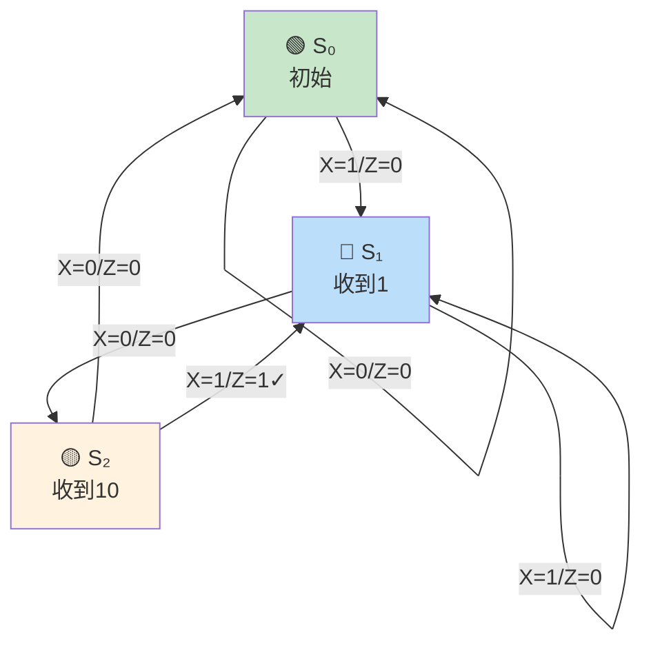

> 设计是分析的逆旅——分析是已知电路求功能，设计则是已知功能造电路。从需求到真值表，从逻辑式到电路图，设计者将抽象的意图化为具体的逻辑门与触发器，这是数字电路最富创造力的环节。

---

## 一、组合电路设计

### 1.1 组合电路设计步骤


---

### 习题1：设计4-2线优先编码器

**需求**：设计一个4输入优先编码器，输入$I_3 \sim I_0$，$I_3$优先级最高，输出2位编码$Y_1Y_0$及组信号$GS$。

**解**：

**第一步：列真值表**

| $I_3$ | $I_2$ | $I_1$ | $I_0$ | $Y_1$ | $Y_0$ | GS |
|:-----:|:-----:|:-----:|:-----:|:-----:|:-----:|:--:|
| 0 | 0 | 0 | 0 | × | × | 0 |
| 0 | 0 | 0 | 1 | 0 | 0 | 1 |
| 0 | 0 | 1 | × | 0 | 1 | 1 |
| 0 | 1 | × | × | 1 | 0 | 1 |
| 1 | × | × | × | 1 | 1 | 1 |

**第二步：写逻辑式**

$GS = I_0 + I_1 + I_2 + I_3$（任意输入有效即GS=1）

$Y_1 = I_3 + I_2$（$I_3$或$I_2$有效时$Y_1=1$，因为$I_3$优先最高，若$I_3=1$则$Y_1=1$；若$I_3=0, I_2=1$则$Y_1=1$）

$Y_0 = I_3 + \overline{I_2}I_1$（$I_3$有效时$Y_0=1$；$I_3=0, I_2=0, I_1$有效时$Y_0=1$）

**第三步：画电路**

```verilog
// 4-2线优先编码器
module priority_encoder_4to2(
    input  [3:0] i,
    output [1:0] y,
    output       gs
);
    assign gs = |i;                    // 任意输入有效
    assign y[1] = i[3] | i[2];        // I3 or I2
    assign y[0] = i[3] | (~i[2] & i[1]); // I3 or (not I2 and I1)
endmodule
```

---

### 习题2：用3-8译码器实现全加器

**需求**：用一片74HC138和必要的门电路实现一位全加器。

**解**：

全加器输出：

$$S_i = \overline{A_i} \cdot \overline{B_i} \cdot C_{i-1} + \overline{A_i} \cdot B_i \cdot \overline{C_{i-1}} + A_i \cdot \overline{B_i} \cdot \overline{C_{i-1}} + A_i \cdot B_i \cdot C_{i-1}$$

$$= m_1 + m_2 + m_4 + m_7$$

$$C_i = \overline{A_i} \cdot B_i \cdot C_{i-1} + A_i \cdot \overline{B_i} \cdot C_{i-1} + A_i \cdot B_i \cdot \overline{C_{i-1}} + A_i \cdot B_i \cdot C_{i-1}$$

$$= m_3 + m_5 + m_6 + m_7$$

74HC138的输出为低电平有效：$\overline{Y_i} = \overline{m_i}$

$$S_i = \overline{\overline{m_1} \cdot \overline{m_2} \cdot \overline{m_4} \cdot \overline{m_7}} = \overline{\overline{Y_1} \cdot \overline{Y_2} \cdot \overline{Y_4} \cdot \overline{Y_7}}$$

$$C_i = \overline{\overline{m_3} \cdot \overline{m_5} \cdot \overline{m_6} \cdot \overline{m_7}} = \overline{\overline{Y_3} \cdot \overline{Y_5} \cdot \overline{Y_6} \cdot \overline{Y_7}}$$

**接线**：

- $A_i \to A$，$B_i \to B$，$C_{i-1} \to C$
- $\overline{Y_1}, \overline{Y_2}, \overline{Y_4}, \overline{Y_7}$ 接4输入与非门 → $S_i$
- $\overline{Y_3}, \overline{Y_5}, \overline{Y_6}, \overline{Y_7}$ 接4输入与非门 → $C_i$

---

### 习题3：用数据选择器实现逻辑函数

**需求**：用4选1数据选择器实现 $Y = A\overline{B} + \overline{A}C + BC$

**解**：

4选1数据选择器：$Y = D_0\overline{A}\overline{B} + D_1\overline{A}B + D_2A\overline{B} + D_3AB$

将$Y$按$A, B$展开：

$$Y = A\overline{B} + \overline{A}C + BC$$

$$= \overline{A}\overline{B} \cdot 0 + \overline{A}B(C) + A\overline{B}(1) + AB(C)$$

所以：

| 选择 | 数据端 |
|:----:|:------:|
| $D_0$ | 0 |
| $D_1$ | $C$ |
| $D_2$ | 1 |
| $D_3$ | $C$ |

**接线**：$A \to S_1$，$B \to S_0$，$D_0 = 0$，$D_1 = C$，$D_2 = 1$，$D_3 = C$

---

## 二、时序电路设计

### 习题4：用74HC161设计模13计数器

**需求**：用74HC161设计模13计数器，分别用异步清零法和同步置数法。

**解**：

**方法一：异步清零法**

$M = 13$，检测状态 $S_{13} = 1101$

$$\overline{CLR} = \overline{Q_3 \cdot Q_2 \cdot Q_0}$$

有效状态：0000~1100

::: warning 注意
异步清零法中，状态1101只是一个短暂的过渡态（纳秒级），不是稳定状态。实际稳定状态为0000~1100共13个。
:::

**方法二：同步置数法（从0000开始）**

$M = 13$，检测状态 $S_{12} = 1100$

当 $Q_3Q_2Q_1Q_0 = 1100$ 时，$\overline{LD} = 0$，$D_3D_2D_1D_0 = 0000$

下一个CP↑时，$Q = 0000$

有效状态：0000~1100

**方法三：同步置数法（利用RCO）**

$16 - 13 = 3$，即从0011开始计数

当 $RCO = 1$（$Q = 1111$）时，$\overline{LD} = 0$，$D_3D_2D_1D_0 = 0011$

有效状态：0011~1111

```verilog
// 模13计数器（同步置数法）
module counter13(
    input  clk,
    input  rst_n,
    output [3:0] q
);
    reg [3:0] q;
    always @(posedge clk or negedge rst_n) begin
        if (!rst_n)
            q <= 4'd0;
        else if (q == 4'd12)
            q <= 4'd0;
        else
            q <= q + 1;
    end
endmodule
```

---

### 习题5：设计序列检测器

**需求**：设计一个Mealy型序列检测器，当输入连续出现"101"时输出Z=1。

**解**：

**第一步：确定状态**

| 状态 | 含义 |
|------|------|
| $S_0$ | 初始状态，未收到任何有效位 |
| $S_1$ | 收到1 |
| $S_2$ | 收到10 |

**第二步：状态转换表**

| 当前状态 | 输入X | 下一状态 | 输出Z |
|----------|:------:|----------|:------:|
| $S_0$ | 0 | $S_0$ | 0 |
| $S_0$ | 1 | $S_1$ | 0 |
| $S_1$ | 0 | $S_2$ | 0 |
| $S_1$ | 1 | $S_1$ | 0 |
| $S_2$ | 0 | $S_0$ | 0 |
| $S_2$ | 1 | $S_1$ | 1 |

**第三步：状态编码**

$S_0 = 00, S_1 = 01, S_2 = 10$

**第四步：卡诺图化简得驱动方程和输出方程**

$$Z = Q_1 \cdot X$$

$$D_1 = \overline{Q_1} \cdot Q_0 \cdot \overline{X}$$

$$D_0 = X$$



---

### 习题6：设计模5计数器（JK触发器）

**需求**：用JK触发器设计一个同步模5计数器，状态编码为000→001→010→011→100→000。

**解**：

**第一步：状态转换表**

| $Q_2$ | $Q_1$ | $Q_0$ | $Q_2^{n+1}$ | $Q_1^{n+1}$ | $Q_0^{n+1}$ |
|:-----:|:-----:|:-----:|:----------:|:----------:|:----------:|
| 0 | 0 | 0 | 0 | 0 | 1 |
| 0 | 0 | 1 | 0 | 1 | 0 |
| 0 | 1 | 0 | 0 | 1 | 1 |
| 0 | 1 | 1 | 1 | 0 | 0 |
| 1 | 0 | 0 | 0 | 0 | 0 |

**第二步：求驱动方程**

对于$Q_0$：$Q_0^{n+1} = \overline{Q_2} \cdot \overline{Q_0}$ → $J_0 = \overline{Q_2}$，$K_0 = 1$

对于$Q_1$：$Q_1^{n+1} = Q_0 \oplus Q_1$ → $J_1 = K_1 = Q_0$

对于$Q_2$：$Q_2^{n+1} = Q_1 Q_0 \overline{Q_2}$ → $J_2 = Q_1 Q_0$，$K_2 = 1$

**第三步：检查自启动**

无效状态：101, 110, 111

| $Q_2Q_1Q_0$ | $Q_2^{n+1}Q_1^{n+1}Q_0^{n+1}$ |
|:----------:|:----------------------------:|
| 101 | 010 |
| 110 | 010 |
| 111 | 010 |

所有无效状态均能进入有效循环，**能自启动**。

---

## 三、综合应用题

### 习题7：用ROM实现代码转换器

**需求**：用ROM实现4位二进制码→格雷码的转换器。

**解**：

**真值表**（4位二进制 $B_3B_2B_1B_0$ → 格雷码 $G_3G_2G_1G_0$）：

| $B_3B_2B_1B_0$ | $G_3G_2G_1G_0$ | $B_3B_2B_1B_0$ | $G_3G_2G_1G_0$ |
|:--------------:|:--------------:|:--------------:|:--------------:|
| 0000 | 0000 | 1000 | 1100 |
| 0001 | 0001 | 1001 | 1101 |
| 0010 | 0011 | 1010 | 1111 |
| 0011 | 0010 | 1011 | 1110 |
| 0100 | 0110 | 1100 | 1010 |
| 0101 | 0111 | 1101 | 1011 |
| 0110 | 0101 | 1110 | 1001 |
| 0111 | 0100 | 1111 | 1000 |

格雷码转换规则：$G_i = B_i \oplus B_{i+1}$（$G_n = B_n$）

ROM容量：$2^4 \times 4 = 16 \times 4$ 位

将上述真值表直接存入ROM即可。

### 习题8：综合设计——交通灯控制器

**需求**：用74HC161和译码器设计一个简化交通灯控制器，要求：
- 主道绿灯亮30秒，然后黄灯亮5秒
- 支道绿灯亮20秒，然后黄灯亮5秒
- 循环工作

**解**：

**总周期**：30 + 5 + 20 + 5 = 60秒

以1Hz时钟为基准，需要模60计数器。

**状态定义**：

| 状态 | 时间 | 主道灯 | 支道灯 |
|------|------|--------|--------|
| S0 | 0~29 (30s) | 绿 | 红 |
| S1 | 30~34 (5s) | 黄 | 红 |
| S2 | 35~54 (20s) | 红 | 绿 |
| S3 | 55~59 (5s) | 红 | 黄 |

**设计方案**：

用两片74HC161构成模60计数器（十位模6+个位模10），计数值00~59。

译码逻辑：

$$主绿 = (十位 = 0) \cdot (个位 < 30) \text{ 或更简单：} 计数值 < 30$$

$$主黄 = (30 \leq 计数值 < 35)$$

$$支绿 = (35 \leq 计数值 < 55)$$

$$支黄 = (计数值 \geq 55)$$

```verilog
// 简化交通灯控制器
module traffic_light(
    input  clk,        // 1Hz时钟
    input  rst_n,
    output main_green,
    output main_yellow,
    output main_red,
    output branch_green,
    output branch_yellow,
    output branch_red
);
    reg [5:0] count;   // 0~59
    always @(posedge clk or negedge rst_n) begin
        if (!rst_n)
            count <= 6'd0;
        else if (count == 6'd59)
            count <= 6'd0;
        else
            count <= count + 1;
    end

    assign main_green  = (count < 30);
    assign main_yellow = (count >= 30) && (count < 35);
    assign main_red    = (count >= 35);
    assign branch_green  = (count >= 35) && (count < 55);
    assign branch_yellow = (count >= 55);
    assign branch_red    = (count < 35);
endmodule
```


---

::: tip 面试速查
- 组合设计：需求→真值表→逻辑式→化简→电路
- 优先编码器：高位优先，低电平有效输入需注意
- 译码器实现逻辑：最小项+与非门（输出低有效）
- 数据选择器实现逻辑：按地址变量展开，剩余变量接数据端
- 计数器设计：清零法检测$S_M$（异步）/$S_{M-1}$（同步），置数法更灵活
- 序列检测器：Mealy型输出与输入有关，Moore型仅与状态有关
- ROM实现组合逻辑：地址=输入，存储内容=真值表
:::

::: info 原著参考
- 阎石《数字电子技术基础》第六版，第3~7章
- 康华光《电子技术基础·数字部分》第七版，第3~8章
:::
