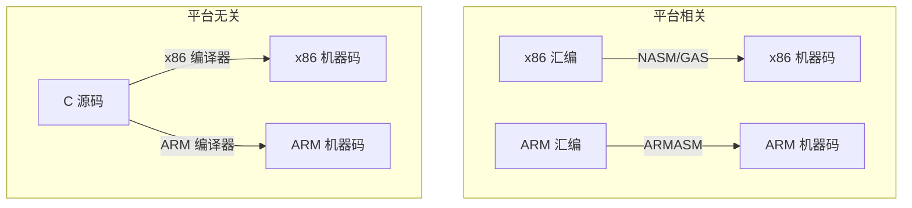
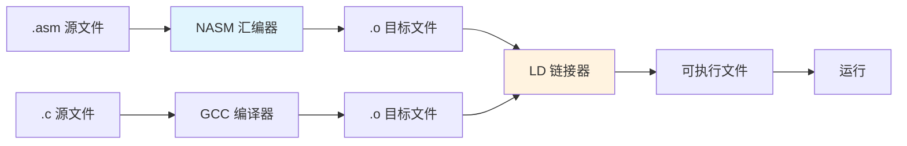

# 什么是汇编语言

## 从高级语言到机器语言：翻译的层级

你写下的 Python `print("hello")`，CPU 并不认识。CPU 只懂一种语言——由 0 和 1 组成的**机器码**。从你写的高级语言到 CPU 能执行的机器码之间，存在一个翻译链条：


汇编语言就处在链条的中间环节——它是机器码的**人类可读形式**。每条汇编指令几乎都一一对应一条机器指令，就像用助记符给二进制操作码起了名字。

::: tip 为什么叫"汇编"？
"汇编"（Assembly）一词源于"assemble"——组装。汇编器将助记符和操作数"组装"成机器码，故名。而反方向的操作叫**反汇编**（Disassembly），把机器码还原回汇编。
:::

## 汇编语言的核心特征

### 1. 与硬件一一对应

高级语言的一条语句可能编译出十多条机器指令，但汇编语言是**1:1 映射**的：

```nasm
mov eax, 42      ; 将立即数 42 装入 EAX 寄存器
add eax, 8       ; EAX = EAX + 8
```

这两条汇编指令，各对应一条 x86 机器指令。你写的每一条汇编，都能精确知道 CPU 将执行什么。

### 2. 没有抽象，只有裸操作

高级语言替你管理内存、类型、作用域。汇编语言没有这些奢侈品：

- 没有"变量类型"——只有寄存器和内存地址中的原始字节
- 没有"自动内存管理"——你手动管理栈和堆
- 没有"控制结构语法"——`if/else/for` 全靠跳转指令实现

::: important 汇编不是"另一种高级语言"
学习汇编最大的思维转换在于：**放下抽象，直面硬件**。你操作的是寄存器、内存地址和标志位，而不是对象和函数。
:::

### 3. 平台相关

C 代码在 x86 和 ARM 上都能编译运行（只要编译器支持），但汇编代码**绑定指令集架构（ISA）**。x86 汇编不能在 ARM 上运行，反之亦然。



## 为什么还要学汇编？

在高级语言如此普及的今天，学习汇编仍有不可替代的价值：

| 场景 | 汇编的作用 |
|------|-----------|
| 性能优化 | 找到编译器无法自动优化的热点，手写关键路径 |
| 逆向工程 | 分析恶意软件、闭源协议、二进制漏洞 |
| 操作系统开发 | 引导扇区、中断处理、上下文切换必须用汇编 |
| 嵌入式系统 | 资源极端受限的 MCU 需要精确控制每条指令 |
| 理解计算机本质 | 真正理解指针、栈、调用约定等底层机制 |

::: tip 面试要点
- 汇编语言是机器码的助记符表示，与机器指令一一对应
- 汇编是平台相关的，绑定特定指令集架构
- 学习汇编的核心价值：性能调优、逆向分析、操作系统开发、理解底层机制
:::

## x86 汇编的两大语法阵营

x86 汇编有两种主流语法格式：

### Intel 语法（NASM 使用）

```nasm
mov eax, 42      ; 目的操作数在前
```

### AT&T 语法（GAS 默认）

```asm
movl $42, %eax   ; 源操作数在前，寄存器加 % 前缀，立即数加 $ 前缀
```

本文系列统一使用 **Intel 语法 + NASM 汇编器**，因为 Intel 语法更直观、可读性更好，也是 Duntemann 教材的标准选择。

::: warning 别混淆两种语法
初学者最容易踩的坑：把 Intel 语法和 AT&T 语法混用。记住规则——
- Intel: `mov dest, src`（目标在前）
- AT&T: `movl src, dest`（源在前，带前缀）
:::

## 第一个汇编程序：Hello World

下面是一个在 Linux 上运行的 x86 汇编 Hello World 程序（32 位）：

```nasm
; hello.asm - 第一个汇编程序
; 编译: nasm -f elf32 hello.asm -o hello.o
; 链接: ld -m elf_i386 hello.o -o hello
; 运行: ./hello

section .data           ; 数据段 - 存放已初始化的数据
    msg db 'Hello, Assembly World!', 0xA  ; 字符串 + 换行符
    len equ $ - msg                        ; 计算字符串长度

section .text           ; 代码段 - 存放指令
    global _start       ; 声明入口点

_start:
    ; 系统调用: sys_write(fd, buf, count)
    mov eax, 4          ; 系统调用号 4 = sys_write
    mov ebx, 1          ; 文件描述符 1 = stdout
    mov ecx, msg        ; 字符串地址
    mov edx, len        ; 字符串长度
    int 0x80            ; 触发内核系统调用

    ; 系统调用: sys_exit(status)
    mov eax, 1          ; 系统调用号 1 = sys_exit
    xor ebx, ebx        ; 退出码 0 (xor 比 mov ebx,0 更短)
    int 0x80            ; 触发内核系统调用
```

编译运行步骤：

```bash
nasm -f elf32 hello.asm -o hello.o
ld -m elf_i386 hello.o -o hello
./hello
# 输出: Hello, Assembly World!
```

::: tip xor 替代 mov
`xor ebx, ebx` 将 EBX 清零，比 `mov ebx, 0` 少一个字节。这是汇编程序员常用的优化技巧——指令更短，执行更快。
:::

## 汇编开发工具链



| 工具 | 作用 |
|------|------|
| **NASM** | 汇编器，将 .asm 翻译成 .o 目标文件 |
| **LD** | 链接器，将 .o 组合成可执行文件 |
| **GCC** | 可替代 LD 做链接，自动处理 C 运行时库 |
| **GDB** | 调试器，单步跟踪汇编执行 |
| **objdump** | 反汇编工具，查看二进制中的汇编代码 |

::: warning 32 位 vs 64 位
本文系列以 32 位 x86 为教学基础，因为寄存器更少、调用约定更简单，适合入门。64 位 x86-64 在后续文章中会专门对比。在 64 位系统上编译 32 位程序需要安装 `gcc-multilib` 包。
:::

## 小结

| 概念 | 要点 |
|------|------|
| 汇编语言的本质 | 机器码的人类可读助记符 |
| 核心特征 | 1:1 对应机器指令、无抽象、平台相关 |
| 语法阵营 | Intel 语法（NASM）vs AT&T 语法（GAS） |
| 开发流程 | 编写 .asm → NASM 汇编 → LD 链接 → 运行 |
| 学习价值 | 性能优化、逆向、OS 开发、理解底层 |

::: info 原著参考
本章内容参考自《汇编语言：基于Linux环境（第3版）》Jeff Duntemann 第1-2章。书中从"汇编是什么"出发，通过大量实例引导读者建立对汇编语言的直觉认知。
:::
