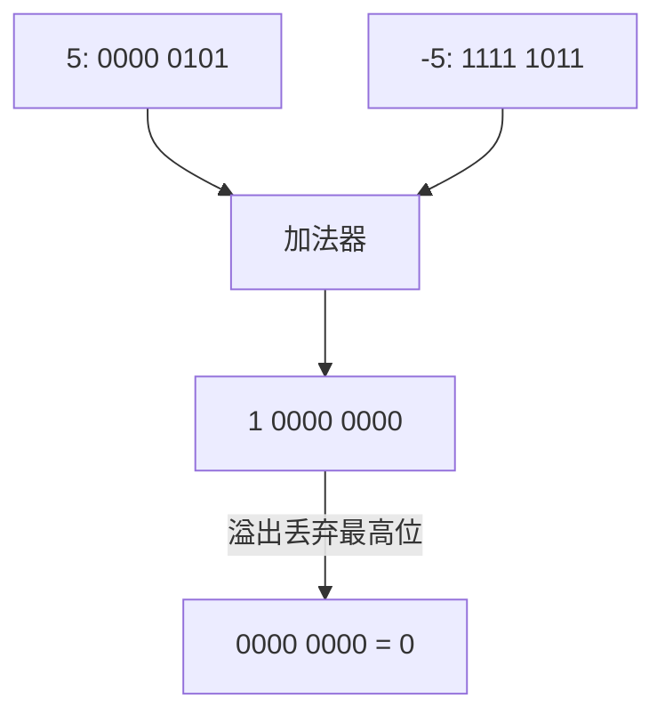
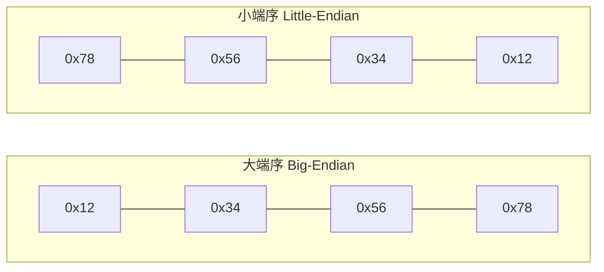

# 数据表示与存储

## 计算机眼中只有 0 和 1

无论你写的是一篇文章、一张图片还是一首歌，在计算机内部统统只是一串比特（bit）。理解数据如何在比特层面表示和存储，是学习汇编的**第一块基石**。

如果把计算机比作一个只认识"开/关"灯泡的人，那么所有的信息——数字、字符、颜色、声音——都必须用灯泡的亮灭组合来表达。这就是数据表示的核心问题。

## 进制转换：计算机的母语与人类的语言

### 二进制、八进制、十进制、十六进制

| 进制 | 基数 | 前缀 | 示例 | 用途 |
|------|------|------|------|------|
| 二进制 | 2 | `0b` | `0b1010` | 计算机原生表示 |
| 八进制 | 8 | `0o` | `0o12` | Unix 文件权限 |
| 十进制 | 10 | 无 | `10` | 人类日常使用 |
| 十六进制 | 16 | `0x` | `0xA` | 汇编中最常用 |

::: tip 为什么汇编爱用十六进制？
一个十六进制数字恰好表示 4 个比特（2^4 = 16），两个十六进制数字 = 1 个字节。所以 `0xFF` 直观地表示"一个全 1 的字节"。十六进制是二进制的"压缩写法"。
:::

### 转换方法


二进制 → 十六进制的快速转换：每 4 位二进制对应 1 位十六进制

```
二进制:  1010  1010
十六进制:  A     A    → 0xAA
十进制:   10    10    → 10×16 + 10 = 170
```

## 整数表示：有符号与无符号

### 无符号整数

所有比特都用于表示数值，没有符号位：

| 位数 | 范围 | 示例 |
|------|------|------|
| 8 位 | 0 ~ 255 | `0b11111111` = 255 |
| 16 位 | 0 ~ 65,535 | |
| 32 位 | 0 ~ 4,294,967,295 | |
| 64 位 | 0 ~ 2^64 - 1 | |

### 有符号整数：补码（Two's Complement）

计算机用**补码**表示有符号数。理解补码是理解汇编中条件跳转、溢出检测的关键。

**补码规则**：最高位是符号位（0 正 1 负），负数的补码 = 按位取反 + 1

```
+5 的 8 位表示:  0000 0101
-5 的 8 位表示:  1111 1011  (取反: 1111 1010, +1: 1111 1011)
```

::: important 补码的妙处
补码让加减法统一：`5 + (-5)` 在补码下直接做二进制加法，结果自然为 0，无需特殊处理。这是硬件设计的天才选择。
:::



### 符号扩展与零扩展

将小尺寸数据移入大尺寸寄存器时，必须决定如何填充高位：

- **零扩展（MOVZX）**：高位填 0，用于无符号数
- **符号扩展（MOVSX）**：高位填符号位，用于有符号数

```nasm
; 零扩展示例
movzx eax, byte [data]     ; 8位无符号 → 32位，高位填0

; 符号扩展示例
movsx eax, byte [sdata]    ; 8位有符号 → 32位，高位填符号位
```

## 字节序：大端 vs 小端

多字节数据在内存中的存放顺序——这是初学者最容易困惑的概念之一。

假设 32 位整数 `0x12345678` 存放在内存地址 `0x1000`：

| 字节序 | 地址 0x1000 | 0x1001 | 0x1002 | 0x1003 | 比喻 |
|--------|-----------|--------|--------|--------|------|
| **大端序** | 0x12 | 0x34 | 0x56 | 0x78 | 人类阅读顺序 |
| **小端序** | 0x78 | 0x56 | 0x34 | 0x12 | 低位放在低地址 |



::: warning x86 使用小端序
x86/x86-64 采用小端序。当你用 GDB 查看内存时，看到的字节顺序是"反"的。这是 x86 汇编最常见的坑之一——`mov eax, 0x12345678` 在内存中存储为 `78 56 34 12`。
:::

## 字符编码

### ASCII

每个字符用 7 位（扩展 ASCII 用 8 位）表示，共 128 个字符：

```nasm
; 在数据段中定义字符串
section .data
    greeting db 'Hello', 0xA, 0   ; 'H'=0x48, 'e'=0x65, 'l'=0x6C, ...
    char_A   equ 'A'              ; 等价于 equ 0x41
```

关键 ASCII 值要记住：

| 字符 | 十进制 | 十六进制 |
|------|--------|---------|
| '0'-'9' | 48-57 | 0x30-0x39 |
| 'A'-'Z' | 65-90 | 0x41-0x5A |
| 'a'-'z' | 97-122 | 0x61-0x7A |
| 换行 LF | 10 | 0x0A |

### 大小写转换

ASCII 大小写字母之间差 32（0x20），可以利用位操作快速转换：

```nasm
; 小写转大写: 清除第5位
and al, 0xDF        ; 'a'(0x61) → 'A'(0x41)

; 大写转小写: 设置第5位
or  al, 0x20        ; 'A'(0x41) → 'a'(0x61)
```

::: tip 位操作转换大小写的原理
大小写字母的 ASCII 码只有第 5 位不同（从低位编号）：大写第 5 位为 0，小写第 5 位为 1。所以用 AND 清除该位变大写，用 OR 设置该位变小写。这比加减 32 更优雅。
:::

## NASM 数据定义伪指令

在数据段中，使用以下伪指令声明不同大小的数据：

| 伪指令 | 大小 | 示例 |
|--------|------|------|
| `db` | 1 字节 | `db 0x41` 或 `db 'A'` |
| `dw` | 2 字节 | `dw 0x1234` |
| `dd` | 4 字节 | `dd 0x12345678` |
| `dq` | 8 字节 | `dq 0x123456789ABCDEF0` |

```nasm
section .data
    bVar   db 0xFF               ; 1 字节
    wVar   dw 0x1234             ; 2 字节
    dVar   dd 0x12345678         ; 4 字节
    qVar   dq 0x123456789ABCDEF0 ; 8 字节
    str    db 'Hello', 0         ; 以 null 结尾的字符串
    array  times 10 dd 0         ; 10 个初始化为 0 的双字
```

::: important times 伪指令
`times 10 dd 0` 相当于重复定义 10 个 `dd 0`。在分配缓冲区时非常有用。
:::

## 实战：观察内存中的数据表示

以下程序演示不同数据在内存中的存储方式：

```nasm
; data_repr.asm - 观察数据在内存中的表示
; 编译: nasm -f elf32 data_repr.asm -o data_repr.o
; 链接: ld -m elf_i386 data_repr.o -o data_repr
; 调试: gdb ./data_repr → break _start → run → x/16xb &testData

section .data
    testData dd 0x12345678       ; 小端序存储: 78 56 34 12
    strData  db 'ABCD'           ; ASCII存储: 41 42 43 44
    negVal   dd -1               ; 补码: FF FF FF FF

section .bss
    buffer resb 16               ; 预留 16 字节未初始化空间

section .text
    global _start

_start:
    ; 将 testData 加载到寄存器
    mov eax, [testData]          ; EAX = 0x12345678

    ; 字节级访问 - 观察小端序
    mov al, [testData]           ; AL = 0x78 (最低字节)
    mov ah, [testData+1]         ; AH = 0x56

    ; 退出
    mov eax, 1
    xor ebx, ebx
    int 0x80
```

用 GDB 验证内存布局：

```bash
gdb ./data_repr
(gdb) break _start
(gdb) run
(gdb) x/4xb &testData
0x804909c:  0x78  0x56  0x34  0x12    # 小端序！
(gdb) x/4xb &strData
0x80490a0:  0x41  0x42  0x43  0x44    # ASCII 按序存储
(gdb) x/4xb &negVal
0x80490a4:  0xff  0xff  0xff  0xff    # -1 的补码
```

## 小结


::: tip 面试要点
- 补码的原理：按位取反加一，统一加减法运算
- x86 采用小端序：低位字节存储在低地址
- 符号扩展（MOVSX）vs 零扩展（MOVZX）的区别和适用场景
- 大小写转换可以用位操作（AND/OR 第 5 位）实现，不必加减 32
:::

::: info 原著参考
本章内容参考自《汇编语言：基于Linux环境（第3版）》Jeff Duntemann 第2章"Alien Bases"及第3章"Lifting the Hood"。书中用大量生动的比喻（如"外星人的计数系统"）讲解进制和补码。
:::
